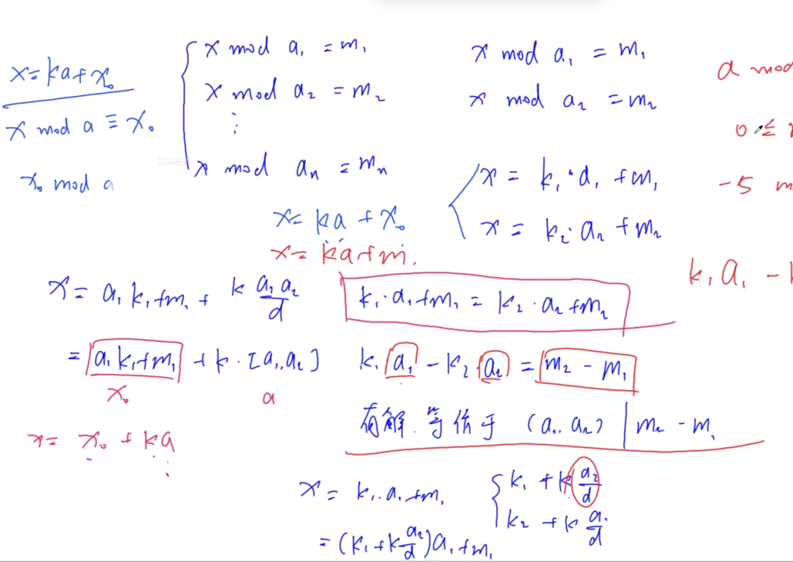

# 中国剩余定理



**模板题**
- [Acwing 204. 表达整数的奇怪方式](https://www.acwing.com/problem/content/206/)
```c++
#include <iostream>

using namespace std;

typedef long long LL;

LL exgcd(LL a, LL b, LL &x, LL &y) {
    if (!b) {
        x = 1, y = 0;
        return a;
    }
    LL d = exgcd(b, a % b, y, x);
    y -= a / b * x;
    return d;
}

int main() {
    int n;
    cin >> n;
    
    bool flag = true;
    LL a1, m1;
    cin >> a1 >> m1;
    
    n--;
    
    while (n--) {
        LL a2, m2;
        cin >> a2 >> m2;
        
        LL k1, k2;
        LL d = exgcd(a1, a2, k1, k2);
        if ((m2 - m1) % d) {
            flag = false;
            break;
        }
        
        k1 *= (m2 - m1) / d;
        LL t = a2 / d;
        k1 = (k1 % t + t) % t;
        
        m1 = a1 * k1 + m1;
        a1 = abs(a1 / d * a2);
    }
    
    if (flag) {
        cout << (m1 % a1 + a1) % a1 << endl;
    } else {
        cout << -1 << endl;
    }
}
```