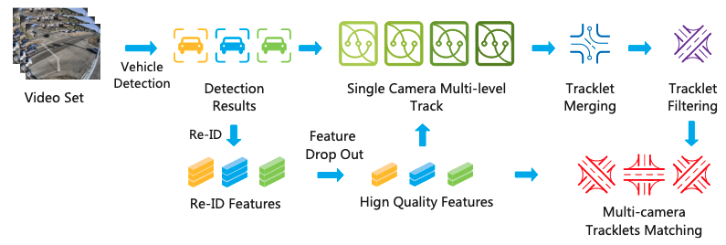
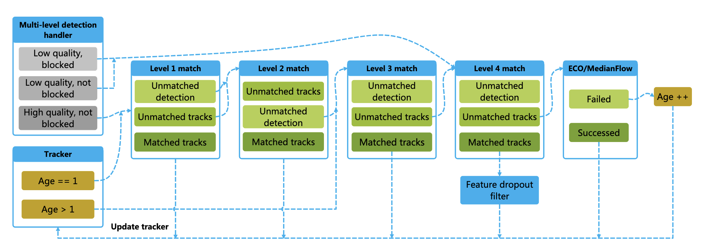
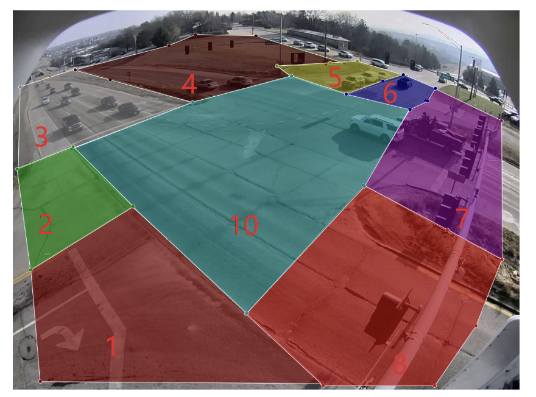
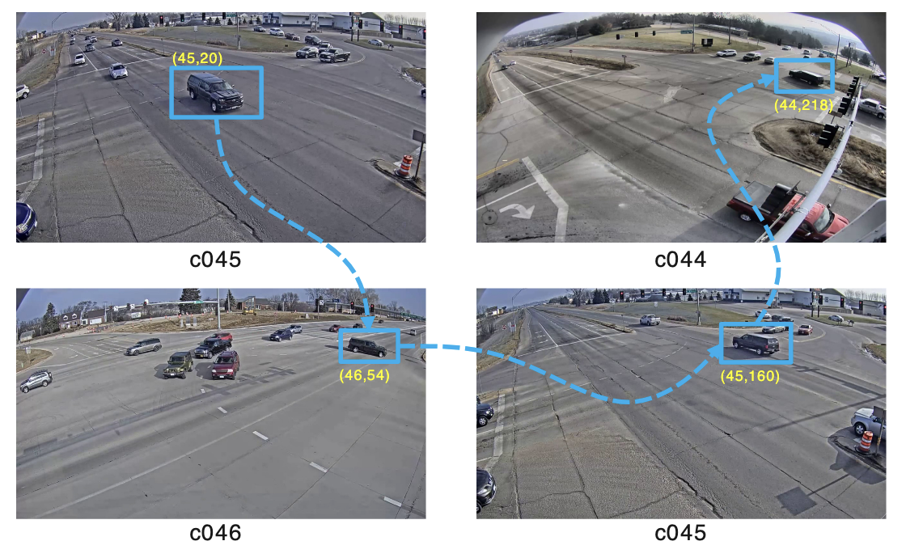

# Multi-Camera Vehicle Tracking System for AI City Challenge 2022 (京东方亚军队伍)

## Abstract

多目标多摄像头（Multi-Target Multi-Camera, MTMC）跟踪是智能交通系统（intelligent traffic systems）的基本任务。2022 AI City 城市挑战赛的赛道一旨在城市规模的多摄像头车辆跟踪任务。本文提出了一个四部分组成的精确车辆跟踪系统，包括：
- 用于车辆检测和特征提取的 sota 检测器和 ReID 模型
- 单摄像头跟踪，在跟踪检测范式的基础上引入增强轨迹预测和多级关联方法
- 基于区域的单摄像头区域合并策略
- 多摄像头时空匹配和聚类策略，并在 AICity Challenge 2022 赛道一排名第二，IDF1 得分为 0.8437

## Introduction

多摄像头车辆跟踪（Multi-Camera Vehicle Tracking, MCVT）可以分解为三个子任务，包括单摄像头跟踪（Single-Camera Tracking, SCT），车辆再识别（Vehicle re-identification, Re-ID），多摄像头轨迹匹配（Multi-Camera Tracklets Matching, MCTM）。

作为初始条件，SCT 可以对连续步骤的正确性产生重大影响，SCT 中的缺失轨迹或 ID 切换会导致 MCTM 阶段混乱，导致 recall 和 precision 结果交叉较差。

MCVT 问题的挑战包括：
- SCT 算法的精度，进而连锁反应影响匹配过程，最终导致轨迹不稳定
- 大多数 SCT 算法低估了由长交通拥堵引起的轨迹缺失
- 大多数 SCT 算法在车辆被另外一个物体遮挡时提取不纯的特征，这样边界框可能包含来自相邻物体的许多像素
- 在 MCTM 阶段，无法区分许多外观相似的车辆，从而在相机之间 ID 值混乱

由于这些问题，本文设计了一个系统，该系统使用置信度分数、IOU 比率对三种类型的检测结果进行标记和处理，包括：低质量的遮挡、低质量的非遮挡和高质量的非遮挡车辆。高质量的非遮挡车辆在匹配时优先级最高，用于轨迹初始化。低质量遮挡车辆的 Re-ID 特征将被丢弃。过滤后的 Re-ID 特征可以让轨迹匹配过程更容易。

对于车辆缺失部分，使用了另外两种 SOT 算法，而不是卡尔曼滤波。因此即使存在不确定性，也可以合成稳定的车辆轨迹。然后，结果经过多级匹配和聚类，对于严重遮挡或外观变化引起的轨迹中中断，我们提出了一种基于区域的轨迹合并策略，将摄像头中的大多数轨迹片段拼凑在一起。

对于多摄像头匹配，我们提出了一种基于方向的时空策略，该策略显著减少了搜索空间和解决 U-turns edge cases 情况。

## Method

### Overview

所提出的 MCVT 系统如图所示，该系统首先使用检测器从视频集中获取车辆的所有边界框；然后使用 Re-ID 模型提取特征，丢弃一些 Re-ID 特征；然后使用单摄像头算法生成轨迹；最后使用匹配和聚类策略同步跨摄像头的轨迹。

### 车辆检测

车辆检测是 MTMC 跟踪的第一步。与大多数 MTMC 跟踪方法一样，我们遵循检测跟踪范式，例如使用 YOLOv5x6 模型，该模型是在 COCO 数据集上预训练的。我们微调了检测器，使类别只有汽车、卡车和公交车。agnostic 参数用于在推理阶段对所检测到的车辆执行非极大值抑制（NMS）。

### 车辆重识别

使用在CityFlow数据集上预先训练的 ResNet50-IBN-a、ResNet101-IBN-a 和 ResNeXt101-IBN-a 模型来提取车辆的特征，而不引入外部数据。每个 Re-ID 模型输出一个 2048 维的特征向量，每个检测到的汽车的最终特征是三个模型的平均输出。

### 单摄像头车辆跟踪

对于单摄像头车辆跟踪，我们遵循 SORT(Simple Online and Realtime Tracking) 的总体框架。为了解决 SORT 的局限性，我们对跟踪方法提出了进一步的改进。首先，依赖卡尔曼滤波器的预测通常会在运动方向发生变化时产生 ID 切换。因此，我们利用另外两个 SOT，即高效卷积算子 (ECO, Efficient Convolution Operators) 和 MedianFlow，并提出了一种增强轨迹预测方法。接下来，受 DeepSort 的启发，我们包括车辆外观特征，然后通过特征 dropout 过滤器和多级匹配过程。最后，为了确保轨迹的完整性，我们在单个相机内添加了另一个用于轨迹合并的后处理。

#### 车辆轨迹预测

为了解决卡尔曼滤波的局限性，我们首先包括 MedianFlow，它使用车辆的当前位置来获取样本像素，然后根据光流预测下一帧的位置。MedianFlow 可以有效地定位被另一辆车平行移动遮挡的车辆，从而变得更加遮挡弹性。

其次，当车辆移动速度非常快或急转弯时，摄像头捕捉的外观可能会发生戏变化。在这种情况下，MedianFlow 可能效果不佳，因此我们可以使用 ECO 调整我们的预测。然后，在我们的多级关联方法中，每个车辆检测框都将有更好的匹配。

#### 多级检测处理

我们从相对较低的置信水平0.1和相对较高的NMS-IOU阈值0.45开始我们的检测过程。之后我们从结果中选择两次，首先置信度值为0.1，NMS-IOU为0.3，置信度值为0.3，NMS-IOU为0.3。此时，我们可以将结果分为三个级别。

低质量和阻塞车辆的特征应该被丢弃，只留下盒子本身进行轨迹匹配过程，得到高召回率，如图5中的特征dropout滤波器所示。另一方面，未被阻塞的车辆不仅参与跟踪器匹配，而且还将它们的特征添加到相应的轨迹中。

#### 多目标多级别联合

为了确保预测的轨迹与检测结果充分匹配，我们的方法四级联合，如图所示：
- 选择高质量和非遮挡车辆，并与 age1 的轨迹相关联，生成如下矩阵。其中 M 表示得到的代价矩阵，α1、β1、γ1表示对应的权重，A表示特征余弦代价矩阵，B表示 MedianFlow 与检测框之间的 IOU 距离代价矩阵，C 表示 ECO boxes 与检测框之间的 IOU 距离代价矩阵。
$$M=\alpha_1 * A+\beta_1 * B+\gamma_1 * C$$
- 对不匹配的轨迹和检测配对，得到以下矩阵。其中 W 是新的成本矩阵，α2、β2、γ2 是相应的权重，P 是卡尔曼滤波器框与检测框之间的 IOU 距离的成本矩阵。
$$M=\alpha_2 * P+\beta_2 * B+\gamma_2 * C$$
- 关联检测与 age 大于 1 的不匹配的轨迹，产生 $F = A$。其中 A 表示特征余弦成本矩阵。这一步受到 DeepSort 的启发，假设 age 较小的轨道在匹配时应该具有更高的优先级。
- 将剩余的低质量车辆(遮挡或非遮挡)与 age = 1 的轨迹进行匹配，矩阵计算与步骤 2 相似。这一步旨在从低质量检测中保存轨迹预测的盒子，以确保轨迹的完整性。

#### 轨迹生命周期

经过四轮关联后，如果仍然有一些不匹配的高质量检测框，那么它们被认为是新的，新的轨迹将被初始化，包括卡尔曼滤波器模型、ECO 轨迹和光流的采样像素。对于匹配的检测和跟踪，轨道将相应地更新。首先确定检测框的类型，如果车辆被遮挡，则只更新卡尔曼滤波器，否则如果ECO预测和匹配检测之间的IOU距离低于阈值，则使用匹配的检测框重新初始化轨迹，而不是更新，并相应地更新光流采样点和特征。对于与检测框不匹配的轨迹，我们尝试通过使用 MediumFlow 或 ECO 的预测来挽救它们，同时使用这些预测更新卡尔曼滤波器模型以补偿缺失的部分。

#### 基于区域的轨迹合并

**轨迹选择**：我们将跨道路图像划分为9个有效区域和1个交通区域，可由特定情况确定，如图所示。这9个区域可以分为起始区域(1,3,5)、中间区域(10)和结束区域(2,4,6)。在合并之前，我们在标准下选择一些轨迹：
- tracklet that starts normally and end in either the same zone or middle zone.
- tracklet that starts in either middle zone or traffic zone.

这些轨迹被认为是异常的，将成为合并的候选者。然后，它们将通过一个滤波器器来去除可以忽略的短噪声(小于或等于4帧)、静止像素和小像素数等噪声，这些候选者将进入下一步中的轨迹合并。

**轨迹合并**：考虑到轨迹可能在一台相机内有多个片段，本文使用层次聚类处理异常轨迹片段。假设有n个碎片轨迹，首先计算每个轨迹小波的平均特征，那么我们有:

$$H_{n \times n}=\left[\begin{array}{ccc}\cos \left(T_1, T_1\right) & \cdots & \cos \left(T_1, T_n\right) \\ \vdots & \ddots & \vdots \\ \cos \left(T_n, T_1\right) & \cdots & \cos \left(T_n, T_n\right)\end{array}\right]$$

$T_i$ 代表要合并的轨迹片段，$H_{n \times n}$ 代表成本矩阵，由于同一个轨迹不能与自身合并，我们设置对角线值为 2，然后进行聚类得到同一聚类下的轨迹:
- 按起始帧升序对轨迹进行排序
- 检查两个轨迹是否与空间和时间一致
  - 后者的起始帧是否在关于前一个结束帧的范围内
  - 前一个和后一个起始位置之间的距离是否大于前一个起始位置和结束位置之间的距离。
  - 后者的起始方向是否前者指向的方向
  - 后者的结束位置是否在结束区域内，如果不是，则递归地查找带有结束区域的一个，直到没有匹配

使用上述技术，可以在同一簇下选择和合并轨迹片段，为单摄像机跟踪产生更准确的轨迹片段结果。

### 多摄像头轨迹匹配

在多摄像头匹配中，我们的方法包括一个选择步骤，一个聚合步骤和一个聚类步骤。

#### 轨迹选择

为了简化多摄像机匹配的过程，我们利用方向和时间信息来缩小匹配过程的范围。
- 基于每个相机的GPS位置，我们可以为每个摄像机旋转区域，以连接轨道入口和出口。区域可以简化为多摄像头匹配，其中 (Zone 1, Zone 2) 对应于西，(Zone 3, Zone 4) 对应于北，(Zone 5, Zone 6) 对应于东，(Zone7, Zone 8) 对应于南。
- 我们可以使用最大和最小速度限制以及给定场景的交通灯信号来计算每个连接之间可能的时间范围。

#### 轨迹聚类

我们的方法包含两轮多摄像头轨迹聚类。第一轮是基于方向性的。例如，从相机 41 到 42 的轨迹可以聚集在一起，但是依赖可靠的单相机跟踪结果，我们只能比较那些在同一方向上发生的轨迹，减少聚类空间。

经过第一轮聚类后，需要将相邻摄像机同一车辆的轨迹聚集在一起，聚合顺序很重要，因为同一车辆可以在摄像机之间具有不同的 id。我们提出了一种迭代搜索策略，有效地解决了 U-turns 情况，如下图所示 U-turns 例子，一辆车辆进入 c045，然后 c046，掉头回 c045，最后出现在 c044 中。

同样的车辆从 45 到 46，从46到44，可以表示为 (camera ID，track ID) 对，如 (45,20)(46,54)(45,160)(44,218)。一个聚合顺序可以为[41,41,42][42,43][43,44][44,45][45,46]，[42,41][43,42][44,43][45,44][46,45]，搜索每个相机之间的轨迹ID交点。如果有交集，则可以合并两组不同的相机，如果不是，则创建新的集合，依此类推。但是，在这种情况下，U-turns 无法正确聚合。例如，在上图中，从 (45,20),(46,54) 开始，当我们到达 (44,218),(45,160) 时，不会识别出相同的车辆，因为尚未到达转折点，交集为空。展望未来，我们得到 (45,20)、(46,54)、(45,160)、(44,218)、(45,160)、(46,54) 等结果。显然，这两组之间存在交集，但它们被分成两个tracklet。因此，我们提出了一种聚合策略，该策略搜索每个相机中的轨迹集合，直到任何集合之间没有交集，有效地解决了 U-turns 问题。

## 实验

$$
\begin{array}{lccc}
\hline \text { Method } & \text { IDF1 } & \text { IDP } & \text { IDR } \\
\hline \text { Baseline } & 0.7522 & 0.8173 & 0.6967 \\
\text { +Feature Dropout Filter } & 0.8192 & 0.8871 & 0.7610 \\
\text { +Multi-level matching } & 0.8312 & 0.8799 & 0.7877 \\
\text { +Tracklet Merging } & 0.8362 & 0.8732 & 0.8022 \\
\text { +Tracklet Selection } & 0.8437 & 0.8900 & 0.8020 \\
\hline
\end{array}
$$
