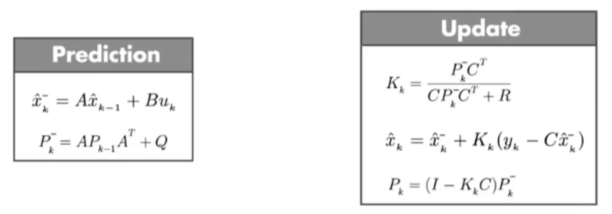

# MOT 算法分类介绍 (Tracking by Detection)


如上图是一个典型的 MOT Pipeline：
- 目标检测
- 对于上一帧检测的目标，用预测器（比如卡尔曼滤波）预测这一时刻的目标位置
- 对检测目标和预测目标进行匹配关联
- 完成关联之后，对目标进行生命周期管理：目标第几次出现、已经连续跟踪多少帧、第几次消失、已经消失了多少帧，目的是为了给出稳定的跟踪结果

## SORT (Simple Online and Realtime Tracking, ICIP 2016)

参考资料：https://zhuanlan.zhihu.com/p/97449724


上图是 SORT 的流程图，SORT的最主要的思想在于对检测出的每个物体建立一个独立于其他物体和相机运动的线性恒速模型，利用卡尔曼滤波法预测当前帧每个物体的状态量（**预测值**），再利用匈牙利算法与目标检测模型对当前帧的检测状态（**观测值**）进行数据关联。

关键步骤：
- 轨迹卡尔曼滤波预测
- 使用匈牙利算法将预测后的 tracks 和当前帧中的 detecions 进行匹配（IOU匹配）
- 卡尔曼滤波更新

### 卡尔曼滤波

卡尔曼滤波的本质是统计平均，统计平均的两个数分别是 predict 和观测值，包括两个阶段：
- predict：使用上一个时刻的 x，也称作 **k-1 时刻的后验状态**，来预测当前时刻的 x，也称作 **k 时刻的先验状态**
- update：使用当前时刻的观测值 y (也就是当前时刻的目标检测结果，需要用匈牙利算法根据 IOU 进行匹配确定是哪个检测框)，以及 predict 得到的 x，来加权平均计算得到新的 x，也就是 **k 时刻的后验状态**



predict 公式 1：
- predict 第一个公式右边的 x 是上一时刻的 x，即 **k-1 时刻的后验状态**
- predict 第一个公式左边的 x 预测的当前时刻的 x，即 **k 时刻的先验状态**
- A: 状态转移矩阵，描述系统的状态方程模型，一般是 position 或者速度等，比如在匀速模型中，A 就是单位矩阵
- B: 外界的控制输入矩阵，用在控制向量 $u_k$, $u_k$ 一般是加速度

predict 公式 2：
- P: 协方差矩阵，描述了各状态（x 的每个值）之间的相关性
- Q: 过程噪声，描述了系统状态转移过程中的噪声，描述了建立系统的模型准确度

update 公式 1:
- K: 卡尔曼增益，用于调整预测值和观测值的权重
- C: 观测矩阵，描述了观测值和状态值之间的关系，一般是单位矩阵
- R: 观测噪声矩阵，描述了传感器的测量噪声

update 公式 2：
- update 第一个公式右边的 x 是 predict 公式 1 左边的 x，即 **k 时刻的先验状态**
- update 第一个公式左边的 x 是 update 公式 1 左边的 x，即 **k 时刻的后验状态**
- y: 观测值，也就是当前时刻的目标检测结果，或者传感器的测量结果，需要用匈牙利算法根据 IOU 进行匹配确定是哪个检测框

update 公式 3：
- I: 单位矩阵
- P: 经过修正的协方差矩阵 P

example code: https://github.com/RahmadSadli/2-D-Kalman-Filter

```python
def predict(self):
    # Update time state
    #x_k =Ax_(k-1) + Bu_(k-1)
    self.x = np.dot(self.A, self.x) + np.dot(self.B, self.u)

    # Calculate error covariance
    # P= A*P*A' + Q
    self.P = np.dot(np.dot(self.A, self.P), self.A.T) + self.Q
    return self.x[0:2]

def update(self, z):
    # S = H*P*H'+R
    S = np.dot(self.H, np.dot(self.P, self.H.T)) + self.R

    # Calculate the Kalman Gain
    # K = P * H'* inv(H*P*H'+R)
    K = np.dot(np.dot(self.P, self.H.T), np.linalg.inv(S))

    self.x = np.round(self.x + np.dot(K, (z - np.dot(self.H, self.x))))

    I = np.eye(self.H.shape[1])

    # Update error covariance matrix
    self.P = (I - (K * self.H)) * self.P
    return self.x[0:2]
```

## DeepSORT (ICIP 2017)

参考资料：http://giantpandacv.com/academic/%E7%9B%AE%E6%A0%87%E6%A3%80%E6%B5%8B%E5%8F%8A%E8%B7%9F%E8%B8%AA/%E7%9B%AE%E6%A0%87%E8%B7%9F%E8%B8%AA/DeepSORT%E7%AE%97%E6%B3%95%E4%BB%A3%E7%A0%81%E8%A7%A3%E6%9E%90%28%E5%85%A8%29/


上图是 DeepSORT 的流程图，和 SORT 基本一样，就多了**级联匹配**（Matching Cascade）和**新轨迹的确认**（confirmed）。

关键步骤：
- 轨迹卡尔曼滤波预测
- 使用匈牙利算法将预测后的 tracks 和当前帧中的 detecions 进行匹配（**级联匹配** 和 IOU 匹配）
- 卡尔曼滤波更新

上图中的级联匹配展开如下图：
- 上半部分中计算相似度矩阵的方法使用到了外观模型 (ReID) 和运动模型 (马氏距离) 来计算相似度，得到代价矩阵，另外一个则是门控矩阵，用于限制代价矩阵中过大的值。
- 下半部分中是是**级联匹配的数据关联**步骤，匹配过程是一个循环 (max age 个迭代，默认为 70)，也就是从 missing age=0 到 missing age=70 的轨迹和 Detections 进行匹配，没有丢失过的轨迹优先匹配，丢失较为久远的就靠后匹配。通过这部分处理，可以重新将被遮挡目标找回，降低**被遮挡然后再出现的目标**发生的 ID Switch 次数。


将 Detection 和 Track 进行匹配，所以出现几种情况：
- Detection 和 Track 匹配，也就是 **Matched Tracks**。普通连续跟踪的目标都属于这种情况，前后两帧都有目标，能够匹配上。
- Detection 没有找到匹配的 Track，也就是 **Unmatched Detections**。图像中突然出现新的目标的时候，Detection 无法在之前的 Track 找到匹配的目标。
- Track 没有找到匹配的 Detection，也就是 **Unmatched Tracks**。连续追踪的目标超出图像区域，Track 无法与当前任意一个 Detection 匹配。
- 以上没有涉及一种特殊的情况，就是两个目标遮挡的情况。刚刚被遮挡的目标的 Track 也无法匹配 Detection，目标暂时从图像中消失。之后被遮挡目标再次出现的时候，应该尽量让被遮挡目标分配的 ID 不发生变动，减少 ID Switch 出现的次数，这就需要用到**级联匹配**了。

example code: https://github.com/ZQPei/deep_sort_pytorch
