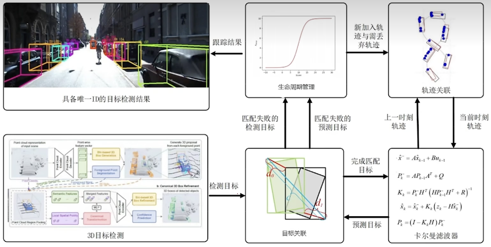
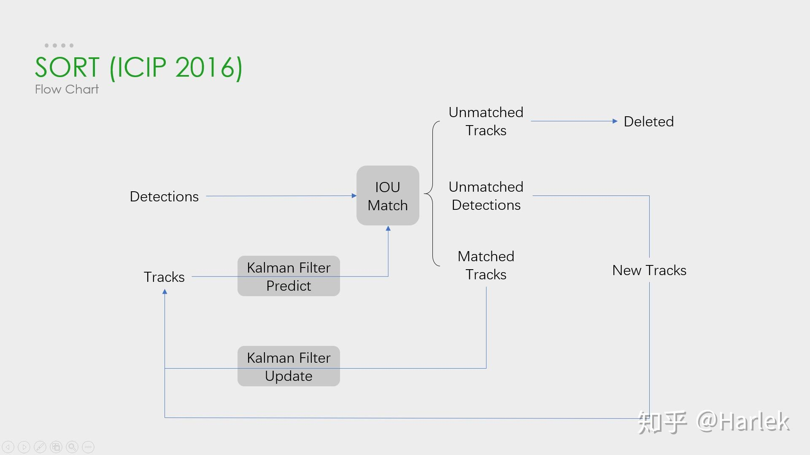
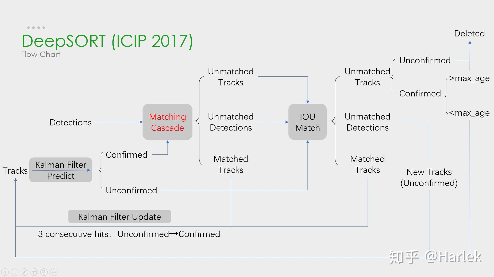
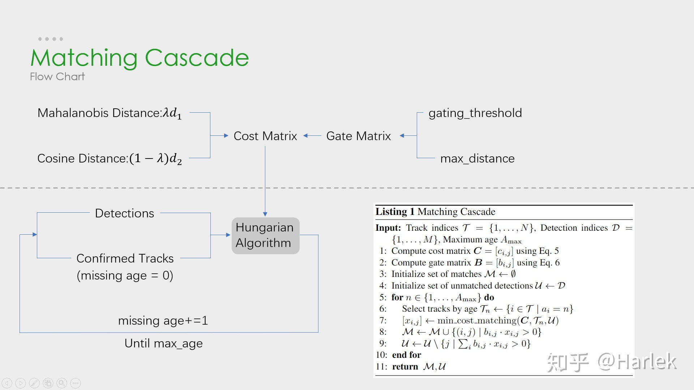
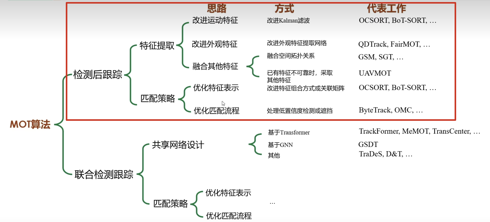
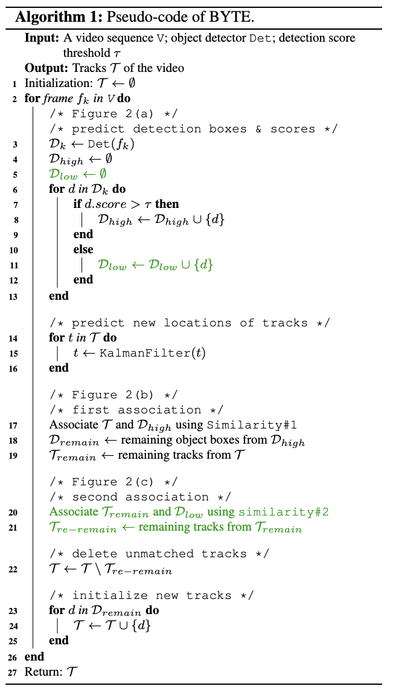
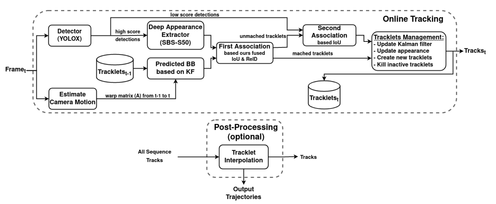

# MOT 算法分类介绍 (Tracking by Detection)



如上图是一个典型的 MOT Pipeline：
- 目标检测
- 对于上一帧检测的目标，用预测器（比如卡尔曼滤波）预测这一时刻的目标位置
- 对检测目标和预测目标进行匹配关联
- 完成关联之后，对目标进行生命周期管理：目标第几次出现、已经连续跟踪多少帧、第几次消失、已经消失了多少帧，目的是为了给出稳定的跟踪结果

首先是两篇经典的论文，SORT 和 DeepSORT。

## SORT (Simple Online and Realtime Tracking, ICIP 2016)

参考资料：https://zhuanlan.zhihu.com/p/97449724



上图是 SORT 的流程图，SORT的最主要的思想在于对检测出的每个物体建立一个独立于其他物体和相机运动的线性恒速模型，利用卡尔曼滤波法预测当前帧每个物体的状态量（**预测值**），再利用匈牙利算法与目标检测模型对当前帧的检测状态（**观测值**）进行数据关联。

关键步骤：
- 轨迹卡尔曼滤波预测
- 使用匈牙利算法将预测后的 tracks 和当前帧中的 detecions 进行匹配（IOU匹配）
- 卡尔曼滤波更新

### 卡尔曼滤波

卡尔曼滤波的本质是统计平均，统计平均的两个数分别是 predict 和观测值，包括两个阶段：
- predict：使用上一个时刻的 $\hat{\mathbf{x}}_{k-1 \mid k-1}$，也称作 **k-1 时刻的后验状态**，来预测当前时刻的 $\hat{\mathbf{x}}_{k \mid k-1}$，也称作 **k 时刻的先验状态**
- update：使用当前时刻的观测值 $\mathbf{z}_k$ (也就是当前时刻的目标检测结果，需要用匈牙利算法根据 IOU 进行匹配确定是哪个检测框)，以及 predict 得到的 $\hat{\mathbf{x}}_{k \mid k-1}$，来加权平均计算得到新的 $\hat{\mathbf{x}}_{k \mid k}$，也就是 **k 时刻的后验状态**

$$
\begin{aligned}
& \text { predict }\left\{\begin{array}{l}
\hat{\mathbf{x}}_{k \mid k-1}=\mathbf{F}_k \mathbf{x}_{k-1 \mid k-1}+\mathbf{B}_k\mathbf{u}_k \\
\hat{\mathbf{P}}_{k \mid k-1}=\mathbf{F}_k \mathbf{P}_{k-1 \mid k-1} \mathbf{F}_k^{\top}+\mathbf{Q}_k
\end{array}\right. \\
& \text { update }\left\{\begin{array}{l}
\mathbf{K}_k=\hat{\mathbf{P}}_{k \mid k-1} \mathbf{H}_k^{\top}\left(\mathbf{H}_k \hat{\mathbf{P}}_{k \mid k-1} \mathbf{H}_k^{\top}+\mathbf{R}_k\right)^{-1} \\
\mathbf{x}_{k \mid k}=\hat{\mathbf{x}}_{k \mid k-1}+\mathbf{K}_k\left(\mathbf{z}_k-\mathbf{H}_k \hat{\mathbf{x}}_{k \mid k-1}\right) \\
\mathbf{P}_{k \mid k}=\left(\mathbf{I}-\mathbf{K}_k \mathbf{H}_k\right) \hat{\mathbf{P}}_{k \mid k-1}
\end{array}\right.
\end{aligned}
$$

predict 公式 1：
- predict 第一个公式右边的 x 是上一时刻的 x，即 **t-1 时刻的后验状态**
- predict 第一个公式左边的 x 预测的当前时刻的 x，即 **t 时刻的先验状态**
- F: 状态转移矩阵，描述系统的状态方程模型，一般是 position 或者速度等，比如在匀速模型中，A 就是单位矩阵
- B: 外界的控制输入矩阵，用在控制向量 $u_k$, $u_k$ 一般是加速度

predict 公式 2：
- P: 协方差矩阵，描述了各状态（x 的每个值）之间的相关性
- Q: 过程噪声，描述了系统状态转移过程中的噪声，描述了建立系统的模型准确度

update 公式 1:
- K: 卡尔曼增益，用于调整预测值和观测值的权重
- H: 观测矩阵，描述了观测值和状态值之间的关系，一般是单位矩阵
- R: 观测噪声矩阵，描述了传感器的测量噪声

update 公式 2：
- update 第一个公式右边的 x 是 predict 公式 1 左边的 x，即 **k 时刻的先验状态**
- update 第一个公式左边的 x 是 update 公式 1 左边的 x，即 **k 时刻的后验状态**
- y: 观测值，也就是当前时刻的目标检测结果，或者传感器的测量结果，需要用匈牙利算法根据 IOU 进行匹配确定是哪个检测框

update 公式 3：
- I: 单位矩阵
- P: 经过修正的协方差矩阵 P

example code: https://github.com/RahmadSadli/2-D-Kalman-Filter

```python
def predict(self):
    # Update time state
    #x_k =Ax_(k-1) + Bu_(k-1)
    self.x = np.dot(self.A, self.x) + np.dot(self.B, self.u)

    # Calculate error covariance
    # P= A*P*A' + Q
    self.P = np.dot(np.dot(self.A, self.P), self.A.T) + self.Q
    return self.x[0:2]

def update(self, z):
    # S = H*P*H'+R
    S = np.dot(self.H, np.dot(self.P, self.H.T)) + self.R

    # Calculate the Kalman Gain
    # K = P * H'* inv(H*P*H'+R)
    K = np.dot(np.dot(self.P, self.H.T), np.linalg.inv(S))

    self.x = np.round(self.x + np.dot(K, (z - np.dot(self.H, self.x))))

    I = np.eye(self.H.shape[1])

    # Update error covariance matrix
    self.P = (I - (K * self.H)) * self.P
    return self.x[0:2]
```

## DeepSORT (ICIP 2017)

参考资料：http://giantpandacv.com/academic/%E7%9B%AE%E6%A0%87%E6%A3%80%E6%B5%8B%E5%8F%8A%E8%B7%9F%E8%B8%AA/%E7%9B%AE%E6%A0%87%E8%B7%9F%E8%B8%AA/DeepSORT%E7%AE%97%E6%B3%95%E4%BB%A3%E7%A0%81%E8%A7%A3%E6%9E%90%28%E5%85%A8%29/



上图是 DeepSORT 的流程图，和 SORT 基本一样，就多了**级联匹配**（Matching Cascade）和**新轨迹的确认**（confirmed）。

关键步骤：
- 轨迹卡尔曼滤波预测
- 使用匈牙利算法将预测后的 tracks 和当前帧中的 detecions 进行匹配（**级联匹配** 和 IOU 匹配）
- 卡尔曼滤波更新

上图中的级联匹配展开如下图：
- 上半部分中计算相似度矩阵的方法使用到了外观模型 (ReID) 和运动模型 (马氏距离) 来计算相似度，得到代价矩阵，另外一个则是门控矩阵，用于限制代价矩阵中过大的值。
- 下半部分中是是**级联匹配的数据关联**步骤，匹配过程是一个循环 (max age 个迭代，默认为 70)，也就是从 missing age=0 到 missing age=70 的轨迹和 Detections 进行匹配，没有丢失过的轨迹优先匹配，丢失较为久远的就靠后匹配。通过这部分处理，可以重新将被遮挡目标找回，降低**被遮挡然后再出现的目标**发生的 ID Switch 次数。



将 Detection 和 Track 进行匹配，所以出现几种情况：
- Detection 和 Track 匹配，也就是 **Matched Tracks**。普通连续跟踪的目标都属于这种情况，前后两帧都有目标，能够匹配上。
- Detection 没有找到匹配的 Track，也就是 **Unmatched Detections**。图像中突然出现新的目标的时候，Detection 无法在之前的 Track 找到匹配的目标。
- Track 没有找到匹配的 Detection，也就是 **Unmatched Tracks**。连续追踪的目标超出图像区域，Track 无法与当前任意一个 Detection 匹配。
- 以上没有涉及一种特殊的情况，就是两个目标遮挡的情况。刚刚被遮挡的目标的 Track 也无法匹配 Detection，目标暂时从图像中消失。之后被遮挡目标再次出现的时候，应该尽量让被遮挡目标分配的 ID 不发生变动，减少 ID Switch 出现的次数，这就需要用到**级联匹配**了。

example code: https://github.com/ZQPei/deep_sort_pytorch

## 改进优化分类

然后下图是近些年工作的主要流派以及分类



## ByteTrack (ECCV 2022)

**优化匹配流程**，处理低置信度或遮挡

code: https://github.com/ifzhang/ByteTrack

主要思想：对于舍弃低置信度可能造成的 Fasle Negative，采取将低置信度与未与高置信度匹配的轨迹再次匹配的方式。

大部分的多目标跟踪方法在获取物体检测结果后，会丢弃置信度小于一定阈值的结果。这些结果往往包含过多的背景图像，这对跟踪器来说是不利的。但是ByteTrack依旧保留了这些目标，并尝试利用它们。

### Byte 策略

参考资料：https://yinguobing.com/bytetrack/



BYTE 保留了全部检测结果，并将它们分为高分值组与低分值组。首先将跟分值组与跟踪对象相关联。此时由于画面模糊、抖动等原因会有一部分跟踪对象没有被关联。然后再将低分值检测结果与未匹配的跟踪对象相关联来保留低分值检测结果并过滤背景。

BYTE 策略包含一个物体检测器、一个卡尔曼滤波器，以及三个阈值：检测阈值 T_high, T_low 与跟踪阈值 E。输入为视频中的每一帧图像，输出为物体的坐标以及唯一性 ID。实际运行时，对于每一帧图像将检测器输出的物体按照阈值分组。**大于T_high 的归入高分值组**；**介于 T_high 与 T_low 之间的归入低分值组**。同时使用卡尔曼滤波器预测已跟踪物体的下一个位置。

第一次数据匹配涉及检测结果的高分值组与全部跟踪对象。基于IoU 计算相似度，再使用匈牙利算法完成匹配。此时未匹配的检测结果与跟踪结果依然予以保留。

第二次数据匹配涉及检测结果的低分值组与上一步剩余的跟踪对象。完成匹配后，**保留未匹配的跟踪对象，并丢弃仍未匹配的检测结果**。在这一步需要**优先使用 IoU 作为匹配依据**。毕竟低分值对象的外观多发生劣化。

在匹配完成后，未被成功匹配的跟踪对象将会被移除。不过实际中，第二次数据匹配也失败的跟踪对象会被暂存，直到足够久仍未获得匹配，才会被丢弃。

最后一步则是跟踪新出现物体。这些物体来自未被匹配的高分值检测结果。对于每一个检测结果，如果他的分值高于E且在连续两帧中出现，则将其纳入跟踪对象集合中。

## OC-SORT (CVPR2023)

**改进运动特征**，改进卡尔曼滤波

**优化特征表示**，改进特征组合方式或关联矩阵

code: https://github.com/noahcao/OC_SORT

主要思想：没有观测到的轨迹要恢复时，为这个轨迹建立一个虚拟轨迹，修正卡尔曼滤波的误差。

实际中，在多目标跟踪中，由于目标被遮挡，经常在某些时刻没有观测值。在这种 case 下，将不能直接使用 KF 更新策略了。为了定位这个问题，一种简单的方式是在下一时刻继续重复使用当前的状态。当没有有效的观测值时监督时，相信运动模型预测的值，在 MOT 使用这种方式会带来一些问题。

**SORT 的局限性**:
- 对状态噪声很敏感
- 时间误差放大：即使假设位置估计的方差仅为1像素，10帧遮挡也会随着对象大小而累积最终位置估计的变化。当场景拥挤时，这种误差放大会导致错误的主要累加
- 以估计为中心：以估计为中心的使得 SORT 在有遮挡和物体运动不完全线性时遭受严重的噪声。

因此，遮挡下的鲁棒多目标跟踪器应该更重视观测值而不是卡尔曼滤波状态估计。为了解决这些局限性，OC-SORT 关键是将跟踪器设计为以观察为中心的，而不是以估计为中心的。**如果从未跟踪的轨迹中恢复，使用以观察为中心的 Re-Update (Observation-centric Re-Update, ORU) 策略来对抗未跟踪期间的累积误差**。OCSORT 还以关联成本添加了一个以观察为中心的动量 (Observation-Centric Momentum, OCM)。

### Observation-centric Re-Update (ORU) 改进卡尔曼滤波

在实践中，即使 SORT 可以在未跟踪一段时间后再次关联对象，由于时间误差放大，它可能会再次丢失，因为它的 KF 参数已经偏离正确很远。为了缓解这个问题，OC-SORT 提出了以观测为中心的 Re-Update (ORU) 来减少累积误差。一旦轨迹在未跟踪的时间段内再次与观察结果相关联 ("re-activation")，我们就会回退检查其丢失的时间段并重新更新卡尔曼滤波的参数。Re-Update 基于虚拟轨迹的"观测"。虚拟轨迹是根据开始和结束未跟踪周期的步骤的观察生成的。

例如，在未丢失之前最后一次观测是 $\mathbf{z}_{t1}$，丢失一段时间后重新观测到的是 $\mathbf{z}_{t2}$，那么 t1 到 t2 这段时间内的虚拟轨迹观测可以表示为：

$$
\tilde{\mathbf{z}}_t=\operatorname{Traj}_{\text {virtual }}\left(\mathbf{z}_{t_1}, \mathbf{z}_{t_2}, t\right), t_1<t<t_2
$$

根据 $\tilde{\mathbf{z}}_t$，重新运行卡尔曼滤波的 predict 和 re-update，re-update 操作为：

$$
\begin{aligned}
& \text { re-update }\left\{\begin{array}{l}
\mathbf{K}_k=\hat{\mathbf{P}}_{k \mid k-1} \mathbf{H}_k^{\top}\left(\mathbf{H}_k \hat{\mathbf{P}}_{k \mid k-1} \mathbf{H}_k^{\top}+\mathbf{R}_k\right)^{-1} \\
\mathbf{x}_{k \mid k}=\hat{\mathbf{x}}_{k \mid k-1}+\mathbf{K}_k\left(\tilde{\mathbf{z}}_k-\mathbf{H}_k \hat{\mathbf{x}}_{k \mid k-1}\right) \\
\mathbf{P}_{k \mid k}=\left(\mathbf{I}-\mathbf{K}_k \mathbf{H}_k\right) \hat{\mathbf{P}}_{k \mid k-1}
\end{array}\right.
\end{aligned}
$$

re-update 作为卡尔曼滤波 predict 和 update 循环之外的独立阶段，并且仅在轨道从没有观测的时刻到被观测到重新激活时运行。

### Observation-Centric Momentum (OCM) 改进关联矩阵

由于状态观测不存在状态估计存在的时间误差放大问题，OC-SORT 建议使用观测值而不是估计来减少运动方向计算的噪声，并引入其一致性项来帮助关联。

给定 N 个现有轨道和 M 个新进入时间步的检测，关联成本矩阵表示为：

$$
C(\hat{\mathbf{X}}, \mathbf{Z})=C_{\mathrm{IoU}}(\hat{\mathbf{X}}, \mathbf{Z})+\lambda C_v(\mathcal{Z}, \mathbf{Z})
$$

- $\hat{\mathbf{X}} \in \mathbb{R}^{N \times 7}$ 是目标状态估计集合
- $\mathbf{Z} \in \mathbb{R}^{M \times 5}$ 是新时间步长的观测值集合
- $\mathcal{Z}$ 包含所有现有轨迹的观测轨迹
- $C_{\mathrm{IoU}}$ 计算负样本对的 IoU
- $C_v$ 计算方向之间的一致性
  - 连接两个观测结果与现有的轨迹
  - 连接轨迹的历史观测和新观测

## BoT-SORT: Robust Associations Multi-Pedestrian Tracking

**改进运动特征**，改进卡尔曼滤波

**优化特征表示**，改进特征组合方式或关联矩阵

code: https://github.com/NirAharon/BOT-SORT

主要思想：提取两帧之间的关键点建立仿射矩阵，将卡尔曼滤波预测结果映射到新坐标下

### Introduction

**之前 SORT-like 算法的局限性**：
- 大多数SORT-like算法采用卡尔曼滤波器和恒速模型假设作为运动模型。KF 用于预测下一帧中的 tracklet 边界框，以与检测边界框相关联，并用于在遮挡或未检测到的情况下预测 tracklet 状态。
- 与目标检测器驱动的检测相比，使用 KF 状态估计作为跟踪器的输出会导致边界框形状次优。最近的大多数方法都使用了经典跟踪器 DeepSORT 中提出的 KF 状态表征，它试图估计框的纵横比而不是宽度，这导致宽度大小估计不准确。
- SORT-like IoU-based 方法主要取决于 tracklet 的预测边界框的质量。因此，在许多复杂的场景中，预测边界框的正确位置可能会由于相机运动而失败，这导致 2 个相关边界框之间的重叠率低，最终导致跟踪器性能低下。作者通过采用**传统的图像配准来估计相机运动**，通过适当地校正卡尔曼滤波器来克服这个问题。这里将此称为**相机运动补偿（Camera Motion Compensation, CMC）**。
- 在许多情况下，SORT-like 算法中的定位和外观信息（即重识别）会导致跟踪器的检测能力 (MOTA) 和跟踪器随时间保持正确身份的能力 (IDF1) 之间的权衡。使用 IoU 通常可以实现更好的 MOTA，而 Re-ID 可以实现更高的 IDF1。

这项工作中，提出了新的跟踪器，通过解决上述 SORT-like 的跟踪器的限制并将它们集成到 ByteTrack 中，新的跟踪器在 MOT17 和 MOT20 挑战的所有主要 MOT 指标中都优于所有领先的跟踪器。本文的主要贡献如下：
- 通过添加改进，例如**基于相机运动补偿的特征跟踪器和合适的卡尔曼滤波器状态向量以实现更好的边界框定位**，Tracking-by-detection 跟踪器的性能也可以得到显著的改进。
- 为 **IoU 和 ReID 的余弦距离融合**提出了一种简单有效的方法，以便在检测和轨迹之间建立更强大的关联。

### Proposed Method

在本节中，我们将介绍基于多目标跟踪的检测方法的三个主要修改和改进。通过将这些改进集成到 ByteTrack 中，我们提出了两个新的最先进的跟踪器 BoT-SORT 和 BoT-SORT-ReID。BoT-SORT-ReID 是一个 BoT-SORT 扩展，包括一个重新识别模块。有关 BoT-SORT-ReID 的伪代码，参阅原文附录 A。算法的流程如下图所示。



