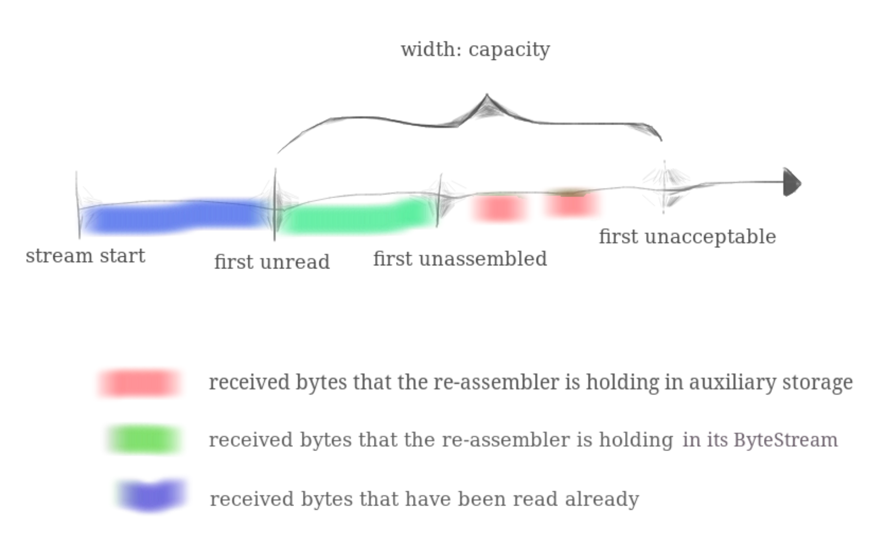

# Lab Checkpoint 1: stitching substrings into a byte stream


上图是 TCP 实现中的各个模块以及数据流动，Lab0 中已经实现了 **ByteStream**，TCP 的任务是在不可靠网络上传输一对可靠的 ByteStream，，保证在一端写入的数据，能够被另一端读出。

Lab1 中，将实现一个 **StreamReassembler**，接收数据片段（substring）、拼装成连续的、正确的 ByteStream 序列，ByteStream 可以被读出。StreamReassembler 解决了网络传输过程中的 乱序(reordering) 与 重复(dupication)问题。

## What’s the “capacity”?

`push_string()` 负责接收数据片段，以及该片段的 index，对于超出 "capacity" 区域的片段，将拒绝接收。"capacity" 的区域如下图所示。
- 蓝色部分是已经被读出的字节流。
- 绿色部分是已经在 ByteStream 中，但还未被读出的字节流。
- 红色部分是 ByteStream 剩余的容量，也就是还可以写入的字节流大小。



这些字段的实现如下：
```c++
size_t stream_start_index() const { return 0; }
size_t first_unread_index() const { return _output.bytes_read(); }
size_t first_unassemebled_index() const { return _output.bytes_written(); }
size_t first_unacceptable_index() const { return _output.bytes_read() + _capacity; }
```

## 实现细节

核心部分是 `push_string(const std::string &data, const uint64_t index, const bool eof)` 方法：

- 首先是对写入的 data 数据片段作预处理。
    - 当 data 的末尾位置 < first unassembled 时，表示 data 已经被写入过 ByteStream 中，不会被再次写入，因此直接返回即可。
    - 当 data 的起始位置(index) >= first unacceptable 时，表示数据片段超出了 capacity 的范围，不该被写入，直接返回即可。
    - 当 data 的末尾位置 > first unacceptable 时，超出 first unacceptable 的数据片段应当被截断。

- 将处理后的数据先写入到**等待写入的数据片段**中，如果处理后的数据与**等待写入的数据片段**有交集，那么我们可以合并有交集的数据片段。
- 取出**等待写入的数据片段**的第一个数据片段，如果该数据片段的 index < first unassembled，那么就可以写入到 ByteStream 中，同时将该片段从**等待写入的数据片段**中移出。

实现代码如下：
```c++
//! \details This function accepts a substring (aka a segment) of bytes,
//! possibly out-of-order, from the logical stream, and assembles any newly
//! contiguous substrings and writes them into the output stream in order.
void StreamReassembler::push_substring(const string &data, const size_t index, const bool eof) {
    // before start, update field
    if (data.empty()) {
        if (eof) {
          _output.end_input();
        }
        return;
    }

    Segment segment{data, index, index + data.size() - 1, eof};

    if (segment._start >= first_unacceptable_index()) {
        return;
    }

    if (segment._end < first_unassemebled_index()) {
        // have been written
        return;
    }

    if (segment._end >= first_unacceptable_index()) {
        // truncate
        size_t len = first_unacceptable_index() - segment._start;
        segment._data = string(segment._data.begin(), segment._data.begin() + len);
        segment._end = first_unacceptable_index() - 1;
        segment._eof = false;
    }

    _waiting_segments.emplace_back(segment);
    merge_waiting_segments();
    auto iter = _waiting_segments.begin();
    if (iter->_start <= first_unassemebled_index()) {
        // insert waiting segment
        write_to_output(*iter);
        _waiting_segments.erase(iter);
    }
}
```

这里定义了 **Segment** 作为带索引的数据段：
```c++
struct Segment {
    std::string _data;
    size_t _start;
    size_t _end;
    bool _eof;

    Segment(const std::string &data, const size_t &start, const size_t &end, const bool &eof)
        : _data(data), _start(start), _end(end), _eof(eof) {}
    bool operator<(const Segment &rhs) const { return this->_start < rhs._start; }
};
```

**等待写入的数据片段**(_waiting_segments)的定义是 `std::vector<Segment>`，**等待写入的数据片段**的合并是一个数据结构与算法的问题，参考 [leetcode 56: 区间合并](https://leetcode-cn.com/problems/merge-intervals/)，`merge_waiting_segments()`实现如下：
```c++
// added method
// leetcode solution: https://leetcode-cn.com/problems/merge-intervals/
void StreamReassembler::merge_waiting_segments() {
    if (_waiting_segments.size() <= 1) {
        return;
    }

    vector<Segment> new_waiting_segments{};

    sort(_waiting_segments.begin(), _waiting_segments.end());

    new_waiting_segments.emplace_back(_waiting_segments[0]);
    for (size_t i = 1; i < _waiting_segments.size(); i++) {
        Segment &new_waiting_segments_back = new_waiting_segments.back();
        if ((new_waiting_segments_back._end + 1 >= _waiting_segments[i]._start) &&
            (new_waiting_segments_back._end <= _waiting_segments[i]._end)) {
            // merge and update data
            new_waiting_segments_back._data += string(
                _waiting_segments[i]._data.begin() + new_waiting_segments_back._end + 1 - _waiting_segments[i]._start,
                _waiting_segments[i]._data.end());
            new_waiting_segments_back._end = _waiting_segments[i]._end;
            new_waiting_segments_back._eof = _waiting_segments[i]._eof;
        } else if (new_waiting_segments_back._end + 1 < _waiting_segments[i]._start) {
            new_waiting_segments.emplace_back(_waiting_segments[i]);
        }
    }

    _waiting_segments.clear();
    _waiting_segments.assign(new_waiting_segments.begin(), new_waiting_segments.end());
}
```

**StreamReassembler** 核心部分实现完毕。