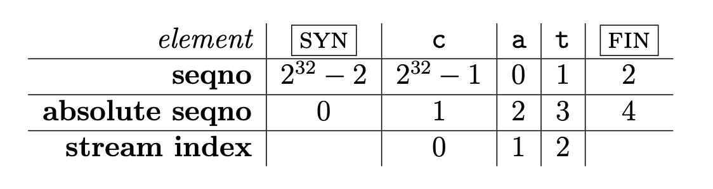

# Lab Checkpoint 2: the TCP receiver


Lab 2 是实现 **TCPReceiver**，它的任务如下：
- 通过 `segment received()` 方法接收到来的**TCPSegment**，这些 TCPSegments 可能是乱序、重复的。
- 将 TCPSegment 取出来的数据与 index，装入到 **StreamReassembler** 中，写入 **ByteStream**，ByteStream 中的字节流都是有序、正确的，因此用户就可以正确读取。
- 除此之外，TCPReceiver 还会将自己的**确认号**(ackno)和**窗口大小**(window size)发送出去：
    - 确认号返回当前第一个未组装的字节序号
    - 窗口大小就是还可以组装的字节序列长度。

## Translating between 64-bit indexes and 32-bit seqnos

本地中的 **StreamReassembler** 和 **ByteStream** 字节索引都是 64 位的 **stream index**，保证足够了的存储空间，并且第一个字节的序号下标总是从 0 开始。但是在网络传输中使用 64 位的字节索引，数据的传输大小就十分吓人了，因此网络传输中的 **TCPSegments** 使用 32 位的字节索引。因此接收 TCPSegment 与发送 ackno 时，需要实现 64 位索引与 32 位索引的相互转换。引入这种转换增加了三种复杂性：
- 网络传输中的字节流的 **序列号(seqno)** 为 $2^{32}-1$ 时，下一个字节的序列号将是 0。
- 数据传输时以 **起始序列号(ISN, Initial Sequence Number)** 开始，这是一个随机值：为了保证安全性，确保序列号不能被可猜测并且不太可能重复。同时这个序列号有 **SYN(beginning of stream)** 标记，表示字节流的起始位置。剩下部分的字节流的序列号将是按 ISN 的顺序，比如字节流的第一个字节的序列号将是 ISN+1 (mod $2^{32}$)，第二个字节将是 ISN+2 (mod $2^{32}$)，以此类推。
- TCP 除了确保接收所有的字节数据以外，还确保接收字节流的开始和结束标记，分别是 **SYN(beginning-of-stream)** 和 **FIN(end-of-stream)**，它们各自占有一个序列号。字节流中的每个字节数据也占有一个序列号。需要注意的是，SYN 和 FIN 标记并不是字节流的一部分，它们只代表字节流的开始和结束。

强调一下，**sequence number** 也就是序列号在 TCPSegment 的 header 中传输；**absolute sequence number** 也就是绝对序列号，从 0 开始；**stream index**，StreamReassembler 装载数据时使用的索引，从 0 开始。下图是 "cat" 为例子，三种不同类型的 index 如下：



| Sequence Number | Absolute Sequence Number | Stream Indices |
| :----: | :----: | :----: |
| Start at the ISN | Start at 0 | Start at 0 |
| Include SYN/FIN | Include SYN/FIN | Omit SYN/FIN |
| 32 bits, wrapping | 64 bits, non-wrapping | 64 bits, non-wrapping |
| "seqno" | "absolute seqno" | "stream index" |

**absolute seqno** 与 **stream index** 的转换十分简单，只需加一或减一即可。而 **absolute seqno** 与 **seqno** 的转换就有点复杂了。**WrappingInt32** 是封装好的一个类，用于代表 32 位的 seqno，并提供了一些帮助函数，用于转换。

### 具体实现

#### WrappingInt32 wrap(uint64 t n, WrappingInt32 isn)

absolute seqno -> seqno

```c++
WrappingInt32 wrap(uint64_t n, WrappingInt32 isn) {
    return isn + (n & 0x00000000ffffffff);
}
```

#### uint64 t unwrap(WrappingInt32 n, WrappingInt32 isn, uint64 t checkpoint)

seqno -> absolute seqno

将序列号转换成离 checkpoint 最近的绝对序列号。例如，序列号 "17" 可以对应绝对序列号 17，也可以对应 $2^{32}$ + 17，2 * $2^{32}$ + 17，3 * $2^{32}$ + 17 ... 。在这些可能的情况中，距离 checkpoint 最近的就是需要返回的绝对序列号。

```c++
// added help func
// distance beetween absolute_seqno_case and checkpoint
static uint64_t distance(uint64_t absolute_seqno_case, uint64_t checkpoint) {
    if (absolute_seqno_case >= checkpoint) {
      return absolute_seqno_case - checkpoint;
    } else {
      return checkpoint - absolute_seqno_case;
    }
}

uint64_t unwrap(WrappingInt32 n, WrappingInt32 isn, uint64_t checkpoint) {
  uint64_t base = 0xffffffff00000000 & checkpoint;
  uint64_t absolute_seqno = (n - isn) & (0x00000000ffffffff);
  if (n.raw_value() < isn.raw_value()) {
      absolute_seqno = (1ul << 32) - ((isn - n) & 0x00000000ffffffff);
  }
  // may have two case as follows
  uint64_t absolute_seqno_case1 = (base + absolute_seqno);
  uint64_t absolute_seqno_case2 = base + (1ul << 32) + absolute_seqno;
  uint64_t absolute_seqno_case3 = base - (1ul << 32) + absolute_seqno;

  if (distance(absolute_seqno_case1, checkpoint) <= distance(absolute_seqno_case2, checkpoint)) {
      // case1 <= case2 , compare case1 and case3
      if (distance(absolute_seqno_case1, checkpoint) <= distance(absolute_seqno_case3, checkpoint)) {
          return absolute_seqno_case1;
      } else {
          return absolute_seqno_case3;
      }
  } else {
      // case1 > case2, compare case2 and case3
      if (distance(absolute_seqno_case2, checkpoint) > distance(absolute_seqno_case3, checkpoint)) {
          return absolute_seqno_case3;
      } else {
          return absolute_seqno_case2;
      }
  }
}
```

## Implementing the TCP receiver

下图是 TCPSegment 的格式，本次 Lab 涉及了 seqno，SYN，FIN，Payload。


### 具体实现

#### segment received()

接收 TCPSegment，如果它携带 SYN 标志，则需要设置**初始化序列号(ISN, Initial Sequence Number)**，为了能够转换 seqno 与 absolute seqno。

将 TCPSegment 中的数据装入到 StreamReassembler 中，如果 TCPSegment 携带 FIN 标志，意味着数据(TCPSegment payload)中的最后一个字节就是 ByteStream 的最后一个字节。

```c++
void TCPReceiver::segment_received(const TCPSegment &seg) {
  WrappingInt32 seqno{seg.header().seqno};
  if (seg.header().syn) {
      _isn_set = true;
      _isn = seqno;
      seqno = seqno + 1;
  }
  
  if (!_isn_set) {
      return;
  }

  uint64_t checkpoint = _reassembler.first_unassemebled_index();
  uint64_t absolute_seqno = unwrap(seqno, _isn, checkpoint);
  uint64_t stream_index = absolute_seqno - 1;
  string data = seg.payload().copy();
  _reassembler.push_substring(data, stream_index, seg.header().fin);
}
```

#### ackno()

如果没有设置 ISN，直接返回空。否则未返回当前第一个未组装的字节序列号(WrappingInt32)，也就是将 stream index (first_unassemebled_index) 转换为 absolute seqno，再调用 `wrap` 转换成 WrappingInt32。如果 StreamReassembler 已经装入完毕，返回 FIN 之后的序号。
```c++
optional<WrappingInt32> TCPReceiver::ackno() const {
  if (!_isn_set) {
    return {};
  }
  if (_reassembler.stream_out().input_ended()) {
    return wrap(_reassembler.first_unassemebled_index() + 1, _isn) + 1;
  }
  return wrap(_reassembler.first_unassemebled_index() + 1, _isn);
}
```

#### window size()

返回还可以组装的字节序列长度。
```c++
size_t TCPReceiver::window_size() const {
    return _reassembler.first_unacceptable_index() - _reassembler.first_unassemebled_index();
}
```