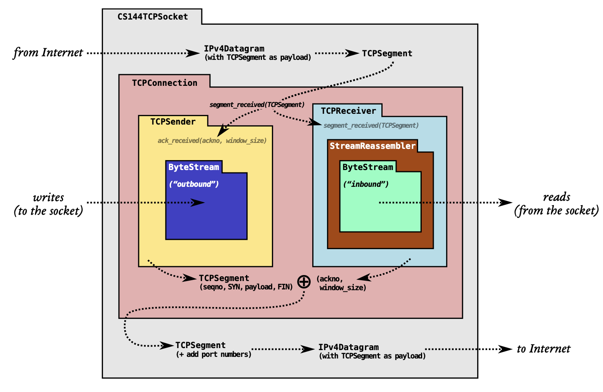
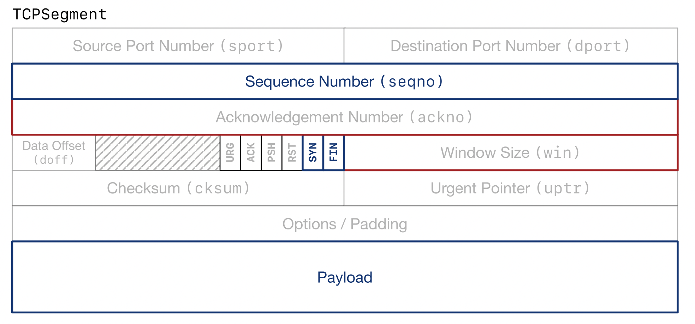

# Lab Checkpoint 3: the TCP sender



Lab 3 实现 **TCPSender**，它负责将 **ByteStream** 封装成 **TCPSegment** 发送给对等端。 

这样 TCPReceiver 接收这些 TCPSegment 序列并还原成原始的 ByteStream，并发送 acknowledgments（确认） 和 window advertisements（通告窗口）给 TCPSender。

TCPSender 发送 TCPSegment 时，写时涉及的字段包括与 TCPReceiver 相关的所有字段：the sequence number, the SYN flag, the payload, the FIN flag。

TCPSender 接收 TCPSegment 时，读时涉及的字段包括：the ackno, the window size。

下图是 TCPSender 操作 TCPSegment 涉及的字段，蓝色部分是写时字段、红色部分是读时字段。



总结 TCPSender 的任务就是：

1. 追踪**另一端的接收方**窗口，处理接收方发送过来的**确认号**和**窗口大小**。

2. 尽可能填充窗口，读 ByteStream，封装成 TCPSegment（可能包括 SYN 和 FIN ），发送给接收方。

3. 追踪发送给了接收方，但是还没有被确认的 segments，这些 segments 被称作 **outstanding segments**。

4. 如果 outstanding segments 超过一定时间还没被确认，那就重新将它发送给接收方。

## 如何实现丢失/超时重传？

上述 1 和 2 很好理解，下面是讲解 3 和 4 的细节，来实现 TCPSender 超时重传。

1. 当初始化 TCPSender 时，会初始化 **retransmission timeout** (RTO, 重传超时时间) 为 **_initial_retransmission_timeout**。

2. 当 TCPSender 发送 segment 时，会启动一个 **retransmission timer** (重传计时器)。

3. 重传计时器时间超过了 RTO：
    1. 重发 outstanding segments 中最早的一个 segment
    2. 如果窗口大小不为0，并且不是同步请求 segment，自增超时重传次数，RTO 时间设置为原来的两倍。
    3. 重置重传计时器时间为0。

4. 当收到一个新的确认号
    1. 重置 RTO 为 _initial_retransmission_timeout。
    2. 如果还有没被确认的 segments，重置重传计时器为0；否则，outstanding segments 为空，停止重传计时器。
    3. 重置超时重传次数为0。

## 实现细节

以下只贴部分核心实现代码

### retransmission timer（超时重传计时器）

根据上述描述，我们的超时重传计数器接口如下：
```cpp
class RetransmissionTimer {
  private:
    bool _running;
    unsigned int _retransmission_timer;
    unsigned int _retransmission_timeout; // RTO
  public:
    RetransmissionTimer(const unsigned int retransmission_timeout);
    unsigned int timer() const;
    void tick(const unsigned int tick);
    unsigned int RTO() const;
    void reset();
    void double_RTO();
    void reset_RTO(const unsigned int retransmission_timeout);
    void stop();
    bool running() const;
    void start();
};
```

### void fill_window()

TCPSender 尽可能地填充接收方窗口，读取 ByteStream 封装成 TCPSegment 发送给接收方，超过`TCPConfig::MAX_PAYLOAD_SIZE`大小时要分多次发送。

需要注意的是当接收方窗口大小为0时，fill_window() 函数将窗口大小视为 1。关于解释，可以引用 lab 指导的原文：

> What should I do if the window size is zero? If the receiver has announced a window size of zero, the fill window method should act like the window size is one. The sender might end up sending a single byte that gets rejected (and not acknowledged) by the receiver, but this can also provoke the receiver into sending a new acknowledgment segment where it reveals that more space has opened up in its window. Without this, the sender would never learn that it was allowed to start sending again.

比如 TCPSender 初始化时，还没接收到接收方的窗口大小，此时认为接收方窗口大小为0，但是又需要发送 segment 给接收方，此时 TCPSender 可以发送一个字节长的 segment，以与接收方收到确认，并将确认号和窗口大小发送回 TCPSender，这样就打开了更多了的窗口。

```cpp
void TCPSender::fill_window() {
    TCPSegment segment;

    if (!_syn_set) {
        _syn_set = true;
        segment.header().syn = true;
        send_segment(segment);
        return;
    }
    if (_fin_set) {
        return;
    }

    int32_t receiver_remaining_window_size =
        _receiver_window_size ? (_receiver_window_size - bytes_in_flight()) : (1 - bytes_in_flight());
    while (receiver_remaining_window_size > 0 && !_fin_set) {
        size_t read_size = min(static_cast<size_t>(receiver_remaining_window_size), TCPConfig::MAX_PAYLOAD_SIZE);
        segment.payload() = stream_in().read(read_size);
        receiver_remaining_window_size -= segment.length_in_sequence_space();
        if (stream_in().eof() && receiver_remaining_window_size > 0) {
            segment.header().fin = true;
            _fin_set = true;
            receiver_remaining_window_size--;
        }
        if (segment.length_in_sequence_space() == 0) {
            return;
        }
        send_segment(segment);
    }
}
```

### void ack_received(const WrappingInt32 ackno, const uint16 t window size)

1. 如果收到的确认号不在等待确认的范围中，则直接返回。

2. 如果收到的确认号与上一次收到的确认号相同，表示原先的接收方窗口太小，TCPSender 还有 ByteStream 没被封装成 TCPSegment 发送，所以重置这次更大的接收方窗口，可以让 TCPSender 发送新的 TCPSegment。

3. _segments_outstanding 中的每一个末尾序列号小于 ackno 的 segment 表示都已被接收方收到，将这些 segment 从 _segments_outstanding 移出。

4. 更新重传计时器。

```cpp
void TCPSender::ack_received(const WrappingInt32 ackno, const uint16_t window_size) {
    uint64_t absolute_ackno = unwrap(ackno, _isn, _prev_ackno);

    if (absolute_ackno < _prev_ackno || absolute_ackno > _next_seqno) {
        return;
    }

    // absolute_ackno == _prev_ackno also set this too
    _receiver_window_size = window_size;

    if (absolute_ackno == _prev_ackno) {
        return;
    }

    while (!_segments_outstanding.empty()) {
        TCPSegment segment = _segments_outstanding.front();
        uint64_t absolute_end_seqno =
            unwrap(segment.header().seqno + segment.length_in_sequence_space() - 1, _isn, _prev_ackno);
        if (absolute_end_seqno >= absolute_ackno) {
            break;
        }
        _segments_outstanding.pop();
        _bytes_in_flight -= segment.length_in_sequence_space();
    }

    _prev_ackno = absolute_ackno;
    _retransmission_timer.reset_RTO(_initial_retransmission_timeout);
    if (_segments_outstanding.empty()) {
        _retransmission_timer.stop();
    } else {
        _retransmission_timer.reset();
    }
    _consecutive_retransmissions_num = 0;
}
```

### void tick(const size t ms since last tick)

重传计时器超过 RTO 时，并且有未被确认的 segment，则需要重新发送 segment。

```cpp
void TCPSender::tick(const size_t ms_since_last_tick) {
    _retransmission_timer.tick(ms_since_last_tick);
    if (_retransmission_timer.timer() >= _retransmission_timer.RTO() && !_segments_outstanding.empty()) {
        resend_segment();
        if (_receiver_window_size > 0 || _segments_outstanding.front().header().syn) {
            _consecutive_retransmissions_num++;
            _retransmission_timer.double_RTO();
        }
        _retransmission_timer.reset();
    }
}
```

## 面试常见问题

### TCP 如何保证可靠传输？

TCP 解决了网络传输过程中会出现的四种问题：lost, reordered, altered, or duplicated。

1. reordered and duplicated：Lab1 中实现的 stream reassembler，将输入的乱序字节流合并为有序的字节流，忽略重复的字节流，输出为合法的字节流，Lab2 实现的 TCPReceiver 则使用 stream reassembler 来接收 TCPSegment，从而解决了乱序、重复问题。

2. lost: Lab3 中我们实现的 TCPSender，有超时重传计时器，发送 TCPSegment 时，启动超时重传计时器。如果在 RTO 时间内没有被确认，RTO 变为两倍，并重新发送 TCPSegment，重新开始计时。

### 什么是 ARQ(automatic repeat request) ？

Lab3 指导的原文如下：

> The basic principle is to send whatever the receiver will allow us to send (filling the window), and keep retransmitting until the receiver acknowledges each segment. This is called “automatic repeat request” (ARQ). The sender divides the byte stream up into segments and sends them, as much as the receiver’s window allows. Thanks to your work last week, we know that the remote TCP receiver can reconstruct the byte stream as long as it receives each index-tagged byte at least once—no matter the order. The sender’s job is to make sure the receiver gets each byte at least once.

对等端没有在 RTO 时间内确认 TCPSegment，TCPSender 就需要重新发送，TCPSender 的任务是确保接收方对于每个字节数据都至少保证接收过一次。
