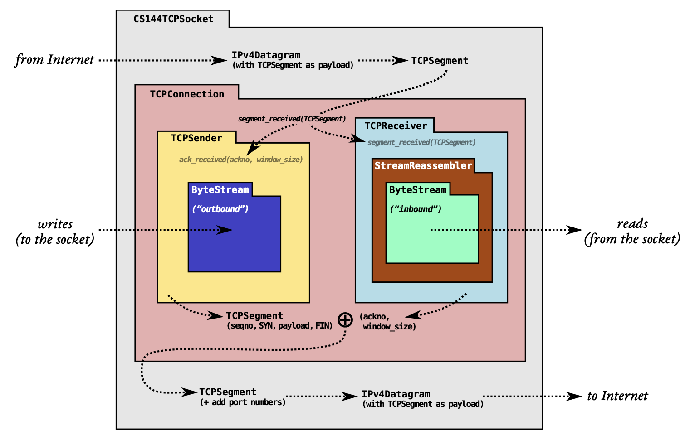
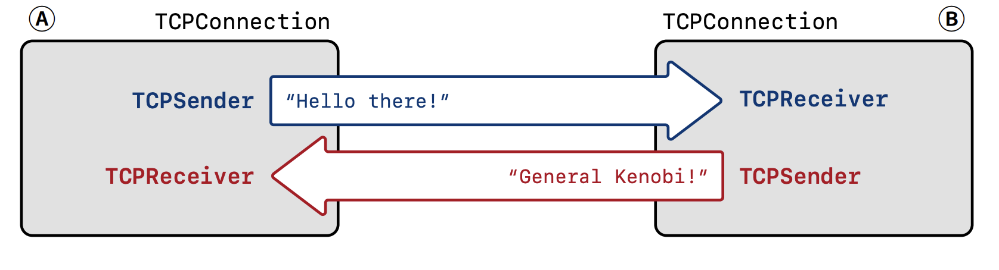

# Lab Checkpoint 4: the TCP connection



Lab 4 将前面实现的 **TCPSender** 和 **TCPReceiver** 组装成 **TCPConnection**。

TCP 可靠地传输一对字节流，每一端都有 "sender" (outbound byte-stream) 和 "receiver" (inbound byte-stream)，如下图：



TCPConnection 负责接收和发送 segments。

## 实现细节

### Receiving segments

接收 segment 主要包括以下几个步骤：

- 如果 segment 带有 `RST` 标志，需要将 inbound 和 outbound stream 都设置为 error 状态。
- 否则的话，将 segment 传给 TCPReceiver，负责接收相关字段：seqno, SYN, payload, FIN
- 如果带有 `ACK` 标志，TCPSender 接收确认号和窗口大小，以便发送 segment。
- 如果 segment 至少占有一个序列号，确保至少发送回复一个 segment，将自己的 ackno 和 窗口大小告诉对等端。
- 考虑一个特殊情况，当连接建立的时候，接收的 segment 的 seqno 可能是非法的，也应当回应发送一个 segment 给对等端。

实现如下：

```c++
void TCPConnection::segment_received(const TCPSegment &seg) {
    // std::cout << ">>>>>>>>>>receive segment... \n" << seg.header().to_string();
    if (!_active) {
        // std::cout << "active false" << std::endl;
        // std::cout << "<<<<<<<<<<" << std::endl << std::endl << std::endl;
        return;
    }

    // listen, not connect yet
    if (!_receiver.ackno().has_value() && _sender.next_seqno_absolute() == 0) {
        // std::cout << "listen, not connect yet" << std::endl;
        if (seg.header().syn) {
            // std::cout << "receive syn" << std::endl;
            _receiver.segment_received(seg);
            connect();
        }
        // std::cout << "<<<<<<<<<<" << std::endl << std::endl << std::endl;
        return;
    }

    _time_since_last_segment_received = 0;

    if (seg.header().rst) {
        // std::cout << "receive rst" << std::endl;
        _sender.stream_in().set_error();
        _receiver.stream_out().set_error();
        _active = false;
        return;
    }

    _receiver.segment_received(seg);

    if (seg.header().ack) {
        _sender.ack_received(seg.header().ackno, seg.header().win);
    }

    if (seg.length_in_sequence_space() >= 1) {
        // syn and fin may occupy 1 seqno
        if (_sender.segments_out().size() == 0) {
            // at least send one segment
            _sender.send_empty_segment();
        }
        send_segments();
    }

    if (_receiver.ackno().has_value() && (seg.length_in_sequence_space() == 0) &&
        (seg.header().seqno == _receiver.ackno().value() - 1)) {
        _sender.send_empty_segment();
    }

    // std::cout << "<<<<<<<<<<" << std::endl << std::endl << std::endl;
}
```

### Sending segment

发送 segment 包括以下步骤：

- 请求 TCPSender 待发送的 segments，并装入到发送队列中。
- 在装入发送队列之前，请求 TCPReceiver 的 ackno 和窗口大小，添加到待发送的 segment中。

需要注意的是，每次发送完毕后，我们会请求`clean_shutdown()`(在**结束连接**部分中解释)，检查是否能结束连接。

```c++
void TCPConnection::send_segments() {
    // std::cout << ">>>>>>>>>>start to send_segments..." << std::endl;
    int i = 0;
    while (!_sender.segments_out().empty()) {
        if (i != 0) {
            // std::cout << std::endl;
        }
        TCPSegment segment = _sender.segments_out().front();
        _sender.segments_out().pop();
        if (_receiver.ackno().has_value()) {
            segment.header().ack = true;
            segment.header().ackno = _receiver.ackno().value();
            segment.header().win = _receiver.window_size();
        }
        // std::cout << segment.header().to_string();
        // std::cout << "TCP data size: " << segment.length_in_sequence_space() << std::endl;
        // std::cout << "TCP data: " << segment.payload().str() << std::endl;
        _segments_out.push(segment);
        i++;
    }
    // std::cout << "<<<<<<<<<<send_segments finish" << endl;
    clean_shutdown();
}
```

### When time passes

TCPConnection 的 `tick` 方法暴露给操作系统调用，它负责做这些事情：

- 告诉 TCPSender 过了多少时候，也就是调用 TCPSender 的`tick`方法，它会检查是否超过超时重传时间，并重发未被确认的 segment。
- 如果超过最大重传次数，则会终止连接，发送一个带 `RST` 标志的空 segment 给对等端。

实现如下：

```c++
void TCPConnection::tick(const size_t ms_since_last_tick) {
    // std::cout << ">>>>>>>>>>tick " << ms_since_last_tick << std::endl;
    _sender.tick(ms_since_last_tick);
    _time_since_last_segment_received += ms_since_last_tick;
    if (_sender.consecutive_retransmissions() > TCPConfig::MAX_RETX_ATTEMPTS) {
        unclean_shutdown();
        return;
    }
    send_segments();
    // std::cout << "<<<<<<<<<<" << std::endl << std::endl << std::endl;
}
```

### TCPSegment 结构

从上述实现我们可以看出，发送一个 segment 给对等端时，TCPSender 负责了设置 seqno、SYN、FIN、Payload 部分，TCPReceiver 负责了设置 ackno 和窗口大小。如下图，分别是蓝色部分和红色部分。


### 结束连接

有两种结束连接的方式，一个是 `unclean_shutdown`，一个是`clean_shutdown`。

#### unclean_shutdown

`unclean_shutdown` 比较简单，直接发送一个 `RST` 标志的空 segment 给对等端即可，同时设置 outbound 和 inbound 为空，active 为 false。

在超出重传次数和 Connection关闭时仍为 active 状态时会用到。

```c++
void TCPConnection::unclean_shutdown() {
    // std::cout << ">>>>>>>>>>unclean_shutdown..." << std::endl;
    _sender.stream_in().set_error();
    _receiver.stream_out().set_error();
    TCPSegment segment;
    segment.header().rst = true;
    _active = false;
    _segments_out.push(segment);
    // std::cout << "<<<<<<<<<<" << endl;
}
```

#### clean_shutdown

`clean_shutdown`比较复杂，首先考虑以下三种先觉条件：
- **prereq #1**：**inbound** stream 已经组装完毕(fully assembled) 并且 input_ended，也就是说 TCPReceiver 接收好了 segment，保证了接收数据的正确性，并且不会再接收 segment，等待用户读取即可。
- **prereq #2**：**outbound** stream 为 EOF，也就是说 TCPSender 已经发送完了所有的 segment，并且用户不会再有数据写入发送。
- **prereq #3**：**outbound** stream，发送的 segment 都被对等端确认了。

每次发送完 segment 时都会调用`clean_shutdown`都会尝试是否能结束连接。

当 outbound 还没 EOF 时，inbound 已经结束了，也就是满足 **prereq #1** 和 **prereq #2**，也就是说 TCPSender 还有要发送的 segment，TCPReceiver 不再接收对等端的 segment了，这时需要设置 `_linger_after_streams_finish`变量为 false。

当 **prereq #1**，**prereq #2**，**prereq #3** 都满足。并且 linger_after_streams_finish 为 false，设置 active 为 false，表示结束连接；linger_after_streams_finish 为 true 时，需要保持连接一段时间，离上次接收 segment 的时间超过了足够的时间(10 * _cfg.rt_timeout)，

实现如下：

```c++
void TCPConnection::clean_shutdown() {
    // std::cout << ">>>>>>>>>>try clean_shutdown..." << std::endl;
    bool prereq1 = (_receiver.unassembled_bytes() == 0) && (_receiver.stream_out().input_ended());
    bool prereq2 = _sender.stream_in().eof();
    bool prereq3 = (_sender.bytes_in_flight() == 0);

    // std::cout << "prereq1: " << prereq1 << std::endl;
    // std::cout << "prereq2: " << prereq2 << std::endl;
    // std::cout << "prereq3: " << prereq3 << std::endl;
    if (prereq1 && !prereq2) {
        // std::cout << "set _linger_after_streams_finish false" << std::endl;
        _linger_after_streams_finish = false;
    }

    if (prereq1 && prereq2 && prereq3) {
        if (time_since_last_segment_received() >= 10 * _cfg.rt_timeout || !_linger_after_streams_finish) {
            // std::cout << "<<<<<<<<<<clean_shutdown success" << std::endl;
            _active = false;
        }
    }
    // std::cout << "<<<<<<<<<<" << endl;
}
```

TCPConnection 实现完毕。

## 测试

### 逻辑测试

`make check_lab4` 运行本地逻辑测试。


### 本地测试 1

第一个窗口运行一个 TCPConnection 作为 server，监听 local address (169.254.144.9)，port 9090：`./apps/tcp_ipv4 -l 169.254.144.9 9090`

第二个窗口用 `wireshark` 捕捉发送与接收的 segments：`sudo tshark -Pw /tmp/debug.raw -i tun144`

第三个窗口运行一个 TCPConnection 作为 client，连接到 server：`./apps/tcp_ipv4 -d tun145 -a 169.254.145.9 169.254.144.9 9090`

输入一些数据，三个窗口分别如下：


### 本地测试 2 （client winsize 为 1，零窗口探测）


### 性能测试

斯坦福获得满分的要求是，至少保证 "0.10 Gbit/s" 的吞吐量。


### webget

将 Lab 0 中实现的 webget 所用的由 OS 提供的 TCP socket 换成自己实现的 CS144TCPSocket，获取 Internet 上的 web server 资源。

```c++
void get_URL(const string &host, const string &path) {
    // Your code here.

    // You will need to connect to the "http" service on
    // the computer whose name is in the "host" string,
    // then request the URL path given in the "path" string.

    // Then you'll need to print out everything the server sends back,
    // (not just one call to read() -- everything) until you reach
    // the "eof" (end of file).

    // cerr << "Function called: get_URL(" << host << ", " << path << ").\n";
    // cerr << "Warning: get_URL() has not been implemented yet.\n";

    CS144TCPSocket tcp_socket;
    tcp_socket.connect(Address(host, "http"));
    tcp_socket.write("GET " + path + " HTTP/1.1\r\n");
    tcp_socket.write("HOST: " + host + "\r\n");
    tcp_socket.write("Connection: close\r\n\r\n");

    while (!tcp_socket.eof()) {
        cout << tcp_socket.read();
    }

    tcp_socket.wait_until_closed();
}
```

