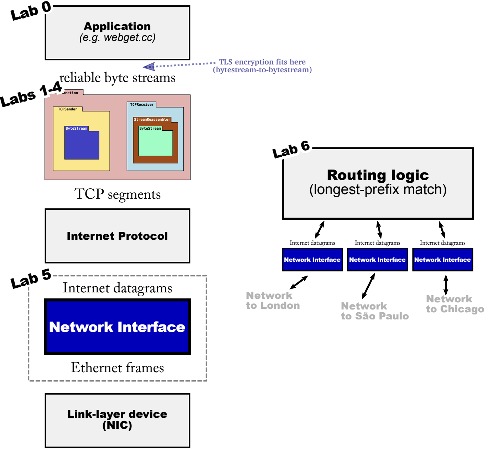

# Lab Checkpoint 5: the network interface



在前面几个 Lab 中，我们的 TCP 实现可以保证两个主机之间传输 **TCP segments**，而这些片段实际是如何通过什么方式进行传输的呢？有如下三种方式：
- **TCP-in-UDP-in-IP**，TCP segments，通过 OS 提供接口（如 **UDPSocket**）构造 UDP header，IP header，Ethernet header，然后发送数据包给下一跳。OS 确保每个 socket 在连接两端的主机间有独占的地址和端口号，保证了不同应用程序之间的隔离。
- **TCP-in-IP**，通常情况下，TCP segments 都是直接放在 IP 数据报里面，没有 TCP header 和 IP header 之间没有 UDP header，这也是通常所说的`TCP/IP`。OS 提供了一个接口，叫做 TUN 设备，用户直接构造 IP 报文，然后 OS 负责了其他的部分（构造 Ethernet header，并发送以太网帧）。
> 在 Lab4 中，`tcp_helpers/ipv4 datagram.{hh,cc}`表示了 IP 报文对象如何解析和构造，以及`tcp_helpers/tcp_over_ip.cc`如何将 TCP segments 封装成 IP 报文，CS144TCPSocket使用这些工具将 TCPConnection 连接到 TUN 设备。
- **TCP-in-IP-in-Ethernet**，上面的两种方法依然依赖 OS 的功能作为协议栈的一部分。每次将 IP 报文写入时，OS 都必须构造  link-layer (Ethernet 以太网)帧。因此 OS 根据给定 下一跳的 IP 地址，找到下一跳的以太网目的地址。如果不知道的话，OS 就会广播查询请求，并等待下一跳的响应。
> 而这些功能则是由 network interface 实现，负责 IP 报文与以太网帧之间的封装或解析。Lab5 中则将实现 network interface，生成原始的以太网帧，将其传给 TAP 设备（与 TUN 设备类似，但是更低层级，它交换以太网帧而不是 IP 报文）。

总结来说 network interface 的主要工作就是：根据每一个下一跳的 IP 地址，查找（缓存）它的以太网目的地址（又叫物理地址，MAC 地址），这个协议也叫做 **ARP** 协议。

## ARP 协议实现

ARP 协议主要维护 IP 地址到以太网目的地址的映射，该映射是一个缓存。


### NetworkInterface::send_datagram

这个方法由用户调用，将 IP 报文封装成以太网帧，并根据 IP 地址获取下一跳的以太网目的地址，从而发送给下一跳。
- 如果知道以太网目的地址，则直接封装成以太网帧发送给下一跳。创建以太网帧（设置 type =  EthernetHeader::TYPE_IPv4），设置 payload 为序列化 IP 报文，设置以太网源地址和以太网目的地址。
- 否则的话，广播 ARP 请求给下一跳，并将要发送的 IP 报文放进待发送报文等待队列里，以便于收到 ARP 回复后再次发送。
> 为了避免网络上充满 ARP 请求，如果 network interface 向 IP 地址发送了 ARP 请求，在 5s 内不会向相同的地址再次发送 ARP 请求，但是仍然需要将要发送的 IP 报文放进待发送报文等待队列里。

```c++
//! \param[in] ethernet_address Ethernet (what ARP calls "hardware") address of the interface
//! \param[in] ip_address IP (what ARP calls "protocol") address of the interface
NetworkInterface::NetworkInterface(const EthernetAddress &ethernet_address, const Address &ip_address)
    : _ethernet_address(ethernet_address), _ip_address(ip_address) {
    cerr << "DEBUG: Network interface has Ethernet address " << to_string(_ethernet_address) << " and IP address "
         << ip_address.ip() << "\n";
}

//! \param[in] dgram the IPv4 datagram to be sent
//! \param[in] next_hop the IP address of the interface to send it to (typically a router or default gateway, but may also be another host if directly connected to the same network as the destination)
//! (Note: the Address type can be converted to a uint32_t (raw 32-bit IP address) with the Address::ipv4_numeric() method.)
void NetworkInterface::send_datagram(const InternetDatagram &dgram, const Address &next_hop) {
    // convert IP address of next hop to raw 32-bit representation (used in ARP header)
    const uint32_t next_hop_ip = next_hop.ipv4_numeric();
    EthernetFrame ethernet_frame;
    if (_cache.find(next_hop_ip) != _cache.end()) {
        ethernet_frame.header().src = _ethernet_address;
        ethernet_frame.header().dst = _cache[next_hop_ip]._MAC_Address;
        ethernet_frame.header().type = EthernetHeader::TYPE_IPv4;
        ethernet_frame.payload() = dgram.serialize();
        _frames_out.push(ethernet_frame);
    } else {
        bool send_ARP = false;
        if (_queue_map.find(next_hop_ip) != _queue_map.end()) {
            send_ARP = _queue_map[next_hop_ip]._time_since_last_ARP_request_send >= DEFAULT_ARP_RESEND_WAITING_TIME;
            _queue_map[next_hop_ip]._time_since_last_ARP_request_send = 0;

        } else {
            _queue_map[next_hop_ip] = WaitingDatagram{};
            send_ARP = true;
        }
        _queue_map[next_hop_ip]._waiting_datagram.push(dgram);

        if (!send_ARP) {
            return;
        }

        // send arp
        ARPMessage arp;
        arp.opcode = ARPMessage::OPCODE_REQUEST;
        arp.sender_ethernet_address = _ethernet_address;
        arp.sender_ip_address = _ip_address.ipv4_numeric();
        arp.target_ethernet_address = {0, 0, 0, 0, 0, 0};
        arp.target_ip_address = next_hop_ip;

        ethernet_frame.header().src = _ethernet_address;
        ethernet_frame.header().dst = ETHERNET_BROADCAST;
        ethernet_frame.header().type = EthernetHeader::TYPE_ARP;
        ethernet_frame.payload() = arp.serialize();
        _frames_out.push(ethernet_frame);
    }
}
```

### NetworkInterface::recv_frame

这个方法是接收网络上的以太网帧。忽略不是传给本地以太网源地址的以太网帧（传来的以太网帧的目的地址不是自身的以太网帧的源地址或广播地址）。
- 如果接收以太网帧的类型是 IPv4，那么将 payload 解析成 IP 报文，并返回给用户。
- 如果接收以太网帧的类型是 ARP，解析 将 payload 解析成 ARPMessage，并将发送方的 IP 地址和以太网地址映射，保持 30s。如果 ARP 请求的 IP 地址是本身的 IP 地址，则回复 ARP 请求，将以太网地址发送给发送方。

```c++
//! \param[in] frame the incoming Ethernet frame
optional<InternetDatagram> NetworkInterface::recv_frame(const EthernetFrame &frame) {
    if (frame.header().dst != _ethernet_address && frame.header().dst != ETHERNET_BROADCAST) {
        return {};
    }

    if (frame.header().type == EthernetHeader::TYPE_IPv4) {
        InternetDatagram dgram;
        if (dgram.parse(frame.payload()) != ParseResult::NoError) {
            return {};
        }
        return dgram;
    }

    if (frame.header().type == EthernetHeader::TYPE_ARP) {
        ARPMessage arp_receive;
        if (arp_receive.parse(frame.payload()) != ParseResult::NoError) {
            return {};
        }

        // update cache
        if (_cache.find(arp_receive.sender_ip_address) == _cache.end()) {
            // not find, create new one
            _cache[arp_receive.sender_ip_address] = EthernetAddressEntry{};
        }
        _cache[arp_receive.sender_ip_address]._cache_time = 0;
        _cache[arp_receive.sender_ip_address]._MAC_Address = arp_receive.sender_ethernet_address;

        // send ipv4 frame and delete send qeue map
        if (_queue_map.find(arp_receive.sender_ip_address) != _queue_map.end()) {
            while (!_queue_map[arp_receive.sender_ip_address]._waiting_datagram.empty()) {
                InternetDatagram dgram = _queue_map[arp_receive.sender_ip_address]._waiting_datagram.front();
                _queue_map[arp_receive.sender_ip_address]._waiting_datagram.pop();
                send_datagram(dgram, Address::from_ipv4_numeric(arp_receive.sender_ip_address));
            }
        }
        _queue_map.erase(arp_receive.sender_ip_address);

        if (arp_receive.opcode == ARPMessage::OPCODE_REQUEST &&
            arp_receive.target_ip_address == _ip_address.ipv4_numeric()) {
            ARPMessage arp_send;
            arp_send.opcode = ARPMessage::OPCODE_REPLY;
            arp_send.sender_ethernet_address = _ethernet_address;
            arp_send.sender_ip_address = _ip_address.ipv4_numeric();
            arp_send.target_ethernet_address = arp_receive.sender_ethernet_address;
            arp_send.target_ip_address = arp_receive.sender_ip_address;

            EthernetFrame ethernet_frame;
            ethernet_frame.header().src = _ethernet_address;
            ethernet_frame.header().dst = arp_receive.sender_ethernet_address;
            ethernet_frame.header().type = EthernetHeader::TYPE_ARP;
            ethernet_frame.payload() = arp_send.serialize();
            _frames_out.push(ethernet_frame);
        }
    }
    return {};
}
```

### NetworkInterface::tick

对 ARP 请求以及 cache 映射计时。

```c++
//! \param[in] ms_since_last_tick the number of milliseconds since the last call to this method
void NetworkInterface::tick(const size_t ms_since_last_tick) {
    // tick for arp send
    for (auto iter = _queue_map.begin(); iter != _queue_map.end(); iter++) {
        iter->second._time_since_last_ARP_request_send += ms_since_last_tick;
    }

    // delete cache ip address which is timeout
    std::queue<uint32_t> deleted_ips_in_cache;
    for (auto iter = _cache.begin(); iter != _cache.end(); iter++) {
        iter->second._cache_time += ms_since_last_tick;
        if (iter->second._cache_time >= DEFAULT_CACHE_TIME) {
            deleted_ips_in_cache.push(iter->first);
        }
    }
    while (!deleted_ips_in_cache.empty()) {
        _cache.erase(deleted_ips_in_cache.front());
        deleted_ips_in_cache.pop();
    }
}
```

### helper variable definition

```c++
class NetworkInterface {
  private:
    ...
    // added
    struct EthernetAddressEntry {
      EthernetAddress _MAC_Address;
      size_t _cache_time;
    };
    static constexpr size_t DEFAULT_CACHE_TIME = 30 * 1000;
    std::map<uint32_t, EthernetAddressEntry> _cache{};

    static constexpr size_t DEFAULT_ARP_RESEND_WAITING_TIME = 5 * 1000;
    struct WaitingDatagram {
      size_t _time_since_last_ARP_request_send{0};
      std::queue<InternetDatagram> _waiting_datagram{};
    };
    std::map<uint32_t, WaitingDatagram> _queue_map{};
    ...
};
```