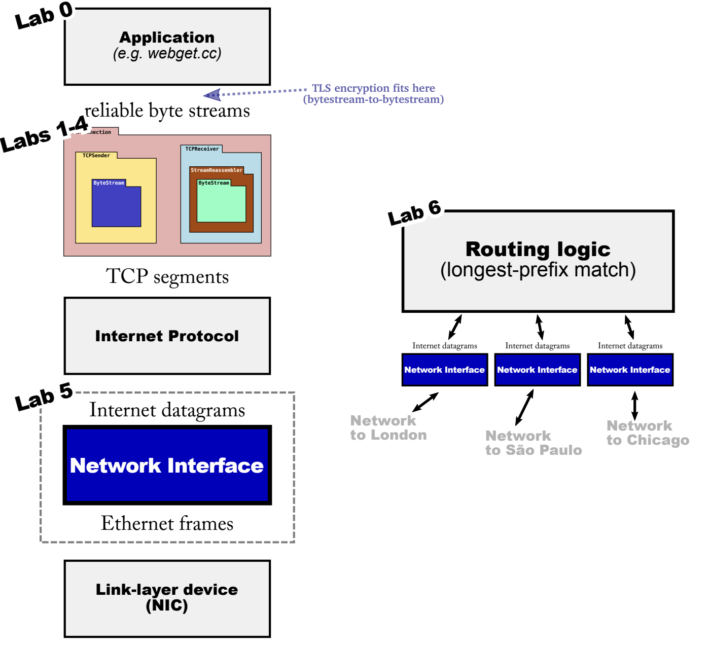

# Lab Checkpoint 6: building an IP router



Lab6 在 Lab5 实现的 network interface 基础上，构建一个 IP 路由器。路由器有多个 network interface，并能接受任意一个 network interface 的 IP 报文。总结来说，路由器的任务就是根据路由表转发 IP 报文。

对于给定 IP 报文，路由表负责以下任务：
- 要将 IP 报文给哪一个 network interface。
- 下一跳的 IP 地址。

## Implementing the Router

**Router** 类可以：
- 追踪路由表
- 将收到的 IP 报文在正确的传出网络接口(network interface)上转发给正确的下一跳

### add_route

为路由表添加路由规则。

```c++
// router.hh
class Router {
    ...
    struct route_entry {
        uint32_t _route_prefix{};
        uint8_t _prefix_length{};
        std::optional<Address> _next_hop{};
        size_t interface_num{};
    };
    std::vector<route_entry> _routes{};
    ...
};

// router.cc
void Router::add_route(const uint32_t route_prefix,
                       const uint8_t prefix_length,
                       const optional<Address> next_hop,
                       const size_t interface_num) {
    cerr << "DEBUG: adding route " << Address::from_ipv4_numeric(route_prefix).ip() << "/" << int(prefix_length)
         << " => " << (next_hop.has_value() ? next_hop->ip() : "(direct)") << " on interface " << interface_num << "\n";
    // Your code here.
    _routes.push_back(route_entry{route_prefix, prefix_length, next_hop, interface_num});
}
```

### route_one_datagram

转发数据包给下一跳，从适当的接口传出。实现`longest-prefix match`逻辑，为路由器找到最佳匹配的路由规则。
- 路由器搜索路由表，找到目的地址的最高有效前缀长度与路由规则的前缀的最高有效前缀长度相同。
- 如果没有匹配的路由，路由器丢弃数据报。
- 路由器减少数据报的 TTL(time to live)，如果 TTL 为 0，路由器丢弃数据报。
- 否则的话，路由器在适当的接口上转发数据报给下一跳。

```c++
void Router::route_one_datagram(InternetDatagram &dgram) {
    // Your code here.
    if (dgram.header().ttl <= 1) {
        return;
    }

    int match_index = -1;
    uint8_t max_match_len = 0;
    for (size_t i = 0; i < _routes.size(); i++) {
        uint32_t mask =
            _routes[i]._prefix_length == 0 ? 0 : numeric_limits<int32_t>::min() >> (_routes[i]._prefix_length - 1);
        if (max_match_len <= _routes[i]._prefix_length && (dgram.header().dst & mask) == _routes[i]._route_prefix) {
            // for 0.0.0.0 _prefix_length = 0, <= needed
            max_match_len = _routes[i]._prefix_length;
            match_index = i;
        }
    }

    if (match_index == -1) {
        return;
    }

    dgram.header().ttl--;

    if (!_routes[match_index]._next_hop.has_value()) {
        interface(_routes[match_index].interface_num)
            .send_datagram(dgram, Address::from_ipv4_numeric(dgram.header().dst));
    } else {
        interface(_routes[match_index].interface_num).send_datagram(dgram, _routes[match_index]._next_hop.value());
    }
}
```
