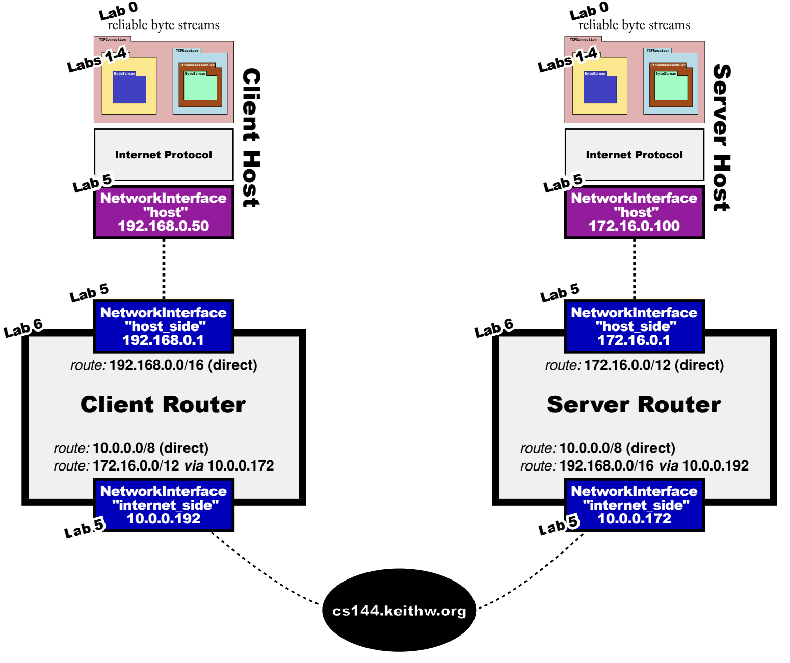

# Lab Checkpoint 7: putting it all together

Lab7 不需要写任何代码，这一部分验证我们前面 Lab 所有实现的正确性。

## The Network

如下图，Lab7 `build/app/lab7`为我们构建了这样一个网络。



1. server 执行`./apps/lab7 server cs144.keithw.org 3000`，输出如下：
```
❯ ./apps/lab7 server cs144.keithw.org 3000
DEBUG: Network interface has Ethernet address 02:00:00:f6:1a:5f and IP address 172.16.0.1
DEBUG: Network interface has Ethernet address 02:00:00:25:55:fe and IP address 10.0.0.172
DEBUG: adding route 172.16.0.0/12 => (direct) on interface 0
DEBUG: adding route 10.0.0.0/8 => (direct) on interface 1
DEBUG: adding route 192.168.0.0/16 => 10.0.0.192 on interface 1
DEBUG: Network interface has Ethernet address b2:3c:1d:4e:1c:2e and IP address 172.16.0.100
DEBUG: Listening for incoming connection...
```
2. client 执行`./apps/lab7 client cs144.keithw.org 3001`，输出如下：
```
❯ ./apps/lab7 client cs144.keithw.org 3001
DEBUG: Network interface has Ethernet address 02:00:00:b5:49:ea and IP address 192.168.0.1
DEBUG: Network interface has Ethernet address 02:00:00:09:33:86 and IP address 10.0.0.192
DEBUG: adding route 192.168.0.0/16 => (direct) on interface 0
DEBUG: adding route 10.0.0.0/8 => (direct) on interface 1
DEBUG: adding route 172.16.0.0/12 => 10.0.0.172 on interface 1
DEBUG: Network interface has Ethernet address 22:6a:fc:2f:1f:0b and IP address 192.168.0.50
DEBUG: Connecting from 192.168.0.50:29928...
DEBUG: Connecting to 172.16.0.100:1234...
```
3. 在任意一端输入数据，可以看到数据被正确传输。`ctrl-D`结束自己的输入，并等待另一端结束。

## Sending a file

1. 写 1M 的随机内容到文件`/tmp/big.txt`：
```
❯ dd if=/dev/urandom bs=1M count=1 of=/tmp/big.txt`
```
2. 启动 server：
```
❯ ./apps/lab7 server cs144.keithw.org 3000 < /tmp/big.txt
```
3. 启动 client：
```
❯ </dev/null ./apps/lab7 client cs144.keithw.org 3001 > /tmp/big-received.txt
```
4. 等待文件传输完毕，查看两个文件的内容，确认是否相同：
```
❯ sha256sum /tmp/big.txt
71c995ab3f4f840808f7b46c2ead007a55bd110699f7f2281dd5fe9b7bb38352  /tmp/big.txt

❯ sha256sum /tmp/big-received.txt
71c995ab3f4f840808f7b46c2ead007a55bd110699f7f2281dd5fe9b7bb38352  /tmp/big-received.txt

❯ ls -l /tmp/big*
-rw-rw-r-- 1 ubuntu ubuntu 1048576 Jan 19 18:20 /tmp/big-received.txt
-rw-rw-r-- 1 ubuntu ubuntu 1048576 Jan 19 18:08 /tmp/big.txt
```