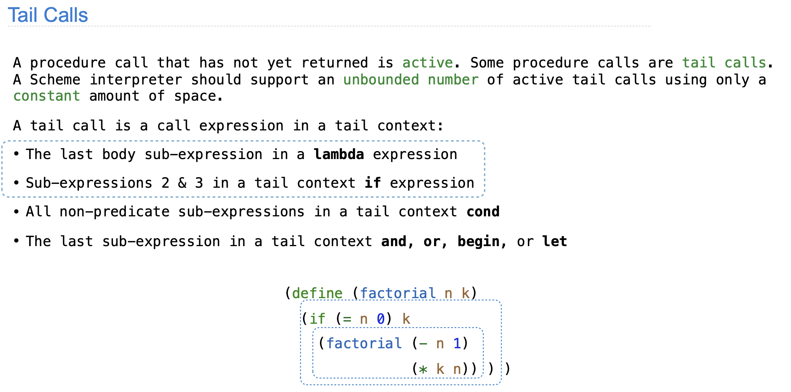

# Scheme 解释器中尾递归优化的实现

这是 CS61A [2020 fall](https://inst.eecs.berkeley.edu/~cs61a/fa20/proj/scheme/#problem-19) Project4  的 PROBLEM 19，优化 Scheme 解释器的尾递归程序。

## 为什么要优化尾递归程序

以 `factorial` 为例子，python 编写的递归、迭代版本实现如下：
```python
# tail-recursion
def factorial_recursion(n, k):
    if n == 0:
        return k
    else:
        return factorial(n - 1, k * n)

# iteration
def factorial_iteration(n, k):
    while n > 0:
        n, k = n - 1, k * n
    return k
```

其中，它们的时间复杂度均为 O(n)，迭代的时间复杂度为 O(1)，而递归版本的空间复杂度尾 O(n)，因为 n 次调用需要 n 个栈帧保存程序参数变量。

因此如果调用`factorial_recursion(1000, 1)`会因为超过最大递归深度（空间复杂度太大）而导致我们所说的**爆栈**，`factorial_iteration`则不会，因为它的空间复杂度是常量。

实际上，`factorial_recursion`每一次递归调用时，可以丢弃上一次调用的栈帧，从而达到与迭代版本一样的常量空间复杂度的效果。

比如，`factorial_recursion(1000, 1)` 调用 `factorial_recursion(999, 1000 * 1)`，实际上已经将变量保存到第二次调用的栈帧的变量`k`中，上一次的栈帧我们不需要再保留。最后，只需要返回最后一次递归调用的 k 即可。可以发现，其实这样的思想就迭代。

因此一个尾递归程序可以转换为一个迭代程序，从而达到常量的空间复杂度。在 Project4 中，我们希望 scheme 解释器的尾递归程序，可以被解释成迭代程序执行。例如，我们需要优化 scheme 解释器的实现，使得 scheme 尾递归版本的 `factorial` 同样是常量的空间复杂度：
```scheme
(define (factorial n k)
    (if (zero? n) k)
        (factorial (- n 1)
                   (* k n)))
```

## 实现

### 程序中如何判断尾递归调用

视频这一节的 [tail calls](https://www.youtube.com/watch?v=V4HDNg79EXo&list=PL6BsET-8jgYXdYh7kYQ-4HkO_EF_BItoz&index=3) 讲述了如下判断方式：



- lambda 表达式函数体的最后一个子表达式。
- if 表达式中的程序体的子表达式。
- cond 表达式中的所有非谓词表示式（非判断部分）。
- and, or, begin, let 的最后一个子表达式。

### Scheme 解释器中的优化实现

Thunk 类实例表示它的类成员变量 expr 需要在类成员变量 env 中被计算。

当 `optimized_eval` 接受非原子的 tail-call 表达式，它立即返回 Thunk 实例，而不是继续去递归 `scheme_eval(expr, env)` 计算表达式，而是先返回，再计算 Thunk 实例中的 expr，相当于回收之前的递归深度/空间。

否则的话，它应当反复调用 `original_scheme_eval`，直到它返回值不是 Thunk 类型。

```python
def optimize_tail_calls(original_scheme_eval):
    """Return a properly tail recursive version of an eval function."""
    def optimized_eval(expr, env, tail=False):
        """Evaluate Scheme expression EXPR in environment ENV. If TAIL,
        return a Thunk containing an expression for further evaluation.
        """
        if tail and not scheme_symbolp(expr) and not self_evaluating(expr):
            return Thunk(expr, env)

        result = Thunk(expr, env)
        # BEGIN PROBLEM 19
        "*** YOR CODE HERE ***"
        while isinstance(result, Thunk):
            result = original_scheme_eval(result.expr, result.env)
        return result
        # END PROBLEM 19
    return optimized_eval

scheme_eval = optimize_tail_calls(scheme_eval) # uncomment this!
```

遵循尾递归调用判断规则，设置 optimize_tail_calls 的第三个参数 `tail` 为 True。
- lambda, cond, let, begin 涉及 `eval_all`。
- if 涉及 `do_if_form`。
- and, or 分别是 `do_and_form`, `do_or_form`。

```python
def eval_all(expressions, env):
    # BEGIN PROBLEM 7
    # return scheme_eval(expressions.first, env) # replace this with lines of your own code
    value = None
    while expressions is not nil:
        if expressions.rest is not nil:
            value = scheme_eval(expressions.first, env)
        else:
            value = scheme_eval(expressions.first, env, True)
        expressions = expressions.rest
    return value
    # END PROBLEM 7


def do_if_form(expressions, env):
    validate_form(expressions, 2, 3)
    if is_true_primitive(scheme_eval(expressions.first, env)):
        return scheme_eval(expressions.rest.first, env, True)
    elif len(expressions) == 3:
        return scheme_eval(expressions.rest.rest.first, env, True)


def do_and_form(expressions, env):
    # BEGIN PROBLEM 12
    value = True
    "*** YOUR CODE HERE ***"
    while expressions is not nil:
        if expressions.rest is not nil:
            value = scheme_eval(expressions.first, env)
        else:
            value = scheme_eval(expressions.first, env, True)
        if value is False:
            return False
        expressions = expressions.rest
    return value


def do_or_form(expressions, env):
    # BEGIN PROBLEM 12
    "*** YOUR CODE HERE ***"
    while expressions is not nil:
        if expressions.rest is not nil:
            value = scheme_eval(expressions.first, env)
        else:
            value = scheme_eval(expressions.first, env, True)
        if value is not False:
            return value
        expressions = expressions.rest
    return False
    # END PROBLEM 12
```
