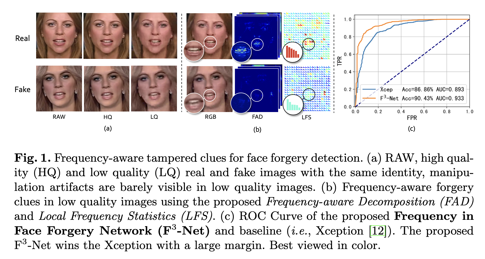
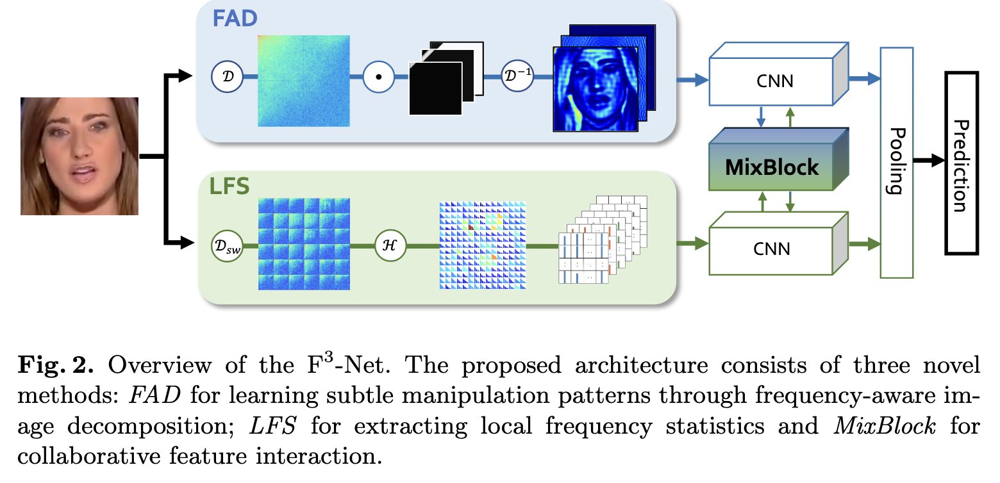
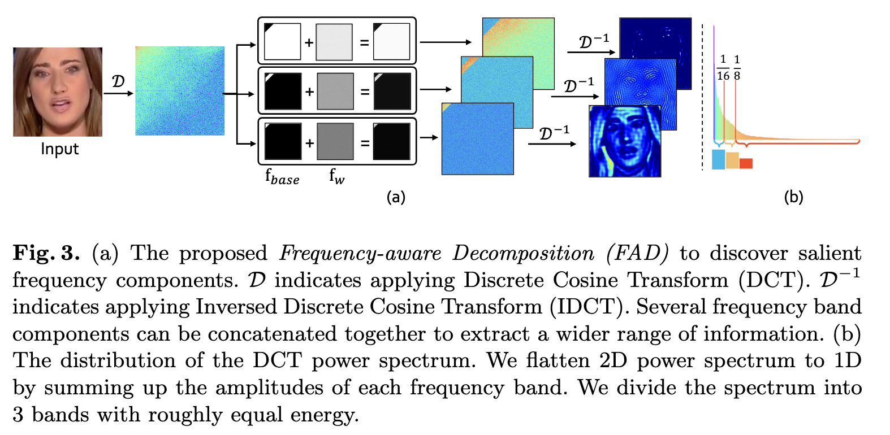
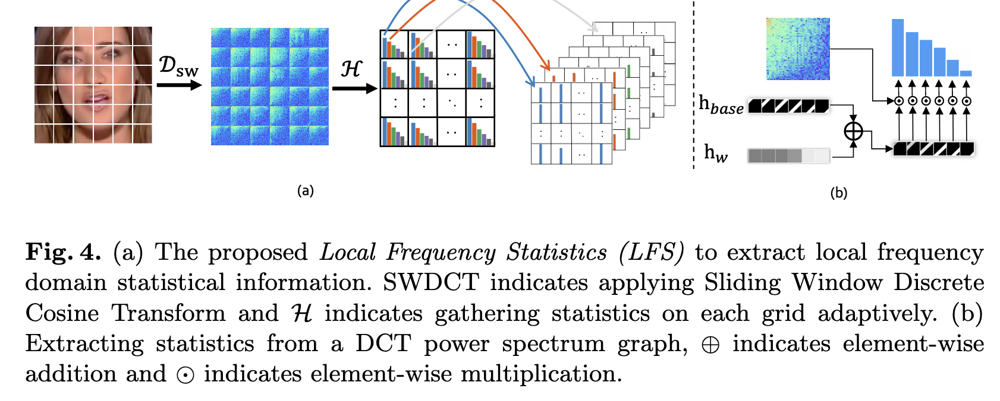
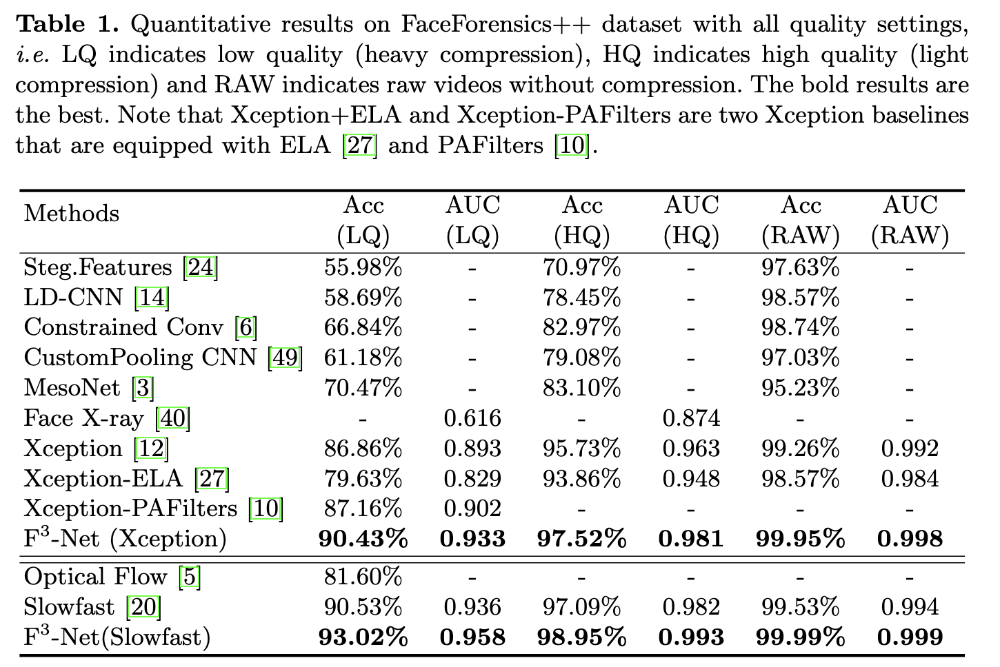

# [ECCV 2020] Thinking in Frequency: Face Forgery Detection by Mining Frequency-aware Clues

idea: 引入两种提取频域特征的方法FAD (Frequency-Aware Decomposition) 和LFS (Local Frequency Statistics) ，并设计了一个 MixBlock 来融合双路网络的特征，从而在频域内实现对Deepfake的检测。

code: https://github.com/yyk-wew/F3Net

https://zhuanlan.zhihu.com/p/260998460

## Abstract

由于逼真的面部操作技术取得了显著的进展，对这些技术潜在恶意滥用的社会关注带来了人脸伪造检测的新兴研究课题。然而，由于最近的进展能够在人眼感知能力之外伪造人脸，特别是在压缩图像和视频中，这是非常具有挑战性的。我们发现，挖掘具有频率意识的伪造模式可能是一种治愈方法，因为频率提供了一个补充的观点，其中可以很好地描述细微的伪造伪影或压缩错误。为了将频率引入人脸伪造检测中，我们提出了一种新颖的 Frequency in Face Forgery Network (F3-Net)，利用两个不同但互补的频率感知线索
- frequency-aware decomposed image components
- local frequency statistics, to deeply mine the forgery patterns via our two-stream collaborative learning framework.

我们将 DCT 应用于应用的频域变换。通过综合研究，我们表明所提出的 F3-Net 在具有挑战性的 FaceForensics++ 数据集中在所有压缩质量上都显着优于竞争最先进的方法，尤其是在低质量媒体上赢得大领先地位。

## Introduction

如果伪造人脸的视觉质量大大降低，如JPEG压缩或H.264压缩比大，伪造伪影会受到压缩误差的污染，有时不能在RGB域中捕获。幸运的是，与真实人脸相比，这些伪影可以在频域中捕获，因为许多先前的研究以不寻常的频率分布形式。然而，如何将频率感知线索纳入深度学习 CNN 模型中。这个问题也一起提出。传统的频域，如FFT和DCT，与自然图像所拥有的移位不变性和局部一致性不匹配，因此普通的CNN结构可能是不可行的。因此，如果我们想利用可学习 cnn 的判别表示能力进行频率感知人脸伪造检测，cnn 兼容的频率表示变得至关重要。为此，我们希望引入两个与深度卷积网络知识挖掘兼容的频率感知伪造线索。

从一个方面，可以通过分离图像的频率信号来分解图像，而每个分解后的图像分量表示一定频带的频率。因此，第一个频率感知伪造线索是通过这样一种直觉发现的，即我们能够在频率较高的分解分量中识别一些显著(即，以不寻常的模式的形式)的细微伪造工件，如图 1 (b) 中间列所示。该线索与 CNN 结构兼容，并且对压缩伪影具有惊人的鲁棒性。另一方面，分解后的图像分量描述了空间域中的频率感知模式，但没有明确地直接在神经网络中渲染频率信息。我们建议第二个频率感知伪造线索作为 local frequency statistics 局部频率统计。在每个密集但定期采样的局部空间补丁中，通过计算每个频带的平均频率响应来收集统计数据。这些频率统计重新组装成多通道空间图，其中通道数与频带数相同。如图1(b)的最后一列所示，即使它们在RGB图像中看起来几乎相同，伪造人脸的局部频率统计也不同于相应的真实人脸。此外，局部频率统计也遵循空间布局作为输入 RGB 图像，因此也享有由 CNN 驱动的有效表示学习。同时，由于分解后的图像分量和局部频率统计是互补的，但它们都具有固有的相似的频率感知语义，因此在特征学习过程中可以逐步融合它们。

因此，我们提出了一种新的 Frequency in Face Forgery Network (F3-Net)频率，它利用了上述频率感知伪造线索。该框架由两个频率感知分支组成，旨在通过频率感知图像分解 (FAD) 学习细微的伪造模式，另一种是从局部频率统计 (LFS) 中提取高级语义来描述真实人脸和伪造人脸之间的频率感知统计差异。这两个分支通过交叉注意模块进一步逐渐融合，即MixBlock，这鼓励了上述FAD和LFS分支之间的丰富交互。整个人脸伪造检测模型是通过交叉熵损失以端到端的方式学习的。大量实验表明，所提出的 F3-Net 通过彻底的消融研究显着提高了低质量伪造媒体的性能。我们还表明，我们的框架在具有挑战性的FaceForensics++[50]中的所有压缩质量上大大超过了竞争的最新技术。如图1(c)所示，通过将ROC曲线与Xception[12](基线，第4节之前最先进的看到)进行比较，可以清楚地看到所提出的频率感知F3-Net的有效性和优越性。我们在本文中的贡献总结如下：
- Frequency-aware Decomposition (FAD) 旨在通过频率感知图像分解学习频率感知伪造模式。所提出的FAD模块根据可学习的频带自适应地划分频域中的输入图像，并用一系列频率感知分量表示图像。
- Local Frequency Statistics (LFS) 提取局部频率统计来描述真实人脸和虚假人脸之间的统计差异。局部频率统计不仅揭示了每个频段伪造图像的异常统计，而且共享自然图像的结构，从而通过cnn进行有效的挖掘。
- 所提出的框架通过支持双流网络的交叉注意（即 MixBlock）从 FAD 和 LFS 协作学习频率感知线索。该方法在具有挑战性的FaceForensics++数据集[50]上实现了最先进的性能，特别是在低质量伪造检测中赢得了大领先地位。

## Our Approach

在本节中，我们介绍了所提出的两种频率感知伪造线索挖掘方法，即频率感知分解和局部频率统计，然后提出了所提出的交叉注意力双流协作学习框架。

### FAD: Frequency-Aware Decomposition

对于频率感知图像分解，以往的研究通常在空间域中应用手工制作的滤波器组，因此无法覆盖整个频域。同时，固定的过滤配置使得难以自适应地捕获伪造模式。为此，我们提出了一种新的频率感知分解(FAD)，根据一组可学习的频率滤波器自适应地划分频域中的输入图像。分解后的频率分量可以反向变换到空间域，从而产生一系列频率感知的图像分量。这些组件沿通道轴堆叠，然后输入到卷积神经网络(在我们的实现中，我们使用 Xception 作为骨干)中，全面挖掘伪造模式。

具体来说，我们手动设计了 N 个二进制基滤波器 $\{f_{base}^i\}_{i = 1}^N$（或称为掩码），明确地将频域划分为低频段、中频段和高频段。然后我们向这些基本过滤器添加三个可学习的过滤器 ${f_{base}^i}_{i = 1}^N$。频率滤波是输入图像和组合滤波器频率响应之间的点积 $f_{base}^i + \sigma(f_w^i), i = \{1, ..., N\}$，这里 $\sigma(x) = \frac{1 - exp(-x)}{1 + exp(-x)}$ 旨在压缩 -1 到 +1 范围内的 x。因此，对于输入图像x，分解后的图像分量由下式得到：

${\bf y}_{i}=D^{-1}\{D({\bf x}) \odot [{\bf f}_{b a s e}^{i}+\sigma({\bf f}_{w}^{i})]\},\;\;\;i=\{1,\cdot\cdot\cdot, N\}$

$\odot$ 是逐元素乘积。我们根据D在图像处理中的广泛应用，将 D 作为离散余弦变换(DCT)[4]，其频率分布的良好布局，即低频响应被放置在左上角，高频响应位于右下角。此外，最近的压缩算法，如JPEG和H.264，通常在它们的框架中应用DCT，因此基于 dct 的 FAD 将更多兼容伪造模式中压缩伪影的描述。观察自然图像的DCT功率谱，我们发现谱分布不均匀，大部分振幅集中在低频区域。我们应用基本滤波器 $f_{base}$ 将频谱划分为能量大致相等的 N 个波段，从低频到高频。添加的可学习 $\{f_w^i\}_{i = 1}^N$ 提供了更多的适应来选择固定基本过滤器之外的兴趣频率。根据经验，如图3(b)所示，频带数N = 3，低频频带 $f_{base}^1$ 是整个频谱的前 1/16，中间频带 $f_{base}^2$ 在频谱的 1/16 和 1/8 之间，高频频带 $f_{base}^3$ 是最后7/8。

### LFS: Local Frequency Statistics

上述 FAD 提供了与 CNN 兼容的频率感知表示，但它必须将频率感知线索表示为空间域，因此无法直接利用频率信息。还知道，直接从光谱表示中提取CNN特征来挖掘伪造伪影通常是不可行的，然后我们建议估计局部频率统计(LFS)，不仅可以显式地渲染频率统计，还可以匹配自然RGB图像拥有的移位不变性和局部一致性。然后将这些特征输入到卷积神经网络中，即，以发现高级伪造模式。

如图 4(a) 所示，我们首先在输入 RGB 图像（即密集地在图像的滑动窗口上获取 DCT）上应用滑动窗口 DCT (SWDCT) 来提取局部频率响应，然后计算一系列可学习频带的平均频率响应。这些频率统计重新组装成与输入图像共享相同布局的多通道空间图。这个 LFS 提供了一个局部孔径来检测详细的异常频率分布。计算一组频带内的统计信息可以减少统计表示，同时在不干扰异常值的情况下产生更平滑的分布。

具体来说，在每个窗口 $p \in x$ 中，在 DCT 之后，在每个频段收集局部统计数据，其构造方式类似于 FAD 中使用的方式（参见第 3.1 节）。在每个波段，统计数据变为：

${\bf q}_{i}=\log_{10}||D({\bf p})\odot[{\bf h}_{b a s e}^{i}+\sigma({\bf h}_{u}^{i})]||_{1},\;\;\;i=\{1,\cdot\cdot,M\}$

请注意，$log_10$ 用于平衡每个频带的大小。频带是通过将频谱平均划分为 M 个部分来收集的，遵循从低频到高频的顺序。类似地，$h_{base}^i$ 是基滤波器，$h_w^{i}$ 是可学习滤波器，$i = {1, ..., M}$。然后将窗口 p 的局部频率统计 q 转置为 1 × 1 × M 向量。从所有窗口收集的这些统计向量被重新组装成输入图像的下采样空间大小的矩阵，其通道数等于 M。这个矩阵将充当后面的卷积层的输入。

实际上，在我们的实验中，我们根据经验采用窗口大小为 10，滑动步长为 2，频带数为 M = 6，因此如果输入图像大小为 299 × 299 × 3，则输出矩阵的大小将为 149 × 149 × 6。

### Two-stream Collaborative Learning Framework

如第 3.1 节和第 3.2 节所述，所提出的 FAD 和 LFS 模块从两个不同但固有的连接方面挖掘频率感知伪造线索。我们认为这两种类型的线索不同但互补。因此，我们提出了一个由交叉注意模块驱动的协作学习框架，逐步融合双流FAD和LFS特征。具体来说，我们的F3-Net的整个网络架构由两个配备 Xception 块的分支组成，一个用于FAD生成的分解图像组件，另一个用于LFS生成的局部频率统计，如图2所示。

我们提出了一个交叉注意力融合模块，用于特征交互和消息传递每几个 Xception 块。如图5所示，与以往方法中广泛使用的简单拼接不同，我们首先使用两个分支的特征映射计算交叉注意权值。采用交叉注意力矩阵将注意力特征从一个流增加到另一个流。

在我们的实现中，我们对两个分支使用在 ImageNet [18] 上预训练的 Xception 网络 [12]，每个分支有 12 个块。新引入的层和块是随机初始化的。在调整为299 × 299后，采用裁剪的人脸作为框架的输入。根据经验，我们在块 7 和块 12 之后采用 MixBlock，根据它们的中级和高级语义融合两种类型的频率感知线索。我们通过众所周知的交叉熵损失训练 F3-Net，整个系统可以以端到端的方式进行训练

## Experiment

## Conclusions

在本文中，我们提出了一种创新的人脸伪造检测框架，该框架可以利用频率感知的伪造线索，称为F3-Net。该框架由两个频率感知分支组成，一个侧重于通过频率分量划分挖掘细微的伪造模式，另一个旨在提取真实图像和伪造图像之间的频率统计的小规模差异。同时，将一种新颖的交叉注意模块应用于双流协作学习。大量实验证明了所提出的F3-Net在FaceForencis++数据集上的有效性和意义，特别是在具有挑战性的低质量任务中。

