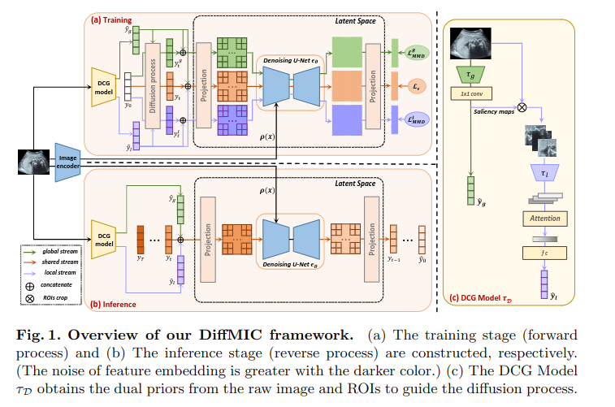
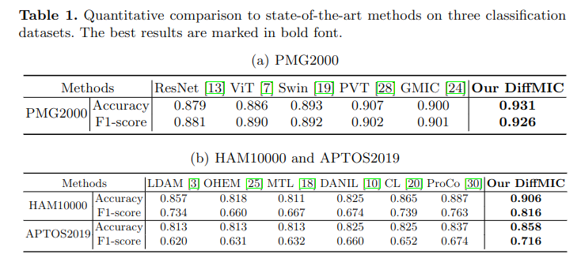
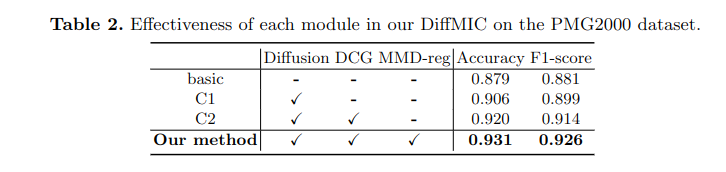
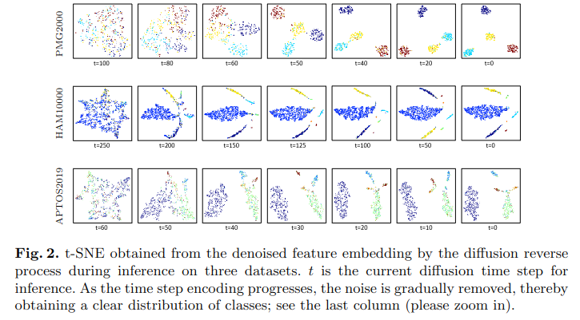

# [MICCAI 2023] DiffMIC: Dual-Guidance Diffusion Network for Medical Image Classification

code: https://github.com/scott-yjyang/DiffMIC

## Abstract

扩散概率模型最近在生成图像建模方面表现出了显著的性能，在计算机视觉领域引起了极大的关注。然而，虽然大量基于扩散的研究都集中在生成任务上，但很少有研究将扩散模型应用于一般的医学图像分类。在本文中，我们提出了第一个基于扩散的模型（称为 DiffMIC），通过消除医学图像中的意外噪声和扰动并稳健地捕获语义表示来解决一般的医学图像分类。为了实现这一目标，我们设计了一种双条件引导策略，该策略以多粒度条件每个扩散步骤，以提高逐步区域注意。此外，我们建议通过在扩散前向过程中强制最大平均差异正则化来学习每个粒度中的互信息。我们评估了我们的DiffMIC在三个具有不同图像模式的医学分类任务上的有效性，包括超声图像的胎盘成熟度分级、皮肤镜图像的皮肤病变分类和眼底图像的糖尿病视网膜病变分级。实验结果表明，DiffMIC 大大优于最先进的方法，表明了所提出模型的通用性和有效性。

## Introduction

数字医学成像在现代医疗保健的影响导致了医学图像分析在临床治疗中不可或缺的作用[5]。医学图像分类是医学图像分析中的一个基本步骤，旨在根据临床病理或成像方式等特定标准来区分医学图像。可靠的医学图像分类系统可以帮助医生快速准确地解释医学图像。在过去的几十年里，文献中开发了大量的医学图像分类解决方案，其中大部分是基于深度神经网络，从流行的卷积神经网络到视觉转换器[8，9，22，23]。这些方法有可能减少人工分类所需的时间和工作量，提高结果的一致性和准确性。然而，由于存在各种模糊病变和细粒度组织，如超声(US)、皮肤镜和眼底图像，不同模式的医学图像仍然挑战现有的方法。此外，在硬件限制下生成医学图像会造成噪声和模糊的影响，从而降低图像质量，因此需要更有效的特征表示建模来进行鲁棒分类。

最近，去噪扩散概率模型(DDPM)[14]通过迭代提高给定图像的质量，在图像生成和合成任务中取得了优异的成绩[21,2,6,26]。具体来说，DDPM 是一种基于马尔可夫链的生成模型，它通过模拟将输入数据演变为目标分布的扩散过程来对数据分布进行建模。虽然一些开创性的工作试图采用扩散模型进行图像分割和目标检测任务[1,29,4,12]，但它们对高级视觉任务的潜力尚未得到充分探索。

受扩散模型在生成图像建模方面的成功启发，我们提出了一种新的基于去噪扩散的模型DiffMIC，用于对各种医学图像模式进行准确的分类。据我们所知，我们是第一个提出基于扩散的通用医学图像分类模型的人。我们的方法可以适当地消除医学图像中的不良噪声，因为扩散过程本质上是每个采样步骤的随机的。特别是，我们引入了一种双粒度条件引导 (DCG) 策略来指导去噪过程，在扩散过程中使用全局和局部先验来调节每个步骤。通过在较小的斑块上进行扩散过程，我们的方法可以区分具有细粒度能力的关键组织。此外，我们引入了特定于条件的最大平均差异 (MMD) 正则化来学习每个粒度潜在空间中的互信息，使网络能够对整个图像和补丁共享的鲁棒特征表示进行建模。我们评估了DiffMIC在三个2D医学图像分类任务中的有效性:胎盘成熟度分级、皮肤病变分类和糖尿病视网膜病变分级。实验结果表明，我们的基于扩散的分类方法在所有三个数据集上都始终优于最先进的方法。我们的DiffMIC为各种医学图像模式的准确和稳健的分类提供了一种很有前途的解决方案。总之，我们工作的技术贡献有四个方面：
- 据我们所知，我们的工作是第一个开发基于 DDPM 的通用医学图像分类模型的工作。
- 我们设计了一种新的指导策略，通过双粒度先验来调节每个步骤。
- 我们在迭代采样过程中学习互信息之前为每个条件引入最大平均差异正则化。
- 在三个医学图像分类基准数据集上的实验结果表明，我们的 DiffMIC 明显优于最先进的医学图像分类方法。

## Method

图 1 显示了我们的网络用于医学图像分类的示意图。给定一个输入的医学图像 $\mathcal{x}$，我们将其传递给图像编码器，得到图像特征嵌入 $\rho(\mathcal{x})$，和双粒度条件引导 (DCG) 模型产生全局先验 $\hat{y}_g$ 和局部先验 $\hat{y}_l$。在训练阶段，我们将扩散过程应用于 ground truth $y_0$ 和不同的先验来生成三个噪声变量 $y_t^g$，$y_t^l$ 和 $y_t$（$y_g^t$ 的全局先验、$y_t^l$ 的局部先验和 $y_t$ 的双重先验）。然后，我们将三个噪声变量 $y_g^t$、$y_t^l$ 和 $y_t$ 与其对应的先验连接起来，并将它们分别投影到潜在空间中。我们进一步将三个投影嵌入分别与图像特征嵌入 $\rho(\mathcal{x})$ 集成到去噪的 U-Net 中，并预测了 $y_t^g, y_t^l, y_t$ 采样的噪声分布。我们在 $y_g^t$ 和 $y_t^l$ 的预测噪声上设计了条件特定的最大平均误差 (MMD) 正则化损失，并在 $y_t$ 的预测噪声上使用噪声估计均方误差(MSE)损失来协同训练我们的 DiffMIC 网络。

**Diffusion Model.** 继DDPM[14]之后，我们的扩散模型也有两个阶段：正向扩散阶段(训练阶段)和反向扩散阶段(推理阶段)。在正向过程中，ground truth 响应变量 $y_0$ 通过扩散过程添加高斯噪声，该扩散过程由 [1, T] 的均匀分布中采样的时间步t采样，这些噪声变量记为 $\{y_1, ..., y_t, ..., y_T\}$。正如DDPM的标准实现所建议的，我们采用UNet作为去噪网络来参数化反向扩散过程并学习正向过程中的噪声分布。在反向扩散过程中，训练好的 UNet $\epsilon_\theta$ 通过将噪声变量分布 $p_\theta(y_T)$ 转换为 ground truth 生成最终的预测 $\hat{y}_0$：

$$p_{\theta}(y_{0;T-1}|y_{T},\rho(x))\equiv\prod_{t=1}^{T}p_{\theta}(y_{t-1}|y_{t},\rho(x)), and \ p_{\theta}(y_{T})=N(\frac{\dot{y}_{g}+\dot{y}_{l}}{2},\bar{\mathbb{I}})$$

其中 $\theta$ 是去噪 UNet 的参数，$\mathcal{N}\left(\cdot,\cdot\right)$ 表示高斯分布，$\mathbb{I}$ 是单位矩阵。

### Dual-granularity Conditional Guidance (DCG) Strategy

**DCG Model.** 在大多数条件DDPM中，条件先验将是唯一给定的信息。然而，由于对象的模糊性，医学图像分类尤其具有挑战性。很难将病变和组织与背景区分开来，特别是在低对比度图像模式中，如超声图像。此外，在感兴趣区域(regions of interest，ROI)中可能存在意想不到的噪声或模糊的影响，从而阻碍了对高级语义的理解。仅将原始图像 x 作为每个扩散步骤中的条件不足以稳健地学习细粒度信息，导致分类性能退化。

为了缓解这个问题，我们设计了一个双粒度条件引导 (Dual-granularity Conditional Guidance，DCG) 来编码每个扩散步骤。具体来说，我们引入了一个 DCG 模型 $\tau_D$ 计算扩散过程的全局和局部条件先验。与放射科医师的诊断过程类似，我们可以从全局先验中获得整体理解，并且在去除负噪声效应时也专注于与局部病变相对应的区域。如图 1 (c) 所示，对于全局 stream，原始图像数据 x 被馈送到全局编码器 $\tau_g$，然后是 1×1 卷积层以生成整个图像的显着图。然后通过平均响应从整个显着性图预测全局先验 $\hat{y}_g$。对于局部流，我们进一步裁剪响应在显著图中显著的 ROI。每个 ROI 被送入本地编码器 $\tau{l}$ 以获得特征向量。然后，我们利用门控注意机制[15]融合 roi 中的所有特征向量，得到一个加权向量，然后用一个线性层计算局部先验 $\hat{y}_l$。

**Denoising Model.** 基于DCG模型计算的全局先验和局部先验，在扩散过程中对噪声变量 $y_t$ 进行采样:

$$y_{t}=\sqrt{\bar{\alpha}_{t}}y_{0}+\sqrt{1-\bar{\alpha}_{t}}\epsilon+(1-\sqrt{\bar{\alpha}_{t}})(\hat{y}_{g}+\hat{y}_{l})$$

其中，$\epsilon \in \mathcal{N}(0, I), \overline{a}_t, a_t = 1 - \beta_t$ 具有线性噪声 schedule $\begin{array}{l}{{\displaystyle\{\beta_{t}\}_{t=1:T}~\in~\left(0,1\right)^{T}}}\end{array}$。之后，我们将噪声变量 $y_t$ 和对偶先验的连接向量输入到我们的去噪模型 UNet $\epsilon_\theta$ 中以估计噪声分布，可以表示为：

$$\epsilon_{\theta}(\rho(x),y_{t},\hat{y}_{g},\hat{y}_{l},t)=D(E(f([y_{t},\hat{y}_{g},\hat{y}_{l}]),\rho(x),t),t)$$

其中 $f(\cdot)$ 表示到潜在空间的投影层。$[\cdot]$ 是连接操作。$E(\cdot)$ 和 $D(\cdot)$ 是 UNet 的编码器和解码器。请注意，图像特征嵌入 $\rho(x)$ 与 UNet 中的投影噪声嵌入进一步集成，使模型专注于高级语义，从而获得更稳健的特征表示。在正向过程中，我们寻求最小化噪声估计损失 $\mathcal{L}_\epsilon$：

$$\mathcal{L}_{\epsilon} = \vert\vert\epsilon-\epsilon_\theta(\rho(x), y_t, \hat{y}_{g},\hat{y}_l, t)\vert\vert^2$$

我们的方法通过在结合来自原始图像和 ROI 的信息的先验上调节每个步骤估计函数来改进普通扩散模型。

### Condition-specific MMD Regularization

最大平均差异 (Maximum-Mean Discrepancy, MMD) 是通过比较所有矩来量化两个分布之间的相似性。它可以使用内核技巧有效地实现。受 InfoVAE [31] 的启发，我们引入了一对特定于条件的 MMD 正则化损失来学习采样噪声分布和高斯分布之间的互信息。具体来说，我们从时间步 t 的扩散过程中采样噪声变量 $y_t^g$，仅以全局先验为条件，然后计算 MMDregularization loss 为：

$$\begin{array}{c}{{{\mathcal L}_{M M D}^{g}(n||m)=\mathrm{K}(n,n^{'})-2\mathrm{K}(m,n)+\mathrm{K}(m,m^{'}),}}\\ {{\mathrm{with~}n=\epsilon,~~m=\epsilon_\theta(\rho(x),\sqrt{\bar{\alpha}_{t}}y_{0}+\sqrt{1-\bar{\alpha}_{t}}\epsilon+(1-\sqrt{\bar{\alpha}_{t}})\hat{y}_{g},\hat{y}_{g},t)}}\end{array}$$

其中 $\mathbb{K}(\cdot, \cdot)$ 是一个正定核，用于在希尔伯特空间中再现分布。条件特定的 MMD 正则化也应用于局部先验，如图 1 (a) 所示。虽然一般的噪声估计损失 $\mathcal{L}_\epsilon$ 从两个先验中捕获互补信息，但特定于条件的 MMD 正则化维护每个先验分布和目标分布之间的互信息。这也有助于网络更好地对双重先验共享的鲁棒特征表示进行建模，并以稳定的方式更快地收敛。

### Training and Inference Scheme

**Total loss.** 通过添加噪声估计损失和 MMD 正则化损失，我们计算去噪网络的总损失 $\mathcal{L}_{diff}$ 如下：

$\mathcal{L}_{d i f f}=\mathcal{L}_{\epsilon}+\lambda(\mathcal{L}_{M M D}^{g}+\mathcal{L}_{M M D}^{l})$

其中 λ 是平衡超参数，根据经验设置为 λ=0.5。

**Training details.** 本研究中的扩散模型利用了一个标准的 DDPM 训练过程，其中扩散时间步长t是从[1,T]的均匀分布中选择的，噪声以 $\beta_1 = 1 \times 10^{-4}$ 和 $\beta_T = 0.02$ linearly scheduled。我们采用 ResNet18 作为图像编码器 $\rho(\cdot)$。根据[12]，我们将 $y_t$, $\hat{y}_g$, $\hat{y}_l$ 连接起来，并应用线性层来获得潜在空间中的融合向量。我们在这样的向量和时间步长嵌入之间做一个 Hadamard 积，得到一个以时间步长为条件的响应嵌入。我们在这样的向量和时间步长嵌入之间做一个 Hadamard积，得到一个以时间步长为条件的响应嵌入。然后，我们在图像特征嵌入和响应嵌入之间执行 Hadamard 积来整合这些变量，并将结果向量通过两个具有相同维数的完全连接层发送，每个层首先是带有时间步长的 Hadamard 积嵌入，最后是具有输出维数的类的完全连接层作为噪声预测。请注意，除了输出层之外，所有完全连接的层后面还跟着一个批处理规范化层和一个 Softplus 非线性层。对于 DCG 模型 $\tau_D$，其全球和局部流的主干是 ResNet。我们采用标准交叉熵损失作为DCG模型的目标。在对DCG模型进行10次预热预训练后，我们联合训练去噪扩散模型和DCG模型，从而得到端到端的DiffMIC用于医学图像分类。

**Inference stage.** 如图 1 (b) 所示，给定一个输入图像 $x$，我们首先将其输入到 DCG 模型中，得到双先验值 $\hat{y}_g, \hat{y}_l$。然后，按照 DDPM 的流水线，使用双先验条件下训练好的 UNet 从随机预测 $y_T$ 中迭代降噪最终预测 $\hat{y}_0$，并对图像特征嵌入 $\rho(x)$ 进行降噪。

## Experiments

### Datasets and Evaluation

我们在一个 in-home 数据集和两个公共数据集上评估了我们的网络的有效性，例如PMG2000、HAM10000[27]和APTOS2019[16]。
- PMG2000。我们收集并注释了一个基准数据集(标记为PMG2000)，用于胎盘成熟度分级(PMG)，分为四类5。PMG2000由2098张超声图像组成，我们将整个数据随机分成一个训练集和一个测试集，比例为8:2。
- (b) HAM10000。HAM10000[27]来自2018年黑色素瘤检测的皮肤病变分析挑战赛，它包含10015张皮肤病变图像，预定义了7个类别。
- (c) APTOS2019。在APTOS2019[16]中，有3662张标记眼底图像用于将糖尿病视网膜病变分为五类。

遵循与相同的协议，我们将 HAM10000 和 APTOS2019 拆分为一个训练集和一个测试集，其比例相同，为7:3。这三个数据集具有不同的医学图像模式。PMG2000为灰度级平衡超声图像;HAM10000是彩色但类别不平衡的皮肤镜图像;APTOS2019是另一个具有彩色眼底图像的类不平衡数据集。此外，我们引入了两个广泛使用的指标(即准确性和F1-score)，用于定量比较我们的网络和最先进的方法。

### Implementation Details

所有的实验都是用PyTorch在一个NVIDIA RTX 3090 GPU上实现的。我们将图像居中裁剪，然后将裁剪后的图像的空间分辨率调整为224×224。在训练过程中实现了随机翻转和旋转来增强数据。我们的网络以端到端方式使用批大小为32的Adam优化器进行训练。当我们的方法在所有实验中训练整个网络时，去噪模型U-Net的初始学习率设置为 $1 \times 10^{-3}$，DCG 模型的初始学习率设置为 $2 \times 10^{-4}$(参见2.1节)。根据[20]，将三个数据集的训练 epoch 数设置为 1000。在推理中，我们经验地将 PMG2000 的总扩散时间步长设置为 100, HAM10000 的为250, APTOS2019 的为 60，这比大多数现有作品要小得多 [14,12]。对于空间分辨率为224×224 的图像，我们的DiffMIC的平均运行时间约为0.056秒。

### Comparison with State-of-the-art Methods

在表1(a)中，我们将DiffMIC与许多最先进的cnn和基于变压器的网络进行了比较，包括 ResNet、Vision Transformer (ViT)、Swin Transformer (Swin)、Pyramid Transformer (PVT)和PMG2000上的医学图像分类方法(即GMIC)。显然，PVT的准确率最高，为0.907,f1得分最高，为0.902。更重要的是，我们的方法进一步优于 pvt，将准确率从 0.907 提高到 0.931, f1得分从 0.902 提高到 0.926。

请注意，HAM10000和APTOS2019都有类不平衡问题。因此，我们将我们的DiffMIC与最先进的长尾医学图像分类方法进行了比较，并在表1(b)中报告了比较结果。对于HAM10000，我们的方法在Accuracy和F1-score方面分别比第二好的ProCo(0.019和0.053)产生了有希望的改进。对于APTOS2019，我们的方法在准确度和f1得分上分别比ProCo提高了0.021和0.042。

### Ablation Study

我们进行消融研究，以评估我们网络主要模块的有效性。为此，我们根据我们的方法构建了三个基线网络。第一个基线(表示为“基本”)是从我们的网络中删除所有扩散操作和MMD正则化损失。这意味着“basic”等于经典的ResNet18。然后，我们将香草扩散过程应用到“basic”上，构建另一个基线网络(记为“C1”)，并将我们的双粒度条件指导添加到扩散过程中，构建基线网络，记为“C2”。因此，“C2”等于从我们的网络中去除用于图像分类的MMD正则化损失。因此，“C2”等于从我们的网络中去除用于图像分类的MMD正则化损失。表2报告了我们的方法和三个基线网络在PMG2000数据集上的准确性和f1得分结果。显然，与“基本”相比，“C1”的准确率提高了0.027,f1得分提高了0.018，这表明扩散机制可以学习到更多医学图像分类的区别特征，从而提高了 PMG 的性能。此外，“C2”优于“C1”的准确率和f1分数结果表明，在香草扩散过程中引入我们的双粒度条件引导可以提高PMG的性能。此外，我们的方法在准确性和f1得分方面优于“C2”，这表明探索扩散过程中的 MMD 正则化损失可以进一步提高 PMG 结果。

### Visualization of our Diffusion Procedure

为了说明由我们的双粒度条件编码指导的扩散反向过程，我们使用t-SNE工具来可视化连续时间步长的去噪特征嵌入。图2展示了这一过程在所有三个数据集上的结果。随着时间步编码的进行，降噪扩散模型逐渐从特征表示中去除噪声，从而从高斯分布中得到更清晰的类分布。推理所需的总时间步数取决于数据集的复杂性。

## Conclusion

本文提出了一种双制导扩散网络 (DiffMIC) 用于医学图像分类。我们的 DiffMIC 的主要思想是在 DDPM 上引入双粒度条件引导，并强制特定条件的 MMD 正则化来提高分类性能。在三种具有不同图像形态的医学图像分类数据集上的实验结果表明，我们的网络优于最先进的方法。作为第一个基于扩散的通用医学图像分类模型，我们的 DiffMIC 有潜力作为该领域未来研究的基本基线。
