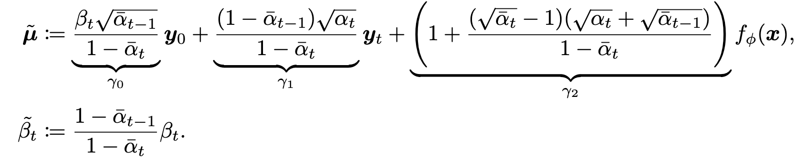
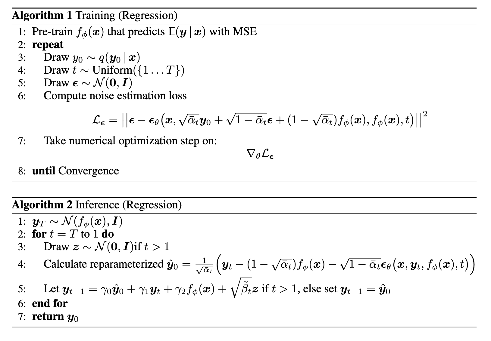
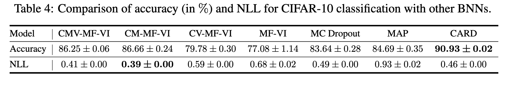
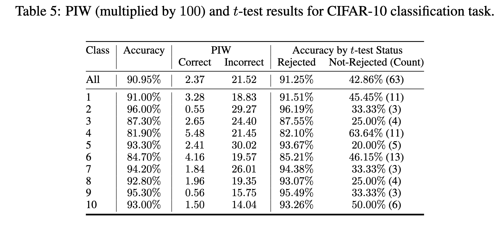

# [NIPS 2022] CARD: Classification and Regression Diffusion Models

code: https://github.com/XzwHan/CARD

## Abstract

给定协变量 x 学习连续或分类响应变量 y 的分布是统计和机器学习中的一个基本问题。**基于深度神经网络的监督学习算法在预测给定 x 的 y 的平均值方面取得了很大进展，但它们经常因无法准确捕捉预测的不确定性而受到批评。** 在本文中，我们引入了分类和回归扩散(CARD)模型，该模型结合了基于去噪扩散的条件生成模型和预训练的条件均值估计器，以准确预测给定 x 的 y 分布。我们用玩具示例和真实数据集证明了CARD在条件分布预测方面的杰出能力，实验结果表明CARD通常优于最先进的方法，包括设计用于不确定性估计的基于贝叶斯神经网络的方法，特别是当 y 给定 x 的条件分布是多模态时。此外，我们利用生成模型输出的随机性，在分类任务的实例级别上获得更细粒度的模型置信度评估。

## Introduction

统计和机器学习的一个基本问题是在给定一组协变量 x 的情况下预测响应变量 y。一般来说，y 是回归分析的连续变量和用于分类的分类变量。将 $f(x) \in \mathbb{R}^C$ 表示为确定性函数，它将 x 转换为 C 维输出。将 $f_c(x)$ 表示为 $f(x)$ 的第 c 维。现有方法通常假设加性噪声模型：对于 $y \in \mathbb{R}^C$ 的回归分析，通常假设 $y = f(x) + \epsilon$，$\epsilon~\sim~{\mathcal{N}}(0,\Sigma)$，而对于 $y \in \{1, ..., C\}$，通常假设 $y = argmax(f_1(x) + \epsilon_1, ..., f_C(x) + \epsilon_C)$，其中 ${\epsilon_{c}}~{\stackrel{iid}{\sim}}~\mathrm{EV}_{1}(0,1)$，标准类型 1 极值分布。因此，我们在回归中给定 x 的 y 的期望值为 $\mathbb{E}[y | x] = f(x)$，分类中 y 的期望值为 $P(y=c\mid x)=\mathbb{E}[y=c\mid x]=\mathrm{sofmax}_{c}(f(x))={\frac{\exp(f_{c}(x))}{\sum_{c^{\prime}=\mathrm{exp}(f_{c}^{\prime}(x))}}}$

这些加性噪声模型主要关注准确估计条件均值 $\mathbb{E}[y | x]$，同时较少关注噪声分布是否可以准确捕获给定 x 的 y 的不确定性。出于这个原因，如果 y 给定 x 的分布明显偏离加性噪声假设，它们可能效果不佳。例如，如果 $p(y | x)$ 是多模态的，这在 x 中缺少分类协变量时经常发生，那么在给定特定 x 的情况下，$\mathbb{E}[y | x]$ 可能无法接近 y 的任何可能真实值。更具体地说，考虑一个体重、身高、血压和年龄已知但性别未知的人，那么这个人的睾酮或雌激素水平很可能遵循双峰分布，患乳腺癌的机会也可能遵循双峰分布。因此，这些广泛使用的加性噪声模型使用确定性函数 $f(x)$ 来表征 y 的条件均值，在不确定性估计能力方面固有地受到限制。

在本文中，我们的目标是在给定一组 N 个训练数据点的情况下准确地恢复 y 条件对 x 的完整分布，表示为 $D = \{(x_i, y_i)\}_{1, N}$。为了实现这个目标，我们考虑基于扩散的（又名基于分数的）生成模型（Sohl-Dickstein 等人，2015；Song 和 Ermon，2019；Ho 等人，2020；Song 和 Ermon，2020；Song 等人，2021c），并将协变量依赖性注入到正向和反向扩散链中。我们的方法可以对连续变量和分类 y 变量的条件分布进行建模，并且在此方法下开发的算法将统称为分类和回归扩散 (CARD) 模型。为了实现这个目标，我们考虑基于扩散的（又名基于分数的）生成模型（Sohl-Dickstein 等人，2015；Song 和 Ermon，2019；Ho 等人，2020；Song 和 Ermon，2020；Song 等人，2021c），并将协变量依赖性注入到正向和反向扩散链中。我们的方法可以对连续变量和分类 y 变量的条件分布进行建模，并且在此方法下开发的算法将统称为分类和回归扩散 (CARD) 模型。

基于扩散的生成模型由于其生成高维数据的能力，如高分辨率图像，以及它们的训练稳定性，最近受到了极大的关注。它们可以从分数匹配（Hyvärinen 和 Dayan，2005；Vincent，2011）和朗之万动力学（Neal，2011；Welling 和 Teh，2011）的角度来理解，正如 Song 和 Ermon (2019) 首创的那样。他们还可以从扩散概率模型的角度来理解（Sohl-Dickstein 等人，2015 年；Ho 等人，2020 年），它首先定义了一个前向扩散来将数据转换为噪声，然后反向扩散以从噪声中重新生成数据。

这些以前的方法主要集中在无条件生成建模上。虽然存在引导扩散模型（Song 和 Ermon，2019；Song 等人，2021c；Dhariwal 和 Nichol，2021；Nichol 等人，2022；Ramesh 等人，2022），旨在生成与标签、文本或损坏图像的语义含义或内容相匹配的高分辨率照片级真实感图像，我们专注于在更基本的水平上研究基于扩散的条件生成建模。特别是，我们的目标是彻底调查 CARD 是否可以帮助准确恢复 $p(y | x, \mathcal{D})$，观察数据 $D = \{(x_i, y_i)\}_{i=1, N}$ 给定 x 的 y 预测分布。换句话说，我们的重点是在给定相应协变量的情况下对连续或分类响应变量的回归分析。

我们总结了我们的主要贡献如下：
- 我们展示了 CARD，它将协变量依赖性和预训练的条件均值估计器注入到正向和反向扩散链中以构建去噪扩散概率模型，提供了对 $p(y | x, \mathcal{D})$ 的准确估计。
- 我们提供了一个新的指标来更好地评估回归模型捕获完整分布 $p(y | x, \mathcal{D})$ 的效果。
- 回归分析标准基准的实验表明，CARD 使用现有指标和新指标实现了最先进的结果。
- 对于分类任务，我们将模型置信度的评估推向单个实例级别的预测，比以前的方法的粒度更细。

## Methods and Algorithms for CARD

给定 ground-truth 响应变量（真实标签） $y_0$ 和它的协变量（输入）$x$，假设扩散模型做出的一系列中间预测 $y_{1:T}$，监督学习的目标是学习一个模型，以便通过优化以下 ELBO 来最大化对数似然：

$$\log p_{\theta}(y_{0}\mid x)=\log\int p_{\theta}(y_{0:T}\mid x)d y_{1:T}\geq\mathbb{E}_{q(y_{1:T}\mid y_{0},x)}\left[\log{\frac{p_{\theta}(y_{0:T}\mid x)}{q(y_{1:T}\mid y_{0},x)}}\right]$$

其中 $q(y_{1:T}\mid y_{0},x)$ 在扩散模型的概念中称为正向过程或扩散过程。将 $D_{KL}(q \mid\mid p)$ 表示为从分布 p 到分布 q 的 Kullback-Leibler (KL) 散度。上述目标可以改写为

$${\mathcal{L}}_{\mathrm{ELBO}}(y_{0},x):={\mathcal{L}}_{0}(y_{0},x)+\sum_{t = 2}^{T}{\mathcal{L}}_{t-1}(y_{0},x)+{\mathcal{L}}_{T}(y_{0},x)$$

$$\mathcal{L}_0(y_0, x) := \mathbb{E}_q[-\log{p_\theta(y_0 \mid y_1, x)}]$$

$$\mathcal{L}_{t - 1}(y_0, x) := \mathbb{E}_q[D_{KL}(q(y_{t - 1} \mid y_t, y_0, x)) \mid\mid p_\theta(y_{t - 1} \mid y_t, x)]$$

$$\mathcal{L}_{T}(y_0, x) := \mathbb{E}_q[D_{KL}(q(y_{T} \mid y_0, x)) \mid\mid p(y_{T} \mid x)]$$

在这里，我们遵循惯例，假设 $\mathcal{L}_T$ 不依赖于任何参数，并通过仔细将观察到的响应变量 $y_0$ 扩散到预先假设的分布 $p(y_T \mid x)$ 将接近于零。其余项将使模型 $p_\theta(y_{t - 1} \mid y_t, x)$ 逼近所有时间步长的相应易于处理的真实去噪转换步骤 $q(y_{t - 1}, y_0, x)$。与普通扩散模型不同，我们假设扩散过程的端点为

$$
p(y_T \mid x) = \mathcal{N}(f_\phi(x), I)
$$

其中 $f_\phi(x)$ 是 x 和 $y_0$ 之间关系的先验知识，则使用 $\mathcal{D}$ 预训练的网络来近似 $\mathbb{E}[y \mid x]$ 或 如果我们假设关系未知，0。使用扩散 schedule $\{\beta_t\}_{t = 1:T} \in (0, 1)^T$，我们以类似于 Pandey 等人 (2022) 的方式指定正向过程条件分布，但对于所有时间步长，包括 t = 1：

$$q\big(y_{t}\mid y_{t-1},f_{\phi}(x)\big)=N\big(y_{t};\sqrt{1-\beta_{t}}y_{t-1}+(1-\sqrt{1-\beta_{t}})f_{\phi}(x),\beta_{t}I\big)$$

它允许具有任意时间步长 t 的封闭形式采样分布：

$$q(y_{t}\mid y_{0},f_{\phi}(x))=N{\bigl(}y_{t};{\sqrt{{\overline{{\alpha}}}_{t}}}y_{0}+(1-{\sqrt{{\overline{{\alpha}}}_{t}}})f_{\phi}(x),(1-{\overline{{\alpha}}}_{t})I{\bigr)}$$

其中，$\alpha_t = 1 - \beta_t$，$\overline{\alpha}_t := \prod_t{\alpha_t}$。请注意，方程式 7 中的均值项可以看作是真实数据 $y_0$ 和预测条件期望 $f_\phi(x)$ 之间的插值，它在整个前向过程中逐渐从前者变为后者。

这样的公式对应于易于处理的前向过程后验：

$$q(y_{t-1}\mid y_{t},y_{0},x)=q{\left(y_{t-1}\mid y_{t},y_{0},f_{\phi}(x)\right)}={\mathcal{N}}{\left(y_{t-1};{\tilde{\mu}}{\left(y_{t},y_{0},f_{\phi}(x)\right)},{\tilde{\beta}}_{t}I\right)}$$

其中

我们在附录 A.1 中提供了推导。术语下的标签用于算法 2。

### CARD for Regression

对于回归问题，反向扩散过程的目标是逐步恢复噪声项的分布、观测中固有的任意不确定性或局部不确定性(Kendall和Gal，2017；Wang和Zhou，2020)，使我们能够生成与真实条件 $p(y \mid x)$ 匹配的样本。

遵循去噪扩散概率模型 (DDPM) (Ho et al., 2020) 引入的重新参数化，我们构建了 $\epsilon_\theta(x, y_t, f_\phi(x), t)$，这是一个由深度神经网络参数化的函数逼近器，它预测为 $y_t$ 采样的前向扩散噪声 $\phi$。训练和推理过程可以以标准的DDPM方式执行。

### CARD for Classification

我们以与第 2.1 节类似的方式制定分类任务，其中：
- 将连续响应变量替换为 $y_0$ 的 one-hot 编码标签向量；
- 将均值估计器替换为预训练分类器，该分类器输出 $f_\phi(x)$ 的类标签的 softmax 概率。

这种构造不再假设 y0 是从分类分布中采样的，而是将每个 one-hot 标签视为一个类原型，即我们假设一个连续数据和状态空间，这使我们能够保持高斯扩散模型框架框架框架。采样过程将在每个维度的实数范围内输出重建的 $y_0$，而不是概率单纯形中的向量。将 C 表示为类数，$1_C$ 表示为 1s 的 C 维向量，我们以温度加权 Brier 分数 (Brier, 1950) 的 softmax 形式将这种输出转换为概率向量，它计算预测和 $1_C$ 之间的平方误差。在数学上，预测第 k 个类的概率和最终点预测 $\hat{y}$ 可以表示为

$\operatorname*{Pr}(y=k)={\frac{\exp(-(y_{0}-1_{C})_{k}^{2}/\tau)}{\sum_{i=1}^{C}\exp(-(y_{0}-1_{C})_{i}^{2}/\tau)}};\;{\hat{y}}=\arg\operatorname*{max}_{k}{\big(}-(y_{0}-1_{C})_{k}^{2}{\big)}$

其中 $\tau > 0$ 是温度参数，并且 $(y_0 - 1_C)^2_k$ 表示 $y_0$ 和 $1_C$ 之间元素平方误差向量的第 k 维，例如 $(y_{0}-1_{C})_{k}^{2}=\|y_{0_{k}}-1\|^{2}$。直观地说，这种结构将分配采样 $y_0$ 中的原始输出最接近真实类的类，由 one-hot 标签中的 1 值编码，概率最高的类。

在相同的协变量 x 的条件下，生成模型的随机性将在每次反向过程采样后为我们提供不同的类原型重建，这使我们能够为所有类标签构建预测概率区间。这种随机重建的方式与 DALL-E 2 (Ramesh et al., 2022) 类似，后者在反向扩散过程中对文本嵌入进行调节来重建图像嵌入之前应用扩散，这是生成图像多样性的关键步骤。

## Related Work

在监督学习设置下，除了通过深度神经网络的条件均值 $\mathbb{E}[y \mid x]$ 之外，为了对条件分布 $p(y \mid x)$ 进行建模，现有工作一直专注于量化预测不确定性，并提出了几项工作。贝叶斯神经网络 (BNN) 通过假设网络参数的分布来模拟这种不确定性，捕获给定数据的模型的合理性（Blundell 等人，2015；Hernández-Lobato 和 Adams，2015；Gal 和 Ghahramani，2016；Kingma 等人，2015；Tomczak 等人，2021）。Kendall 和 Gal (2017) 还通过将加性噪声项作为神经网络输出的一部分，对模型输出中的不确定性进行建模。同时，已经提出了基于集成的方法（Lakshminarayanan 等人，2017；Liu 等人，2022）通过将多个神经网络与随机输出相结合来对预测不确定性进行建模。此外，神经过程家族 (Garnelo et al., 2018b,a; Kim et al., 2019; Gordon et al., 2020) 引入了一系列模型，这些模型以分布外的方式捕获预测不确定性，专为小样本学习设置而设计。

上述模型都假设 p(y | x) 中的参数形式，即高斯分布或高斯混合，并基于高斯负对数似然目标函数优化网络参数。另一方面，深度生成模型已被用于在没有参数分布假设的情况下对隐式分布进行建模，但很少有人提出利用这些特征来解决回归任务。Zhou等人(2021)和Liu等人(2021)引入了基于gan的模型，用于条件密度估计和预测不确定性量化。另一方面，对于分类任务，生成分类器（Revow 等人，1996；Fetaya 等人，2020；Ardizzone 等人，2020；Mackowiak 等人，2021）是一类也使用生成模型进行分类的模型；其中，齐默尔曼等人。 （2021）提出了基于分数的生成分类器来处理具有基于分数的生成模型的分类任务（Song 等人，2021b，c）。他们对 $p(x \mid y)$ 进行建模并预测 x 条件似然最大的标签，而 CARD 模型 p(y | x) 相反。

近年来，基于扩散的(或基于分数的)深度生成模型类在建模高维多模态分布方面表现出了出色的性能(Ho等人，2020;Song等人，2021a;Kawar等人，2022;Xiao等人，2022;Dhariwal和Nichol, 2021;Song和Ermon, 2019, 2020)，大多数工作都集中在在连续状态空间中运行的高斯扩散过程上。Hoogeboom 等人(2021) 引入了分类数据的扩散模型的扩展，Austin等人(2021)提出了离散数据的扩散模型作为多项扩散模型的推广，这可以提供一种使用基于扩散的模型进行分类的替代方法。

## Experiments

对于回归和分类任务中CARD的超参数，我们将时间步数设置为T = 1000，线性噪声调度β1 = 10−4，βT = 0.02，与Ho等人(2020)相同。我们在附录 A.8 中提供了实验设置的更详细步行，包括训练和网络架构。

### Regression

除了统计解释之外，单词回归指示与进度相反的方向，这表明状态不太发达。这种语义实际上可以很好地转化为统计领域，因为传统的回归分析方法通常只关注估计 $\mathbb{E}(y \mid x)$，而忽略了关于 $p(y \mid x)$ 的所有剩余细节。近年来，贝叶斯神经网络 (BNN) 已成为一类旨在估计不确定性的模型（Hernández-Lobato 和 Adams，2015；Gal 和 Ghahramani，2016；Lakshminarayanan 等人，2017；Tomczak 等人，2021），提供了更完整的 $p(y \mid x)$。它们用于量化不确定性估计、负对数似然 (NLL) 的度量是用高斯密度计算的，这意味着它们的假设使得所有 x 的条件分布 $p(y \mid x = x)$ 是高斯的。然而，这一假设对于真实世界的数据集很难验证：协变量可以是任意高维的，使得特征空间相对于收集到的观察的数量越来越稀疏。

为了适应不确定性估计的需要，而不会对 $p(y \mid x)$ 的参数形式施加这种限制，我们应用了以下两个指标，这两个指标都旨在凭经验评估学习和真实条件分布之间的相似性水平：
- Prediction Interval Coverage Probability (PICP);
- Quantile Interval Coverage Error (QICE).

PICP 已在姚等人中进行了描述。（2019），而 QICE 是我们提出的新指标。我们将在下面描述这两者。

#### PICP and QICE

PICP 计算为

$\mathrm{PICP}:=\frac{1}{N}\sum_{n=1}^{N}\mathbb{1}_{y_{n}\geq\hat{y}_{n}^{\mathrm{low}}}\cdot\mathbb{1}_{y_{n}\leq\hat{y}_{n}^{\mathrm{high}}}$

其中 $\hat{y}_n^{low}$ 和 $\hat{y}_n^{high}$ 分别表示给定相同 x 输入的预测 y 输出的选择的低百分位数和高百分位数。该指标衡量在给定每个 x 输入的情况下落在生成的 y 个样本的百分位数范围内的真实观察的比例。直观地说，当学习的分布很好地表示真实分布时，这种测量应该接近所选低百分位数和高百分位数之间的差异。在本文中，我们选择第 2.5 和 97.5 个百分位数，因此学习模型的理想 PICP 值应该是 95%。

同时，该指标有一个警告：例如，想象学习分布的第 2.5 到 97.5 个百分位数恰好覆盖真实分布中第 1 个和第 96 个百分位数之间的数据的情况。给定足够的样本，我们仍然应该得到一个接近 95% 的 PICP 值，但显然学习分布与真实分布之间存在不匹配。

### Classification

与Lakshminarayanan等人(2017)类似，我们分类的动机不是在基准数据集上的平均精度方面实现最先进的性能，这与网络架构设计密切相关。我们的目标是两方面：
- 我们的目标是通过生成模型解决分类问题，强调它能够在准确性方面提高具有确定性输出的基本分类器的性能；
- 我们打算通过在实例级引入模型置信度的思想来提供另一种不确定性感，即通过生成模型的输出的随机性，模型对其每个预测有多确定。

作为另一种类型的监督学习问题，分类不同于回归，主要是响应变量是离散的类标签而不是连续值。传统的操作是将分类器输出转换为点估计，取值范围为0 ~ 1。这种设计旨在预测可解释性:由于人类已经对概率有认知直觉(Cosmides和Tooby, 1996)，因此分类模型的输出旨在传达特定类标签的可能性感。换句话说，预测概率应该在预测这样一个标签时反映其置信度，即确定性水平。郭等人。 (2017) 提供了一个好的分类器的以下示例，其输出与人类对概率的直觉一致：如果模型输出概率预测为 0.8，我们希望这表明该模型为 80% 确保其预测是正确的；给定 100 个 0.8 的预测，人们会期望大约 80 个是正确的。

从这个意义上说，一个好的分类算法不仅可以预测正确的标签，还可以通过其概率预测来反映真正的正确性可能性，即提供校准的置信度（Guo et al., 2017）。为了评估模型的错误校准水平，最近文献中采用了预期校准误差 (ECE) 和最大校准误差 (MCE) (Naeini et al., 2015) 等指标 (Kristiadi et al., 2022; Rudner et al., 2021) 用于图像分类任务，并开发了诸如 Platt 缩放和等校准方法来改进这种对齐 (Guo et al., 2017)。

请注意，这些方法都是基于分类器的点估计预测。此外，这些对齐指标在实践中只能在子组级别计算，而不是在实例级别计算。换句话说，可能无法使用现有的分类框架做出声明，以便给定一个特定的测试实例，分类器在预测中正确的置信度。我们在附录 A.16 中更详细地讨论了我们对 ECE 的分析，这可能有助于证明我们在 4.2.1 节中引入另一种方法来衡量单个测试实例级别的模型置信度的合理性。

#### Predict with Instance Level Model Confidence via Generative Models

我们提出以下框架来评估模型在实例级别的预测的置信度：对于每个测试实例，我们首先通过算法 2 的分类版本 CARD 对 N 个类原型重建进行采样，然后执行以下计算：
- 我们直接计算所有类的N个重构值的 2.5 百分位和 97.5 百分位之间的预测区间宽度(PIW)，即总共有 C 个不同的类，我们将获得每个实例的 C PIWs;
- 然后，我们用 Eq.(10) 将样本转换为概率空间，并将成对的双样本 t 检验作为 Fan等人(2021) 提出的不确定性估计方法:我们为每个实例获得最多和第二个最预测的类，并测试它们的平均预测概率的差异是否具有统计学意义。

该框架将需要分类器每次不产生完全相同的输出，因为目标是为每个类标签构建预测区间。因此，生成模型的类别是一个更好的建模选择，因为它能够产生随机输出，而不仅仅是传统分类器的点估计。

在实践中，我们将每个 one-hot 标签视为真实连续空间中的类原型（在第 2.2 节中介绍），我们使用生成模型以随机方式重建这个原型。直觉是，如果分类器确定特定实例所属的类，它将精确地重建原始原型向量，而不会造成太多不确定性；否则，同一测试实例的不同类原型重建往往有更多的变化：在去噪扩散模型的背景下，给定时间步 T 的先验分布的不同样本，标签重建看起来彼此大不相同。

#### Classification with Model Confidence on CIFAR-10 Dataset

我们在 CIFAR-10 数据集上展示了我们的实验结果。我们首先在表 4 中将 CARD 的性能置于传统指标中，包括准确度和 NLL 与 ResNet-18 架构中的其他 BNN。Tomczak 等人报告了其他方法的指标。 （2021 年），这是 BNN 中最近的一项工作，它提出了更严格的 ELBO 来提高变分推理性能和先前的超参数优化。按照第 2.2 节中的配方，我们首先使用相同的 ResNet-18 架构预训练确定性分类器，并实现了 90.39% 的测试准确率，我们继续训练 CARD。然后，我们通过多数投票获得我们的实例预测，即每个图像输入的 N 个样本中预测最多的类标签，并在 10 次运行中以 90.93% 的平均值实现改进的测试精度，表明它能够从基分类器提高测试精度。我们的 NLL 结果在最好的结果之间具有竞争力，即使模型没有使用交叉熵目标函数进行优化，因为我们假设类标签位于真正的连续空间中。

我们现在展示了使用 4.2.1 节中提出的框架运行的模型的结果，以评估实例级预测置信度。在获得每个测试实例的 PIW 和配对双样本检验 (α = 0.05) 结果后，我们首先通过多数投票预测的正确性将测试实例分为两组，然后我们只获得每个实例的真实类对应的 PIW，并计算每组中真实类的平均 PIW。此外，我们通过 t 检验拒绝状态拆分测试实例，并计算每组的平均准确度。我们在表 5 中报告了这两个分组程序的结果，其中指标在所有测试实例和每个真实类标签级别上计算。

我们从表 5 中观察到，在整个测试集的范围内，正确预测中真实类标签的平均 PIW 比错误预测的平均 PIW 窄一个数量级，这表明当 CARD 做出正确预测时，其类标签重建的变化要小得多。我们可以将这样的结果解释为 CARD 可以揭示它在重建变化中的相对论不知道的内容。此外，在比较不同类的平均PIW时，我们观察到预测精度较高的类在正确预测和错误预测之间的真实标签 PIW 中往往有更清晰的对比;此外，在不太准确的类中，正确预测和错误预测的PIW值往往更大。同时，值得注意的是，如果我们为每个实例用最窄的 PIW 预测类标签，我们已经可以获得 87.84% 的测试精度，这表明预测正确性和实例级模型置信度之间存在很强的相关性（就标签重建可变性而言）。此外，我们观察到 t 检验拒绝的测试实例的准确性远高于未拒绝的测试实例的准确性，无论是在整个测试集还是在每个类中。

我们指出，这些指标可以反映 CARD 对其预测的正确性有多确定，因此可以用作每个实例模型预测是否可以信任的重要指标。因此，它有可能进一步应用于人机协作领域（Madras et al., 2018; Raghu et al., 2019; Wilder et al., 2020; Gao et al., 2021），这样可以应用这种不确定性测量来决定我们是否可以直接接受模型预测，或者我们需要将实例分配给人类进行进一步评估。

## Conclusion

在本文中，我们提出了分类和回归扩散 (CARD) 模型，这是一种条件生成模型，可以从条件生成的角度处理监督学习问题。如果没有与评估指标直接相关的目标进行训练，我们在基准回归任务上取得了最先进的结果。此外，CARD具有很强的用多种密度模式表示条件分布的能力。我们还提出了一种新的度量分位数区间覆盖误差 (QICE)，它可以被视为负对数似然的广义版本，用于评估模型拟合数据的程度。最后，我们引入了一个框架来评估分类任务实例级的预测不确定性。
