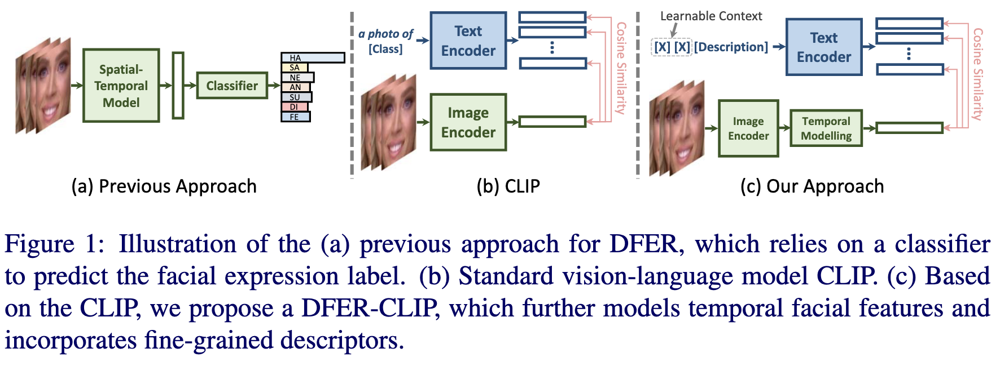
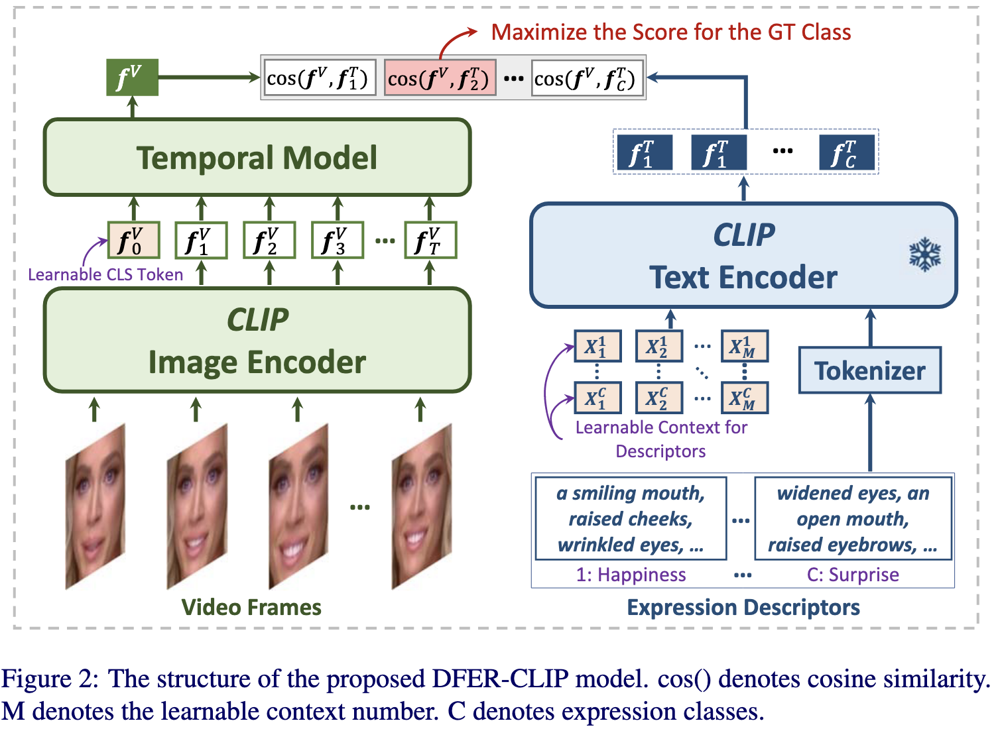
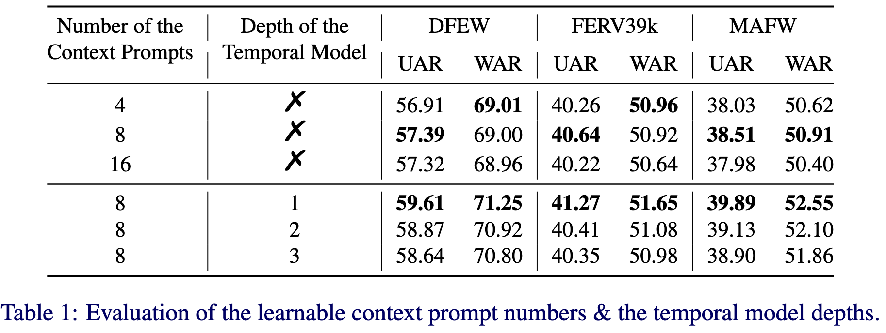
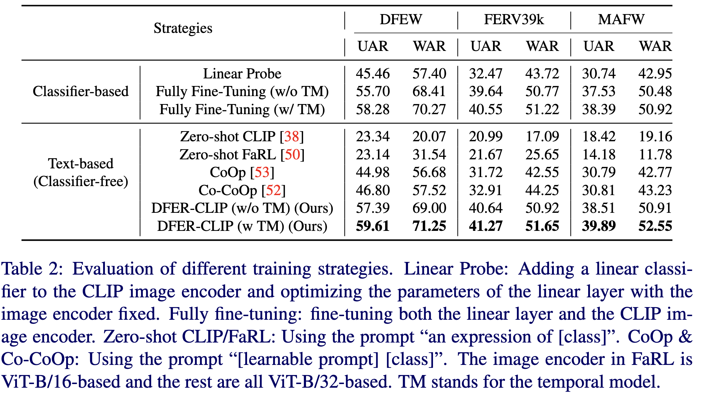
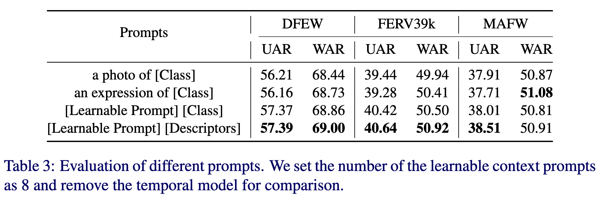
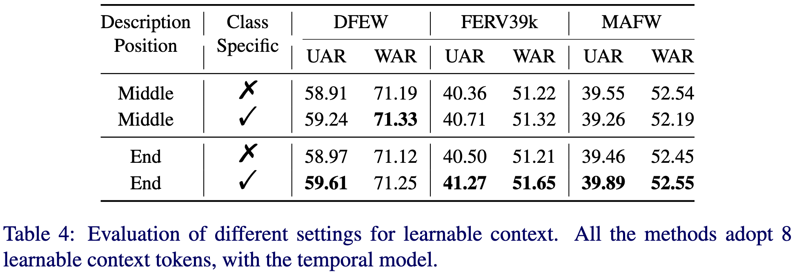
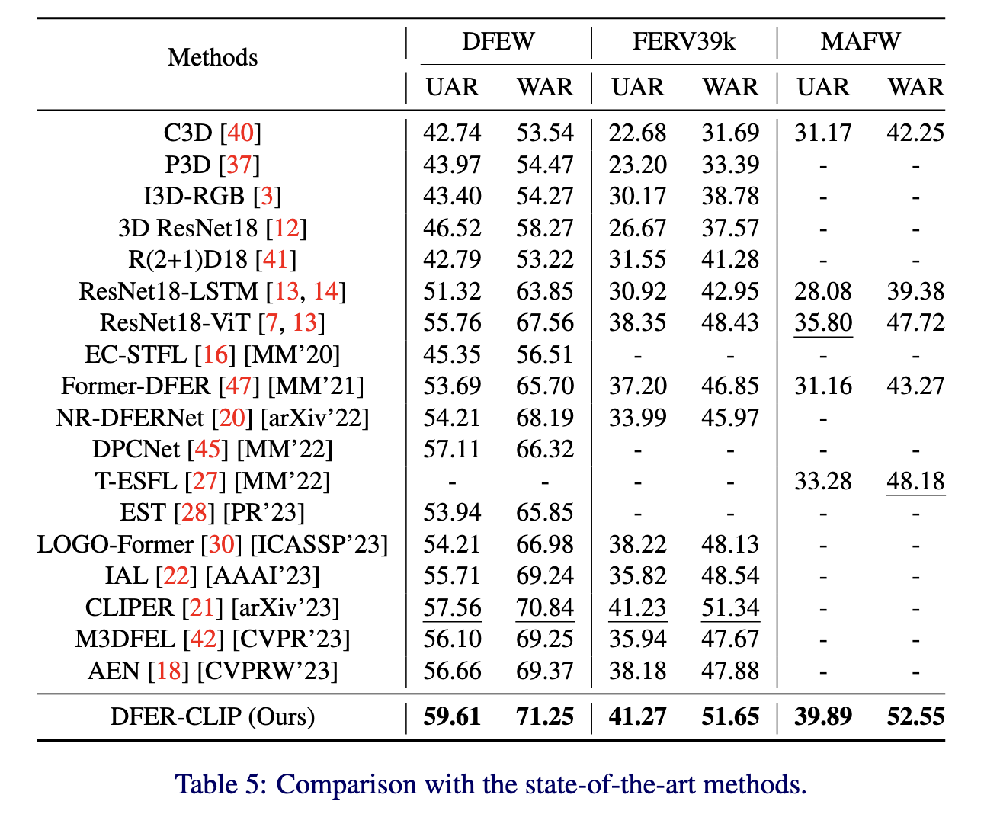
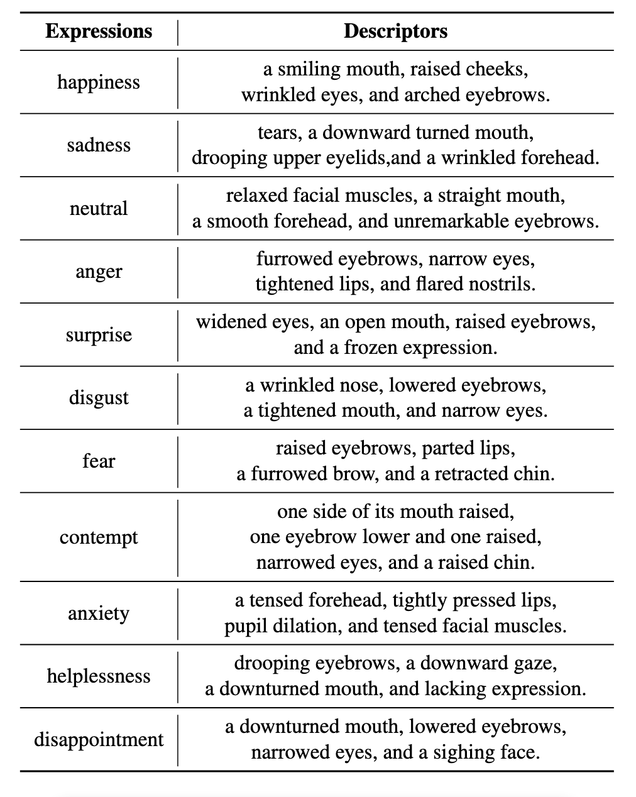

# [BMVC 2023] Prompting Visual-Language Models for Dynamic Facial Expression Recognition

## Abstract

本文提出了一种新的视觉语言模型DFER-CLIP，该模型基于CLIP模型，专为野外动态面部表情识别(DFER)设计。具体来说，所提出的 DFER-CLIP 由视觉部分和文本部分组成。

- 对于视觉部分，基于 CLIP 图像编码器，引入了由几个 Transformer 编码器组成的时间模型来提取时间面部表情特征，并将最终的特征嵌入作为可学习的“类”标记获得。
- 对于文本部分，我们使用与我们感兴趣的类别（面部表情）相关的面部行为的文本描述作为输入——这些描述是使用大型语言模型生成的，如 ChatGPT。
- 除了文本描述之外，我们还引入了一个可学习的标记，这有助于模型在训练期间为每个表达式学习相关的上下文信息。

大量实验证明了所提出方法的有效性，并表明与当前在 DFEW、FERV39k 和 MAFW 基准上的监督 DFER 方法相比，我们的 DFER-CLIP 也取得了最先进的结果。代码可在 https://github.com/zengqunzhao/DFER-CLIP 公开获得。

## Introduction

动态面部表情识别(DFER)的早期研究主要集中在实验室控制条件上，其中人脸都是正面的，没有遮挡。然而，在现实世界中，面部表情总是伴随着光照、非正面姿态和遮挡等变化。因此，近年来，野外DFER的工作越来越受欢迎。主要的重点是尝试为 DFER 任务学习判别和鲁棒的时空特征表示。这些方法可以大致分为基于 3DCNN、基于 CNN-RNN 和基于 Transformer，其中基于 Transformer 的方法实现了最先进的性能。然而，标记面部表情数据的高成本限制了 DFER 模型可用的训练数据量。这可能会对模型的性能产生影响，特别是如果训练数据不能完全捕捉到现实世界中可能出现的面部表情的多样性。

最近，CLIP 等视觉语言预训练(V-LP)模型已经成为视觉表示学习的有前途的替代方案。V-LP 模型的主要思想是使用两个独立的编码器对齐图像和文本的大连接，以学习视觉和文本数据之间的语义信息。V-LP 模型的成功引起了人们对将它们用于各种下游任务的兴趣越来越大，例如视频理解、图像合成和语义分割。鉴于 V-LP 模型强大的表示学习能力，相关的问题是如何最好地利用它们对 DFER 任务的潜力。一种方法是在 DFER 数据集上微调 V-LP 模型的图像编码器。然而，这种方法面临两个必须解决的挑战。首先，虽然原始的CLIP模型可以识别图像中的物体和场景，但在识别细微的面部表情方面可能不如有效，这需要更细粒度的描述符和表情之间的相似性建模。其次，学习稳健的时间面部特征来理解情绪对于 DFER 至关重要。不幸的是，标准的CLIP视觉编码器对静态图像进行编码，因此缺乏捕获时间信息的方法。

为了应对这些挑战，基于 CLIP 模型，我们提出了一种新颖的架构，即 DFER-CLIP 模型。DFER-CLIP与以前的方法和CLIP之间的差异的概述如图 1 所示，详细架构如图 2 所示。该方法主要由视觉部分和文本部分组成。**关于视觉部分，基于 CLIP 图像编码器，我们引入了一个时间模型，该模型由几个 Transformer 编码器组成，用于对时间面部特征进行建模**。**关于文本部分，考虑到不同的面部表情在局部行为层面既有共同的属性，也有独特或特殊属性，我们利用与面部行为相关的描述，而不是文本编码器的类名。因此，文本嵌入可以提供有关每个表达中涉及的肌肉的特定运动或位置的更详细和准确的信息**。此外，受 CoOp 的启发，**我们采用可学习的提示作为每个类的描述符的上下文——这不需要专家设计上下文词并允许模型学习训练期间每个表达式的相关上下文信息**。为了评估我们的 DFER-CLIP 模型，我们在三个数据集上进行了实验。结果表明，时间模型可以显着提高性能，采用具有可学习上下文的细粒度表达描述优于类级提示。此外，与现有的监督DFER方法相比，所提出的DFER-CLIP在DFEW、FERV39k和MAFW基准上实现了最先进的结果。

## Methods

### Overview

DFER-CLIP的结构如图 2 所示。我们可以看到，所提出的 DFERCLIP 由视觉部分和文本部分组成。关于视觉部分，基于 CLIP 图像编码器，我们引入了一个时间模型，该模型由几个 Transformer Encoders 组成，用于对时间面部特征进行建模。最终的视频级面部特征由可学习的类标记获得。关于文本部分，我们利用与面部行为相关的描述，而不是文本编码器的类名。此外，我们采用可学习的提示作为每个类的描述符的上下文，它不需要专家设计上下文词，并允许模型在训练期间为每个表达式学习相关的上下文信息。我们将首先介绍 DFER-CLIP 模型的细节，然后展示我们如何为面部表情构建纹理描述。

### DFER-CLIP

关于视觉部分，在 CLIP 图像编码器之上，采用由几个 ViT 编码器层组成的时间模型对时间关系进行建模。每个编码器还包含一个多头自注意力和前馈网络，它们都是从头开始训练的。帧级特征首先由共享的 CLIP 视觉编码器学习。然后将所有帧级特征以及一个额外的可学习类标记输入到时间模型中，其中添加可学习的位置嵌入来编码时间位置。

具体来说，给定一个面部视频，我们对大小为 $H \times W$ 的 $T$ 帧进行采样，以形成输入 $x \in \mathbb{R}^{T \times 3 \times H \times W}$。对于每一帧 $x_{i}$，我们首先利用共享的 CLIP 图像编码器 $f(\cdot)$ 来提取特征向量 $f_i^v \in \mathbb{R}^L$，其中 $i \in \{1, 2, ..., T\}$。$L$ 是特征向量的长度。然后将 $T$ 个特征向量输入时间模型 $g(\cdot)$ 来学习时间特征，以及最终得到的视觉表示 $f^V \in \mathbb{R}$：

$$
f_i^v = f(x_i)
$$

$$
f^V = g(f_0^v + e_0, f_1^v + e_1, ..., f_T^v + e_T)
$$

e 表示添加到编码时间位置的可学习位置嵌入。

关于文本部分，我们利用与面部行为相关的描述，而不是文本编码器的类名。此外，我们采用可学习的提示作为每个类的描述符的上下文。提示的形式如下：

$$
p_k = [p]_k^1, [p]_k^2, ..., [p]_k^M[Tokenizer(description)]_k
$$

其中 M 是指定上下文标记数量的超参数，$k \in \{1, 2, ... C\}$，C 是面部表情类的数量，每个 $[p]_k^m$，$m \in {1, 2, ..., M}$ 是一个与词嵌入具有相同维度的向量。在这里，我们采用特定于类的上下文，其中上下文向量独立于每个描述。通过将提示 $P_k$ 转发到文本编码器 $h(\cdot)$，我们可以得到代表视觉概念的 C 个分类权重向量 $f_k^T \in \mathbb{R}^L$：

$$f_{k}^{T}=h(P_{k})$$

那么预测概率可以计算为：

$$p(y=k|x)={\frac{exp(cos(f^{V},f_{k}^{T})/\tau)}{\sum_{k^{\prime}=1}^{C}exp(cos(f^{V},f_{k^{\prime}}^{T})/\tau)}}$$

其中 $\tau$ 是 CLIP 学习的温度参数，$cos(\cdot, \cdot)$ 表示余弦相似度。

在训练阶段，CLIP文本编码器是固定的，我们对CLIP图像编码器进行微调。时间模型、可学习类标记和可学习上下文都是从头开始学习的。DFER-CLIP 被端到端训练，交叉熵损失用于计算预测和真实标签之间的距离。

### Building Descriptions

先前的研究表明，人类面部表情有一些共同的属性，同时也具有独特的或独特的特征。这表明局部面部肌肉在不同表情中的运动有相似之处。例如，快乐和惊讶的表达都涉及眉毛的提升，悲伤和愤怒的表达都涉及眉毛的降低和前额的皱眉。考虑到 CLIP 文本编码器从自然语言文本中学习语义信息的事实，我们建议将面部表情动作描述作为文本编码器的输入。我们没有手动设计面部表情描述，而是提示大型语言模型，例如 ChatGPT，以根据上下文信息自动生成描述。我们用输入提示语言模型：

> Q: What are useful visual features for the facial expression of {class name}?

> A: Some useful visual features for facial expressions of {class name} include: ... 

All the generated descriptors of each facial expression class will be combined to form a comprehensive description. The descriptions for the classification of the seven basic emotions and of the classes in the datasets we used can be found in the supplementary material.

## Experiments

### Datasets

为了评估我们的方法，我们在三个流行的 DFER 基准上进行了实验。

**DFEW** 数据集包含 11,697 个野外视频剪辑，所有样本都被分成五个相同大小的部分，没有重叠。每个视频都由十个注释者在专业指导下单独注释，并分配给七个基本表达之一（即快乐、悲伤、中性、愤怒、惊讶、厌恶和恐惧）。视频剪辑是从全球 1,500 多部电影中收集的，涵盖了各种具有挑战性的干扰，例如极端照明、遮挡和不同的头部姿势。采用5倍交叉验证作为评估协议。

**FERV39k** 数据集包含 38,935 个野外视频剪辑，是目前最大的野外 DFER 数据集。所有视频剪辑都是从 4 个场景中收集的，可以进一步划分为 22 个细粒度的场景，例如犯罪、日常生活、语音和战争。每个剪辑由 30 个单独的注释器注释，并分配给七个基本表达式之一，如 DFEW。所有场景的视频剪辑随机打乱并拆分为训练（80%）和测试（20%），不重叠。

**MAFW** 数据集包含 10,045 个野外视频剪辑，这是第一个具有 11 个单表达类别的大规模、多模态的多标签情感数据库（愤怒、厌恶、恐惧、快乐、悲伤、惊讶、蔑视、焦虑、无助、失望和中性），32 个多表达类别和情感描述性文本。采用 5 折交叉验证作为评估协议。

### Implementation Details

**Training Setting:** 对于视觉输入，我们实验中的所有固定的 16 帧序列都遵循 [16, 20, 21, 22, 30, 47] 中的采样策略，然后调整为 224 × 224。采用随机调整大小的作物、水平翻转、随机旋转和颜色抖动来避免过拟合。考虑到视频数据的高计算成本，我们的 DFER-CLIP 采用了基于 ViT-B/32 的 CLIP。文本标记的最大数量为 77（遵循官方 CLIP 设计），温度超参数 $\tau$ 设置为 0.01。

我们的模型基于开源 PyTorch 平台在 Tesla A100 GPU 上进行训练。参数通过 SGD 优化器进行优化，小批量大小为48。CLIP 图像编码器、时间模型和可学习提示的初始学习率分别设置为 1e-5, 1e-2, 1e-3。MultiStepLR 为 {30,40} 和 0.1 的 gamma 作为调度器来调整学习率。DFER-CLIP 模型以端到端的方式训练了 50 个 epoch。为了获得更稳定可靠的结果，我们使用不同的随机种子对模型进行 3 次训练，然后使用平均值作为最终结果。

**Evaluation Metrics:** 与大多数以前的方法 [16, 20, 21, 22, 30, 47] 一致，加权平均召回率（WAR，即准确度）和未加权平均召回率（UAR，即每个类的准确度除以类数而不考虑每个类的实例数）用于评估方法的性能。

### Ablation Analysis

为了评估 DFER-CLIP 中每个组件的有效性，我们对所有三个基准进行了详尽的消融分析。具体来说，我们将首先展示时间模型的有效性、不同数量的上下文提示的影响和时间模型的深度。然后，我们将比较不同的训练策略，包括基于分类器和文本（无分类器）。最后，我们将比较 DFER 任务的不同提示。

**Evaluation of Temporal Model & Context Prompts:** 如前所述，学习时间面部特征对于基于视频的FER任务至关重要。从选项卡中。1，我们可以看到，通过采用时间模型，在DFER、FERV39k 和 MAFW 数据集上，UAR性能分别提高了2.22%、0.63% 和 1.38%，WAR性能分别提高了 2.25%、0.73% 和 1.64%。一般来说，更深的模型可以获得更好的性能，但在我们的 DFER-CLIP 中，最佳性能是在单层时间模型下获得的。这是因为时间模型是从头开始训练的，如果它很复杂，可能会过拟合。这也是在可学习的上下文中考虑，其中更多可学习的向量不会改善结果。我们相信增加可学习的上下文数量或时间模型深度会导致训练数据过度拟合，从而导致测试数据的泛化性能更差。

**Evaluation of Different Training Strategies:** 我们的 DFER-CLIP 的最终识别结果是通过计算视觉嵌入和所有文本类级嵌入之间的相似性来获得的，这与传统的基于分类器的训练策略不同。因此，我们将 DFER-CLIP 与分类头微调和全量微调方法进行了比较。表 2 的结果显示，在 DFER、FERV39k 和 MAFW 数据集上，我们的方法在 UAR 上的性能分别比 Fully Fine-tuning 高3.91%、1.63% 和 2.36%，在 WAR 上的性能分别比 Fully Fine-tuning 高 2.84%、0.88% 和 2.07%。即使没有时间模型，我们的方法也优于所有基于分类器的方法。我们还为完全微调策略添加了一个时间模型，结果表明我们的方法仍然优于完全微调策略。我们还将我们的方法与 zero-shot CLIP 和 zero-shot FaRL 进行了比较，其中 FaRL 是在大规模视觉语言人脸数据上进行预训练的。表2的结果表明，对图像编码器进行微调可以显著提高性能。CoOp 和 Co-CoOp 都使用了可学习上下文，其中 Co-CoOp 还将投影图像特征添加到上下文提示符中。表 2 中没有时间模型的方法与这两种方法的比较显示了我们策略的有效性。

**Evaluation of Different Prompts:** 在监督学习设置中，V-LP模型与传统分类模型的不同之处在于，它们可以被提示设计无分类器模型进行预测。这使得快速工程成为使 V-LP 模型适应下游任务的关键方面。我们将我们的方法与两种手动设计的提示进行了比较: "a photo of [class]" and "an expression of [class]"。表 3 的结果显示，我们的方法在DFEW和FERV39k数据集上都优于手动设计的提示符，但 WAR 略低于MAFW数据集上的“an expression of [class]”提示符。我们注意到，MAFW数据集包含11个面部表情类，并且视频样本是不平衡的，"contempt", "helplessness", and "disappointment" 表情的比例分别仅为 2.57%，2.86% 和 1.98%。表3的结果表明，基于学习的上下文始终能够获得最佳的 WAR 结果。此外，我们的方法优于使用类名提示和可学习上下文方法，这表明使用描述的有效性。

在我们的 DFER-CLIP 中，描述位于提示符的末尾，可学习的上下文是特定于类的，即每个描述都有自己的学习上下文。我们还进行了不同设置下的实验：a) 把描述放在可学习的上下文中间；b) 所有的描述符共享相同的上下文。三个数据集的结果如表4所示。结果表明，将描述 token 定位到最后可以获得更大的改进。此外，对于结束位置，采用特定于类的提示符总是比使用共享上下文提示符更好，从而达到最佳效果。

### Comparison with State-of-the-Art Methods

在本节中，我们将我们的结果与DFEW、FERV39k和MAFW基准测试上的几种最先进的方法进行比较。与之前的方法[16,21,22,27,30,47]一样，DFEW和MAFW的实验在5倍交叉验证下进行，并使用FERV39k上的训练和测试集。此外，我们使用不同的随机种子对模型进行三次训练，然后使用平均值来获得更稳定和可靠的结果。表 5 中的比较性能表明，所提出的 DFER-CLIP 在 UAR 和 WAR 中都优于所比较的方法。具体来说，与之前的最佳结果相比，我们的方法在 DFEW、FERV39k和MAFW上的UAR分别提高了2.05%、0.04%和4.09%，WAR分别提高了0.41%、0.31%和4.37%。需要指出的是，FERV39k是目前最大的DFER基准，有38,935个视频。考虑到如此庞大的规模，进行重大的改进成为一项艰巨的任务。

## Conclusion

本文提出了一种新的用于野外动态面部表情识别的视觉语言模型——DFER-CLIP。在视觉部分，在 CLIP 图像编码器的基础上，引入了一个由多个 Transformer 编码器组成的时间模型来建模人脸表情的时间特征。在文本部分，采用与面部行为相关的表情描述符作为文本输入，捕捉面部表情与其底层面部行为之间的关系，其中的表情描述符由 ChatGPT 等大型语言模型生成。还设计了这些描述符的可学习上下文，以帮助模型在训练期间学习每个表达式的相关上下文信息。大量的实验证明了 DFER-CLIP 中每个组件的有效性。此外，所提出的方法在三个基准上取得了最先进的结果。

## Supplementary Material

### Facial Expression Descriptions

