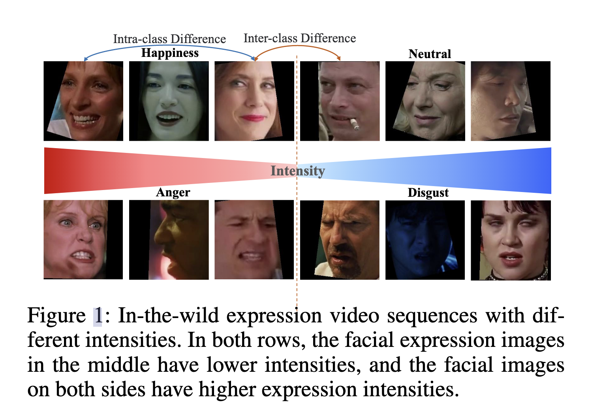
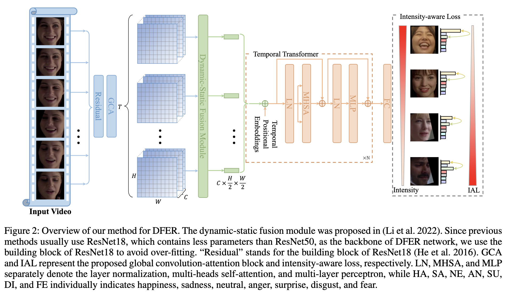
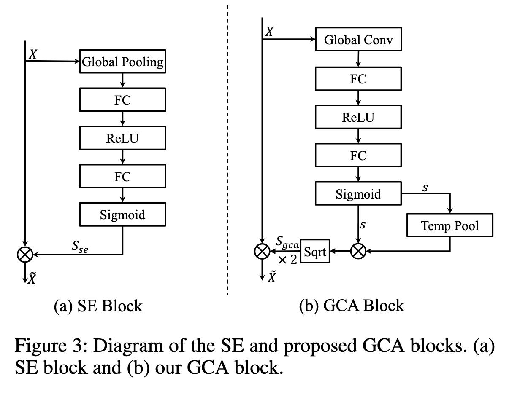
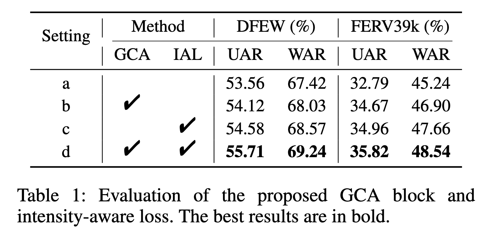
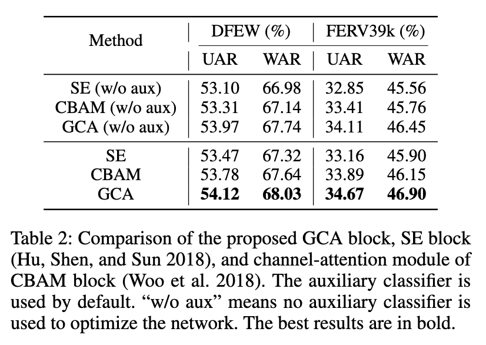
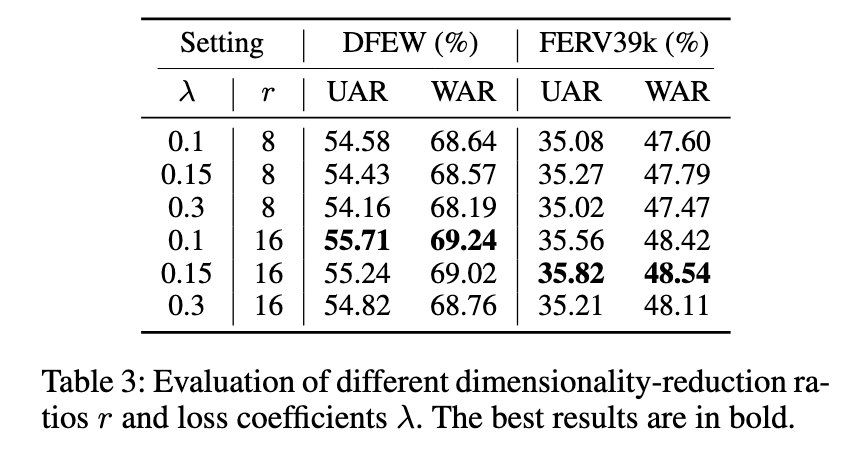
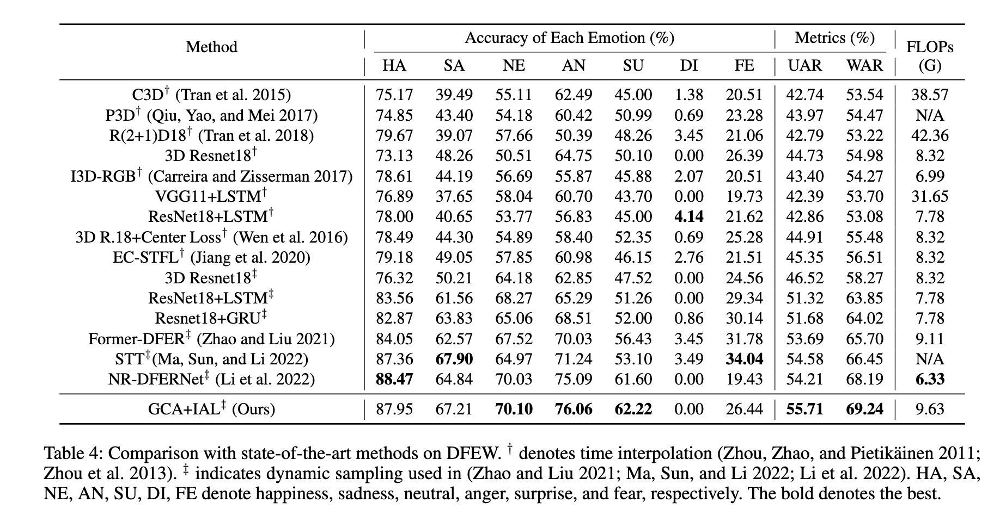
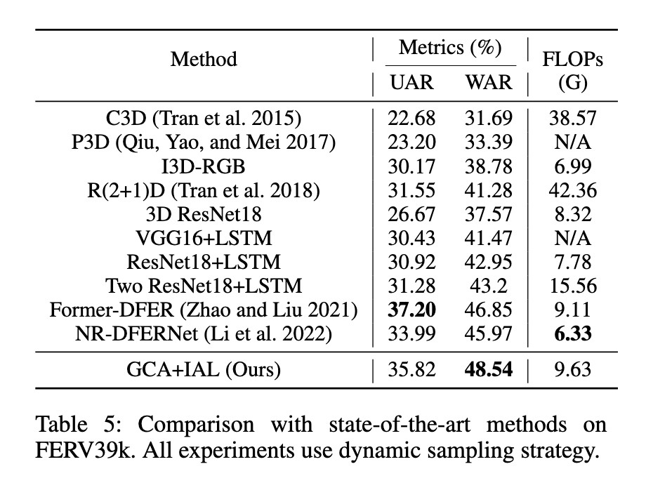

# [AAAI 2023] Intensity-Aware Loss for Dynamic Facial Expression Recognition in the Wild

code: https://github.com/muse1998/IAL-for-FacialExpression-Recognition

## Abstract

与基于图像的静态面部表情识别(SFER)任务相比，基于视频序列的动态面部表情识别(DFER)任务更接近自然表情识别场景。然而，DFER 通常更具挑战性。**主要原因之一是视频序列通常包含具有不同表达强度的帧，特别是对于现实场景中的面部表情，而 SFER 中的图像经常呈现均匀和高表达强度。**然而，如果不同强度的表达式被平等对待，网络学习到的特征将具有较大的类内差异和小类间差异，这对DFER是有害的。**为了解决这个问题，我们提出了全局卷积注意块 (GCA) 来重新缩放特征图的通道。**此外，我们在训练过程中引入了**强度感知损失（intensity-aware loss，IAL），以帮助网络区分表达强度相对较低的样本。**在两个野外动态面部表情数据集(即 DFEW 和 FERV39k)上的实验表明，我们的方法优于目前最先进的DFER方法。

## Introduction

与实验室控制的DFER数据集相比，野外更接近自然面部事件，可以通过从互联网上收集视频序列来提供更多样化的数据，如Aff-Wild (Zafeiriou et al. 2017)、DFEW (Jiang等人，2020)和FERV39k (Wang et al. 2022)。如图 1 所示，**具有不同表达强度的真实世界中的视频序列可能会导致类间距离小于类内距离的问题**。然而，离散标签数据集的监督信息不包含与强度相关的先验，例如 DFEW 和 FERV39k，这导致低强度表达序列通常更有可能被错误分类。为了解决这个问题，一些数据集沿着唤醒价轴用连续标签注释视频序列，如OMG (Barros等人，2018)和AMIGOS (Miranda-Correa等人，2018)，唤醒维度可用于测量表达强度。然而，对这些数据集进行标注是非常昂贵的，而且很难统一不同标注器的标注标准。因此，有必要考虑表达强度对离散标签标注的低成本数据集分类的影响。

近年来，随着并行计算硬件的发展和大规模DFER数据集的收集(Wang et al. 2022;Jiang et al. 2020)，基于深度学习的方法已经逐渐取代了基于手工特征的算法，并在野外DFER数据集上实现了最先进的性能。例如，视觉变压器(vision transformer, ViT) (Dosovitskiy et al. 2020)在许多计算机视觉任务上取得了令人鼓舞的结果，这激发了许多研究人员基于ViT构建DFER模型(Zhao and Liu 2021;马，孙，李2022)。由于变压器对严重的遮挡和干扰具有很强的鲁棒性(Naseer et al. 2021)，因此这些基于变压器的方法主要通过利用空间变压器和时间变压器来处理实际场景中的各种干扰(例如，不同的头部姿势，较差的照明和遮挡)

然而，先前关于离散标签DFER的工作忽略了同一类样本之间表达强度的差异(即对所有视频序列给予同等状态监督)。为了解决这个问题，我们设计了一种新的全局卷积注意块(GCA)来重新调整特征映射的通道，这有助于网络在低强度样本中增强关键通道(即，引入不同强度序列的特征以减少类内差异)，同时像其他注意机制一样抑制不太有用的通道。此外，我们提出了一种新的强度感知损失(IAL)来帮助网络从硬分类视频序列(即低强度序列)中学习更多信息。

综上所述，本文有以下贡献:
- 通过使用全局卷积聚合每个通道中的信息，我们设计了一个即插即用的全局卷积注意块，可以重新缩放特征映射的通道。特别的是，GCA 阻断不仅可以像其他注意机制(如SE和CBAM)一样抑制不太重要的通道，还可以增强低强度表达的靶相关通道。据我们所知，这是第一个关注**离散标签DFER任务中表达强度**问题的工作。
- 我们提出了一个简单但有效的损失函数，称为强度感知损失，它可以迫使网络额外关注最令人困惑的低强度表达序列。因此，网络可以学习到更精确的分类边界。

## Related Work

### DFER in the Wild

具体而言，Zhao等人设计了一个由CSFormer和T-Former组成的动态面部表情识别转换器(Former-DFER)，分别用于学习空间特征和时间特征(Zhao and Liu 2021)。Ma等人提出了一种时空变压器(spatial -temporal transformer, STT)，通过基于变压器的编码器可以共同获取时空信息(Ma, Sun, and Li 2022)。此外，Li等人还引入了一种NR-DFERNet，用于抑制视频序列中噪声帧的影响(Li et al. 2022)。

尽管上述解决方案设计了许多有效的模型来解决离散标签DFER问题，但它们都忽略了表达式强度对DFER任务的影响。因此，我们提出IAL来强制网络对低强度的样本给予额外的关注。

### Attention Mechanisms

近年来，注意机制在各种计算机视觉任务中得到了广泛的应用。通过模拟人类视觉系统中的注意机制(Tootell et al. 1998)，网络可以集中注意与任务相关的信息，抑制与任务无关的信息。其中，SE block(Hu, Shen, and Sun 2018)通过执行全局平均池化操作将全局空间信息压缩到通道描述符中，并使用两个完全连接(FC)层对通道相关关系进行建模。ECA-Net (Wang et al. 2020b) 用 1D 卷积滤波器替换 SE 块中的 FC 层，以降低模型复杂度。除了对渠道依赖关系进行建模外，CBAM (Woo et al. 2018)还学习了一种空间注意机制。同样，SGE (Li, Hu, and Yang 2019)结合了空间和通道关注。特别是 DANet (Fu et al. 2019)利用两分支结构分别学习空间注意和通道注意。

以上的注意力机制大多使用全局空间池化(例如，全局平均池化或全局最大池化)在学习通道依赖关系之前聚合通道信息，然后应用sigmoid函数来约束通道注意力权重。

然而，**全局池化可能会丢失空间位置信息**，这对FER至关重要(例如，从眉毛或嘴巴中提取的皱纹相关特征会对结果产生很大影响)。此外，**由于 sigmoid 函数的取值范围属于(0,1)，生成的通道注意权值只能用来抑制无用的通道，这与我们增强低强度样本的通道特征的初衷不符合**。由于上述两个原因，我们提出了一个全局卷积注意块来建模通道依赖并增强关键通道。

## Method

### Overview

如图2所示，从原始视频中动态采样长度为T的面部表情序列作为输入。然后将输入 clip $X_{in} \in \mathbb{R}^{T \times 3 \times H_{in} \times W_{in}}$ 馈送到几个构建块中(He et al. 2016)以提取帧级特征。然后使用所提出的 GCA 块对特征映射的通道进行重新缩放(即抑制不重要的通道，增强与目标相关的通道)。然后应用(Li et al. 2022)中提出的动态-静态融合模块(DSF)，通过融合每帧的静态特征和相邻帧之间的动态特征来学习空间特征。在将包含动态和静态特征的帧级特征馈送到时序转换器以学习帧之间的远距离依赖关系之前，将其平面化。随后，将 token 序列的均值送入 FC 层，得到识别结果。所提出的 IAL 和交叉熵损失都用于优化网络。

### Input Clips

我们的方法以由 T 个 RGB 图像作为输入组成的 clip $X_{in}$。

输入剪辑是从原始视频中动态采样的，就像以前的工作一样。具体来说，对于训练片段，原始序列被平均分成 U 个片段，然后从每个片段中随机选择 V 帧。至于测试剪辑，我们首先将所有帧分成 U 段，然后在每个片段的中间选择 V 帧。因此，训练集和测试集的采样剪辑长度为 T = U × V。

### Global Convolution-attention Block

SE块（Hu、Shen 和 Sun 2018）被提出来学习特征的通道依赖关系。如图 3(a) 所示，SE 块生成的注意力权重 $S_{se} \in (0, 1)$ 用于抑制不太重要的通道。对于输入 $X \in \mathbb{R}^{T \times C \times H \times W}$，SE 块的输出 $\bar{X}$ 可以表示为，

$${\bar{X}}=S_{s e}\otimes X$$

$$S_{s e} = \sigma(W_{2}\delta(W_{1}Z))$$

$$Z_{c}=\frac{1}{H\times W}\sum_{i=1}^{H}\sum_{j=1}^{W}X_{c}(i,j)$$

其中 $Z \in \mathbb{R}^C$ 代表由输入 $X$ 上的全局平均池化操作生成的通道描述符，$Z_c$ 和 $X_c$ 分别是 $Z$ 和 $X$ 的第 c 个元素。$\delta$ 指 ReLU 函数，σ 表示 sigmoid 函数。$W_{1}\in\mathbb{R}^{\frac{G}{r}}\times C$ 和 $W_{2}\in\mathbb{R}^{\frac{G}{r}}\times C$ 分别是第一和第二FC层的权重。r 表示降维比，$\otimes$ 表示逐元素乘法。然而，由于 $S_{se}$ 的值属于(0,1)，SE块只能抑制不太重要的通道。DFER 的合适注意机制也应该增强关键通道，这对于加强低强度样本的目标相关特征至关重。此外，位置信息对于 DFER 任务也至关重要（例如，出现在嘴角或眉毛之间的皱纹相关特征可以指示完全不同的表达），但全局平均池化生成的通道描述符 Z 会丢失输入特征的位置信息。

基于这些观点，我们提出了GCA块，如图2(b)所示。对于相同的输入 $X$，GCA块的输出可以通过以下方式计算：

$${\bar{X}}=S_{g c a}\otimes X$$

$$S_{g c a}=2\sqrt{s\otimes G A P_{t}(s)}$$

$$s=\sigma(W_{2}\delta(W_{1}Z))$$

$$Z_{c}=\sum_{i=1}^{H}\sum_{j=1}^{W}X_{c}(i,j)\times\hat{W}_{c}(i,j)$$

其中 $S_{gca}$ 是 GCA 块生成的注意权重，$\hat{W}_c \in \mathbb{R}^{H \times W}$ 代表第c个通道的全局卷积核。${GAP}_t$ 表示时间维度上的全局平均池化。

由于 $S_{gca}$ 属于(0,2)，GCA块不仅可以抑制不太重要的通道，还可以增强关键通道。同时，全局卷积可以保留特征的位置信息，这对于 DFER 至关重要。此外，时间全局平均池化提供了更大的帧间视野。

### Intensity-aware Loss

表达强度是人类面部表情的一个重要属性。当我们定义 $intensity \in (0, 1)$ 时，很明显，当强度收敛到零时，所有非中性表达式都倾向于接近中性表达式，可以定义为:

$\operatorname*{lim}_{\mathrm{intensity\to0}}N N E=N E$

其中 NNE 和 NE 分别是非中性和中性表达。似乎将面部表情作为回归任务更合适。然而，由于带有连续标签的 DFER 数据集注释成本很高，因此此类数据集的规模通常是有限的。此外，注释的强度标准很难统一。为了解决这个问题，我们提出了强度感知损失来减少低强度样本对 DFER 任务的影响。

基于低强度样本可能与来自其他类的低强度样本混淆的假设(如图1所示)，网络应该特别注意每个样本的最令人困惑的类别。因此，所提出的强度感知损失可以表述为，

$${\mathcal L}_{I A}=-\log(P_{I A})$$

$$P_{I A}={\frac{e^{x t}}{e^{x_{t}}+e^{x_{m a x}}}}$$

其中 $x_t$ 表示目标类的 logits，$x_{max}$ 表示不包括目标类的最大 logits。综上所述，所提出的IAL对最有可能引起混淆的类给予额外的关注，如图 2 所示。最后，利用常用的交叉熵损失，整体损失函数定义如下:

$\mathcal{L}=\mathcal{L}_{C E}+\lambda\mathcal{L}_{I A}$

其中 $\lambda$ 是超参数控制损失系数。值得注意的是，当 $\mathcal{L}_{CE}$ 收敛到零时，$\mathcal{L}_{IA}$ 也收敛到零

## Experiments

我们对两个流行的野外DFER数据集(即DFEW (Jiang et al. 2020)和FERV39k (Wang et al. 2022))进行了广泛的实验。在本节中，我们首先介绍数据集和实现细节。然后我们探讨GCA块的有效性和强度感知损失。随后，我们将所提出的方法与几个 SOTA 进行比较，并给出一些可视化来证明我们方法的有效性。

### Datasets

**Training Setting:** 在我们的实验中，所有人脸图像的大小都调整为112 × 112的大小。采用随机裁剪、水平翻转、旋转和颜色抖动来避免过拟合。我们使用 SGD (Robbins and Monro 1951) 来优化批量大小为 40 的模型。对于 DFEW 数据集，学习率初始化为 0.001，在 80 个 epoch 中以指数速率降低强度感知和交叉熵损失函数。对于 FERV39k 数据集，学习率也初始化为 0.001，使用相同的损失函数在 100 个 epoch 中以指数速率下降。对于这两个数据集，模型都是从头开始训练的。至于采样，FERV39K 的动态采样序列的长度为 16 (U = 8, V = 2，DFEW 的 U = 16, V = 1)。自注意力头和时间转换器编码器的数量设置为 4 和 2。默认情况下，降维比 r 设置为 16，损失系数 λ 设置为 0.1。所有实验均在具有 PyTorch 工具箱的单个 NVIDIA RTX 3090 卡上进行。

**Validation Metrics:** 与以前的方法一致，我们采用未加权的平均召回率（UAR，即每个类的准确度除以类数，而不考虑每个类的实例数）和加权平均召回率（WAR，即准确度）作为指标。

## Ablation Studies

我们对 DFEW 和 FERV39k 进行消融研究，以证明我们方法中每个组件的有效性（即 GCA 和 IAL）。我们采用由 ResNet18 (He et al. 2016)、NR-DFERNet (Li et al. 2022) 和 vanilla Transformer (Dosovitskiy et al. 2020; Vaswani et al. 2017) 的构建块组成的模型作为我们实验中的基线（即表 1 中的设置 (a)。默认情况下，我们添加了连接到中间注意块（例如 SE、CBAM 和 GCA）的辅助分类器，如 (Szegedy et al. 2015) 中所做的那样，以帮助注意力机制根据目标生成注意力权重，然后拉在不同的强度样本的特征中。

**Evaluation of GCA Block and Intensity-Aware Loss:** 我们首先研究了GCA和IAL的有效性。如表 1 所示，将 ResNet18 中使用的构建块替换为所提出的 GCA 块（设置 (b)），并引入 IAL 来强制网络更加关注容易混淆的类（设置 (c))）可以提高两个基准的整体性能。具体来说，当我们同时部署 GCA 和 IAL 时，我们的方法设置 (d) 在 DFEW 上超过基线设置 (a) 2.15%/1.82% 的 UAR/WAR 和 3.03%/3.30% 的 UAR/WAR 在 FERV39k 上，这完全表示提出模块的有效性。

**Comparison with Other Channel-Attention Modules:** 我们在表2中将我们的GCA块与几个经典的通道注意模块进行比较。此外，我们还探索了辅助分类器的有效性(Szegedy et al. 2015)。可以看出，部署辅助分类器根据目标标签生成注意力权重后，所有注意力机制的性能都有所提高。此外，在不同的通道注意块中，我们的GCA块在两个基准上都超过了SE块和CBAM块。具体来说，GCA 在 DFEW 上优于 TAR/WAR 的 0.65%/0.71%，在 FERV39k 上优于 UAR/WAR 的 1.51%/1.00%。GCA的主要优点是通过用全局卷积替换全局池化来保留特征的位置信息。

**Evaluation of Hyper-Parameters:** 我们对我们方法的几个关键超参数（即 IAL 的损失系数 λ 和 GCA 块的降维比 r）进行消融研究，以探索它们对性能的影响。如表 3 所示，较小的损失系数往往具有更好的性能，其原因是较大的损失系数会使网络更加关注最容易混淆的类别，而忽略了其他类别之间的区别。至于降维比，对应于较小参数大小的较大 r 在两个数据集上往往具有更好的性能。总之，与表 1 中的基线相比，表 3 中的所有结果都显着提高，这也显示了我们方法的稳健性。

## Comparison with State-of-the-Arts

在本节中，我们将我们的最佳结果与DFEW和FERV39k基准测试上当前最先进的方法进行比较，以证明我们方法的优越性。

**Results on DFEW:** 与之前的工作一致，实验采用5倍交叉验证。实验结果如表4所示。可以看出，我们的方法在WAR和UAR中都取得了最好的效果。具体而言，所提出的方法优于NRDFERNet (Li et al. 2022)的UAR/WAR的1.50%/1.05%。我们还在表4中显示了每个表达式的性能。很明显，“恐惧”和“厌恶”的得分较其他类别差，这主要是由于训练样本不足(“厌恶”和“恐惧”的比例分别为1.22%和8.14%)。

**Results on FERV39k:** 作为目前最大的野外DFER数据集，FERV39k基准包含了不同的数据源(22个细粒度场景)，这给DFER任务带来了挑战。如表5所示，我们的方法在WAR中显著优于被比较的方法，在UAR中与Former-DFER (Zhao and Liu 2021)取得了相当的结果。具体来说，所提出的方法比Former-DFER高出1.69%的WAR。需要注意的是，FERV39k也存在数据分布不平衡的问题。“厌恶”和“恐惧”序列的比例分别为5.89%和5.4%，这是我们的方法在UAR中获得相对较低性能的原因。

## Visualization

我们利用 t-SNE (Van der Maaten and Hinton 2008) 来分析基线和我们的方法学习到的特征分布在图 4 中。对于 DFEW 数据集，我们方法的特征分布更紧密，不同类别之间的边界也更加明显。值得注意的是，基线学习到的中性序列的特征分布在剩余类别的中心，这与我们在Eq.(8)中的分析一致(即，当强度收敛到零时，非中性表达式倾向于接近中性表达式)。由于目前没有关于表达强度的统一量化定义，我们使用方程式 (10) 来衡量强度。从图4中我们可以看到，不使用IAL的非中性样本包围着中性样本(类边界处的样本对应于低强度样本)。使用IAL后，中性样本的分布不再在中心，从而减少了与其他非中性表达式的重叠，说明边界处的低强度样本得到了更好的学习。对于FERV39k数据集，可以看出我们的方法比基线学习到更多的判别特征，特别是对于“中性”和“惊喜”样本。由于FERV39k上的整体性能仍然较弱，t-SNE结果看起来仍然有点乱，我们放大关键区域以提供更直观的显示。

## Discussions

无论是从图 1 的人脸图像还是图 4 的可视化结果中，我们都可以发现低强度样本对离散标签 DFER 的挑战，这与基于高强度单幅图像的静态表情识别任务不同。因此，我们首先在离散标签DFER中提出了这一问题，并提出了IAL来处理这些低强度样本，并使用所提出的GCA块来增强其特征。

然而，在没有额外监督的情况下，准确发现这些低强度样本并增强其特征仍有很大的改进空间。在这里，我们提供了几种技术路线，可以在未来处理低强度表达样本的工作中尝试:
- 通过知识蒸馏的方法，从教师网络的输出中寻找低强度样本
- 建立一个以中性表情为原点的面部表情空间，通过输入与原点之间的偏移量来测量强度。

我们希望这项工作能够激励研究人员提出更有效的解决方案。

## Conclusion

在本文中，我们开发了一个称为全局卷积注意块的即插即用模块和一个简单但有效的强度感知损失用于野外DFER。我们的全局卷积注意块设计用于重新缩放特征映射的通道，从而增强低强度序列的目标相关特征，抑制不太重要的特征。提出的强度感知损失帮助网络额外关注每个样本中最可能混淆的类别(低强度样本通常有一个可能混淆的类别)。实验和可视化结果验证了该方法的有效性和优越性。

具体来说，我们重点研究了野外动态面部表情识别任务中低强度样本的处理。据我们所知，这是第一个关注离散可标记DFER中表达强度问题的工作。我们希望更多的研究者能够注意到这个问题，并在未来提供更多有趣的解决方案。
