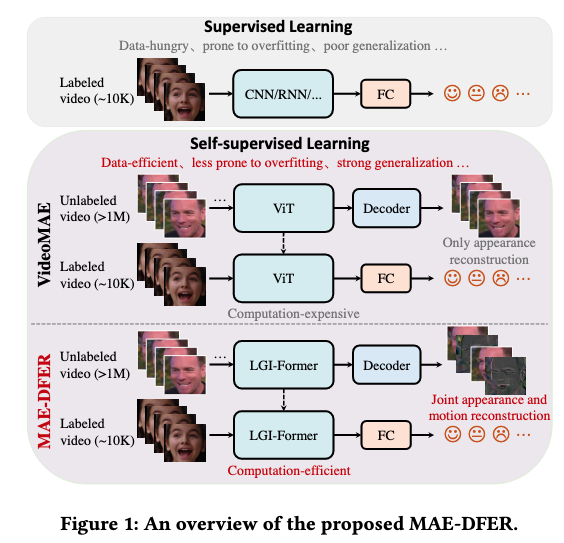
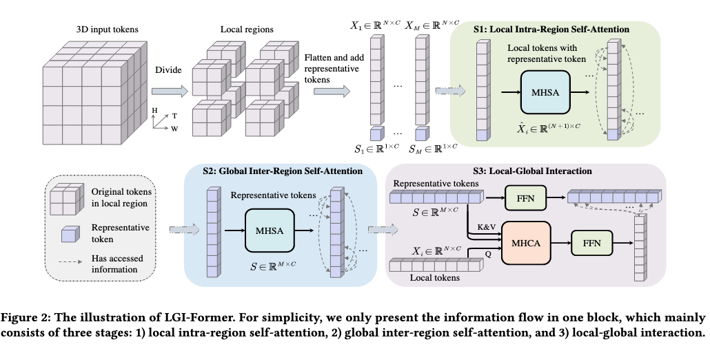

# [ACM MM 2023] Efficient Masked Autoencoder for Self-supervised Dynamic Facial Expression Recognition

code: https://github.com/sunlicai/MAE-DFER

## Abstract

动态面部表情识别 (DFER) 对智能和移情机器的发展至关重要。**该领域的先前努力主要属于监督学习范式，这受到现有数据集中有限的标记数据的严重限制。**受掩妈自动编码器(如 VideoMAE )最近前所未有的成功启发，本文提出了一种新的自监督方法 MAE-DFER，该方法利用对大量未标记数据的大规模自我监督预训练，在很大程度上推进 DFER 的发展。由于 VideoMAE 中使用的 (ViT) 在微调期间需要大量的计算，MAE-DFER 开发了一种高效的局部-全局交互转换器(LGI-Former)作为编码器。此外，除了 VideoMAE 的独立外观内容重建外，MAEDFER 还引入了显式的时间面部运动建模，以鼓励 LGI-Former 挖掘静态外观和动态运动信息。在六个数据集上的大量实验表明，MAE-DFER 的性能始终优于最先进的监督方法(例如，DFEW上的+6.30% UAR和MAFW上的+8.34% UAR)，验证了它可以通过大规模自监督预训练学习强大的动态人脸表示。此外，它具有与 VideoMAE 相当或更好的性能，同时大大降低了计算成本（大约 38% 的 FLOP）。我们相信 MAE-DFER 为 DFER 的进步铺平了道路，并可以激发该领域的更多相关研究，甚至其他相关任务。

## Introduction

DFER 以监督学习范式为主。研究人员为这项任务开发了各种深度神经网络，包括 2D/3D 卷积神经网络 (CNN) [15, 25, 27]、循环神经网络 (RNN) [14, 52, 65] 和更先进的基于 Transformer 的架构 [29, 35 , 37 , 61, 69]。尽管监督方法取得了显着的成功，但现有 DFER 数据集中有限的训练样本（通常在 10K 左右，远小于一般图像/视频分类和人脸识别等其他研究领域的训练样本，详见表 1）严重限制了它们的进一步进步（例如，训练大型视频 Transformer）。解决这个问题的一个直接想法是增加数据集规模。然而，收集和注释大规模的高质量DFER数据集非常耗时和劳动密集型，这主要是由于视频中动态面部表情的稀疏性和面部表情感知的模糊性和主观性[25,31,364]。考虑到互联网上有大量未标记的面部视频，一个自然的问题出现了：我们能否利用它们充分释放深度神经网络的力量以获得更好的 DFER？

自监督学习在许多深度学习领域的最新进展 [1, 12, 22] 表明存在肯定的答案。值得注意的是，计算机视觉中的掩码自动编码器 (MAE) [22] 开发了一种非对称编码器-解码器架构，用于掩码图像建模。它以端到端的方式成功地预训练了 vanilla Vision Transformer (ViT) [13]，并在许多视觉任务中优于监督基线。随后，VideoMAE[54]将MAE扩展到视频领域，并在许多通用视频数据集上取得了令人印象深刻的结果。受这一研究方向的启发，我们提出了MAE-DFER(图1)，这是一种基于VideoMAE的新型自我监督方法，它利用对丰富的未标记面部视频数据的大规模自我监督预训练来促进DFER的发展。尽管VideoMAE在自监督视频预训练方面取得了显著的成功，但我们注意到它仍然有两个主要缺点:
- 由于全局时空自注意力的二次缩放成本，VideoMAE 中使用的 vanilla ViT 编码器在微调期间需要大量的计算，这在许多资源受限的场景中是负担不起的。
- 它在预训练期间只重建视频外观内容，因此可能不足以对 DFER 至关重要的时间面部运动信息进行建模。

为了解决上述VideoMAE问题，我们的MAE-DFER相应地提出了两个核心设计。对于第一个问题，MAE-DFER 开发了一种高效的局部-全局交互 Transformer (LGI-Former) 作为编码器。与ViT中的全局时空自我注意不同，LGI-Former首先约束局部时空区域的自我注意，然后利用一小组可学习的代表性令牌来实现高效的 local-gloabl 信息交换。具体来说，它将全局时空自注意力分解为三个阶段：局部区域内自注意力、全局区域间自注意力和局部全局交互。这样，LGI-Former 可以有效地将全局信息传播到局部区域，避免了全局时空注意的昂贵计算。对于第二个问题，MAE-DFER 引入了联合掩码外观和运动建模，以鼓励模型捕捉静态面部外观和动态运动信息。具体来说，除了原始的外观内容重建分支外，它只是利用帧差分信号作为另一个重建目标进行显式时间面部运动建模。为了验证 MAE-DFER 的有效性，我们在 VoxCeleb2 数据集 [9] 上执行大规模自监督预训练，该数据集有超过 1M 个从 YouTube 收集的未标记面部视频剪辑。然后我们在六个DFER数据集上微调预训练模型，包括三个相对较大的野外数据集(DFEW[25]、FERV39k[64]和MAFW[32])和三个小型实验室控制数据集(CREMA-D[5]、RAVDESS[36]和eNTERFACE05[38])。结果表明，MAE-DFER 显着优于最先进的监督方法，表明它能够为 DFER 学习强大且有用的动态面部表示。此外，与VideoMAE相比，MAE-DFER在很大程度上减少了∼38%的Flop，同时具有相当甚至更好的性能。本文的主要贡献总结如下：
- 我们提出了一种新的自我监督方法MAE-DFER，作为早期尝试利用大量未标记的面部视频数据的大规模自我监督预训练来推进DFER的发展。
- MAE-DFER 通过开发高效的 LGI-Former 作为编码器并引入联合掩蔽外观和运动建模来改进 VideoMAE。通过这两个核心设计，MAE-DFER 大大降低了计算成本，同时具有可比甚至更好的性能。
- 在 6 个 DFER 数据集上的大量实验表明，我们的 MAE-DFER 在三个野外数据集上始终优于以前的最佳监督方法(在三个野外数据集上为+5 ~ 8% UAR，在三个实验室控制数据集上为+7 ~ 12% WAR)，这表明它可以通过大规模的自我监督预训练来学习DFER强大的动态面部表示。

## Related work

### Dynamic Facial Expression Recognition

DFER 的早期研究主要集中在设计各种局部描述符上，只有少数非常小的实验室控制数据集可用于评估。随着深度学习的出现和相对更大的数据集的扩散，研究范式已经以端到端的方式训练深度神经网络发生了变革性的转变。一般来说，有三个趋势。第一个趋势直接利用3D CNN(如C3D[55]、3D ResNet[21]、R(2+1)D[56]和P3D[46])从原始人脸视频中提取联合时空特征[15,25,27,32,60,64]。第二个趋势使用 2D CNN（例如 VGG [48] 和 ResNet [23]）和 RNN（例如 LSTM [24] 和 GRU [8]）的组合[14,25,26,32,52,64,65]。最近，随着 Transformer [59] 的兴起，一些研究利用其全局依赖建模能力来增强 CNN/RNN 以获得更好的性能，这形成了第三个趋势 [29、30、32、35、37、69]。例如，Former-DFER[69]使用 Transformer 增强的ResNet-18进行空间特征提取，另一种用于时间信息聚合的 Transformer。STT [37] 通过引入分解空间和时间注意进行联合时空特征学习，改进了Former-DFER。IAL[29]进一步引入了全局卷积注意块和强度软件损失来处理不同强度的表达式。然而，上述所有方法都属于监督学习范式，因此受到现有 DFER 数据集中有限的训练样本的限制。与它们不同的是，本文提出了一种自监督方法，该方法可以从大量未标记的面部视频数据中学习强大的表示，并对它们取得了显著的改进。

### Masked Autoencoders

蒙面自动编码器(MAEs)作为生成式自我监督学习的代表，最近在许多深度学习领域取得了前所未有的成功[67]。它们主要受到自然语言处理中掩码语言建模（例如 BERT [12] 和 GPT [47]）的进展的启发，通常采用掩码然后预测策略来预训练 vanilla ViT。值得注意的是，iGPT [7] 遵循 GPT 来自回归预测像素并做出第一次成功的尝试。BEiT [2] 遵循 BERT 并采用两阶段训练管道，即首先使用现成的标记器来生成离散的视觉标记，然后执行掩码然后预测训练。MAE[22]通过设计非对称编码器-解码器架构来改进BEiT，以实现高效的端到端预训练。之后，许多研究采用 MAE 的架构对各种任务进行自我监督预训练。例如，VideoMAE[54]及其并行工作MAE-ST[17]将MAE扩展到视频领域，并在许多视频基准上取得了令人印象深刻的结果。我们提出的 MAE-DFER 受到 VideoMAE 的启发，它开发了两个核心设计，以促进 DFER 的有效和高效表示学习。

## Method

### Revisiting VideoMAE

VideoMAE[54]是MAE[22]在视频域中的简单扩展。它基本上遵循MAE的非对称编码器-解码器架构进行自监督视频预训练。主要区别在于，考虑到视频中较大的时间冗余和高时间相关性[54]，采用了更高的掩蔽率(即90% vs. 75%)和管掩蔽策略(而不是随机掩蔽)。具体地说，VideoMAE 主要由四个模块组成：立方体嵌入、管掩蔽、大容量编码器 $\Phi_{e}$ (即Vanilla ViT)和轻量级解码器 $\Phi_{d}$。给定一个原始视频 $V \in \mathbb{R}^{T \times H \times W \times 3}$，VideoMAE 首先利用立方体大小为 2 × 16 × 16 的立方体嵌入，将 V 转换为令牌序列 $X \in \mathbb{R}^{K \times C}$，其中 $K={\frac{T}{2}}\cdot{\frac{H}{16}}\cdot{\frac{W}{16}}$ 并且 C 是通道大小。则管屏蔽模块生成掩码 $M \in {0, 1}^K$ 掩蔽比为 $\rho = 90\%$ 和高容量编码器 $\Phi_e$ 只取未掩码令牌 ${\bf X}\odot{\bf M}\in\mathbb{R}^{L\times C}\;(L=(1-\rho)K)$ 作为输入，用全局时空自注意力简单地处理它们。随后，轻量级解码器 $\Phi_d$ 将编码的可见标记与可学习的掩码标记(大小为 $\rho K$) 重建原始视频数据。最后，计算原视频与重构视频在掩码位置的均方误差，对整个模型进行优化。上述过程可大致表述如下:

$$\mathcal{L}_{\mathrm{VideoMAE}}=M\mathrm{SE}(\Phi_{d}(\Phi_{e}(\mathbf{X}\odot\mathbf{M})),\mathbf{V}\odot\Psi(1-\mathbf{M}))$$

其中 $\Psi$ 是一个用于在像素空间中获取掩码位置的函数。在下游任务中，轻量级解码器 $\Phi_d$ 被丢弃，只有高容量 ViT 编码器 $\Phi_e$ 将进行微调。

### MAE-DFER: Overview

尽管VideoMAE在自监督视频预训练方面取得了巨大的成功，但它仍然面临着两大挑战。首先，它只专注于重建视频中的原始外观内容，因此缺乏明确的时间运动建模，可能不足以建模时间面部运动信息。其次，尽管它通过非对称编码器-解码器架构在预训练过程中具有很高的效率(即，放弃大量的掩码令牌以节省计算)，但在下游微调过程中，vanilla ViT 的全局时空自关注的计算成本仍然非常昂贵，因为它不能在此阶段放弃输入令牌。为了解决这些问题，如图1所示，我们提出了MAE-DFER，一个新的DFER自监督框架。在第一期中，MAE-DFER引入了关节屏蔽外观和运动建模，以鼓励模型挖掘静态外观和动态运动信息(第3.3节)。对于第二个问题，它采用了一种新颖的局部-全局交互变压器(LGI-Former)作为编码器，以大大降低ViT在下游微调期间的计算成本(第3.4节)。

### MAE-DFER: Joint Masked Appearance and Motion Modeling

时间运动信息对 DFER 很重要（例如，微笑的逐渐外观和消失可能会传达完全不同的情绪）。为了明确地将这些信息纳入自我监督的预训练中，我们的 MAE-DFER 与 VideoMAE 中的原始外观重建分支并行添加了一个额外的时间运动重建分支，以实现关节面部外观和运动结构学习。具体来说，我们简单地将帧差信号计算为时间运动目标，因为它的计算非常便宜，并且在视频动作识别中已显示出有效性 [49, 62, 63]。为了确保在类似于VideoMAE的预训练过程中的计算成本，我们为外观和运动分支共享解码器主干，只使用两个不同的线性头来预测它们的目标。此外，解码器只输出奇数帧中的外观预测和剩余偶数帧中的运动预测。最后，总损失是两个分支均方误差的加权和：

$\begin{array}{c}{{{\mathcal Z}_{\mathrm{MAE-DFER}}=\lambda\cdot\mathrm{MSE}(\Phi_{d}(\Phi_{e}(\bf X \odot{\bf M})),\mathrm{V}_{a}\odot\Psi(1-{\bf M}))+}}\\ {{(1-\lambda)\cdot\mathrm{MSE}(\Phi_{d}(\Phi_{e}(\Phi_{e}(\bf X \odot {\bf M})),\mathrm{V}_{m}\odot\Psi(1-{\bf M}))}}\end{array}$

其中，$\mathbf{V}_{a}=\mathbf{V}[0:T;\,2]$ 是外观目标，$\mathbf{V}_{m} = \mathbf{V}[1:T:2] - \mathbf{V}[0:T:2]$ 是运动目标，$\lambda$ 是平衡两个分支贡献的超参数，我们根据经验将其设置为 0.5。

### MAE-DFER: Efficient LGI-Former

LGI-Former的体系结构如图2所示。与普通ViT中采用的全局时空自我注意不同，LGIFormer在局部时空区域约束自我注意以节省计算量。然而，简单地堆叠多个局部自注意力层不允许区域间的信息交换。受[16]和[51]的启发，LGI-Former的核心思想是向局部区域引入一小组具有代表性的标记。一方面，这些标记负责总结局部区域的关键信息。另一方面，它们允许不同区域之间的长期依赖关系建模，并实现高效的局部-全局信息交换。由于引入了代表性标记，昂贵的全局时空自我注意可以分解为三个阶段，计算量要低得多：(1)局部区域内自我注意(2)全局区域间自我注意(3)局部-全局交互。在下文中，为简单起见，我们仅在微调期间描述上述三个阶段。训练前的过程类似于MAE-DFER遵循VideoMAE采用管掩蔽策略，对每个局部区域应用相同的掩蔽比，以确保所有区域都有相同数量的可见标记。

**Local Intra-Region Self-Attention.** 为方便起见，我们首先重塑输入序列 $\mathbf{X} \in \mathbb{R}^{K \times C}$ （立方体嵌入后）到 3D 令牌 $\mathbf{X} \in \mathbb{R}^{\frac{T}{2} \times \frac{H}{16} \times \frac{W}{16} \times C}$ 并将其划分为大小相等的非重叠局部时空区域，如图2所示。除了原始标记之外，我们还添加了一个可学习的代表性标记。然后，局部区域内自我注意对其连接进行操作，以促进细粒度的局部特征学习，并使局部信息聚合成为代表性标记。假设原始的局部令牌和相关代表令牌在第 i 区域为 $\mathbf{X}_i \in \mathbb{R}^{N \times C}$ 和 $S_i \in \mathbb{R}^{1 \times C}$，（$N = thw, i \in \{1, 2, ..., M\}$，$M = \frac{K}{N}$ 是表示 tokens 的数量)，局部区域内自我注意的公式如下:

$${\hat{X}}_{i}=\operatorname{Concat}(S_{i},X_{i})$$

$$\hat{\bf X}_{i}=M\mathrm{HSA}(\mathrm{LN}(\hat{\bf X}_{i}))+\hat{\bf X}_{i}$$

其中 $\hat{X} \in \mathbb{R}^{(N + 1) \times C}$ MHSA 是 vanilla ViT 中的多头自注意力，LN 代表层归一化。特别是，MHSA的计算公式如下：

$${\mathrm{MIISA}}(\mathbf{X})=\operatorname{Concat}(\mathrm{head}_{1},\ldots\mathrm{head}_{h})\mathrm{W}^{O}$$

$$\mathrm{head}_{j}=\mathrm{Attention}(\mathrm{XW}_{j}^{Q},\mathrm{XW}_{j}^{K},\mathrm{XW}_{j}^{V})$$

$${\mathrm{Attention}}(\mathbf{Q},\mathbf{K},\mathbf{V})={\mathrm{sortmax}}({\frac{\mathbf{Q}\mathbf{K}^{\mathsf{T}}}{\sqrt{d}}})\mathbf{V}$$

其中 ${{\bf W}_{j}^{*}}\in\mathbb{R}^{C\times d}\ (*\in\{Q,K,V\}),{\bf W}^{O}\in\mathbb{R}^{C\times C},h$ 是注意力头的数量，$d = \frac{C}{h}$ 是每个头的特征维度。

**Global Inter-Region Self-Attention.** 在局部区域内自我注意后，代表性标记在每个局部区域提取关键信息，可以表示原始标记在不同区域之间进行信息交换。由于代表性令牌的数量通常很小（例如 8），因此区域间通信的计算成本可以忽略不计。因此，我们首先聚合所有具有代表性的标记，然后简单地利用它们之间的全局区域间自我注意来传播不同区域的信息，即

$$\mathrm{S}=\mathrm{Concat}(\mathrm{S}_{1},...,\mathrm{S}_{M})$$

$$\mathrm{S}=\mathrm{MHSA}(\mathrm{LN}(\mathrm{S}))+\mathrm{S}$$

其中 $\mathrm{S} \in \mathbb{R}^{M \times C}$ 是聚合的代表性令牌。

**Local-Global Interaction.** 在通过全局区域间自我注意进行信息传播后，每个局部区域的代表性标记由来自其他区域的有用信息合并，从而对整个输入标记具有全局视图。为了实现每个局部区域的原始令牌访问全局信息，我们进一步在本地令牌和代表性令牌之间使用交叉注意来实现这一目标：

$${\bf X}_{i}=\mathrm{MHCA}(\mathrm{LN}(X_{i}),\mathrm{LN}({\bf S}))+{\bf X}_{i}$$

$$\mathbf{X}_{i}=\mathrm{FFN}(\mathrm{LN}(\mathbf{X}_{i}))+\mathbf{X}_{i}$$

$$\mathrm{S}=\mathrm{FFN}(\mathrm{LN}(\mathrm{S}))+\mathrm{S}$$

其中MHCA是多头交叉注意，FFN表示前馈网络。具体来说，MHCA 与 MHSA 具有相似的实现，只是它的查询和键/值来自不同的输入，即

$\operatorname{MHCA}(X,\mathbf{Y})=\operatorname{Concat}(\operatorname{head}_{1},\ldots,\operatorname{head}_{h})\mathbf{W}^{O}$

${\mathrm{head}}_{h}={\mathrm{Attention}}({\mathrm{XW}_{j}^{Q}},{\mathrm{YW}}_{j}^{K},{\mathrm{YW}}_{j}^{V})$

**Complexity Analysis.** 我们假设扁平化的输入是 $X \in \mathbb{R}^{K \times C}$，其中 K = MN 是总输入标记的数量，M 是局部区域的数量，而 N 是每个区域中原始标记的数量。由于自注意力与序列长度呈二次方关系，因此局部区域内自注意力的复杂性为 $O(M(N+1)^{2})\approx\ O(M N^{2})\,=\,O(\frac{K^{2}}{M})$。同样，全局区域间自我注意的复杂性为 $O(M^{2})=O(\frac{K^{2}}{N^{2}})$。此外，局部-全局交互的复杂性为 $O(MNM) = O(\frac{K^2}{N})$。将它们放在一起，LGI-Former块的复杂度是 $O((\frac{1}{M}+\frac{1}{N^{2}}+\frac{1}{N})K^{2})$，而 vanilla ViT 中的标准 Transformer 块的复杂性为 $O(K^2)$。实践中，$M\ll K, N \ll K$，因此与普通ViT相比，LGI-Tranformer的计算成本大大降低。
