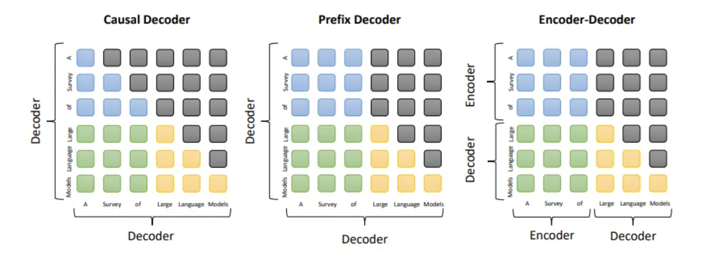

# 大模型（LLMs）面试

## LLMs 基础面

1. 目前**主流的开源模型体系**有哪些？
> OpenAI 的 GPT 系列、Meta 的 LLaMA 系列、清华智谱 AI 的 GLM 系列、百川智能的 Baichuan 系列

2. prefix LM 和 causal LM 区别是什么？
> attention mask 不同，prefix LM 的 prefix 部分的 token 互相能看到，causal LM 只有后面的 token 才能看到前面的 token。目前除了 T5 和 GLM 是 prefix LM，其他大模型基本上都是 Causal LM。

3. 什么是大模型的涌现能力，为什么？
> 涌现，emerge(abilities)，即一般指在大模型中出现而小模型没有的能力。一般包括上下文学习(ICL)、指令微调(IFT)、思维链(CoT)等。

4. 大模型 LLM 的架构介绍？

> 现有的 LLM 可以大致分为 3 种类型：encoder-decoder、causal decode、prefix decoder。
> - Encoder-Decoder: 编码器利用堆叠的多头自注意力层对输入序列进行编码并生成潜在表示。解码器对这些表示进行交叉注意力并生成目标序列。例子：T5, BART。
> - Causal Decoder：causal decoder 架构包含一个单向的 attention mask，允许每个输入令牌仅关注过去的令牌及其自身。输入和输出 token 在 decoder 以相同的方式处理。
> - Prefix Decoder: 前缀标记的双向 attention 和对生成标记的单向 attention。与编码器-解码器架构类似，前缀解码器可以双向编码前缀序列，并使用共享参数自回归预测输出 token。例子：GLM。

## LLMs 进阶面

1. LLMs 复读机问题
- 什么是 LLMs 复读机问题？
> 比如：ABCABCABC 不断循环输出到 max length。
- 为什么会出现 LLMs 复读机问题？
> 预测下一个 token 的条件概率不变，导致复读机问题。
- 如何缓解 LLMs 复读机问题？
> 解码时加入多样性，比如：调高 temperature、beam search、top-k sampling、top-p sampling 等。

2. llama 系列问题
- llama 输入句子长度理论上可以无限长吗？
> 理论上 RoPE 的 llama 可以处理无限长度，但是太长了效果不好，没训练过的长度效果通常不好。而想办法让没训练过的长度效果好，这个问题就叫做“长度外推性”问题。

3. 什么情况用Bert模型，什么情况用 LLaMA、ChatGLM 类大模型，咋选？
> - 标准 Bert 模型是双向注意力 Transformer 编码器，大约只有 1 亿的参数量，在自然语言理解任务效果很好，单卡 GPU 可以部署，速度快相对大模型来说快。
> - ChatGLM-6B, LLaMA-7B 模型分别是 60 亿参数量和 70 亿参数量的大模型，基本可以处理所有 NLP 任务，效果好，但大模型部署成本高，需要大显存的 GPU，并且推理速度相对较慢。

4. 各个专业领域是否需要各自的大模型来服务？
> 各巨头公司发布的大模型通常是在万亿级别 token 训练的，而且是通用的，可以处理各种任务。但是，如果想要更好的效果，可以针对某个领域进行微调，比如：医疗、法律、金融等。

5. 如何让大模型处理更长的文本？
> - 从预训练的角度来说，可以使用更加高效的注意力机制，降低注意力机制的复杂度。
> - 从推理的角度来说，类似 map-reduce 的思想，将长文本分成多个小段，然后分别输入到大模型中，最后将结果进行融合。

## LLMs 微调面

1. 如果想要在某个模型基础上做全参数微调，究竟需要多少显存？
> 

FlashAttention 是什么？
> 自注意力机制（self attention）的时间和存储复杂度在序列长度上属于二次型，Flash Attention的主要目的是加速和节省内存，主要贡献包括：
> - 计算softmax时候不需要全量input数据，可以分段计算；
> - 反向传播的时候，不存储 attention matrix (N^2的矩阵)，而是只存储softmax归一化的系数。
