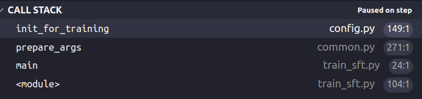
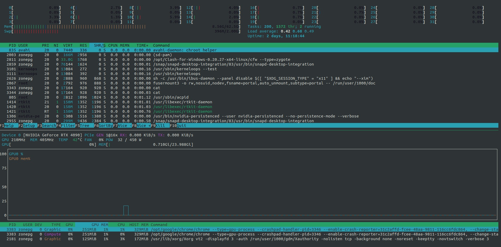

# 基于 LLaMA-Efficient-Tuning 对大模型进行 SFT： 数据是如何加载的

根据 [LLaMA-Efficient-Tuning](https://github.com/hiyouga/LLaMA-Efficient-Tuning) 仓库的描述，它支持对 baichuan, LLaMA 模型的微调，支持训练方法包括预训练(pre-training), 有监督微调（sft）和 RLHF，微调方式均为 LoRA 或者 QLoRA。该仓库作者的另外一个仓库 [ChatGLM-Efficient-Tuning](https://github.com/hiyouga/ChatGLM-Efficient-Tuning) 实现了对 ChatGLM 的微调。baichuan-7B 或 ChatGLM/ChatGLM2 是中文数据集任务下效果比较好的模型，我主要基于这两个模型的微调调研了一些代码仓库。

LLaMA-Efficient-Tuning 作者在 baichuan-7B 仓库的这个 [issue#23](https://github.com/baichuan-inc/baichuan-7B/issues/23#issuecomment-1592658897%EF%BC%9A) 下提供 baichuan-7B 模型的 LoRA 微调命令参数，可以直接运行，即可基于 alpaca_gpt4_zh 数据集进行有监督微调。

```shell
CUDA_VISIBLE_DEVICES=0 python src/train_sft.py \
    --model_name_or_path baichuan-7B模型文件夹路径或huggingface地址 \
    --do_train \
    --dataset alpaca_gpt4_zh \
    --finetuning_type lora \
    --lora_rank 8 \
    --lora_target W_pack \
    --output_dir alpaca_baichuan \
    --per_device_train_batch_size 4 \
    --per_device_eval_batch_size 4 \
    --gradient_accumulation_steps 8 \
    --lr_scheduler_type cosine \
    --logging_steps 10 \
    --save_steps 100 \
    --eval_steps 100 \
    --learning_rate 5e-5 \
    --max_grad_norm 0.5 \
    --num_train_epochs 3.0 \
    --dev_ratio 0.01 \
    --evaluation_strategy steps \
    --load_best_model_at_end \
    --plot_loss \
    --fp16
```

为了理解 LLaMA-Efficient-Tuning 微调大模型的代码思路，以及如何构造自己的数据集，可以对该仓库使用 vscode 调试工具来调试该仓库代码，关于如何使用 vscode 调试 python 程序，可以参考我写的这篇博客 [vscode 远程开发不完全指南](../tools/vscode-remote.md#python-开发与调试) 的 python 调试部分。

## 准备工作

### 下载模型文件

如果不手动指定模型下载目录，huggingface 可能会将数据集下载到 `~/.cache` 目录。个人比较喜欢手动下载模型 checkpoint 文件，并手动管理，我手动下载的模型目录位置为 `~/models` 也就是我的 `/home/zonepg/models` 目录

以 baichuan-7B 为例子，为了下载 huggingface 上的大模型文件，我们需要安装 [git-lfs](https://git-lfs.github.com/)，并设置 git lfs：
```
git lfs install
```

就可以开始下载模型了：
```
mkdir ~/models && cd ~/models
git clone https://huggingface.co/baichuan-inc/baichuan-7B
```

模型参数文件较大，下载可能比较慢，如果不确定是否在下载，可以使用 `bwm-ng` 命令 (ubuntu 系统直接 `sudo apt install bwm-ng` 安装) 查看下载网络速度，确定模型否在下载。


### 配置调试配置文件

模型下载好后，下载 LLaMA-Efficient-Tuning 的仓库代码。根据开篇提供的命令参数样例，我们可以配置调试文件`.vscode/launch.json`，准备工作就完成了：

```json
{
    // Use IntelliSense to learn about possible attributes.
    // Hover to view descriptions of existing attributes.
    // For more information, visit: https://go.microsoft.com/fwlink/?linkid=830387
    "version": "0.2.0",
    "configurations": [
        {
            "name": "Python: train_sft.py example",
            "type": "python",
            "request": "launch",
            "program": "src/train_sft.py",
            "console": "integratedTerminal",
            "justMyCode": false, // 可以调试库代码
            "args": [
                "--model_name_or_path=/home/zonepg/models/baichuan-7B", // 更改为模型下载陆军
                "--do_train",
                "--dataset=example", // 以 example 数据集为例
                "--finetuning_type=lora",
                "--lora_rank=8",
                "--lora_target=W_pack",
                "--output_dir=alpaca_baichuan",
                "--per_device_train_batch_size=4",
                "--per_device_eval_batch_size=4",
                "--gradient_accumulation_steps=8",
                "--lr_scheduler_type=cosine",
                "--logging_steps=10",
                "--save_steps=1000",
                "--eval_steps=1000",
                "--learning_rate=5e-5",
                "--max_grad_norm=0.5",
                "--num_train_epochs=3.0",
                "--dev_ratio=0.01",
                "--evaluation_strategy=steps",
                "--load_best_model_at_end",
                "--plot_loss",
                "--fp16"
            ]
        }
    ]
}
```

## 数据是如何加载的

开启调试模式，就可以分析代码了

### dataset_info.json



在 init_for_traning 函数中，加载了数据集信息 `dataset_info.json` 文件，以 example 为例：
```
  "example": {
    "script_url": "example_dataset",
    "columns": {
      "prompt": "instruction",
      "query": "input",
      "response": "output",
      "history": "history"
    }
  },
```

`example` 表示数据集名称，和 `--dataset` 参数对应，`script_url` 是数据集路径，`columns` 设置了数据集格式的映射关系，因为不同数据集的数据可能格式不一样。

```example_dataset``` 文件夹包括`example_dataset.py` 和 `examples.json` 文件，`examples.json` 是数据集具体内容如下。`example_dataset.py` 文件包括了数据集的构造类，这套规则是由 huggingface 定义的，在 `raw_datasets = load_dataset(...)` 会调用该文件的类构造初始化数据集，可以断点调试查看过程。

### prepare_data()

由于各个数据集格式可能不一样，在 prepare_data 方法中对数据集格式进行了统一：
```python
def prepare_data(
        model_args: ModelArguments,
        data_args: DataTrainingArguments
) -> Dataset:
    ...
        for column_name, target_name in [
            ("prompt_column", "prompt"),
            ("query_column", "query"),
            ("response_column", "response"),
            ("history_column", "history")
        ]: # every dataset will have 4 columns same as each other
            if getattr(dataset_attr, column_name) != target_name:
                if getattr(dataset_attr, column_name):
                    dataset = dataset.rename_column(getattr(dataset_attr, column_name), target_name)
                else: # None or empty string
                    dataset = dataset.add_column(target_name, dummy_data)
        dataset = dataset.add_column("prefix", prefix_data)
    ...
```

最终经过 prepare_data 得到的 dataset 包括 5 个 columns: ['prompt', 'query', 'response', 'history', 'prefix']
- **prompt**: 也就是指令 instruction
- **query**: 输入 input，可能为空
- **response**: 也是 output
- history: 是一个包含多轮对话的列表，子列表长度为 2，[0] 表示 input，[1] 表示 output。某些数据集没有 history。
- prefix: 通常由 Template 设定，也就是指令的前缀。
```
    "history": [
      ["你好，你能帮我解答一个问题吗？", "当然，请问有什么问题？"],
      ["我想了解人工智能的未来发展方向，你有什么想法吗？", "人工智能在未来的发展方向可能包括更强大的机器学习算法，更先进的自然语言处理技术，以及更加智能的机器人。"]
    ]
```

### preprocess_data()

经过 prepare_data 获得统一格式化的 dataset，需要经过 preprocess_data 处理，得到最终输入给模型的 dataset，也就是 input_ids 和 labels。

```python
def preprocess_data(
        dataset: Dataset,
        tokenizer: PreTrainedTokenizer,
        data_args: DataTrainingArguments,
        training_args: Seq2SeqTrainingArguments,
        stage: Literal["pt", "sft", "rm", "ppo"]
) -> Dataset:
    ...
    # support question with a single answer or multiple answers
    def get_dialog(examples):
        for i in range(len(examples["prompt"])):
            if examples["prompt"][i] and examples["response"][i]:
                query, answer = examples["prompt"][i], examples["response"][i]
                query = query + "\n" + examples["query"][i] if examples["query"][i] else query
                prefix = examples["prefix"][i] if examples["prefix"][i] else ""
                dialog = prompt_template.get_dialog(query, answer, examples["history"][i], prefix)
                yield dialog
    ...
    def preprocess_supervised_dataset(examples):
        # build inputs with format `<bos> X Y <eos>` and labels with format `<ignore> ... <ignore> Y <eos>`
        # for input with history, we build multiple input-label pairs just like:
        # https://github.com/lm-sys/FastChat/blob/f17c092f64840fa6354ed52789dccb2daa793d0b/fastchat/train/train.py#L112
        model_inputs = {"input_ids": [], "labels": []}
        for dialog in get_dialog(examples):
            input_ids, labels = [], []

            for i in range(len(dialog) // 2):
                source_ids = tokenizer.encode(text=dialog[2*i], add_special_tokens=False)
                target_ids = tokenizer.encode(text=dialog[2*i+1], add_special_tokens=False)

                if len(source_ids) > data_args.max_source_length - 1: # bos token
                    source_ids = source_ids[:data_args.max_source_length - 1]
                if len(target_ids) > data_args.max_target_length - 1: # eos token
                    target_ids = target_ids[:data_args.max_target_length - 1]

                input_ids += [tokenizer.bos_token_id] + source_ids + target_ids + [tokenizer.eos_token_id]
                labels += [IGNORE_INDEX] * (len(source_ids) + 1) + target_ids + [tokenizer.eos_token_id]

            if len(input_ids) > data_args.max_source_length + data_args.max_target_length:
                input_ids = input_ids[:data_args.max_source_length + data_args.max_target_length]
            if len(labels) > data_args.max_source_length + data_args.max_target_length:
                labels = labels[:data_args.max_source_length + data_args.max_target_length]

            model_inputs["input_ids"].append(input_ids)
            model_inputs["labels"].append(labels)
        return model_inputs
    ...
    with training_args.main_process_first(desc="dataset map pre-processing"):
        # preprocess_function(dataset) for debug
        dataset = dataset.map(
            preprocess_function,
            batched=True,
            num_proc=data_args.preprocessing_num_workers,
            remove_columns=column_names,
            load_from_cache_file=not data_args.overwrite_cache,
            desc="Running tokenizer on dataset"
        )

        ...
        elif stage == "sft":
            print_supervised_dataset_example(dataset[0])

        return dataset
```

如上我列出了以 sft 为例时的核心调用逻辑：
- map 会对 dataset 调用 preprocess_supervised_dataset 函数，也就是 tokenizer 过程。
- preprocess_supervised_dataset 遍历每一个样本，get_dialog 函数会根据样本的 5 个 column 属性直构造对话序列 list。
```
原始 column
  {
    "instruction": "听起来很不错。人工智能可能在哪些方面面临挑战呢？",
    "input": "",
    "output": "人工智能面临的挑战包括数据隐私、安全和道德方面的问题，以及影响就业机会的自动化等问题。",
    "history": [
      ["你好，你能帮我解答一个问题吗？", "当然，请问有什么问题？"],
      ["我想了解人工智能的未来发展方向，你有什么想法吗？", "人工智能在未来的发展方向可能包括更强大的机器学习算法，更先进的自然语言处理技术，以及更加智能的机器人。"]
    ]
  },
=========
构造后的对话序列 dialog
[
    "A chat between a curious user and an artificial intelligence assistant. The assistant gives helpful, detailed, and polite answers to the user's questions.\nHuman: 你好，你能帮我解答一个问题吗？\nAssistant: ",
    "当然，请问有什么问题？",
    "\nHuman: 我想了解人工智能的未来发展方向，你有什么想法吗？\nAssistant: ",
    "人工智能在未来的发展方向可能包括更强大的机器学习算法，更先进的自然语言处理技术，以及更加智能的机器人。",
    "\nHuman: 听起来很不错。人工智能可能在哪些方面面临挑战呢？\nAssistant: ",
    "人工智能面临的挑战包括数据隐私、安全和道德方面的问题，以及影响就业机会的自动化等问题。",
]
```
- preprocess_supervised_dataset for 循环时 调用 get_dialog 得到的上述 dialog 经过 tokenizer encode 分别得到 source_ids (问) 和 target_ids (答)
  - 最终 input_ids 包括 source_ids 和 target_ids
  - labels 只有 target_ids，但是长度和 input_ids一样，前面的 source_ids 部分用 IGNORE_INDEX 填充。

至此，处理后的 dataset 喂给模型的输入 input_ids 和输出 labels 就构造完成了。

## 微调自定义数据集

- **prompt**: 也就是指令 instruction
- **query**: 输入 input，可能为空
- **response**: 也是 output
- history: 是一个包含多轮对话的列表，子列表长度为 2，[0] 表示 input，[1] 表示 output。某些数据集没有 history。
- prefix: 通常由 Template 设定，也就是指令的前缀。

因此，如果要微调自定义数据集，可以这样设计自己的数据集格式：
```json
  {
    "prefix": "这是一个心理健康专家助手与一个存在心理疾病的病人的问答对话。心理专家助手给出的都是有用、无害并且有礼貌的回答。", // 可以为空
    "prompt": "我最近面临考试，感到压力很大，你可以给我一些建议吗", // 指令
    "query": "", // 可以为空
    "response": "你可以这样缓解压力......",
    "history": [
      ["你好，你能帮我....吗？", "当然，......"], // 0 为 问句，1 为所回答的句子
      ["我想了解..........吗？", "当然，....."]
    ]
  },
```

## 工具推荐

推荐开发时用到的有用的命令行工具。

### htop 和 nvtop

htop 查看 cpu 线程和内存占用情况，nvtop 查看 gpu 内存、功耗和带宽速度。



### tree

命令行查看当前路径文件树结构和文件大小`tree -s -h --du`


