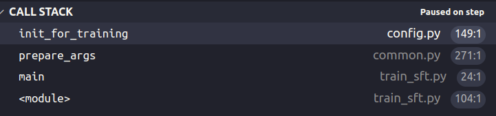
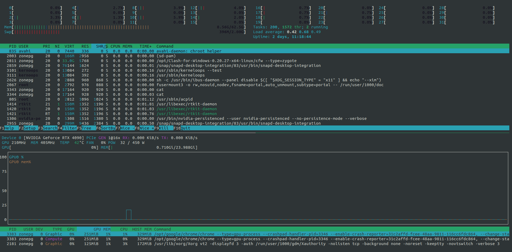
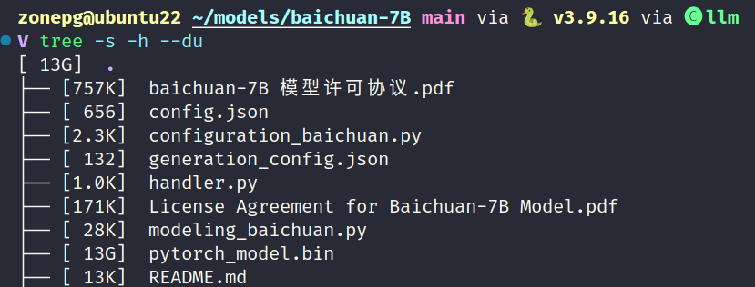

# 基于 LLaMA-Factory 对大模型进行 SFT： 数据是如何加载的

根据 [hiyouga/LLaMA-Factory](https://github.com/ZonePG/LLaMA-Factory/tree/main) 仓库的描述，它支持对 BaiChuan, LLaMA, Qwen, ChatGLM 等模型的微调，支持训练方法包括预训练(pre-training), 有监督微调（sft）和 RLHF，微调方式均为 LoRA 或者 QLoRA。BaiChuan 或 Qwen 是中文数据集任务下效果比较好的模型，我主要基于这两个模型的微调调研了一些代码仓库。

根据 LLaMA-Factory 作者在仓库 `README.md` 的[描述](https://github.com/hiyouga/LLaMA-Factory)，针对 Baichuan 的 sft，我们可以使用如下 shell 命令：
```
CUDA_VISIBLE_DEVICES=0 python src/train_bash.py \
    --stage sft \
    --model_name_or_path /opt/models/Baichuan2-13B-Chat \
    --do_train \
    --dataset example \
    --template default \
    --finetuning_type lora \
    --lora_target W_pack \  # 这里的 W_pack 是适用 Baichuan
    --output_dir path_to_sft_checkpoint \
    --overwrite_cache \
    --per_device_train_batch_size 4 \
    --gradient_accumulation_steps 4 \
    --lr_scheduler_type cosine \
    --logging_steps 10 \
    --save_steps 1000 \
    --learning_rate 5e-5 \
    --num_train_epochs 3.0 \
    --plot_loss \
    --fp16
``` 

为了理解 LLaMA-Factory 微调大模型的代码思路，以及如何构造自己的数据集，可以对该仓库使用 vscode 调试工具来调试该仓库代码，关于如何使用 vscode 调试 python 程序，可以参考我写的这篇文章 [vscode 远程开发不完全指南](../tools/vscode-remote.md#python-开发与调试) 的 python 调试部分。

## 准备工作

### 下载模型文件

如果不手动指定模型下载目录，huggingface 可能会将数据集下载到 `~/.cache` 目录。个人比较喜欢手动下载模型 checkpoint 文件，并手动管理，我手动下载的模型目录位置为 `~/models` 也就是我的 `/home/zonepg/models` 目录

以 baichuan2-13B 为例子，为了下载 huggingface 上的大模型文件，我们需要安装 [git-lfs](https://git-lfs.github.com/)，并设置 git lfs：
```
git lfs install
```

就可以开始下载模型了：
```
mkdir ~/models && cd ~/models
git clone https://huggingface.co/baichuan-inc/Baichuan2-13B-Chat
```

模型参数文件较大，下载可能比较慢，如果不确定是否在下载，可以使用 `bwm-ng` 命令 (ubuntu 系统直接 `sudo apt install bwm-ng` 安装) 查看下载网络速度，确定模型否在下载。


### 配置调试配置文件

模型下载好后，下载 LLaMA-Factory 的仓库代码。根据开篇提供的命令参数样例，我们可以配置调试文件`.vscode/launch.json`，准备工作就完成了：

```json
{
    // Use IntelliSense to learn about possible attributes.
    // Hover to view descriptions of existing attributes.
    // For more information, visit: https://go.microsoft.com/fwlink/?linkid=830387
    "version": "0.2.0",
    "configurations": [
        {
            "name": "Python: train_bash.py Baichuan2-13B-Chat example",
            "type": "python",
            "request": "launch",
            "program": "src/train_bash.py",
            "console": "integratedTerminal",
            "justMyCode": false, // 设置为 false 可以调试源码
            "args": [
                // model arguments
                "--model_name_or_path=/opt/models/Baichuan2-13B-Chat",
                "--plot_loss",

                // data arguments
                "--template=baichuan2",
                "--dataset=example",
                "--overwrite_cache=True",
                
                // training arguments
                "--do_train=True",
                "--output_dir=checkpoints/alpaca_gpt4_en-baichuan-13b-chat",
                "--per_device_train_batch_size=4",
                "--gradient_accumulation_steps=4",
                "--lr_scheduler_type=cosine",
                "--logging_steps=10",
                "--save_steps=1000",
                "--learning_rate=5e-5",
                "--num_train_epochs=3.0",
                "--fp16",

                // fine-tuning arguments
                "--finetuning_type=lora",
                "--lora_target=W_pack",

                // general arguments
                "--stage=sft",
            ],
            "env": {
                "CUDA_VISIBLE_DEVICES": "7"
            }
        },
    ]
}
```

## 数据是如何加载的

开启调试模式，就可以分析代码了

### dataset_info.json



在 init_for_traning 函数中，加载了数据集信息 `dataset_info.json` 文件，以 example 为例：
```
  "example": {
    "script_url": "example_dataset",
    "columns": {
      "prompt": "instruction",
      "query": "input",
      "response": "output",
      "history": "history"
    }
  },
```

`example` 表示数据集名称，和 `--dataset` 参数对应，`script_url` 是数据集路径，`columns` 设置了数据集格式的映射关系，因为不同数据集的数据可能格式不一样。

```example_dataset``` 文件夹包括`example_dataset.py` 和 `examples.json` 文件，`examples.json` 是数据集具体内容如下。`example_dataset.py` 文件包括了数据集的构造类，这套规则是由 huggingface 定义的，在 `raw_datasets = load_dataset(...)` 会调用该文件的类构造初始化数据集，可以断点调试查看过程。

### get_dataset()

由于各个数据集格式可能不一样，在 get_dataset 方法中对数据集格式进行了统一：
```python
def get_dataset(
    model_args: "ModelArguments",
    data_args: "DataArguments"
) -> Union["Dataset", "IterableDataset"]:
    ...
        dataset = load_dataset(
            data_path,
            data_files=data_files,
            split=data_args.split,
            cache_dir=model_args.cache_dir,
            streaming=data_args.streaming,
            use_auth_token=True if model_args.use_auth_token else None
        )

        if max_samples is not None:
            max_samples_temp = min(len(dataset), max_samples)
            dataset = dataset.select(range(max_samples_temp))

        for column_name in ["prompt", "query", "response", "history"]: # align datasets
            if getattr(dataset_attr, column_name) and getattr(dataset_attr, column_name) != column_name:
                dataset = dataset.rename_column(getattr(dataset_attr, column_name), column_name)

        if dataset_attr.system_prompt: # add system prompt
            if data_args.streaming:
                dataset = dataset.map(lambda _: {"system": dataset_attr.system_prompt})
            else:
                dataset = dataset.add_column("system", [dataset_attr.system_prompt] * len(dataset))

        all_datasets.append(dataset)
        ...
```

最终经过 prepare_data 得到的 dataset 包括 4 个 columns: ['prompt', 'query', 'response', 'history']
- **prompt**: 也就是指令 instruction
- **query**: 输入 input，可能为空
- **response**: 也是 output
- history: 是一个包含多轮对话的列表，子列表长度为 2，[0] 表示 input，[1] 表示 output。某些数据集没有 history。
```
    "history": [
      ["你好，你能帮我解答一个问题吗？", "当然，请问有什么问题？"],
      ["我想了解人工智能的未来发展方向，你有什么想法吗？", "人工智能在未来的发展方向可能包括更强大的机器学习算法，更先进的自然语言处理技术，以及更加智能的机器人。"]
    ]
```

### preprocess_dataset()

经过 prepare_data 获得统一格式化的 dataset，需要经过 preprocess_data 处理，得到最终输入给模型的 dataset，也就是 input_ids 和 labels。

```python
def preprocess_dataset(
    dataset: Union["Dataset", "IterableDataset"],
    tokenizer: "PreTrainedTokenizer",
    data_args: "DataArguments",
    training_args: "Seq2SeqTrainingArguments",
    stage: Literal["pt", "sft", "rm", "ppo"]
) -> Union["Dataset", "IterableDataset"]:
    column_names = list(next(iter(dataset)).keys())
    template = get_template_and_fix_tokenizer(data_args.template, tokenizer)

    def construct_example(examples: Dict[str, List[Any]]) -> Generator[Any, None, None]:
        for i in range(len(examples["prompt"])):
            query, response = examples["prompt"][i], examples["response"][i]
            query = query + "\n" + examples["query"][i] if "query" in examples and examples["query"][i] else query
            history = examples["history"][i] if "history" in examples else None
            system = examples["system"][i] if "system" in examples else None
            yield query, response, history, system

    def preprocess_supervised_dataset(examples: Dict[str, List[Any]]) -> Dict[str, Any]:
        # build inputs with format `<bos> X Y <eos>` and labels with format `<ignore> ... <ignore> Y <eos>`
        # for multiturn examples, we only mask the prompt part in each prompt-response pair.
        model_inputs = {"input_ids": [], "attention_mask": [], "labels": []}

        for query, response, history, system in construct_example(examples):
            input_ids, labels = [], []

            for turn_idx, (source_ids, target_ids) in enumerate(template.encode_multiturn(
                tokenizer, query, response, history, system
            )):
                total_len = len(source_ids) + len(target_ids)
                max_source_len = int(data_args.cutoff_len * (len(source_ids) / total_len))
                max_target_len = int(data_args.cutoff_len * (len(target_ids) / total_len))

                if len(source_ids) > max_source_len:
                    source_ids = source_ids[:max_source_len]
                if len(target_ids) > max_target_len:
                    target_ids = target_ids[:max_target_len]

                if turn_idx != 0 and template.efficient_eos:
                    source_mask = [tokenizer.eos_token_id] + [IGNORE_INDEX] * (len(source_ids) - 1)
                else:
                    source_mask = [IGNORE_INDEX] * len(source_ids)

                input_ids += source_ids + target_ids
                labels += source_mask + target_ids

            if template.efficient_eos:
                input_ids += [tokenizer.eos_token_id]
                labels += [tokenizer.eos_token_id]

            if len(input_ids) > data_args.cutoff_len:
                input_ids = input_ids[:data_args.cutoff_len]
                labels = labels[:data_args.cutoff_len]

            model_inputs["input_ids"].append(input_ids)
            model_inputs["attention_mask"].append([1] * len(input_ids))
            model_inputs["labels"].append(labels)

        return model_inputs

    def print_supervised_dataset_example(example):
        print("input_ids:\n{}".format(example["input_ids"]))
        print("inputs:\n{}".format(tokenizer.decode(example["input_ids"], skip_special_tokens=False)))
        print("label_ids:\n{}".format(example["labels"]))
        print("labels:\n{}".format(
            tokenizer.decode(list(filter(lambda x: x != IGNORE_INDEX, example["labels"])), skip_special_tokens=False)
        ))

    ...
    elif stage == "sft" and not training_args.predict_with_generate:
        dataset = dataset.filter(lambda example: example["prompt"] and example["response"])
        preprocess_func = preprocess_packed_supervised_dataset if data_args.sft_packing else preprocess_supervised_dataset
        print_function = print_supervised_dataset_example

    with training_args.main_process_first(desc="dataset map pre-processing"):
        kwargs = {}
        if not data_args.streaming:
            kwargs = dict(
                num_proc=data_args.preprocessing_num_workers,
                load_from_cache_file=not data_args.overwrite_cache,
                desc="Running tokenizer on dataset"
            )

        dataset = dataset.map(
            preprocess_func,
            batched=True,            
            remove_columns=column_names,
            **kwargs
        )

        print_function(next(iter(dataset)))
        return dataset
```

如上我列出了以 sft 为例时的核心调用逻辑：
- map 会对 dataset 调用 preprocess_supervised_dataset 函数，也就是 tokenizer 过程。
- preprocess_supervised_dataset 遍历每一个样本。

至此，处理后的 dataset 喂给模型的输入 input_ids 和输出 labels 就构造完成了。

## 微调自定义数据集

用于微调的自定义数据集的格式可以是这样的：
- **prompt**: 也就是指令 instruction
- **query**: 输入 input，可能为空
- **response**: 也是 output
- history: 是一个包含多轮对话的列表，子列表长度为 2，[0] 表示 input，[1] 表示 output。某些数据集没有 history。

因此，如果要微调自定义数据集，可以这样设计自己的数据集格式：
```json
  {
    "prompt": "我最近面临考试，感到压力很大，你可以给我一些建议吗", // 指令
    "query": "", // 可以为空
    "response": "你可以这样缓解压力......",
    "history": [
      ["你好，你能帮我....吗？", "当然，......"], // 0 为 问句，1 为所回答的句子
      ["我想了解..........吗？", "当然，....."]
    ]
  },
```

## 工具推荐

推荐开发时用到的有用的命令行工具。

### htop 和 nvtop

htop 查看 cpu 线程和内存占用情况，nvtop 查看 gpu 内存、功耗和带宽速度。



### tree

命令行查看当前路径文件树结构和文件大小`tree -s -h --du`


