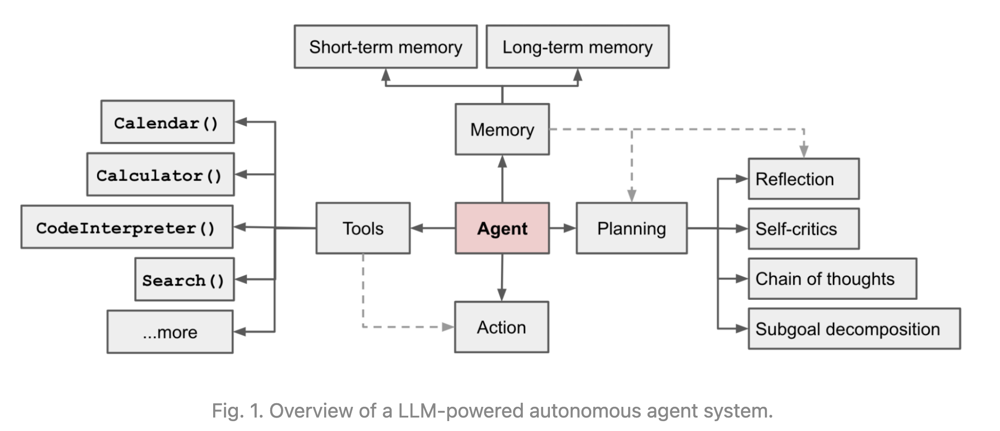
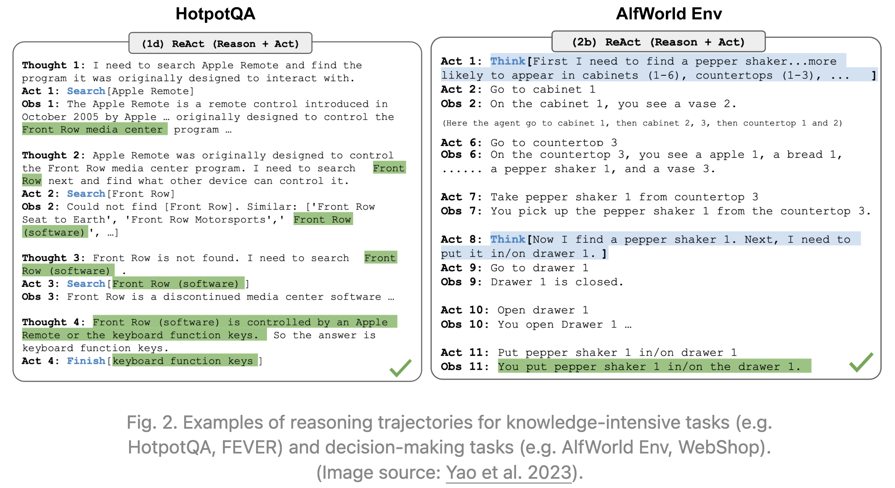
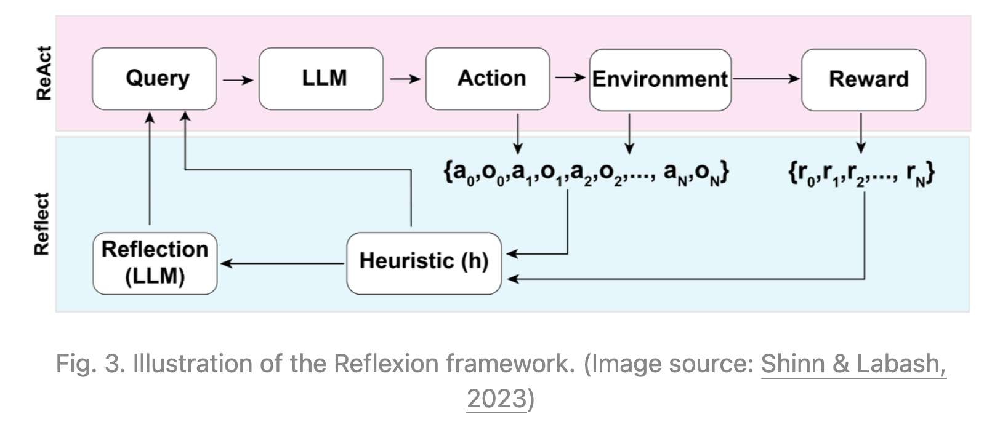

# LLM Powered Autonomous Agents

以 LLM（大语言模型）作为核心控制器构建 Agent 是一个很酷的概念。 AutoGPT、GPT-Engineer 和 BabyAGI 等几个概念验证演示都是鼓舞人心的示例。LLM 的潜力不仅仅限于生成写得好的副本、故事、论文和程序；它可以被视为一个强大的通用问题解决器。

## Agent System Overview

在 LLM 支持的自主 Agent 系统中，LLM 充当代理的大脑，并由几个关键组件进行补充：

- Planning
  - 子目标和分解：Agent 将大型任务分解为更小的、可管理的子目标，从而能够有效处理复杂的任务。
  - 反思和完善：智能体可以对过去的行为进行自我批评和自我反思，从错误中吸取教训，并针对未来的步骤进行完善，从而提高最终结果的质量。
- Memory
  - 短期记忆：我认为所有的上下文学习（例如 Prompt Engineering）都是利用模型的短期记忆来学习。
  - 长期记忆：这为 Agent 提供了长时间保留和回忆（无限）信息的能力，通常是通过利用外部向量存储和快速检索。
- Tool use
  - Agent 学习调用外部 API 来获取模型权重中缺失的额外信息（通常在预训练后很难更改），包括当前信息、代码执行能力、对专有信息源的访问等。



## Component One: Planning

一项复杂的任务通常涉及许多步骤。Agent 需要了解它们是什么并提前计划。

### Task Decomposition

**Chain of thought**（CoT；Wei et al. 2022）已成为增强复杂任务模型性能的标准提示技术。该模型被指示“一步一步思考”，以利用更多的测试时间计算将困难任务分解为更小、更简单的步骤。 CoT 将大型任务转化为多个可管理的任务，并阐明模型思维过程的解释。

**Tree of Thoughts**（Yao et al. 2023）通过在每一步探索多种推理可能性来扩展 CoT。它首先将问题分解为多个思考步骤，并在每个步骤中生成多个思考，从而创建树结构。搜索过程可以是 BFS（广度优先搜索）或 DFS（深度优先搜索），每个状态由分类器（通过提示）或多数投票进行评估。

任务分解可以（1）由LLM通过简单的提示（如 "Steps for XYZ.\n1." ， "What are the subgoals for achieving XYZ?" ）来完成，（2）通过使用特定于任务的指令；例如 "Write a story outline." 用于写小说，或 (3) 人工输入。

另一种截然不同的方法是 **LLM+P**（Liu et al. 2023），涉及依赖外部经典规划器来进行长期规划。该方法利用规划领域定义语言（PDDL）作为描述规划问题的中间接口。在此过程中，LLM (1) 将问题转化为“Problem PDDL”，然后 (2) 请求经典规划器基于现有的“Domain PDDL”生成 PDDL 计划，最后 (3) 将 PDDL 计划转化回自然语言。本质上，规划步骤被外包给外部工具，假设特定领域的 PDDL 和合适的规划器可用，这在某些机器人设置中很常见，但在许多其他领域并不常见。

### Self-Reflection

自我反思是一个重要的方面，它允许 Agent 通过完善过去的行动决策和纠正以前的错误来迭代改进。它在不可避免地会出现试错的现实任务中发挥着至关重要的作用。

**ReAct**（Yao et al. 2023）通过将动作空间扩展为特定于任务的离散动作和语言空间的组合，将推理和动作集成在 LLM 中。前者使 LLM 能够与环境交互（例如使用维基百科搜索 API），而后者则促使 LLM 以自然语言生成推理过程。

ReAct 提示模板包含了 LLM 思考的明确步骤，大致格式为：

```
Thought: ...
Action: ...
Observation: ...
... (Repeated many times)
```



在知识密集型任务和决策任务的两个实验中，`ReAct` 比删除了 `Thought: ...` 步骤的仅 Act 基线效果更好。

**Reflexion** (Shinn & Labash 2023) 是一个为智能体配备动态记忆和自我反思能力以提高推理技能的框架。 Reflexion 有一个标准的 RL 设置，其中奖励模型提供简单的二元奖励，动作空间遵循 ReAct 中的设置，其中特定于任务的动作空间通过语言进行增强，以实现复杂的推理步骤。在每个操作 $a_t$ 之后，Agent 计算启发式 $h_t$ 并且可以选择根据自我反思结果决定重置环境以开始新的试验。



启发式功能确定轨迹何时效率低下或包含幻觉并且应该停止。低效的规划是指花费太长时间而没有成功的轨迹。幻觉被定义为遇到一系列连续的相同动作，这些动作导致在环境中进行相同的观察。

自我反思是通过向 LLM 展示两个例子来创建的，每个例​​子都是一对（失败的轨迹，指导计划未来变化的理想反思）。然后，反射被添加到代理的工作内存中，最多三个，用作查询 LLM 的上下文。

## Component Two: Memory

（非常感谢 ChatGPT 帮助我起草本节。在与 ChatGPT 的对话中，我学到了很多关于人脑和快速 MIPS 的数据结构的知识。）

### Types of Memory


