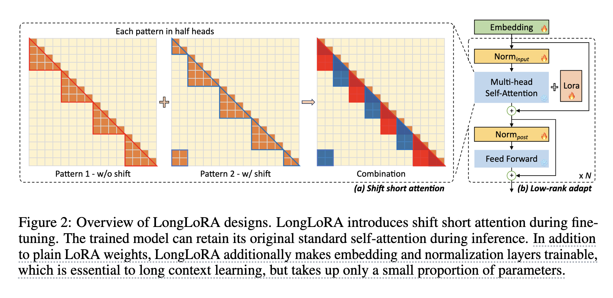
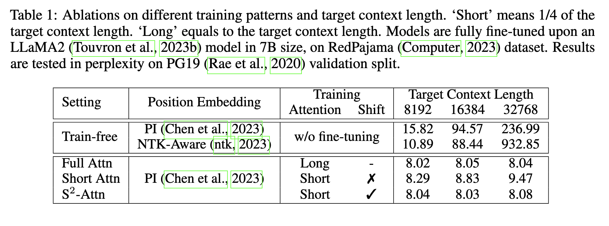
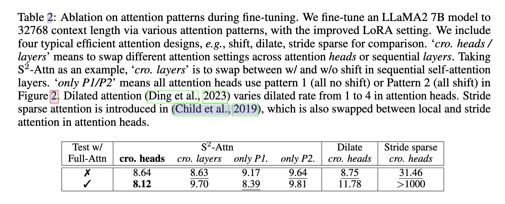
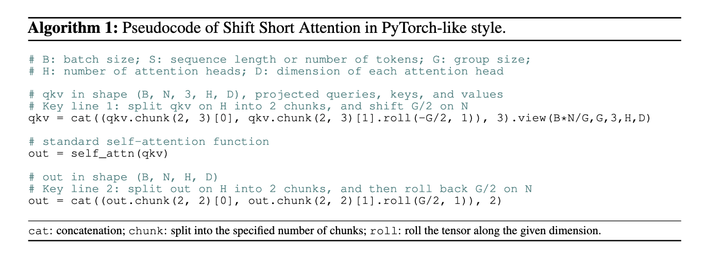
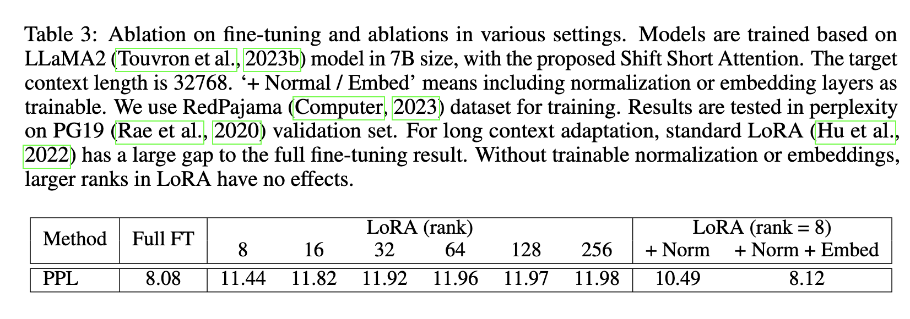

# [2023.09.21] LongLoRA: Efficient Fine-Tuning of Long-Context Large Language Models

code: https://github.com/dvlab-research/LongLoRA

## Abstract

我们提出了 LongLoRA，一种有效的微调方法，以有限的计算成本扩展预训练的大型语言模型 (llm) 的上下文大小。通常，训练具有长上下文大小的 llm 在计算上是昂贵的，需要大量的训练时间和GPU资源。例如，在上下文长度为 8192 的情况下进行训练，自注意力层的计算成本是在上下文长度为 2048 的情况下的 16 倍。本文从两个方面加快 LLM 的语境扩展。一方面，虽然在推理过程中需要密集的全局关注，但通过稀疏的局部关注可以有效地对模型进行微调。提出的转移短注意力 ($S^2-Attn$) 有效地支持上下文扩展，从而节省了大量计算，性能与使用普通注意力进行微调相似。特别是，它可以在训练中仅用两行代码实现，而在推理中是可选的。另一方面，我们重新审视了上下文扩展的参数有效微调机制。值得注意的是，我们发现 LoRA 在可训练的嵌入和规范化的前提下可以很好地进行上下文扩展。LongLoRA 在 LLaMA2 模型从 7B/13B 到 70B 的各种任务上证明了强有力的实证结果。LongLoRA 在单个 8 $\times$ A100 机器上采用 LLaMA2 7B 从 4k 上下文到 100k，或 LLaMA2 70B 到32k。LongLoRA 扩展了模型的上下文，同时保留了它们原来的架构，并且与大多数现有技术兼容，比如FlashAttention-2。此外，为了使 LongLoRA 实用，我们收集了一个数据集 LongQA，用于监督微调。它包含超过 3k 长的上下文问答对。

## Introduction

大型语言模型 (LLMs) 通常使用预定义的上下文大小进行训练，例如 LLaMA 的 2048 个 tokens (Touvron等人，2023a) 和 LLaMA2 的 4096 个标记(Touvron等人，2023b)。

然而，在许多应用程序中，预定义的大小限制了 LLMs，比如总结长文档或回答长问题。为了解决这一限制，最近的一些研究 (Chen et al.，2023;Tworkowski et al.， 2023;Mohtashami & Jaggi, 2023) 训练或微调 LLM 以适应更长的上下文。然而，从头开始训练具有长序列的 LLM 会带来计算挑战，并且对现有预训练的 LLM 进行微调也相当昂贵。例如，Position Interpolation (Chen et al.， 2023)使用 32 个 A100 gpu 将 LLaMA 模型从 2k 上下文扩展到 8k 上下文，使用 128 个 A100 gpu 进行更长的上下文微调。FOT (Tworkowski et al.， 2023)使用 32 个 tpu 进行标准 Transformer 培训，使用 128 个 tpu 进行 LongLLaMA 培训。这些计算资源对于普通研究人员来说通常是负担不起的，这自然会导致我们的问题：我们能否有效地扩展 LLMs 的上下文窗口?

一种直接的方法是通过低秩自适应(LoRA)对预训练的LLM进行微调(Hu et al.， 2022)。LoRA利用低秩矩阵对自注意块中的线性投影层进行修改，这种方法通常是有效的，并且减少了可训练参数的数量。然而，我们的实证研究结果表明，以这种方式训练长上下文模型既不够有效，也不够高效。在有效性方面，普通的低阶适应导致了长语境扩展的高度困惑，如表3所示。将 rank 增加到更高的值，例如 rank = 256，并不能缓解这个问题。在效率方面，无论是否使用LoRA，计算成本都会随着上下文规模的扩大而急剧增加，这主要是由于标准的自注意机制(Vaswani et al.， 2017)。这主要是由于标准的自我注意机制(Vaswani et al.， 2017)。如图1所示，即使使用LoRA，当上下文窗口扩展时，标准LLaMA2模型的培训时间也会大幅增加。

在这项工作中，我们引入了LongLoRA，这是一种有效的微调方法，可以扩展预训练llm的上下文窗口，例如LLaMA2 (Touvron等人，2023b)。LoRA (Hu et al.， 2022) 使用低秩权重更新来近似完全微调。同样，我们发现在训练过程中，短时间的注意力也能够近似于长时间的语境。我们提出短时转移注意 (S2-Attn) 作为标准自我注意的有效替代。如图 2 所示，我们将上下文长度分成几个组，并在每个组中单独进行注意。在半注意头中，我们将令牌移动一半的组大小，这确保了相邻组之间的信息流动。例如，我们使用组大小为 2048 的 S2-Attn 来近似总共 8192 个上下文长度训练。这与 Swin Transformer 思想差不多(Liu et al.， 2021)。

通过 S2-Attn 微调的模型在推理过程中保留了原始的注意力结构。这有利于大多数现有的优化和基础设施。普通 LLM 的技术也可以应用于我们的 LLM。例如，FlashAttention-2 (Dao et al.， 2022;Dao, 2023) 在训练和推理时间上都与我们的方法兼容。这背后的原因是短注意力类似于 LLM 预训练阶段的注意方案。其他有效注意，如扩张注意或稀疏注意，在预训练阶段与标准风格有较大差距，如表2所示。

我们的经验表明，可学习的嵌入层和规范化层是解锁长上下文 LoRA 微调的关键，见表3。嵌入层和归一化层在整个 LLM 中所占的参数比例很小。例如，在 LLaMA2 7B 中，嵌入有(< 2%)参数，归一化有 (≤0.004%) 参数。对于更大的 LLMs，这个比例会降低。

在实验中，我们证明了LongLoRA是有效的。我们给出了扩展 LLaMA2 7B、13B 和 70B 上下文窗口的实验结果。根据位置插值的实验设置(Chen et al.， 2023)，我们使用适当的位置嵌入对模型进行微调。经过训练的模型获得了与完全关注和完全微调的结果相当的性能，而计算成本要少得多，如图1所示。LongLoRA 可以在单个 8 × A100 机器上微调 LLaMA2 7B 高达 100k 的上下文，或 70B 模型高达 32k 的上下文。

此外，我们提出了一个用于监督微调 (SFT) 的数据集 LongQA。LongQA包含超过 3000 个长的问题和相应的答案。我们为技术论文、科幻小说和其他书籍设计各种类型的问题。SFT 对提高法学硕士的聊天能力具有重要意义。我们在附录中给出了一些训练模型的例子。

## Related Work

**Long-context Transformers.** 已经开展了大量的研究来增加变压器的上下文长度。其中一些方法是基于检索的(Karpukhin等人，2020;Izacard et al.， 2022;Guu et al.， 2020)，它通过获取相关文档并将检索结果包含到上下文中来增强语言模型。我们的工作是对这些工作的补充，因为我们的注意机制在推理过程中是不变的。许多研究将多头注意力修正为近似注意力(Wang et al.， 2020;Beltagy et al.， 2020;Zaheer et al.， 2020;Kitaev et al.， 2020;Bulatov et al.， 2022;丁等人，2023;邱等人，2020)。它们减轻了自注意计算的二次复杂度。例如，Longformer (Beltagy等人，2020) 和BigBird (Zaheer等人，2020) 使用稀疏关注来处理长序列。其他作品(Wu et al.， 2022;Bulatov等人，2022)利用内存机制对过去的输入进行压缩，以查找相关令牌。这些工作的一个限制是，这些压缩与完全关注有很大的差距，使得对预训练的 LLMs 进行微调是不可行的。虽然我们的工作也涉及到一个近似的注意机制，但它与标准注意有着相似的形状和很小的差距。这使我们能够微调预训练的 LLMs，并在推理期间保持充分的注意力。

**Long-context LLMs.** LLM 通常使用预定义的上下文长度进行预训练，例如 LLAMA 的 2048 (Touvron et al., 2023a) 和 LLAMA2 的 4096 (Touvron et al., 2023b)。大多数研究人员来说，从头开始训练具有长上下文的 LLM 是非常昂贵的。最近，许多作品试图通过微调来扩展 LLM 的上下文长度。位置插值 (Chen et al., 2023) 在旋转位置编码 (Su et al., 2021) 上引入了修改，并将 LLAMA 的上下文长度扩展到 32768。Focused Transformer (Tworkowski et al., 2023) 利用对比学习来训练 LongLLaMA。它们都依赖于完全微调，这在计算上是昂贵的（128 A100 GPU / 128 TPUv3 用于训练）。Landmark attention (Mohtashami & Jaggi, 2023)是一种有效的方法，但也有一定的损耗。它将长上下文输入压缩为检索到的令牌。我们的方法节省了大量的微调成本，同时保持了原始 attention 的质量。我们在推理期间通过未修改的注意力保持对整个输入的完全访问。一些文献侧重于 LLMs 的位置嵌入修改，用于长上下文扩展，包括位置插值(Chen 等人，2023)、ntk 感知(ntk, 2023)、Yarn (Peng等人，2023)、位置跳过(Zhu等人，2023)和分布外相关方法(Han等人，2023)。我们的方法侧重于有效的微调和在推理过程中保持原始结构，这与这些位置嵌入方法是正交的。我们的模型在实验中应用位置插值(Chen et al.， 2023)。

**Efficient Fine-tuning.** 这项工作是基于LoRA (Hu et al.， 2022)，一种经典的高效微调方法。除了LoRA (Hu等人，2022)，还有许多其他参数高效的微调方法，包括 prompt tuning (Lester等人，2021)、prefix tuning (Li & Liang, 2021)、hidden state tuning (Liu等人，2022)、bias tuning(Zaken等人，2022)和 masked weight learning (Sung等人，2021)。input-tuning (An et al.， 2022)引入了一个适配器来调整输入嵌入。虽然我们的输入嵌入层也是可训练的，但这还不足以进行长上下文扩展。我们对实验中的层型进行综合分析，见表3。

## LongLoRA

### BackGround

**Transformer.** llm通常由变压器组成。以LLaMA2 (Touvron et al.， 2023b)为例，如图 2 所示，LLM 模型由一个嵌入输入层和多个解码器层组成。每个解码器层包括一个 self-attention 模块。它通过具有权重矩阵 ${W_q, W_k, W_v}$ 的线性投影层，将输入特征映射到一组查询、键和值 ${q, k, v}$ 中。给定 ${q, k, v}$，它计算输出 $o$ 为

$$
o = softmax(qk^T)v
$$

然后用一个权重矩阵为 $W_o$ 的线性层来投影输出。然后是 MLP 层。在 self-attention 模块前后，应用 layer normalization (Ba et al.， 2016)。在所有解码器层之后进行最后的归一化。

对于长序列，自关注与计算成本的斗争，计算成本是序列长度的二次元。这极大地减缓了训练过程并增加了GPU内存成本。

**Low-rank Adaptation.** LoRA (Hu et al.， 2022) 假设预训练模型的权重更新在适应过程中具有较低的内在秩。对于预训练的权重矩阵 $W \in \mathbb{R}^{d \times k}$，更新为低秩分解 $W + \triangle W = BA$，其中 $B \in \mathbb{R}^{d \times r}, A \in \mathbb{R}^{r \times k}, rank \ll min(d, k)$。在训练过程中，W是冻结的，没有梯度更新，而 A 和 B 是可训练的。这就是为什么 LoRA 训练比完全微调更有效的原因。在 Transformer 结构中，LoRA只调整注意权值($W_q, W_k, W_v, W_o$)，而冻结所有其他层，包括 MLP 层和规范化层。这种方式简单且参数有效。然而，我们的经验表明，只有注意权重的低阶适应对长语境扩展不起作用。

### Shift Short Attention

标准的自注意模式需要 $O(n^2)$ 次计算，这使得 LLMs 在长序列上的内存成本高且速度慢。为了在训练过程中避免这个问题，我们建议转移短注意力 (S2-Attn)，如图2所示。在下面，我们一步一步地解释我们的设计。

**Pilot Study.** 在表 1 中，我们首先验证了微调的重要性。如果没有微调，随着上下文长度的增长，即使有适当的位置嵌入，模型的表现也会变差(Chen et al.， 2023;Ntk, 2023)装备。我们建立了一个标准的基线，经过充分的关注和充分的微调，训练和测试，在各种上下文长度中呈现一致的高质量。

第一个试验是短注意力训练，只有图 2 中的模式 1。长期以来，我们知道，高成本主要来自自关注模块。因此，在这个试验中，由于输入很长，我们在自我注意方面分成了几个组。例如，该模型在训练和测试阶段都将 8192 个令牌作为输入，但在每个大小为 2048 的组中进行自我注意。组号为 4，如表 11 所示。这种模式很有效，但仍然不能在很长的上下文中工作，如表 1 所示。随着上下文长度的增加，困惑度也随之增大。这背后的原因是不同群体之间没有信息交换。

**Consistency to Full Attention.** 现有的高效注意力设计也可以提高长语境 LLMs 的效率。在表 2 中，我们将提出的 S2-Attn 与几种典型的高效注意进行了比较，包括短时注意、扩张性注意(Ding et al.， 2023)和跨步稀疏注意(Child et al.， 2019)。我们证明S2-Attn不仅可以实现有效的微调，而且还支持全注意力测试。

一些有效的注意力设计对于长上下文微调是不可行的。变压器(Qiu et al.， 2020;Child et al.， 2019)是为从头开始训练而开发的，与预训练中使用的标准全注意力存在差距。因此，这些注意事项不适合长上下文微调。S2-Attn支持全注意力测试，尽管该模型对shift - short注意力进行了微调，如表2所示。尽管其他注意，如扩张注意(Ding等人，2023)和跨步稀疏注意(Child等人，2019)也可以用于长上下文微调，但必须使用微调期间使用的注意来测试模型。转换可以防止模型过度适应特定的注意力模式。在S2-Attn中，模式 1 或模式 2 不像表 2 中那样工作。

**Easy Implementation.** 转移短暂的注意力很容易实现。它只涉及两个步骤:(1)在半注意头中移动令牌，(2)将特征从令牌维度转置到批处理维度。两行代码就足够了。我们在算法1中提供了一个pytorch风格的代码。接下来，我们进行了初步的研究，并逐步明确了我们设计的原因。

### Improved LoRA for Long Context

LoRA (Hu et al.， 2022)是一种使 LLMs 适应其他数据集的有效且流行的方式。与完全微调相比，它节省了许多可训练参数和内存成本。然而，将 LLMs 从短上下文长度调整为长上下文长度并不容易。根据经验，我们观察到 LoRA 和完全微调之间存在明显的差距。如表 3 所示，随着目标上下文长度的增大，LoRA和完全微调之间的差距也会增大。而 largr ranks 的 LoRA 无法缩小差距。

为了弥补这一差距，我们打开了用于训练的嵌入层和规范化层。如表 3 所示，它们占用有限的参数，但对长时间的上下文适应有影响。特别是对于正规化层，整个 LLaMA2 7B 的参数仅为 0.004%。我们在实验中将这种改进的 LoRA 标记为 LoRA+。

## Experiment

## Conclusion

在这项工作中，我们提出了LongLoRA，可以有效地扩展 LLMs 的上下文长度，使其显着变大。与标准的完全微调相比，LongLoRA 具有更少的GPU内存成本和训练时间，并且具有最小的精度折衷。在体系结构层面，我们建议在训练期间将短暂注意力转移到接近标准的自注意力模式。转移短暂注意力很容易实现，只需要两行代码。此外，通过转移短注意力训练的模型在推理过程中保留了原始的标准注意力结构，使大多数预先存在的基础设施和优化可重用。在训练层面，我们用可训练的归一化和嵌入弥合了 LoRA 和完全微调之间的差距。我们的方法可以在一台 8×A100 机器上将 LLaMA2 7B 模型扩展到 100k 上下文长度，将 70B 模型扩展到 32k 上下文长度。我们认为LongLoRA是一种通用的方法，可以兼容更多类型的 LLMs 和位置编码，我们计划在未来进行研究。
