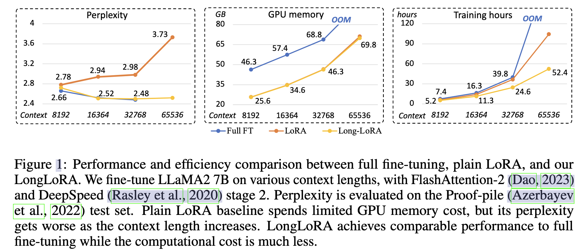

# [2023.09.21] LongLoRA: Efficient Fine-Tuning of Long-Context Large Language Models

code: https://github.com/dvlab-research/LongLoRA

## Abstract

我们提出了 LongLoRA，一种有效的微调方法，以有限的计算成本扩展预训练的大型语言模型 (llm) 的上下文大小。通常，训练具有长上下文大小的 llm 在计算上是昂贵的，需要大量的训练时间和GPU资源。例如，在上下文长度为 8192 的情况下进行训练，自注意力层的计算成本是在上下文长度为 2048 的情况下的 16 倍。本文从两个方面加快 LLM 的语境扩展。一方面，虽然在推理过程中需要密集的全局关注，但通过稀疏的局部关注可以有效地对模型进行微调。提出的转移短注意力 ($S^2-Attn$) 有效地支持上下文扩展，从而节省了大量计算，性能与使用普通注意力进行微调相似。特别是，它可以在训练中仅用两行代码实现，而在推理中是可选的。另一方面，我们重新审视了上下文扩展的参数有效微调机制。值得注意的是，我们发现 LoRA 在可训练的嵌入和规范化的前提下可以很好地进行上下文扩展。LongLoRA 在 LLaMA2 模型从 7B/13B 到 70B 的各种任务上证明了强有力的实证结果。LongLoRA 在单个 8 $\times$ A100 机器上采用 LLaMA2 7B 从 4k 上下文到 100k，或 LLaMA2 70B 到32k。LongLoRA 扩展了模型的上下文，同时保留了它们原来的架构，并且与大多数现有技术兼容，比如FlashAttention-2。此外，为了使 LongLoRA 实用，我们收集了一个数据集 LongQA，用于监督微调。它包含超过 3k 长的上下文问答对。

## Introduction

大型语言模型 (LLMs) 通常使用预定义的上下文大小进行训练，例如 LLaMA 的 2048 个 tokens (Touvron等人，2023a) 和 LLaMA2 的 4096 个标记(Touvron等人，2023b)。

然而，在许多应用程序中，预定义的大小限制了 LLMs，比如总结长文档或回答长问题。为了解决这一限制，最近的一些研究 (Chen et al.，2023;Tworkowski et al.， 2023;Mohtashami & Jaggi, 2023) 训练或微调 LLM 以适应更长的上下文。然而，从头开始训练具有长序列的 LLM 会带来计算挑战，并且对现有预训练的 LLM 进行微调也相当昂贵。例如，Position Interpolation (Chen et al.， 2023)使用 32 个 A100 gpu 将 LLaMA 模型从 2k 上下文扩展到 8k 上下文，使用 128 个 A100 gpu 进行更长的上下文微调。FOT (Tworkowski et al.， 2023)使用 32 个 tpu 进行标准 Transformer 培训，使用 128 个 tpu 进行 LongLLaMA 培训。这些计算资源对于普通研究人员来说通常是负担不起的，这自然会导致我们的问题：我们能否有效地扩展 LLMs 的上下文窗口?
