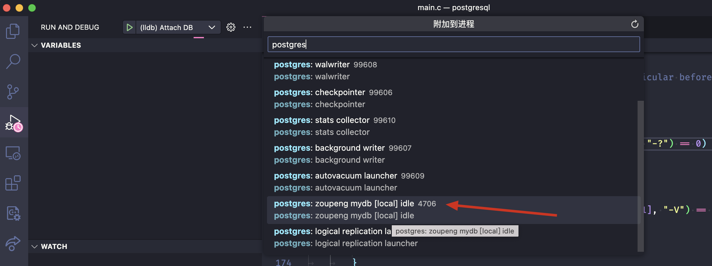
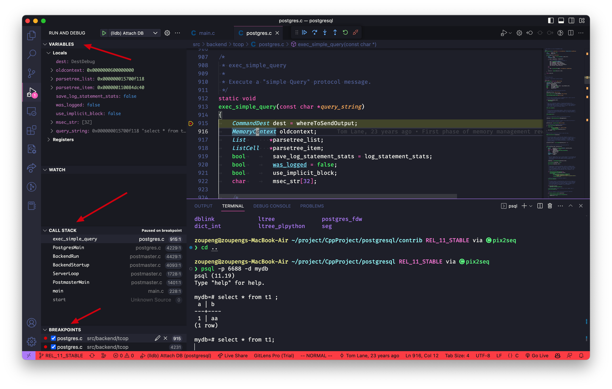

# PostgreSQL 编译安装与 VSCode 调试

## 源码编译安装

**1. 下载源码**

```shell
git clone https://github.com/postgres/postgres.git
```

**2. 切换到 PostgreSQL11 分支**

```shell
cd postgres
git checkout REL_11_STABLE && git pull
```

**3. 编译安装**

configure 配置编译选项：
- **prefix**: Postgres 将被安装的文件夹
- CFLAGS
  - -O0: 禁用优化
  - -g: 生成调试符号

```shell
./configure -help

# Debug 版
./configure --prefix=/Users/zoupeng/postgres/pg11 --enable-debug --enable-cassert CFLAGS="-ggdb -O0 -g3 -Wall -fno-omit-frame-pointer -fstack-protector-strong"
# or
# Release 版
./configure --prefix=/Users/zoupeng/postgres/pg11 --enable-debug --enable-cassert CFLAGS="-g -O2 -Wall -fno-omit-frame-pointer -fstack-protector-strong"

make && make install

# 安装一些有用的工具
cd contrib && make all && make install
```

**4. 设置环境变量**

```shell
export PATH="/Users/zoupeng/postgres/pg11/bin:$PATH"
export LD_LIBRARY_PATH="/Users/zoupeng/postgres/pg11/lib:$LD_LIBRARY_PATH"
export PGHOME="/Users/zoupeng/postgres/pg11"
export PGDATA="/Users/zoupeng/postgres/pgdata"
```

## 初始化数据库

1. 使用 initdb 为数据库初始化一个 PGDATA 文件夹。
```shell
initdb -D $PGDATA
```

2. 参数文件修改 `$PGDATA/postgresql.conf`
```conf
# $PGDATA/postgresql.conf 文件末尾添加如下配置

max_connections = 100
max_wal_senders = 10
max_replication_slots = 10
max_worker_processes = 10
shared_preload_libraries = 'pg_stat_statements'
listen_addresses = '*'
port = 6688

logging_collector = on
log_directory = 'log'
log_filename = 'postgresql-%a.log'
log_truncate_on_rotation = on
log_rotation_age = 1d
log_rotation_size = 0
log_checkpoints = on
log_connections = on
log_disconnections = on
log_error_verbosity = verbose
log_line_prefix = '%m [%p] '
log_timezone = 'PRC'
log_autovacuum_min_duration = 0
```

3. 数据库启动停止
```shell
pg_ctl -D $PGDATA -l $PGDATA/logfile1 start
pg_ctl -D $PGDATA -l $PGDATA/logfile1 stop
```

## PG 常用命令

```shell
ls -al $PGHOME/bin

createdb -p 6688 ${database_name} # 创建数据库

psql -p 6688 -d ${database_name}  # 连接数据库
# 连接成功后可执行数据库基本操作
# CREATE TABLE t1(a int, b text);
# INSERT INTO t1 VALUES(1, 'aa');
# SELECT * FROM t1;


pg_config # 获取已安装的 PostgreSQL 版本信息

pg_ctl --help # 初始化、启动、停止或控制 PostgreSQL 服务器

pg_dump --help # 将 PostgreSQL 数据库导出为脚本文件或其他归档文件
pg_dump -p 6688 -d ${database_name} -t ${table_name} -f ${output_sql_name}
cat ${output_sql_name}

pg_controldata # 显示 PostgreSQL 数据库集群的控制信息
```

psql 连接数据库成功之后所有的命令都是使用 "\\" + 字符
```
\?    所有命令帮助
\l    列出所有数据库
\di   列出连接数据库中所有 index
\dv   列出连接数据库中所有view
\h    sql 命令帮助
\dt   列出连接数据库中所有表
\d    \d 后面什么都不带，将列出当前数据库中的所有表。\d 后面跟一个表名，表示显示这个表的结构定义
\q    退出连接
\c [database_name] 切换到指定数据库，相当于 use
\c    显示当前数据库名称和用户
\conninfo 显示客户端的连接信息
\du   显示所有用户
select version(); 获取版本信息
```

## VSCode 调试 Postgres

1. 在 VS Code 中打开 Postgres 源代码并创建一个 `.vscode/launch.json` 文件。

2. 添加启动配置 attach postgres 进程
```json
{
 // Use IntelliSense to learn about possible attributes.
 // Hover to view descriptions of existing attributes.
 // For more information, visit: https://go.microsoft.com/fwlink/?linkid=830387
 "version": "0.2.0",
 "configurations": [
     {
         "name": "(lldb) Attach DB",
         "type": "cppdbg",
         "request": "attach",
         "program": "${env:PGHOME}/bin/postgres",
         "MIMode": "lldb",
         "targetArchitecture": "arm64"
     },
 ]
}
```

对于 M1 Macs，targetArchitecture 设置为 arm64。程序必须指向我们安装目录下 bin/ 中的 postgres 二进制文件。

3. 在任何函数中创建一个断点，例如 `src/backend/tcop/postgres.c` 中的 `exec_simple_query`，这是查询执行开始的地方。

4. 通过终端登录到数据库并使用 psql 命令查找 postgres 后台进程 ID，启动 VSCode 调试程序。
```
psql -p 6688 -d mydb
select pg_backend_pid();
```
`pg_backend_pid()` 是一个系统函数，用于返回当前连接的 PostgreSQL 后端进程 ID。

也可以在 VSCode 中启用调试程序，搜索 postgres 进程，然后选择 Attach。如下图，进程 ID 为 4706，名称为 `postgres: zoupeng mydb [local] idle`。



5. 启动调试程序后，如下图所示可以查看程序变量、调用栈、断点等信息。


