# VSCode 远程开发不完全指南

[toc]

## 远程连接

- 安装 `Remote - SSH` 插件

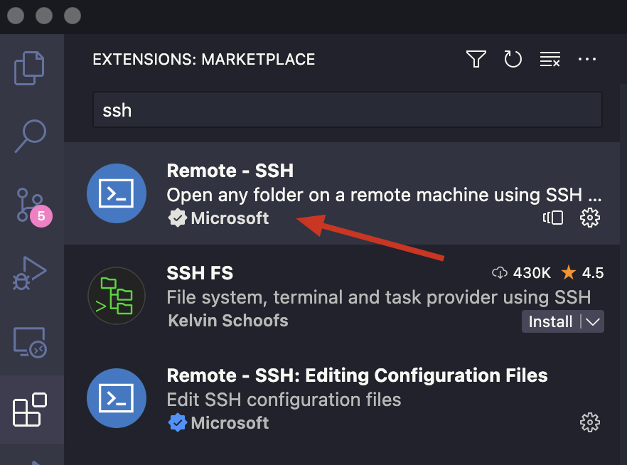

- 打开命令面板 `Ctrl/Command + Shift + P`，输入 `>Remote-SSH: Connect to Host...`，选择 `Add New SSH Host...`，输入远程机器的 IP 地址。
- 或者直接在编辑器界面操作：

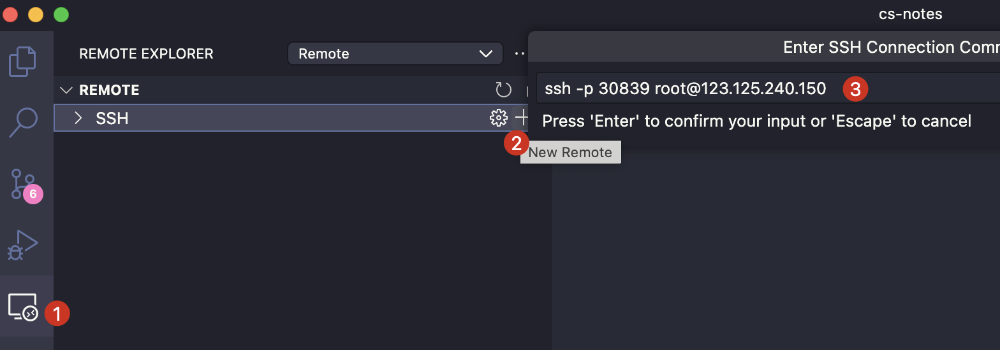

- 连接成功后，可以修改本地 `~/.ssh/config` 配置文件，添加远程机器别名，方便连接。

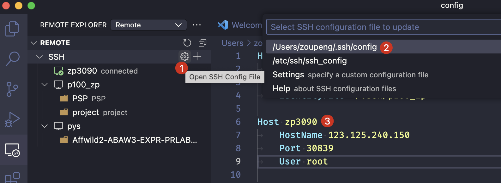

- 连接成功后，可以打开远程机器的文件夹作为工作目录。

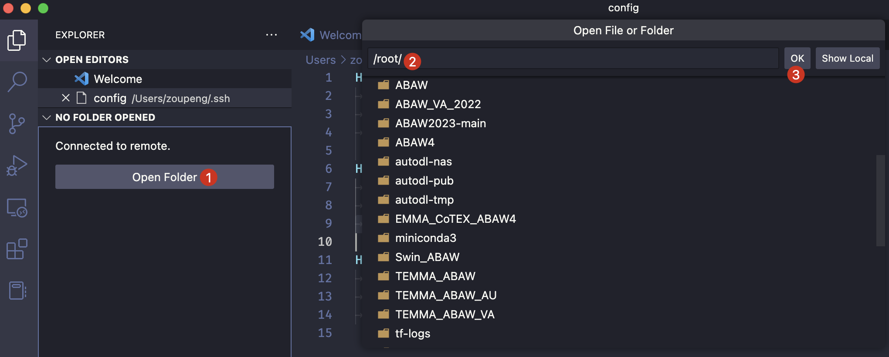

## SSH 配置免密登陆（可选）

避免每次连接都要输入密码

- 本地机器 `cd ~/.ssh`
- 本地机器 `ssh-keygen -t rsa` 生成公私钥对 (生成时输入可以输入别名，例如 `zp3090`)
- 本地机器上传公钥到服务器 `ssh-copy-id -i zp3090.pub -p port username@remote_host`
- ~/.ssh/config 添加 `IdentityFile` 属性
```
Host zp3090
	HostName 123.125.240.150
	Port 30839
	User root
	IdentityFile ~/.ssh/zp3090
```

## 远程开发

### 代码仓库上传到服务器

由于网络原因的限制（服务器无法科学上网），使用 Git 比较慢，所以需要使用 scp 将本地代码仓库或数据集上传到服务器。
- 本地文件夹上传到服务器
```
scp -r path/to/local_directory zp3090:path/to/remote_directory
```
- 服务器文件夹拷贝到本地
```
scp -r zp3090:path/to/remote_directory path/to/local_directory
```

## Python 开发与调试

### 安装插件

- Python (代码补全高亮等)
- Code Runner （代码运行或调试）

### 开发 (略)

安装必要开发环境/依赖包

- pip env
- conda env
- pip install / conda install

### 调试

- 创建调试配置文件`launch.json`

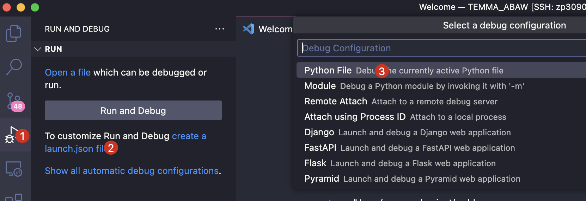

- 修改文件内容
  - `name`: 调试配置名称
  - `program`: 参数可以指定文件名，例如 `main.py`
  - `justMyCode`: 是否只调试自己的代码，如果是第三方库的代码，可以设置为 `false`，方便调试别人写的库，可以给别人的库修改 bug 并提交 PR，例如：[openmmlab mmclassification #1271](https://github.com/open-mmlab/mmclassification/pull/1271)

```json
// launch.json
{
    // Use IntelliSense to learn about possible attributes.
    // Hover to view descriptions of existing attributes.
    // For more information, visit: https://go.microsoft.com/fwlink/?linkid=830387
    "version": "0.2.0",
    "configurations": [
        {
            "name": "Python: Current File",
            "type": "python",
            "request": "launch",
            "program": "main.py",
            "console": "integratedTerminal",
            "justMyCode": false
        }
    ]
}
```
- 点击调试按钮即可开始调试
  - Continue: 继续执行到下一个断点处
  - Step Over: 执行下一行代码（不进入函数）
  - Step Into: 执行下一行代码（进入函数）
  - Step Out: 执行完当前函数，返回上一层函数
  - Restart: 重新开始调试
  - Stop: 停止调试

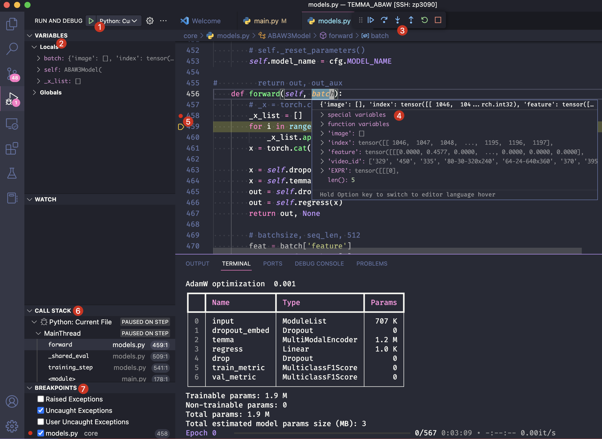

#### 一些调试建议

##### 程序运行时参数

有些程序需要设置运行时参数，比如 `python3 main.py --arg1 value1 --arg2 value2 ... `

为了方便调试，有两种方式可以处理:
- 可以在 `.vscode/launch.json` 中设置 `args` 参数，例如：

```json
{
    "name": "Python: Current File",
    "type": "python",
    "request": "launch",
    "program": "main.py",
    "console": "integratedTerminal",
    "justMyCode": false,
    "args": [
        "--arg1", "value1",
        "--arg2", "value2",
        ...
    ]
}
```
- 可以在命令行参数解析器中为参数指定默认值
```python
parser = argparse.ArgumentParser('...')
parser.add_argument('--arg1', type=str, default='value1', help='...')
parser.add_argument('--arg2', type=str, default='value2', help='...')
```

##### num_worker=0

通常在训练代码时，我们会设置 Data_loader 的 num_worker 数量为 8 (cpu 核心数)，这样可以加快数据加载速度，但是在调试时，如果设置为 8，可能会出现断点跳转奇怪的问题 (断点打进 `__getitem__`)，因为断点调试不适用于多线程环境，所以建议在调试时，将 num_worker 设置为 0，也就是只使用主线程，即不使用多线程加载数据。
```python
data_loader = torch.utils.data.DataLoader(dataset, batch_size=2, shuffle=False, num_workers=0)
```

##### 指定 device

指定第几张 GPU 卡

```python
device = torch.device('cuda:1' if torch.cuda.is_available() else 'cpu')
```

##### 创建较小的数据集调试

基于大数据集构建一个较小的数据集，用于调试，可以加快调试速度，减少数据读取等待时间。
- 设置较小的 batch_size
- shuffle = False

##### 稳定复现结果

```python
def seed_everything(seed):
    random.seed(seed)
    np.random.seed(seed)
    torch.manual_seed(seed)
    torch.cuda.manual_seed_all(seed)
```

## Linux 环境下一些有用的工具

### zsh (略)

[命令行补全强化、美化](/tools/zsh-config.md)

### tldr

tldr 是一个命令行工具，可以用来查看命令的使用方法，比如 `tldr scp` 可以查看 `scp` 命令的使用方法。

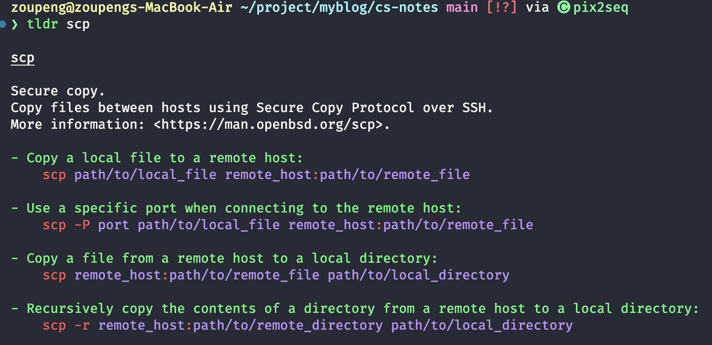

### screen

screen 是一个命令行工具，可以用来在后台运行程序，即使关闭了 ssh 连接，程序也不会停止运行。

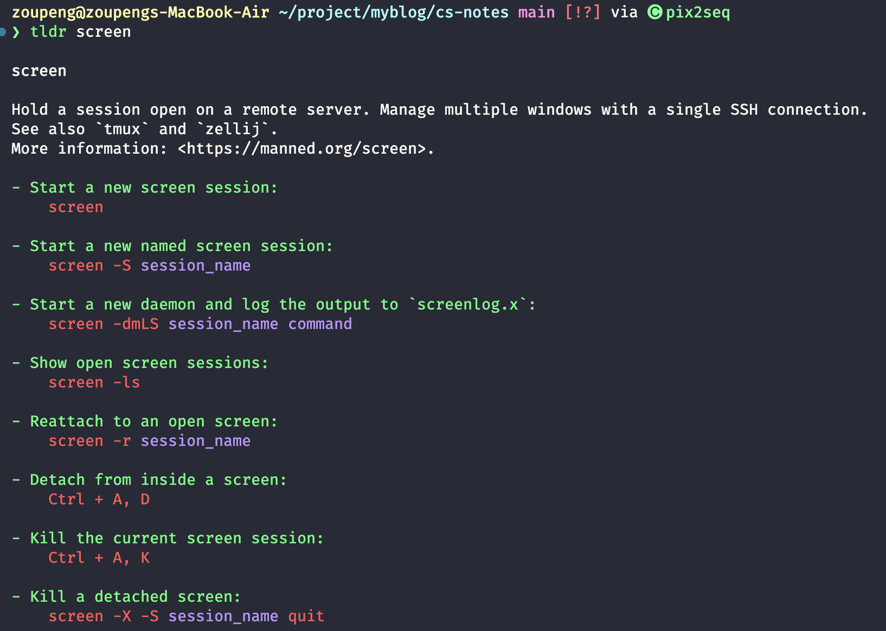

### htop, nvidia-smi

- htop 是一个命令行工具，可以用来查看系统的使用情况。（检查是否充分使用 cpu 性能、内存占用情况）
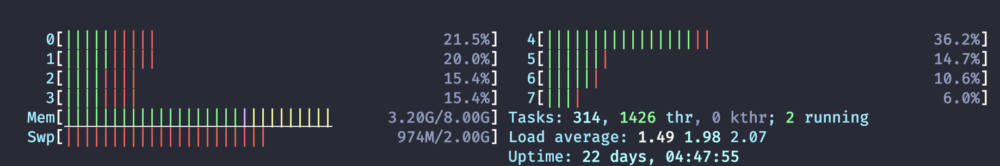
- nvidia-smi 是一个命令行工具，可以用来查看 GPU 的使用情况。（功耗，显存占用情况）
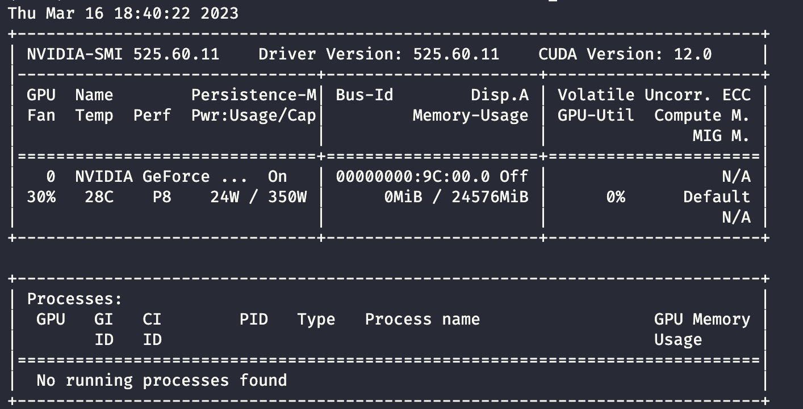

### ps

ps 是一个命令行工具，可以用来查看进程的使用情况。如果退出了 ssh，重新启动可以检查一些程序是否还在运行。

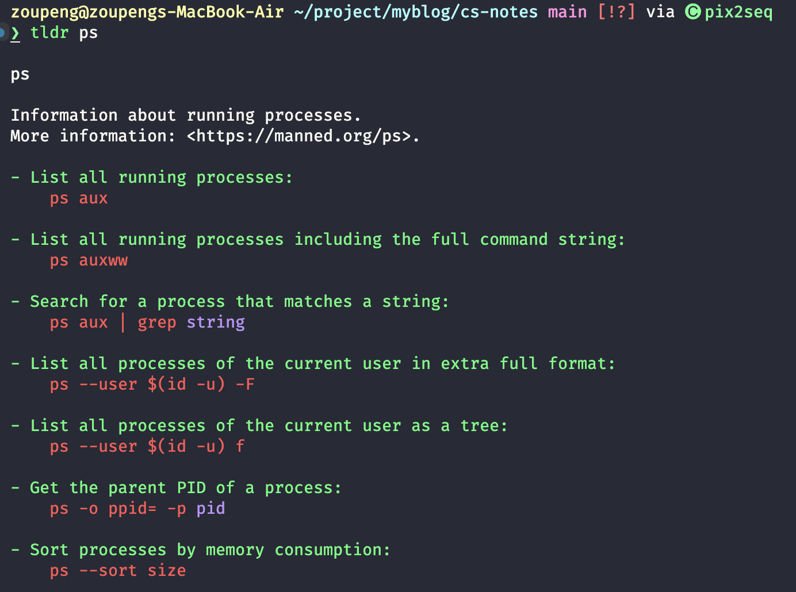
