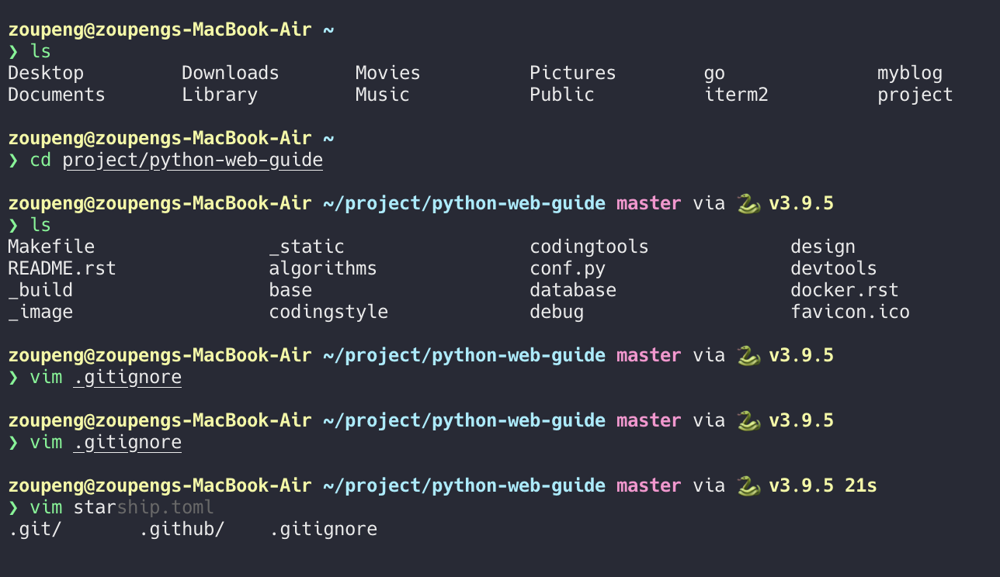
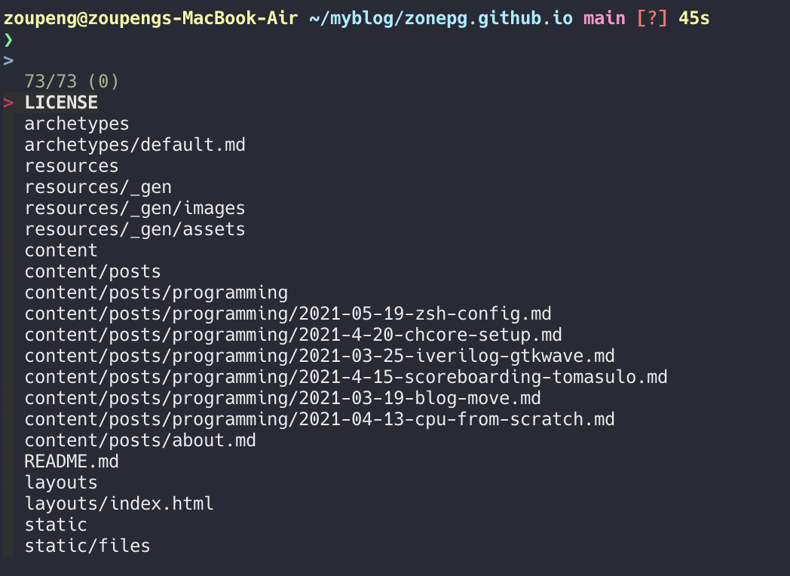

之前有过在 ubuntu 折腾 zsh 的经历，使用 oh-my-zsh，这种比较笨重的框架用起来有点卡卡的，遂明确自己的需求，自己动手找了解决方案。

自己的需求是一个轻量、快速、美观的 shell，功能包括以下：
- 支持 vim
- 配色优雅、好看
- 展示 git 分支信息
- 补全、提示
- 搜索

将 zsh 稍加配置，最终效果如下：



## vim 支持
在 `.zshrc` 中加入以下配置，可以让你的 zsh 支持vim，这里同时使光标在不同编辑模式下显示不用效果，以及 tab 切换补全。
```zsh
# Basic auto/tab complete:
autoload -U compinit
zstyle ':completion:*' menu select
zmodload zsh/complist
compinit
_comp_options+=(globdots)		# Include hidden files.

# vi mode
bindkey -v
export KEYTIMEOUT=1

# Use vim keys in tab complete menu:
bindkey -M menuselect 'h' vi-backward-char
bindkey -M menuselect 'k' vi-up-line-or-history
bindkey -M menuselect 'l' vi-forward-char
bindkey -M menuselect 'j' vi-down-line-or-history

# Change cursor shape for different vi modes.
function zle-keymap-select {
  if [[ ${KEYMAP} == vicmd ]] ||
     [[ $1 = 'block' ]]; then
    echo -ne '\e[1 q'
  elif [[ ${KEYMAP} == main ]] ||
       [[ ${KEYMAP} == viins ]] ||
       [[ ${KEYMAP} = '' ]] ||
       [[ $1 = 'beam' ]]; then
    echo -ne '\e[5 q'
  fi
}
zle -N zle-keymap-select
zle-line-init() {
    zle -K viins # initiate `vi insert` as keymap (can be removed if `bindkey -V` has been set elsewhere)
    echo -ne "\e[5 q"
}
zle -N zle-line-init
echo -ne '\e[5 q' # Use beam shape cursor on startup.
preexec() { echo -ne '\e[5 q' ;} # Use beam shape cursor for each new prompt.
```

## 工具
### zinit
使用 [zinit](https://github.com/zdharma/zinit) 作为插件管理工具，用法简单，且快。
根据官方 wiki 安装好后，我们的需求是 **高亮/补全/提示**，安装以下三个插件。
```
zinit light zsh-users/zsh-completions
zinit light zsh-users/zsh-autosuggestions
zinit light zsh-users/zsh-syntax-highlighting
```

### starship
我们使用[startship](https://starship.rs/)配置主题，可以感受以下它官网主页的介绍：
> The minimal, blazing-fast, and infinitely customizable prompt for any shell!

这是我的`.config/starship.toml`配置文件：
```
add_newline = true

[directory]
truncation_length = 0
truncate_to_repo = false

[git_branch]
format = "[$branch]($style) "
# format = "[$symbol$branch]($style) "

[golang]
format = "[$symbol()]($style)"

[python]
python_binary = "python3"

[cmd_duration]
format = "[$duration]($style) "
min_time = 3_000

[character]
success_symbol = "[❯](bold green)"
error_symbol = "[✗](bold red)"
vicmd_symbol = "[V](bold blue)"

[username]
style_user = "yellow bold"
style_root = "black bold"
format = "[$user@]($style)"
disabled = false
show_always = true

[hostname]
ssh_only = false
format =  "[$hostname](bold yellow) "
disabled = false

[package]
disabled = true

[gcloud]
disabled = true

[aws]
disabled = true
```
现在 zsh 就能达到上面的效果了。

### fzf
再加入 fzf 搜索支持，包括文件搜索，文件夹切换，历史命令搜索。
```zsh
brew install fzf

# To install useful key bindings and fuzzy completion:
$(brew --prefix)/opt/fzf/install

brew install ripgrep

brew install --HEAD universal-ctags/universal-ctags/universal-ctags

brew install the_silver_searcher

brew install fd
```
安装后，需要将`key-bindings.zsh`与`completion.zsh`加入`.zshrc`
mac下的option键与普通键盘alt键不太一样，windows下 alt+c 键是 \<M-c>，需要去`key-bindings.zsh`中修改键位绑定`option-c`即`ç`。
这是我的路径：
```
/opt/homebrew/opt/fzf/shell/completion.zsh
/opt/homebrew/opt/fzf/shell/key-bindings.zsh
```
使用`ctrl-r`, `ctrl-t`, `option-c` 即可使用命令搜索、文件搜索、文件夹切换。`ctrl-n`, `ctrl-p`进行选择。


我的最终配置在我的 [github仓库](https://github.com/ZonePG/dotfiles/tree/main/zsh) 中


## Reference
- [不优化，zsh 也超快](https://shuxiao.wang/posts/zsh-refresh/)
- [Integrate Neovim with FZF & more](https://www.chrisatmachine.com/Neovim/08-fzf/)
