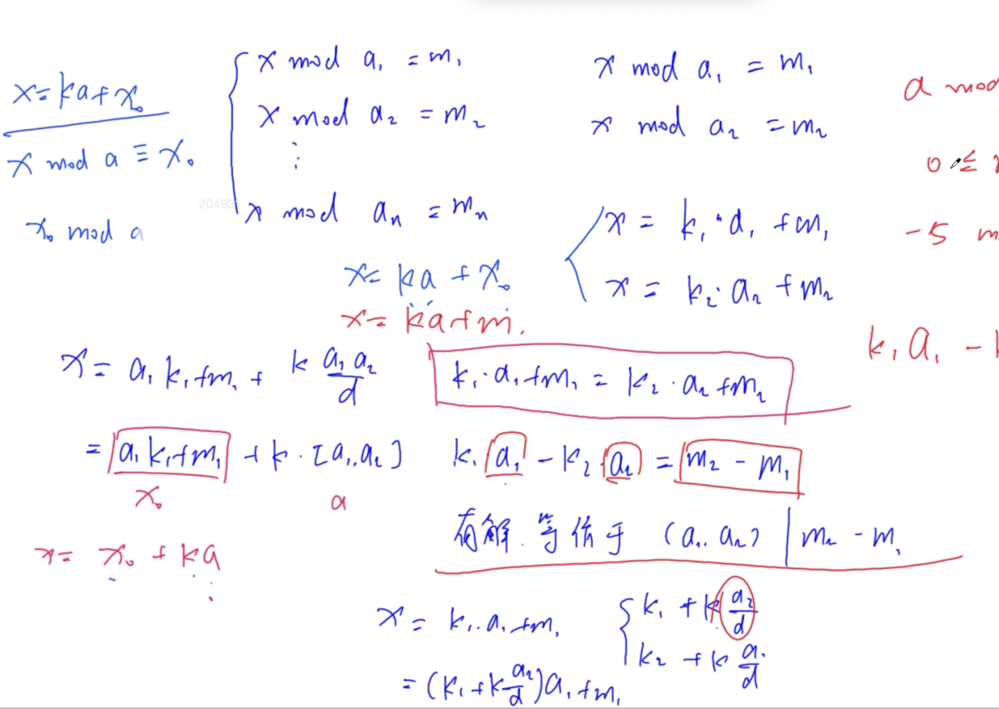

# AcWing 算法模版

## 1. 基础算法

### 快速排序

L--x------R

- 确定分界点 x：q[L], q[(L+R)/2], q[R], 随机取点
- **调整区间**：|---<=x---||--->=x---|
  - 额外数组
    - a[] b[]
    - q[L~R]: q[i] <= x 的部分放到 a 数组，q[i] > x 的部分放到 b 数组
    - 将 a 数组和 b 数组复制到 q 数组中。
  - 双指针
    - i, j 分别从数组两段开始走，直到相遇，q[i] >= x, q[j] <= x 停下并交换，再继续走。
    - i 指针前面所有的数 <= x
    - j 指针后面所有的数 >= x
- 递归处理左右两段

快排是不稳定排序，若想稳定，可以双关键字排序，<q[i], i>

- [AcWing 785. 快速排序](https://www.acwing.com/problem/content/787/)
- [AcWing 786. 第k个数](https://www.acwing.com/problem/content/788/)
```c++
void quick_sort(int q[], int l, int r)
{
    if (l >= r) return;

    int i = l - 1, j = r + 1, x = q[l + r >> 1];
    while (i < j)
    {
        do i ++ ; while (q[i] < x);
        do j -- ; while (q[j] > x);
        if (i < j) swap(q[i], q[j]);
    }
    quick_sort(q, l, j), quick_sort(q, j + 1, r);
}
```

### 归并排序

|--left--|--right--|

- 确定分界点：mid = (left + right) / 2
- 递归排序 left、right
- **归并** —— 合二为一

归并排序是稳定排序。复杂度O(nlogn)。

- [AcWing 787. 归并排序](https://www.acwing.com/problem/content/789/)
- [AcWing 788. 逆序对的数量](https://www.acwing.com/problem/content/790/)
```c++
void merge_sort(int q[], int l, int r)
{
    if (l >= r) return;

    int mid = l + r >> 1;
    merge_sort(q, l, mid);
    merge_sort(q, mid + 1, r);

    int k = 0, i = l, j = mid + 1;
    while (i <= mid && j <= r)
        if (q[i] <= q[j]) tmp[k ++ ] = q[i ++ ];
        else tmp[k ++ ] = q[j ++ ];

    while (i <= mid) tmp[k ++ ] = q[i ++ ];
    while (j <= r) tmp[k ++ ] = q[j ++ ];

    for (i = l, j = 0; i <= r; i ++, j ++ ) q[i] = tmp[j];
}
```

### 二分

#### 整数二分

二分是将区间一分为二，一半满足性质，一半不满足性质

- [AcWing 789. 数的范围](https://www.acwing.com/problem/content/791/)
```c++
bool check(int x) {/* ... */} // 检查x是否满足某种性质

// 区间[l, r]被划分成[l, mid]和[mid + 1, r]时使用：
int bsearch_1(int l, int r)
{
    while (l < r)
    {
        int mid = l + r >> 1;
        if (check(mid)) r = mid;    // check()判断mid是否满足性质
        else l = mid + 1;
    }
    return l;
}
// 区间[l, r]被划分成[l, mid - 1]和[mid, r]时使用：
int bsearch_2(int l, int r)
{
    while (l < r)
    {
        int mid = l + r + 1 >> 1;
        if (check(mid)) l = mid;
        else r = mid - 1;
    }
    return l;
}
```

#### 浮点数二分

- [AcWing 790. 数的三次方根](https://www.acwing.com/problem/content/792/)
```c++
bool check(double x) {/* ... */} // 检查x是否满足某种性质

double bsearch_3(double l, double r)
{
    const double eps = 1e-6;   // eps 表示精度，取决于题目对精度的要求
    while (l + eps < r)
    {
        double mid = (l + r) / 2;
        if (check(mid)) r = mid;
        else l = mid;
    }
    return l;
}
```

### 高精度

#### 高精度加法

- [AcWing 791. 高精度加法](https://www.acwing.com/problem/content/793/)
```c++
// C = A + B, A >= 0, B >= 0
vector<int> add(vector<int> &A, vector<int> &B)
{
    if (A.size() < B.size()) return add(B, A);

    vector<int> C;
    int t = 0;
    for (int i = 0; i < A.size(); i ++ )
    {
        t += A[i];
        if (i < B.size()) t += B[i];
        C.push_back(t % 10);
        t /= 10;
    }

    if (t) C.push_back(t);
    return C;
}
```

#### 高精度减法

- [AcWing 792. 高精度减法](https://www.acwing.com/problem/content/794/)
```c++
// C = A - B, 满足A >= B, A >= 0, B >= 0
vector<int> sub(vector<int> &A, vector<int> &B)
{
    vector<int> C;
    for (int i = 0, t = 0; i < A.size(); i ++ )
    {
        t = A[i] - t;
        if (i < B.size()) t -= B[i];
        C.push_back((t + 10) % 10);
        if (t < 0) t = 1;
        else t = 0;
    }

    while (C.size() > 1 && C.back() == 0) C.pop_back();
    return C;
}
```

#### 高精度乘低精度

- [AcWing 793. 高精度乘法](https://www.acwing.com/problem/content/795/)
```c++
// C = A * b, A >= 0, b >= 0
vector<int> mul(vector<int> &A, int b)
{
    vector<int> C;

    int t = 0;
    for (int i = 0; i < A.size() || t; i ++ )
    {
        if (i < A.size()) t += A[i] * b;
        C.push_back(t % 10);
        t /= 10;
    }

    while (C.size() > 1 && C.back() == 0) C.pop_back();

    return C;
}
```

#### 高精度除以低精度

- [AcWing 794. 高精度除法](https://www.acwing.com/problem/content/796/)
```c++
// A / b = C ... r, A >= 0, b > 0
vector<int> div(vector<int> &A, int b, int &r)
{
    vector<int> C;
    r = 0;
    for (int i = A.size() - 1; i >= 0; i -- )
    {
        r = r * 10 + A[i];
        C.push_back(r / b);
        r %= b;
    }
    reverse(C.begin(), C.end());
    while (C.size() > 1 && C.back() == 0) C.pop_back();
    return C;
}
```

### 前缀和与差分

#### 一维前缀和

- [AcWing 795. 前缀和](https://www.acwing.com/problem/content/797/)
```c++
S[i] = a[1] + a[2] + ... a[i]
a[l] + ... + a[r] = S[r] - S[l - 1]
```

#### 二维前缀和

- [AcWing 796. 子矩阵的和](https://www.acwing.com/problem/content/798/)
```c++
S[i, j] = 第i行j列格子左上部分所有元素的和
以(x1, y1)为左上角，(x2, y2)为右下角的子矩阵的和为：
S[x2, y2] - S[x1 - 1, y2] - S[x2, y1 - 1] + S[x1 - 1, y1 - 1]
```

#### 一维差分

- [AcWing 797. 差分](https://www.acwing.com/problem/content/799/)
```c++
给区间[l, r]中的每个数加上c：B[l] += c, B[r + 1] -= c
```

#### 二维差分

- [AcWing 798. 差分矩阵](https://www.acwing.com/problem/content/800/)
```c++
给以(x1, y1)为左上角，(x2, y2)为右下角的子矩阵中的所有元素加上c：
S[x1, y1] += c, S[x2 + 1, y1] -= c, S[x1, y2 + 1] -= c, S[x2 + 1, y2 + 1] += c
```

### 双指针算法

- [AcWing 799. 最长连续不重复子序列](https://www.acwing.com/problem/content/801/)
- [AcWing 800. 数组元素的目标和](https://www.acwing.com/problem/content/802/)
- [AcWing 2816. 判断子序列](https://www.acwing.com/problem/content/2818/)
```c++
for (int i = 0, j = 0; i < n; i ++ )
{
    while (j < i && check(i, j)) j ++ ;

    // 具体问题的逻辑
}
常见问题分类：
    (1) 对于一个序列，用两个指针维护一段区间
    (2) 对于两个序列，维护某种次序，比如归并排序中合并两个有序序列的操作
```


### 位运算

- [AcWing 801. 二进制中1的个数](https://www.acwing.com/problem/content/803/)
```c++
求n的第k位数字: n >> k & 1
返回n的最后一位1：lowbit(n) = n & -n
```

### 离散化

- [AcWing 802. 区间和](https://www.acwing.com/problem/content/804/)
```c++
vector<int> alls; // 存储所有待离散化的值
sort(alls.begin(), alls.end()); // 将所有值排序
alls.erase(unique(alls.begin(), alls.end()), alls.end());   // 去掉重复元素

// 二分求出x对应的离散化的值
int find(int x) // 找到第一个大于等于x的位置
{
    int l = 0, r = alls.size() - 1;
    while (l < r)
    {
        int mid = l + r >> 1;
        if (alls[mid] >= x) r = mid;
        else l = mid + 1;
    }
    return r + 1; // 映射到1, 2, ...n
}
```

### 区间合并

- [AcWing 803. 区间合并](https://www.acwing.com/problem/content/805/)
```c++
// 将所有存在交集的区间合并
void merge(vector<PII> &segs)
{
    vector<PII> res;

    sort(segs.begin(), segs.end());

    int st = -2e9, ed = -2e9;
    for (auto seg : segs)
        if (ed < seg.first)
        {
            if (st != -2e9) res.push_back({st, ed});
            st = seg.first, ed = seg.second;
        }
        else ed = max(ed, seg.second);

    if (st != -2e9) res.push_back({st, ed});

    segs = res;
}
```

## 2. 数据结构

### 单链表

- [AcWing 826. 单链表](https://www.acwing.com/blog/content/404/)
```c++
// head存储链表头，e[]存储节点的值，ne[]存储节点的next指针，idx表示当前用到了哪个节点
int head, e[N], ne[N], idx;

// 初始化
void init()
{
    head = -1;
    idx = 0;
}

// 在链表头插入一个数a
void insert(int a)
{
    e[idx] = a, ne[idx] = head, head = idx ++ ;
}

// 将头结点删除，需要保证头结点存在
void remove()
{
    head = ne[head];
}
```

### 双链表

- [AcWing 827. 双链表](https://www.acwing.com/activity/content/problem/content/864/)
```c++
// e[]表示节点的值，l[]表示节点的左指针，r[]表示节点的右指针，idx表示当前用到了哪个节点
int e[N], l[N], r[N], idx;

// 初始化
void init()
{
    //0是左端点，1是右端点
    r[0] = 1, l[1] = 0;
    idx = 2;
}

// 在节点a的右边插入一个数x
void insert(int a, int x)
{
    e[idx] = x;
    l[idx] = a, r[idx] = r[a];
    l[r[a]] = idx, r[a] = idx ++ ;
}

// 删除节点a
void remove(int a)
{
    l[r[a]] = l[a];
    r[l[a]] = r[a];
}
```

### 栈

- [AcWing 828. 模拟栈](https://www.acwing.com/problem/content/830/)
- [AcWing 3302. 表达式求值](https://www.acwing.com/problem/content/3305/)
```c++
// tt表示栈顶
int stk[N], tt = 0;

// 向栈顶插入一个数
stk[ ++ tt] = x;

// 从栈顶弹出一个数
tt -- ;

// 栈顶的值
stk[tt];

// 判断栈是否为空
if (tt > 0)
{

}
```

### 单调栈

- [AcWing 830. 单调栈](https://www.acwing.com/problem/content/832/)
```c++
常见模型：找出每个数左边离它最近的比它大/小的数
int tt = 0;
for (int i = 1; i <= n; i ++ )
{
    while (tt && check(stk[tt], i)) tt -- ;
    stk[ ++ tt] = i;
}
```

### 队列

- [AcWing 829. 模拟队列](https://www.acwing.com/blog/content/404/)

**普通队列**
```c++
// hh 表示队头，tt表示队尾
int q[N], hh = 0, tt = -1;

// 向队尾插入一个数
q[ ++ tt] = x;

// 从队头弹出一个数
hh ++ ;

// 队头的值
q[hh];

// 判断队列是否为空
if (hh <= tt)
{

}
```

**循环队列**
```c++
// hh 表示队头，tt表示队尾的后一个位置
int q[N], hh = 0, tt = 0;

// 向队尾插入一个数
q[tt ++ ] = x;
if (tt == N) tt = 0;

// 从队头弹出一个数
hh ++ ;
if (hh == N) hh = 0;

// 队头的值
q[hh];

// 判断队列是否为空
if (hh != tt)
{

}
```

**单调队列**

- [AcWing 154. 滑动窗口](https://www.acwing.com/problem/content/156/)
```c++
常见模型：找出滑动窗口中的最大值/最小值
int hh = 0, tt = -1;
for (int i = 0; i < n; i ++ )
{
    while (hh <= tt && check_out(q[hh])) hh ++ ;  // 判断队头是否滑出窗口
    while (hh <= tt && check(q[tt], i)) tt -- ;
    q[ ++ tt] = i;
}
```

### KMP

- [AcWing 831. KMP字符串](https://www.acwing.com/problem/content/833/)
```c++
// s[]是长文本，p[]是模式串，n是s的长度，m是p的长度
求模式串的Next数组：
for (int i = 2, j = 0; i <= m; i ++ )
{
    while (j && p[i] != p[j + 1]) j = ne[j];
    if (p[i] == p[j + 1]) j ++ ;
    ne[i] = j;
}

// 匹配
for (int i = 1, j = 0; i <= n; i ++ )
{
    while (j && s[i] != p[j + 1]) j = ne[j];
    if (s[i] == p[j + 1]) j ++ ;
    if (j == m)
    {
        j = ne[j];
        // 匹配成功后的逻辑
    }
}
```

- [leetcode 28. 找出字符串中第一个匹配项的下标](https://leetcode.cn/problems/find-the-index-of-the-first-occurrence-in-a-string/description/)
```c++
class Solution {
public:
    int strStr(string haystack, string needle) {
        int m = haystack.size(), n = needle.size();
        string s = " " + haystack, p = " " + needle;
        int ans = -1;
        vector<int> next(n + 1);
        for (int i = 2, j = 0; i <= n; i++) {
            while (j && p[i] != p[j + 1]) {
                j = next[j];
            }
            if (p[i] == p[j + 1]) {
                j++;
            }
            next[i] = j;
        }
        for (int i = 1, j = 0; i <= m; i++) {
            while (j && s[i] != p[j + 1]) {
                j = next[j];
            }
            if (s[i] == p[j + 1]) {
                j++;
            }
            if (j == n) {
                ans = i - j;
                break;
            } 
        }
        return ans;
    }
};
```

- [leetcode 572. 另一棵树的子树](https://leetcode-cn.com/problems/subtree-of-another-tree/)
```c++
class Solution {
    vector<int> s{0};
    vector<int> p{0};

    void preOrder(TreeNode *node, vector<int> &vec) {
        if (node == nullptr) {
            vec.emplace_back(-1e4 - 1);
            return ;
        }
        vec.emplace_back(node->val);
        preOrder(node->left, vec);
        preOrder(node->right, vec);
    }

public:
    bool isSubtree(TreeNode* root, TreeNode* subRoot) {
        preOrder(root, s);
        preOrder(subRoot, p);
        int ans = -1;
        int n = s.size() - 1, m = p.size() - 1;
        vector<int> next(m + 1, 0);
        for (int i = 2, j = 0; i <= m; i++) {
            while (j && p[i] != p[j + 1]) {
                j = next[j];
            }
            if (p[i] == p[j + 1]) {
                j++;
            }
            next[i] = j;
        }
        for (int i = 1, j = 0; i <= n; i++) {
            while (j && s[i] != p[j + 1]) {
                j = next[j];
            }
            if (s[i] == p[j + 1]) {
                j++;
            }
            if (j == m) {
                return true;
            }
        }
        return false;
    }
};
```

### Trie

- [AcWing 835. Trie字符串统计](https://www.acwing.com/problem/content/837/)
- [AcWing 143. 最大异或对](https://www.acwing.com/problem/content/145/)
```c++
int son[N][26], cnt[N], idx;
// 0号点既是根节点，又是空节点
// son[][]存储树中每个节点的子节点
// cnt[]存储以每个节点结尾的单词数量

// 插入一个字符串
void insert(char *str)
{
    int p = 0;
    for (int i = 0; str[i]; i ++ )
    {
        int u = str[i] - 'a';
        if (!son[p][u]) son[p][u] = ++ idx;
        p = son[p][u];
    }
    cnt[p] ++ ;
}

// 查询字符串出现的次数
int query(char *str)
{
    int p = 0;
    for (int i = 0; str[i]; i ++ )
    {
        int u = str[i] - 'a';
        if (!son[p][u]) return 0;
        p = son[p][u];
    }
    return cnt[p];
}
```

### 并查集

- 将两个集合合并
- 查询两个元素是否在一个集合中

基本原理：每个集合用一棵树来表示。树根的编号就是整个集合的编号。每个节点存储它的父节点，p[x]表示 x 的父节点。

问题1：如何判断树根：if (p[x] == x)

问题2：如何求 x 的集合编号：while (p[x] != x) x = p[x]

问题3：如何合并两个集合：p[x] 是 x 的集合编号，p[y] 是 y 的集合编号。p[x] = y

- [AcWing 836. 合并集合](https://www.acwing.com/problem/content/838/)
- [AcWing 837. 连通块中点的数量](https://www.acwing.com/problem/content/839/)
- [AcWing 240. 食物链](https://www.acwing.com/problem/content/242/)
```c++
(1)朴素并查集：

    int p[N]; //存储每个点的祖宗节点

    // 返回x的祖宗节点
    int find(int x)
    {
        if (p[x] != x) p[x] = find(p[x]);
        return p[x];
    }

    // 初始化，假定节点编号是1~n
    for (int i = 1; i <= n; i ++ ) p[i] = i;

    // 合并a和b所在的两个集合：
    p[find(a)] = find(b);


(2)维护size的并查集：

    int p[N], size[N];
    //p[]存储每个点的祖宗节点, size[]只有祖宗节点的有意义，表示祖宗节点所在集合中的点的数量

    // 返回x的祖宗节点
    int find(int x)
    {
        if (p[x] != x) p[x] = find(p[x]);
        return p[x];
    }

    // 初始化，假定节点编号是1~n
    for (int i = 1; i <= n; i ++ )
    {
        p[i] = i;
        size[i] = 1;
    }

    // 合并a和b所在的两个集合：
    size[find(b)] += size[find(a)];
    p[find(a)] = find(b);


(3)维护到祖宗节点距离的并查集：

    int p[N], d[N];
    //p[]存储每个点的祖宗节点, d[x]存储x到p[x]的距离

    // 返回x的祖宗节点
    int find(int x)
    {
        if (p[x] != x)
        {
            int u = find(p[x]);
            d[x] += d[p[x]];
            p[x] = u;
        }
        return p[x];
    }

    // 初始化，假定节点编号是1~n
    for (int i = 1; i <= n; i ++ )
    {
        p[i] = i;
        d[i] = 0;
    }

    // 合并a和b所在的两个集合：
    p[find(a)] = find(b);
    d[find(a)] = distance; // 根据具体问题，初始化find(a)的偏移量
```

### 堆

如何手写一个堆？
- 插入一个数
- 求集合中的最小值
- 删除最小值
- 删除任意一个元素
- 修改任意一个元素

- [AcWing 838. 堆排序](https://www.acwing.com/problem/content/840/)
- [AcWing 839. 模拟堆](https://www.acwing.com/problem/content/841/)
```c++
// h[N]存储堆中的值, h[1]是堆顶，x的左儿子是2x, 右儿子是2x + 1
// ph[k]存储第k个插入的点在堆中的位置
// hp[k]存储堆中下标是k的点是第几个插入的
int h[N], ph[N], hp[N], size;

// 交换两个点，及其映射关系
void heap_swap(int a, int b)
{
    swap(ph[hp[a]],ph[hp[b]]);
    swap(hp[a], hp[b]);
    swap(h[a], h[b]);
}

void down(int u)
{
    int t = u;
    if (u * 2 <= size && h[u * 2] < h[t]) t = u * 2;
    if (u * 2 + 1 <= size && h[u * 2 + 1] < h[t]) t = u * 2 + 1;
    if (u != t)
    {
        heap_swap(u, t);
        down(t);
    }
}

void up(int u)
{
    while (u / 2 && h[u] < h[u / 2])
    {
        heap_swap(u, u / 2);
        u >>= 1;
    }
}

// O(n)建堆
for (int i = n / 2; i; i -- ) down(i);
```

### 哈希表

#### 一般哈希

- [AcWing 840. 模拟散列表](https://www.acwing.com/problem/content/842/)
```c++
(1) 拉链法
    int h[N], e[N], ne[N], idx;

    // 向哈希表中插入一个数
    void insert(int x)
    {
        int k = (x % N + N) % N;
        e[idx] = x;
        ne[idx] = h[k];
        h[k] = idx ++ ;
    }

    // 在哈希表中查询某个数是否存在
    bool find(int x)
    {
        int k = (x % N + N) % N;
        for (int i = h[k]; i != -1; i = ne[i])
            if (e[i] == x)
                return true;

        return false;
    }

(2) 开放寻址法
    int h[N];

    // 如果x在哈希表中，返回x的下标；如果x不在哈希表中，返回x应该插入的位置
    int find(int x)
    {
        int t = (x % N + N) % N;
        while (h[t] != null && h[t] != x)
        {
            t ++ ;
            if (t == N) t = 0;
        }
        return t;
    }
```

#### 字符串哈希

- [AcWing 841. 字符串哈希](https://www.acwing.com/problem/content/843/)
```c++
核心思想：将字符串看成P进制数，P的经验值是131或13331，取这两个值的冲突概率低
小技巧：取模的数用2^64，这样直接用unsigned long long存储，溢出的结果就是取模的结果

typedef unsigned long long ULL;
ULL h[N], p[N]; // h[k]存储字符串前k个字母的哈希值, p[k]存储 P^k mod 2^64

// 初始化
p[0] = 1;
for (int i = 1; i <= n; i ++ )
{
    h[i] = h[i - 1] * P + str[i];
    p[i] = p[i - 1] * P;
}

// 计算子串 str[l ~ r] 的哈希值
ULL get(int l, int r)
{
    return h[r] - h[l - 1] * p[r - l + 1];
}
```

### C++ STL 简介

```
vector, 变长数组，倍增的思想
    size()  返回元素个数
    empty()  返回是否为空
    clear()  清空
    front()/back()
    push_back()/pop_back()
    begin()/end()
    []
    支持比较运算，按字典序

pair<int, int>
    first, 第一个元素
    second, 第二个元素
    支持比较运算，以first为第一关键字，以second为第二关键字（字典序）

string，字符串
    size()/length()  返回字符串长度
    empty()
    clear()
    substr(起始下标，(子串长度))  返回子串
    c_str()  返回字符串所在字符数组的起始地址

queue, 队列
    size()
    empty()
    push()  向队尾插入一个元素
    front()  返回队头元素
    back()  返回队尾元素
    pop()  弹出队头元素

priority_queue, 优先队列，默认是大根堆
    size()
    empty()
    push()  插入一个元素
    top()  返回堆顶元素
    pop()  弹出堆顶元素
    定义成小根堆的方式：priority_queue<int, vector<int>, greater<int>> q;

stack, 栈
    size()
    empty()
    push()  向栈顶插入一个元素
    top()  返回栈顶元素
    pop()  弹出栈顶元素

deque, 双端队列
    size()
    empty()
    clear()
    front()/back()
    push_back()/pop_back()
    push_front()/pop_front()
    begin()/end()
    []

set, map, multiset, multimap, 基于平衡二叉树（红黑树），动态维护有序序列
    size()
    empty()
    clear()
    begin()/end()
    ++, -- 返回前驱和后继，时间复杂度 O(logn)

    set/multiset
        insert()  插入一个数
        find()  查找一个数
        count()  返回某一个数的个数
        erase()
            (1) 输入是一个数x，删除所有x   O(k + logn)
            (2) 输入一个迭代器，删除这个迭代器
        lower_bound()/upper_bound()
            lower_bound(x)  返回大于等于x的最小的数的迭代器
            upper_bound(x)  返回大于x的最小的数的迭代器
    map/multimap
        insert()  插入的数是一个pair
        erase()  输入的参数是pair或者迭代器
        find()
        []  注意multimap不支持此操作。 时间复杂度是 O(logn)
        lower_bound()/upper_bound()

unordered_set, unordered_map, unordered_multiset, unordered_multimap, 哈希表
    和上面类似，增删改查的时间复杂度是 O(1)
    不支持 lower_bound()/upper_bound()， 迭代器的++，--

bitset, 圧位
    bitset<10000> s;
    ~, &, |, ^
    >>, <<
    ==, !=
    []

    count()  返回有多少个1

    any()  判断是否至少有一个1
    none()  判断是否全为0

    set()  把所有位置成1
    set(k, v)  将第k位变成v
    reset()  把所有位变成0
    flip()  等价于~
    flip(k) 把第k位取反
```

## 3. 搜索与图论

### 树与图的存储

树是一种特殊的图，与图的存储方式相同。

对于无向图中的边ab，存储两条有向边a->b, b->a。

因此我们可以只考虑有向图的存储。

- 邻接矩阵：g[a][b] 存储边a->b
- 邻接表：
```c++
// 对于每个点k，开一个单链表，存储k所有可以走到的点。h[k]存储这个单链表的头结点
int h[N], e[N], ne[N], idx;

// 添加一条边a->b
void add(int a, int b)
{
    e[idx] = b, ne[idx] = h[a], h[a] = idx ++ ;
}

// 初始化
idx = 0;
memset(h, -1, sizeof h);
```

### 树与图的遍历

时间复杂度 O(n + m), n 表示点数，m 表示边数

#### 深度优先遍历

- [AcWing 842. 排列数字](https://www.acwing.com/problem/content/844/)
- [AcWing 843. n-皇后问题](https://www.acwing.com/problem/content/845/)
- [AcWing 846. 树的重心](https://www.acwing.com/problem/content/848/)
```c++
int dfs(int u)
{
    st[u] = true; // st[u] 表示点u已经被遍历过

    for (int i = h[u]; i != -1; i = ne[i])
    {
        int j = e[i];
        if (!st[j]) dfs(j);
    }
}
```

#### 宽度优先遍历

- [AcWing 844. 走迷宫](https://www.acwing.com/problem/content/846/)
- [AcWing 845. 八数码](https://www.acwing.com/problem/content/847/)
- [AcWing 847. 图中点的层次](https://www.acwing.com/problem/content/849/)
```c++
queue<int> q;
st[1] = true; // 表示1号点已经被遍历过
q.push(1);

while (q.size())
{
    int t = q.front();
    q.pop();

    for (int i = h[t]; i != -1; i = ne[i])
    {
        int j = e[i];
        if (!st[j])
        {
            st[j] = true; // 表示点j已经被遍历过
            q.push(j);
        }
    }
}
```

#### 拓扑排序

- [AcWing 848. 有向图的拓扑序列](https://www.acwing.com/problem/content/850/)
```c++
bool topsort()
{
    int hh = 0, tt = -1;

    // d[i] 存储点i的入度
    for (int i = 1; i <= n; i ++ )
        if (!d[i])
            q[ ++ tt] = i;

    while (hh <= tt)
    {
        int t = q[hh ++ ];

        for (int i = h[t]; i != -1; i = ne[i])
        {
            int j = e[i];
            if (-- d[j] == 0)
                q[ ++ tt] = j;
        }
    }

    // 如果所有点都入队了，说明存在拓扑序列；否则不存在拓扑序列。
    return tt == n - 1;
}
```

### Dijkstra 算法

#### 最短路

单源最短路
- 所有边权都是正数
  - 朴素 Dijkstra 算法 $O(n^2)$
  - 堆优化版的 Dijkstra 算法 $O(mlogn)$
- 存在负权边
  - Bellman-Ford $O(nm)$
  - SPFA 一般 $O(m)$，最坏 $O(nm)$

多源汇最短路
- Floyd 算法 $O(n^3)$

#### 朴素 Dijkstra 算法

时间复杂是 $O(n^2+m)$, n 表示点数，m 表示边数

- [AcWing 849. Dijkstra求最短路 I](https://www.acwing.com/problem/content/851/)
```c++
int g[N][N];  // 存储每条边
int dist[N];  // 存储1号点到每个点的最短距离
bool st[N];   // 存储每个点的最短路是否已经确定

// 求1号点到n号点的最短路，如果不存在则返回-1
int dijkstra()
{
    memset(dist, 0x3f, sizeof dist);
    dist[1] = 0;

    for (int i = 0; i < n - 1; i ++ )
    {
        int t = -1;     // 在还未确定最短路的点中，寻找距离最小的点
        for (int j = 1; j <= n; j ++ )
            if (!st[j] && (t == -1 || dist[t] > dist[j]))
                t = j;

        // 用t更新其他点的距离
        for (int j = 1; j <= n; j ++ )
            dist[j] = min(dist[j], dist[t] + g[t][j]);

        st[t] = true;
    }

    if (dist[n] == 0x3f3f3f3f) return -1;
    return dist[n];
}
```

#### 堆优化版 Dijkstra 算法

时间复杂度 $O(mlogn)$, n 表示点数，m 表示边数

- [AcWing 850. Dijkstra求最短路 II](https://www.acwing.com/problem/content/852/)
```c++
typedef pair<int, int> PII;

int n;      // 点的数量
int h[N], w[N], e[N], ne[N], idx;       // 邻接表存储所有边
int dist[N];        // 存储所有点到1号点的距离
bool st[N];     // 存储每个点的最短距离是否已确定

// 求1号点到n号点的最短距离，如果不存在，则返回-1
int dijkstra()
{
    memset(dist, 0x3f, sizeof dist);
    dist[1] = 0;
    priority_queue<PII, vector<PII>, greater<PII>> heap;
    heap.push({0, 1});      // first存储距离，second存储节点编号

    while (heap.size())
    {
        auto t = heap.top();
        heap.pop();

        int ver = t.second, distance = t.first;

        if (st[ver]) continue;
        st[ver] = true;

        for (int i = h[ver]; i != -1; i = ne[i])
        {
            int j = e[i];
            if (dist[j] > distance + w[i])
            {
                dist[j] = distance + w[i];
                heap.push({dist[j], j});
            }
        }
    }

    if (dist[n] == 0x3f3f3f3f) return -1;
    return dist[n];
}
```

### Bellman-Ford 算法 

时间复杂度 $O(nm)$, n 表示点数，m 表示边数

- [AcWing 853. 有边数限制的最短路](https://www.acwing.com/problem/content/855/)
```c++
int n, m;       // n表示点数，m表示边数
int dist[N], backup[N];        // dist[x]存储1到x的最短路距离

struct Edge     // 边，a表示出点，b表示入点，w表示边的权重
{
    int a, b, w;
}edges[M];

// 求1到n的最短路距离，如果无法从1走到n，则返回-1。
int bellman_ford()
{
    memset(dist, 0x3f, sizeof dist);
    dist[1] = 0;

    // 如果第n次迭代仍然会松弛三角不等式，就说明存在一条长度是n+1的最短路径，由抽屉原理，路径中至少存在两个相同的点，说明图中存在负权回路。
    for (int i = 0; i < n; i ++ )
    {
        memcpy(backup, dist, sizeof backup);
        for (int j = 0; j < m; j++) {
            int a = edges[j].a, b = edges[j].b, w = edges[j].w;
            dist[b] = min(dist[b], backup[a] + w);
        }
    }

    if (dist[n] > 0x3f3f3f3f / 2) return -1;
    return dist[n];
}
```

### SPFA 算法 

#### 队列优化的 Bellman-Ford 算法

时间复杂度 平均情况下 $O(m)$，最坏情况下 $O(nm)$, n 表示点数，m 表示边数

- [AcWing 851. spfa求最短路](https://www.acwing.com/problem/content/853/)
```c++
int n;      // 总点数
int h[N], w[N], e[N], ne[N], idx;       // 邻接表存储所有边
int dist[N];        // 存储每个点到1号点的最短距离
bool st[N];     // 存储每个点是否在队列中

// 求1号点到n号点的最短路距离，如果从1号点无法走到n号点则返回-1
int spfa()
{
    memset(dist, 0x3f, sizeof dist);
    dist[1] = 0;

    queue<int> q;
    q.push(1);
    st[1] = true;

    while (q.size())
    {
        auto t = q.front();
        q.pop();

        st[t] = false;

        for (int i = h[t]; i != -1; i = ne[i])
        {
            int j = e[i];
            if (dist[j] > dist[t] + w[i])
            {
                dist[j] = dist[t] + w[i];
                if (!st[j])     // 如果队列中已存在j，则不需要将j重复插入
                {
                    q.push(j);
                    st[j] = true;
                }
            }
        }
    }

    if (dist[n] == 0x3f3f3f3f) return -1;
    return dist[n];
}
```

#### spfa判断图中是否存在负环

时间复杂度是 $O(nm)$, n 表示点数，m 表示边数

- [AcWing 852. spfa判断负环](https://www.acwing.com/problem/content/854/)
```c++
int n;      // 总点数
int h[N], w[N], e[N], ne[N], idx;       // 邻接表存储所有边
int dist[N], cnt[N];        // dist[x]存储1号点到x的最短距离，cnt[x]存储1到x的最短路中经过的点数
bool st[N];     // 存储每个点是否在队列中

// 如果存在负环，则返回true，否则返回false。
bool spfa()
{
    // 不需要初始化dist数组
    // 原理：如果某条最短路径上有n个点（除了自己），那么加上自己之后一共有n+1个点，由抽屉原理一定有两个点相同，所以存在环。

    queue<int> q;
    for (int i = 1; i <= n; i ++ )
    {
        q.push(i);
        st[i] = true;
    }

    while (q.size())
    {
        auto t = q.front();
        q.pop();

        st[t] = false;

        for (int i = h[t]; i != -1; i = ne[i])
        {
            int j = e[i];
            if (dist[j] > dist[t] + w[i])
            {
                dist[j] = dist[t] + w[i];
                cnt[j] = cnt[t] + 1;
                if (cnt[j] >= n) return true;       // 如果从1号点到x的最短路中包含至少n个点（不包括自己），则说明存在环
                if (!st[j])
                {
                    q.push(j);
                    st[j] = true;
                }
            }
        }
    }

    return false;
}
```

### Floyd 算法 

时间复杂度是 $O(n^3)$, n 表示点数

- [AcWing 854. Floyd求最短路](https://www.acwing.com/problem/content/856/)
```c++
初始化：
    for (int i = 1; i <= n; i ++ )
        for (int j = 1; j <= n; j ++ )
            if (i == j) d[i][j] = 0;
            else d[i][j] = INF;

// 算法结束后，d[a][b]表示a到b的最短距离
void floyd()
{
    for (int k = 1; k <= n; k ++ )
        for (int i = 1; i <= n; i ++ )
            for (int j = 1; j <= n; j ++ )
                d[i][j] = min(d[i][j], d[i][k] + d[k][j]);
}
```

### 朴素版 prim 算法

时间复杂度是 $O(n^2+m)$, n 表示点数，m 表示边数

- [AcWing 858. Prim算法求最小生成树](https://www.acwing.com/problem/content/860/)
```c++
int n;      // n表示点数
int g[N][N];        // 邻接矩阵，存储所有边
int dist[N];        // 存储其他点到当前最小生成树的距离
bool st[N];     // 存储每个点是否已经在生成树中


// 如果图不连通，则返回INF(值是0x3f3f3f3f), 否则返回最小生成树的树边权重之和
int prim()
{
    memset(dist, 0x3f, sizeof dist);

    int res = 0;
    for (int i = 0; i < n; i ++ )
    {
        int t = -1;
        for (int j = 1; j <= n; j ++ )
            if (!st[j] && (t == -1 || dist[t] > dist[j]))
                t = j;

        if (i && dist[t] == INF) return INF;

        if (i) res += dist[t];
        st[t] = true;

        for (int j = 1; j <= n; j ++ )
            // if (!st[j])
            dist[j] = min(dist[j], g[t][j]);
    }

    return res;
}
```

### Kruskal 算法

时间复杂度是 $O(mlogm)$, n 表示点数，m 表示边数

- [AcWing 859. Kruskal算法求最小生成树](https://www.acwing.com/problem/content/861/)
```c++
int n, m;       // n是点数，m是边数
int p[N];       // 并查集的父节点数组

struct Edge     // 存储边
{
    int a, b, w;

    bool operator< (const Edge &W)const
    {
        return w < W.w;
    }
}edges[M];

int find(int x)     // 并查集核心操作
{
    if (p[x] != x) p[x] = find(p[x]);
    return p[x];
}

int kruskal()
{
    sort(edges, edges + m);

    for (int i = 1; i <= n; i ++ ) p[i] = i;    // 初始化并查集

    int res = 0, cnt = 0;
    for (int i = 0; i < m; i ++ )
    {
        int a = edges[i].a, b = edges[i].b, w = edges[i].w;

        a = find(a), b = find(b);
        if (a != b)     // 如果两个连通块不连通，则将这两个连通块合并
        {
            p[a] = b;
            res += w;
            cnt ++ ;
        }
    }

    if (cnt < n - 1) return INF;
    return res;
}
```

### 染色法判定二分图

时间复杂度是 $O(n + m)$, n 表示点数，m 表示边数

- [AcWing 860. 染色法判定二分图](https://www.acwing.com/problem/content/862/)
```c++
int n;      // n表示点数
int h[N], e[M], ne[M], idx;     // 邻接表存储图
int color[N];       // 表示每个点的颜色，-1表示未染色，0表示白色，1表示黑色

// 参数：u表示当前节点，c表示当前点的颜色
bool dfs(int u, int c)
{
    color[u] = c;
    for (int i = h[u]; i != -1; i = ne[i])
    {
        int j = e[i];
        if (color[j] == -1)
        {
            if (!dfs(j, !c)) return false;
        }
        else if (color[j] == c) return false;
    }

    return true;
}

bool check()
{
    memset(color, -1, sizeof color);
    bool flag = true;
    for (int i = 1; i <= n; i ++ )
        if (color[i] == -1)
            if (!dfs(i, 0))
            {
                flag = false;
                break;
            }
    return flag;
}
```

### 匈牙利算法

时间复杂度是 $O(nm)$, n 表示点数，m 表示边数

- [AcWing 861. 二分图的最大匹配](https://www.acwing.com/problem/content/863/)
```c++
int n1, n2;     // n1表示第一个集合中的点数，n2表示第二个集合中的点数
int h[N], e[M], ne[M], idx;     // 邻接表存储所有边，匈牙利算法中只会用到从第一个集合指向第二个集合的边，所以这里只用存一个方向的边
int match[N];       // 存储第二个集合中的每个点当前匹配的第一个集合中的点是哪个
bool st[N];     // 表示第二个集合中的每个点是否已经被遍历过

bool find(int x)
{
    for (int i = h[x]; i != -1; i = ne[i])
    {
        int j = e[i];
        if (!st[j])
        {
            st[j] = true;
            if (match[j] == 0 || find(match[j]))
            {
                match[j] = x;
                return true;
            }
        }
    }

    return false;
}

// 求最大匹配数，依次枚举第一个集合中的每个点能否匹配第二个集合中的点
int res = 0;
for (int i = 1; i <= n1; i ++ )
{
    memset(st, false, sizeof st);
    if (find(i)) res ++ ;
}
```

## 4. 数学知识

### 质数

#### 试除法判定质数

- [AcWing 866. 试除法判定质数](https://www.acwing.com/problem/content/868/)
```c++
bool is_prime(int x)
{
    if (x < 2) return false;
    for (int i = 2; i <= x / i; i ++ )
        if (x % i == 0)
            return false;
    return true;
}
```

#### 试除法分解质因数

- [AcWing 867. 分解质因数](https://www.acwing.com/problem/content/869/)
```c++
void divide(int x)
{
    for (int i = 2; i <= x / i; i ++ )
        if (x % i == 0)
        {
            int s = 0;
            while (x % i == 0) x /= i, s ++ ;
            cout << i << ' ' << s << endl;
        }
    if (x > 1) cout << x << ' ' << 1 << endl;
    cout << endl;
}
```

#### 朴素筛法求素数

- [AcWing 868. 筛质数](https://www.acwing.com/problem/content/870/)
```c++
int primes[N], cnt;     // primes[]存储所有素数
bool st[N];         // st[x]存储x是否被筛掉

void get_primes(int n)
{
    for (int i = 2; i <= n; i ++ )
    {
        if (st[i]) continue;
        // 只删质数
        primes[cnt ++ ] = i;
        for (int j = i + i; j <= n; j += i)
            st[j] = true;
    }
}
```

#### 线性筛法求素数 

x 只会被最小质因子筛掉
- i % prime[j] == 0
  - pj 一定是 i 的最小质因子，pj 一定是 pj * i 的最小质因子
- i % prime[j] != 0
  - pj 一定是小于 i 的所有质因子，pj 也一定是 pj * i 的最小质因子

- [AcWing 868. 筛质数](https://www.acwing.com/problem/content/870/)
```c++
int primes[N], cnt;     // primes[]存储所有素数
bool st[N];         // st[x]存储x是否被筛掉

void get_primes(int n)
{
    for (int i = 2; i <= n; i ++ )
    {
        if (!st[i]) primes[cnt ++ ] = i;
        for (int j = 0; primes[j] <= n / i; j ++ )
        {
            st[primes[j] * i] = true;
            if (i % primes[j] == 0) break;
        }
    }
}
```

### 约数

#### 试除法求所有约数

- [AcWing 869. 试除法求约数](https://www.acwing.com/problem/content/871/)
```c++
vector<int> get_divisors(int x)
{
    vector<int> res;
    for (int i = 1; i <= x / i; i ++ )
        if (x % i == 0)
        {
            res.push_back(i);
            if (i != x / i) res.push_back(x / i);
        }
    sort(res.begin(), res.end());
    return res;
}
```

#### 约数个数和约数之和

- [AcWing 870. 约数个数](https://www.acwing.com/problem/content/872/)
- [AcWing 871. 约数之和](https://www.acwing.com/problem/content/873/)
```c++
如果 N = p1^c1 * p2^c2 * ... *pk^ck
约数个数： (c1 + 1) * (c2 + 1) * ... * (ck + 1)
约数之和： (p1^0 + p1^1 + ... + p1^c1) * ... * (pk^0 + pk^1 + ... + pk^ck)
```

#### 欧几里得算法

- [AcWing 872. 最大公约数](https://www.acwing.com/problem/content/874/)
```c++
int gcd(int a, int b)
{
    return b ? gcd(b, a % b) : a;
}
```

### 欧拉函数

#### 求欧拉函数

- [AcWing 873. 欧拉函数](https://www.acwing.com/problem/content/875/)
```c++
int phi(int x)
{
    int res = x;
    for (int i = 2; i <= x / i; i ++ )
        if (x % i == 0)
        {
            res = res / i * (i - 1);
            while (x % i == 0) x /= i;
        }
    if (x > 1) res = res / x * (x - 1);

    return res;
}
```

#### 筛法求欧拉函数

- [AcWing 874. 筛法求欧拉函数](https://www.acwing.com/problem/content/876/)
```c++
int primes[N], cnt;     // primes[]存储所有素数
int euler[N];           // 存储每个数的欧拉函数
bool st[N];         // st[x]存储x是否被筛掉


void get_eulers(int n)
{
    euler[1] = 1;
    for (int i = 2; i <= n; i ++ )
    {
        if (!st[i])
        {
            primes[cnt ++ ] = i;
            euler[i] = i - 1;
        }
        for (int j = 0; primes[j] <= n / i; j ++ )
        {
            int t = primes[j] * i;
            st[t] = true;
            if (i % primes[j] == 0)
            {
                euler[t] = euler[i] * primes[j];
                break;
            }
            euler[t] = euler[i] * (primes[j] - 1);
        }
    }
}
```

### 快速幂

- [AcWing 875. 快速幂](https://www.acwing.com/problem/content/877/)
- [AcWing 876. 快速幂求逆元](https://www.acwing.com/problem/content/878/)
```c++
求 m^k mod p，时间复杂度 O(logk)。

int qmi(int m, int k, int p)
{
    int res = 1 % p, t = m;
    while (k)
    {
        if (k&1) res = res * t % p;
        t = t * t % p;
        k >>= 1;
    }
    return res;
}
```

### 扩展欧几里得算法

- [AcWing 877. 扩展欧几里得算法](https://www.acwing.com/problem/content/879/)
- [AcWing 878. 线性同余方程](https://www.acwing.com/problem/content/880/)
```c++
// 求x, y，使得ax + by = gcd(a, b)
int exgcd(int a, int b, int &x, int &y)
{
    if (!b)
    {
        x = 1; y = 0;
        return a;
    }
    int d = exgcd(b, a % b, y, x);
    y -= (a/b) * x;
    return d;
}
```

### 中国剩余定理



- [Acwing 204. 表达整数的奇怪方式](https://www.acwing.com/problem/content/206/)
```c++
#include <iostream>

using namespace std;

typedef long long LL;

LL exgcd(LL a, LL b, LL &x, LL &y) {
    if (!b) {
        x = 1, y = 0;
        return a;
    }
    LL d = exgcd(b, a % b, y, x);
    y -= a / b * x;
    return d;
}

int main() {
    int n;
    cin >> n;
    
    bool flag = true;
    LL a1, m1;
    cin >> a1 >> m1;
    
    n--;
    
    while (n--) {
        LL a2, m2;
        cin >> a2 >> m2;
        
        LL k1, k2;
        LL d = exgcd(a1, a2, k1, k2);
        if ((m2 - m1) % d) {
            flag = false;
            break;
        }
        
        k1 *= (m2 - m1) / d;
        LL t = a2 / d;
        k1 = (k1 % t + t) % t;
        
        m1 = a1 * k1 + m1;
        a1 = abs(a1 / d * a2);
    }
    
    if (flag) {
        cout << (m1 % a1 + a1) % a1 << endl;
    } else {
        cout << -1 << endl;
    }
}
```

### 高斯消元

- [AcWing 883. 高斯消元解线性方程组](https://www.acwing.com/problem/content/885/)
```c++
// a[N][N]是增广矩阵
int gauss()
{
    int c, r;
    for (c = 0, r = 0; c < n; c ++ )
    {
        int t = r;
        for (int i = r; i < n; i ++ )   // 找到绝对值最大的行
            if (fabs(a[i][c]) > fabs(a[t][c]))
                t = i;

        if (fabs(a[t][c]) < eps) continue;

        for (int i = c; i <= n; i ++ ) swap(a[t][i], a[r][i]);      // 将绝对值最大的行换到最顶端
        for (int i = n; i >= c; i -- ) a[r][i] /= a[r][c];      // 将当前行的首位变成1
        for (int i = r + 1; i < n; i ++ )       // 用当前行将下面所有的列消成0
            if (fabs(a[i][c]) > eps)
                for (int j = n; j >= c; j -- )
                    a[i][j] -= a[r][j] * a[i][c];

        r ++ ;
    }

    if (r < n)
    {
        for (int i = r; i < n; i ++ )
            if (fabs(a[i][n]) > eps)
                return 2; // 无解
        return 1; // 有无穷多组解
    }

    for (int i = n - 1; i >= 0; i -- )
        for (int j = i + 1; j < n; j ++ )
            a[i][n] -= a[i][j] * a[j][n];

    return 0; // 有唯一解
}
```
- [AcWing 884. 高斯消元解异或线性方程组](https://www.acwing.com/problem/content/886/)
```c++
#include <iostream>

using namespace std;

const int N = 110;

int a[N][N];

int n;

int gauss() {
    int r, c;
    for (r = 0, c = 0; c < n; c++) {
        int t = r;
        for (int i = r; i < n; i++) {
            if (a[i][c]) {
                t = i;
                break;
            }
        }
        
        if (!a[t][c]) continue;
        
        for (int i = c; i <= n; i++) swap(a[t][i], a[r][i]);
        for (int i = r + 1; i < n; i++) {
            if (a[i][c]) {
                for (int j = n; j >= c; j--) {
                    a[i][j] ^= a[r][j];
                }
            }
        }
        r++;
    }
    
    if (r < n) {
        for (int i = r; i < n; i++) {
            if (a[i][n]) {
                return 2;
            }
        }
        return 1;
    }
    
    for (int i = n - 1; i >= 0; i--) {
        for (int j = i + 1; j < n; j++) {
            a[i][n] ^= a[i][j] & a[j][n];
        }
    }
    
    return 0;
}

int main() {
    cin >> n;
    for (int i = 0; i < n; i++) {
        for (int j = 0; j < n + 1; j++) {
            cin >> a[i][j];
        }
    }
    
    int res = gauss();
    
    if (res == 0) {
        for (int i = 0; i < n; i++) cout << a[i][n] << endl;
    } else if (res == 1) {
        cout << "Multiple sets of solutions" << endl;
    } else {
        cout << "No solution" << endl;
    }
}
```

### 求组合数

#### 递推法求组合数

- [AcWing 885. 求组合数 I](https://www.acwing.com/problem/content/887/)
```c++
// c[a][b] 表示从a个苹果中选b个的方案数
for (int i = 0; i < N; i ++ )
    for (int j = 0; j <= i; j ++ )
        if (!j) c[i][j] = 1;
        else c[i][j] = (c[i - 1][j] + c[i - 1][j - 1]) % mod;
```

#### 通过预处理逆元的方式求组合数

- [AcWing 885. 求组合数 I](https://www.acwing.com/problem/content/888/)
```c++
首先预处理出所有阶乘取模的余数fact[N]，以及所有阶乘取模的逆元infact[N]
如果取模的数是质数，可以用费马小定理求逆元
int qmi(int a, int k, int p)    // 快速幂模板
{
    int res = 1;
    while (k)
    {
        if (k & 1) res = (LL)res * a % p;
        a = (LL)a * a % p;
        k >>= 1;
    }
    return res;
}

// 预处理阶乘的余数和阶乘逆元的余数
fact[0] = infact[0] = 1;
for (int i = 1; i < N; i ++ )
{
    fact[i] = (LL)fact[i - 1] * i % mod;
    infact[i] = (LL)infact[i - 1] * qmi(i, mod - 2, mod) % mod;
}
```

#### Lucas定理

- [AcWing 887. 求组合数 III](https://www.acwing.com/problem/content/889/)
```c++
若p是质数，则对于任意整数 1 <= m <= n，有：
    C(n, m) = C(n % p, m % p) * C(n / p, m / p) (mod p)

int qmi(int a, int k, int p)  // 快速幂模板
{
    int res = 1 % p;
    while (k)
    {
        if (k & 1) res = (LL)res * a % p;
        a = (LL)a * a % p;
        k >>= 1;
    }
    return res;
}

int C(int a, int b, int p)  // 通过定理求组合数C(a, b)
{
    if (a < b) return 0;

    LL x = 1, y = 1;  // x是分子，y是分母
    for (int i = a, j = 1; j <= b; i --, j ++ )
    {
        x = (LL)x * i % p;
        y = (LL) y * j % p;
    }

    return x * (LL)qmi(y, p - 2, p) % p;
}

int lucas(LL a, LL b, int p)
{
    if (a < p && b < p) return C(a, b, p);
    return (LL)C(a % p, b % p, p) * lucas(a / p, b / p, p) % p;
}
```

#### 分解质因数法求组合数

- [AcWing 888. 求组合数 IV](https://www.acwing.com/problem/content/890/)
```c++
当我们需要求出组合数的真实值，而非对某个数的余数时，分解质因数的方式比较好用：
    1. 筛法求出范围内的所有质数
    2. 通过 C(a, b) = a! / b! / (a - b)! 这个公式求出每个质因子的次数。 n! 中p的次数是 n / p + n / p^2 + n / p^3 + ...
    3. 用高精度乘法将所有质因子相乘

int primes[N], cnt;     // 存储所有质数
int sum[N];     // 存储每个质数的次数
bool st[N];     // 存储每个数是否已被筛掉


void get_primes(int n)      // 线性筛法求素数
{
    for (int i = 2; i <= n; i ++ )
    {
        if (!st[i]) primes[cnt ++ ] = i;
        for (int j = 0; primes[j] <= n / i; j ++ )
        {
            st[primes[j] * i] = true;
            if (i % primes[j] == 0) break;
        }
    }
}


int get(int n, int p)       // 求n！中的次数
{
    int res = 0;
    while (n)
    {
        res += n / p;
        n /= p;
    }
    return res;
}


vector<int> mul(vector<int> a, int b)       // 高精度乘低精度模板
{
    vector<int> c;
    int t = 0;
    for (int i = 0; i < a.size(); i ++ )
    {
        t += a[i] * b;
        c.push_back(t % 10);
        t /= 10;
    }

    while (t)
    {
        c.push_back(t % 10);
        t /= 10;
    }

    return c;
}

get_primes(a);  // 预处理范围内的所有质数

for (int i = 0; i < cnt; i ++ )     // 求每个质因数的次数
{
    int p = primes[i];
    sum[i] = get(a, p) - get(b, p) - get(a - b, p);
}

vector<int> res;
res.push_back(1);

for (int i = 0; i < cnt; i ++ )     // 用高精度乘法将所有质因子相乘
    for (int j = 0; j < sum[i]; j ++ )
        res = mul(res, primes[i]);
```

#### 卡特兰数

- [AcWing 889. 满足条件的01序列](https://www.acwing.com/problem/content/891/)
```
给定n个0和n个1，
它们按照某种顺序排成长度为2n的序列，
满足任意前缀中0的个数都不少于1的个数的序列的数量为：
 Cat(n) = C(2n, n) / (n + 1)
```

### 容斥原理

- [AcWing 890. 能被整除的数](https://www.acwing.com/problem/content/892/)
```c++
#include <iostream>
#include <algorithm>

typedef long long LL;

using namespace std;

const int N = 20;

int n, m;
int p[N];

int main() {
    cin >> n >> m;   
    
    for (int i = 0; i < m; i++) cin >> p[i];
    
    int res = 0;
    for (int i = 1; i < (1 << m); i++) {
        int t = 1, cnt = 0;
        
        for (int j = 0; j < m; j++) {
            if (i >> j & 1) {
                cnt++;
                if ((LL) t * p[j] > n) {
                    t = -1;
                    break;
                }
                t *= p[j];
            }
        }
        if (t != -1) {
            if (cnt % 2) res += n / t;   
            else res -= n / t;
        }
    }
    
    cout << res << endl;
}
```

### 博弈论

#### NIM 游戏

给定N堆物品，第i堆物品有Ai个。两名玩家轮流行动，每次可以任选一堆，取走任意多个物品，可把一堆取光，但不能不取。取走最后一件物品者获胜。两人都采取最优策略，问先手是否必胜。

我们把这种游戏称为NIM博弈。把游戏过程中面临的状态称为局面。整局游戏第一个行动的称为先手，第二个行动的称为后手。若在某一局面下无论采取何种行动，都会输掉游戏，则称该局面必败。

所谓采取最优策略是指，若在某一局面下存在某种行动，使得行动后对面面临必败局面，则优先采取该行动。同时，这样的局面被称为必胜。我们讨论的博弈问题一般都只考虑理想情况，即两人均无失误，都采取最优策略行动时游戏的结果。

NIM博弈不存在平局，只有先手必胜和先手必败两种情况。

定理： NIM博弈先手必胜，当且仅当 A1 ^ A2 ^ … ^ An != 0

- [AcWing 891. Nim游戏](https://www.acwing.com/problem/content/893/)
- [AcWing 892. 台阶-Nim游戏](https://www.acwing.com/problem/content/894/)

#### 公平组合游戏ICG

若一个游戏满足：
- 由两名玩家交替行动；
- 在游戏进程的任意时刻，可以执行的合法行动与轮到哪名玩家无关；
- 不能行动的玩家判负；

则称该游戏为一个公平组合游戏。

NIM博弈属于公平组合游戏，但城建的棋类游戏，比如围棋，就不是公平组合游戏。因为围棋交战双方分别只能落黑子和白子，胜负判定也比较复杂，不满足条件2和条件3。

#### 有向图游戏

给定一个有向无环图，图中有一个唯一的起点，在起点上放有一枚棋子。两名玩家交替地把这枚棋子沿有向边进行移动，每次可以移动一步，无法移动者判负。该游戏被称为有向图游戏。

任何一个公平组合游戏都可以转化为有向图游戏。具体方法是，把每个局面看成图中的一个节点，并且从每个局面向沿着合法行动能够到达的下一个局面连有向边。

#### Mex运算

设S表示一个非负整数集合。定义 mex(S) 为求出不属于集合S的最小非负整数的运算，即：

mex(S) = min{x}, x属于自然数，且 x 不属于 S

#### SG函数

在有向图游戏中，对于每个节点x，设从x出发共有k条有向边，分别到达节点y1, y2, …, yk，定义SG(x)为x的后继节点y1, y2, …, yk 的SG函数值构成的集合再执行mex(S)运算的结果，即：

SG(x) = mex({SG(y1), SG(y2), …, SG(yk)})

特别地，整个有向图游戏 G 的 SG 函数值被定义为有向图游戏起点 s 的 SG 函数值，即 SG(G) = SG(s)。

#### 有向图游戏的和

设G1, G2, …, Gm 是m个有向图游戏。定义有向图游戏G，它的行动规则是任选某个有向图游戏Gi，并在Gi上行动一步。G被称为有向图游戏G1, G2, …, Gm的和。

有向图游戏的和的SG函数值等于它包含的各个子游戏SG函数值的异或和，即：

SG(G) = SG(G1) ^ SG(G2) ^ … ^ SG(Gm)

- [AcWing 893. 集合-Nim游戏](https://www.acwing.com/problem/content/895/)

#### 定理

有向图游戏的某个局面必胜，当且仅当该局面对应节点的SG函数值大于0。

有向图游戏的某个局面必败，当且仅当该局面对应节点的SG函数值等于0。

- [AcWing 894. 拆分-Nim游戏](https://www.acwing.com/problem/content/896/)

## 5. 动态规划

### 背包问题

状态表示 $f(i, j)$
- 集和
  - 所有选法
  - 条件
    - 只从前 i 个物品中选
    - 总体积 <= j
- 属性：Max，Min，数量

状态计算：集和划分
- $f(i, j)$
  - 不含 $i \le j，f(i - 1, j)$
  - 含 $i \le j，f(i - 1, j - v_i) + w_i$
  - 取 max

- [AcWing 2. 01背包问题](https://www.acwing.com/problem/content/2/)
```c++
#include <iostream>

using namespace std;

const int N = 1010;

int n, m;

int v[N], w[N];

int f[N];

int main() {
    cin >> n >> m;
    for (int i = 1; i <= n; i++) {
        cin >> v[i] >> w[i];
    }
    
    for (int i = 1; i <= n; i++) {
        for (int j = m; j >= v[i]; j--) {
            if (v[i] <= j) f[j] = max(f[j], f[j - v[i]] + w[i]);
        }
    }
    
    cout << f[m] << endl;
    
    return 0;
}
```

- [AcWing 3. 完全背包问题](https://www.acwing.com/problem/content/3/)
```c++
#include <iostream>
#include <algorithm>

using namespace std;

const int N = 1010;

int v[N], w[N];

int f[N];

int main() {
    int n, m;
    cin >> n >> m;
    
    for (int i = 1; i <= n; i++) cin >> v[i] >> w[i];
    for (int i = 1; i <= n; i++) {
        for (int j = v[i]; j <= m; j++) {
            f[j] = max(f[j], f[j - v[i]] + w[i]);
        }
    }
    
    cout << f[m] << endl;
}
```

- [AcWing 4. 多重背包问题](https://www.acwing.com/problem/content/4/)

- [AcWing 5. 多重背包问题 II](https://www.acwing.com/problem/content/5/)

- [AcWing 9. 分组背包问题](https://www.acwing.com/problem/content/9/)

### DP

#### 线性 DP

- [AcWing 898. 数字三角形](https://www.acwing.com/problem/content/900/)
- [AcWing 895. 最长上升子序列](https://www.acwing.com/problem/content/897/)
- [AcWing 896. 最长上升子序列 II](https://www.acwing.com/problem/content/898/)
- [AcWing 897. 最长公共子序列](https://www.acwing.com/problem/content/899/)
- [AcWing 902. 最短编辑距离](https://www.acwing.com/problem/content/904/)
- [AcWing 899. 编辑距离](https://www.acwing.com/problem/content/901/)

#### 区间 DP

- [AcWing 282. 石子合并](https://www.acwing.com/problem/content/284/)

#### 计数类 DP

- [AcWing 900. 整数划分](https://www.acwing.com/problem/content/902/)

#### 数位统计 DP

- [AcWing 338. 计数问题](https://www.acwing.com/problem/content/340/)

#### 状态压缩 DP

- [AcWing 291. 蒙德里安的梦想](https://www.acwing.com/problem/content/293/)
- [AcWing 91. 最短Hamilton路径](https://www.acwing.com/problem/content/93/)

#### 树形 DP

- [AcWing 285. 没有上司的舞会](https://www.acwing.com/problem/content/287/)

#### 记忆化搜索

- [AcWing 901. 滑雪](https://www.acwing.com/problem/content/903/)

## 6. 贪心

### 区间问题

- [AcWing 905. 区间选点](https://www.acwing.com/problem/content/907/)
- [AcWing 908. 最大不相交区间数量](https://www.acwing.com/problem/content/910/)
- [AcWing 906. 区间分组](https://www.acwing.com/problem/content/908/)
- [AcWing 907. 区间覆盖](https://www.acwing.com/problem/content/909/)

### Huffman树

- [AcWing 148. 合并果子](https://www.acwing.com/problem/content/150/)

### 排序不等式

- [AcWing 913. 排队打水](https://www.acwing.com/problem/content/description/915/)

### 绝对值不等式

- [AcWing 104. 货仓选址](https://www.acwing.com/problem/content/106/)

### 推公式

- [AcWing 125. 耍杂技的牛](https://www.acwing.com/problem/content/127/)

## 7. 时空复杂度分析

一般ACM或者笔试题的时间限制是1秒或2秒。

在这种情况下，C++ 代码中的操作次数控制在 $10^7 \sim 10^8$ 为最佳。

下面给出在不同数据范围下，代码的时间复杂度和算法该如何选择：
- $n \le 30$，指数级别，dfs+剪枝，状态压缩dp
- $n \le 100 \Rightarrow O(n^3)$，floyd，dp，高斯消元
- $n \le 1000 \Rightarrow O(n^2), O(n^2logn)$，dp，二分，朴素版Dijkstra、朴素版Prim、Bellman-Ford
- $n \le 10000 \Rightarrow O(n \cdot \sqrt{n})$，块状链表、分块、莫队
- $n \le 100000 \Rightarrow O(nlogn)$，各种sort，线段树、树状数组、set/map、heap、拓扑排序、dijkstra+heap、prim+heap、Kruskal、spfa、求凸包、求半平面交、二分、CDQ分治、整体二分、后缀数组、树链剖分、动态树
- $n \le 1000000 \Rightarrow O(n)$，以及常数较小的 $O(nlogn)$ 算法，单调队列、 hash、双指针扫描、并查集，kmp、AC自动机，常数比较小的 $O(nlogn)$ 的做法：sort、树状数组、heap、dijkstra、spfa
- $n \le 10000000 \Rightarrow O(n)$，双指针扫描、kmp、AC自动机、线性筛素数
- $n \le 10^9 \Rightarrow O(\sqrt{n})$，判断质数
- $n \le 10^{18} \Rightarrow O(logn)$，最大公约数，快速幂，数位 DP
- $n \le 10^{1000} \Rightarrow O((logn)^2)$，高精度加减乘除
- $n \le 10^{100000} \Rightarrow O(logk \cdot loglogk)$，k 表示位数，高精度加减、FFT/NTT
